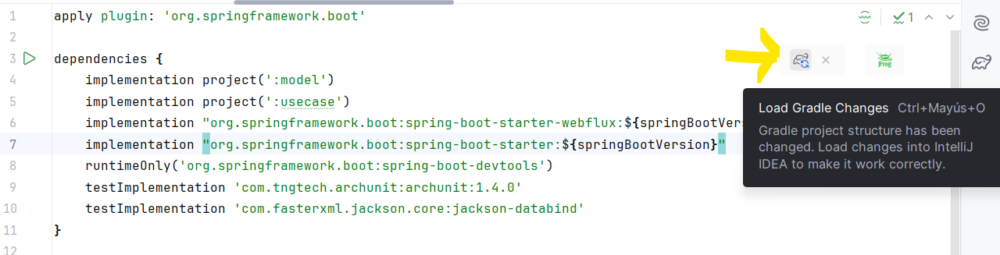
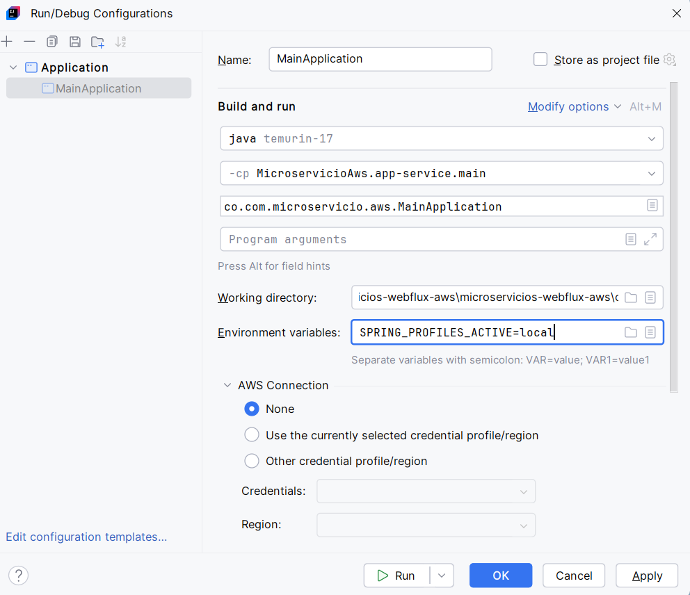

# Instructivo paso a paso proyecto base
> A continuación se hace uso del plugin gradle bancolombia para la creación base del proyecto basada en microservicios y arquitectura limpia

### Requisitos

- ⚠️ Java 17 o superior
- ⚠️ Gradle 8.8 o posterior
- ⚠️ Docker o Podman
- ⚠️ Postman
- ⚠️ Intellij

### Gradle Scaffold Clean Architecture: 

[Plugin introducción](https://bancolombia.github.io/scaffold-clean-architecture/)

[Plugin documentación](https://bancolombia.github.io/scaffold-clean-architecture/docs/intro)

### Crear proyecto:

1. Crear en un directorio de trabajo en su computador el archivo build.gradle con lo siguiente:

    ```
    plugins {
        id 'co.com.bancolombia.cleanArchitecture' version '3.22.4'
    }
    ```
2. Abrir la consola de comandos en el directorio donde se ha creado el archivo y colocar el siguiente comando el cual puede ser modificado según requieran para sus proyectos

    ```
    gradle cleanArchitecture --package=co.com.microservicio.aws --type=reactive --name=MicroserviceAws --lombok=true --javaVersion=VERSION_17 --mutation=true --metrics=true
    ```

    ### Notas complementarias:  
    - **Metrics**: habilitar métricas en el proyecto usando Micrometer, una librería de observabilidad que permite recolectar métricas de rendimiento (como tiempos de respuesta, número de peticiones, uso de memoria, etc.)
    - **Mutation**: habilitar el mutation testing, una técnica de pruebas que evalúa la calidad de tus tests introduciendo pequeños cambios (mutaciones) en el código y viendo si las pruebas lo detectan. Generalmente se hace con herramientas como Pitest.

3. Evidencia:
   - Ejecutar paso 1:  

   

   - Ejecutar paso 2:  

   

4. Abrir la aplicación en intellij
   - Abrir desde el explorador:

   

   - Ubicarse en el proyecto applications > app-service, abrir el archivo build.gradle y cambiar la línea 6

    ```
    implementation 'org.springframework.boot:spring-boot-starter'
    ```
    por las siguientes dos líneas

    ```
    implementation "org.springframework.boot:spring-boot-starter-webflux:${springBootVersion}"
    implementation "org.springframework.boot:spring-boot-starter:${springBootVersion}"
    ```

   - Actualizar gradle para descargar las dependencias

    

   - Ubicarse en el proyecto applications > app-service > src > main > resources, abrir el archivo application.yaml y cambiar su contenido por el siguiente
```
server:
  port: ${APP_PORT:8080}

spring:
  application:
    name: "${APP_NAME:MicroserviceAws}"

management:
  health:
    probes:
      enabled: true
  endpoint:
    health:
      show-details: ${SHOW_DETAILS:never}
      enabled: true
      cache:
        time-to-live: "10s"
  endpoints:
    web:
      base-path: "${PATH_BASE:/api/v1/microservice-aws/}"
      path-mapping:
        health: "health"
        liveness: "liveness"
        readiness: "readiness"
      exposure:
        include: "health, liveness, readiness, metrics"

logging:
  level:
    root: ${LOG4J_LEVEL:INFO}

springdoc:
  version: "1.0.0"
  api-docs:
    path: "${PATH_BASE:/api/v1/microservice-aws}/api-docs"
  swagger-ui:
    disable-swagger-default-url: true
    path: "${PATH_BASE:/api/v1/microservice-aws}/swagger.html"

entries:
  reactive-web:
    path-base: "${PATH_BASE:/api/v1/microservice-aws/}"

integration:
  secrets:
    rabbitmq: ${SECRET_NAME_RABBITMQ:local-rabbitmq}
    redis: ${SECRET_NAME_REDIS:local-redis}
  aws:
    secrets-manager:
      region: ${AWS_REGION:us-east-1}
      endpoint: http://localhost:4566
      cacheSeconds: ${AWS_CACHE_SECONDS:3600}
      cacheSize: ${AWS_CACHE_SIZE:200}

adapters:
  dynamodb:
    endpoint: "http://localhost:4566"
  repositories:
    tables:
      namesmap:
        world_region: local_worldregions
        
  rest-client:
    timeout: ${REST_TIMEOUT_CONNECTION:5000}
    readTimeout: ${REST_TIMEOUT_READ:5000}
    writeTimeout: ${REST_TIMEOUT_WRITE:5000}
    microservice-external:
      url: ${URL-MOCK-SITE:http://localhost:8010}
  s3:
    endpoint: "${S3_ENDPOINT:http://localhost:4566}"
    bucket: "${S3_BUCKET_NAME:exampleaws}"
    region: "${REGION_AWS:us-east-1}"

registration:
  event:
    consume:
      createCountry: "${event_create_region:microservice.common.createRegion}"
    publish:
      updateCountry: "${event_audit_update_region:microservice.audit.updateRegion"
      deleteCountry: "${event_audit_delete_region:microservice.audit.deleteRegion"
```

   |Sección|Descripción|
|---|---|
|`server.port`|Define el puerto en el que se levanta el microservicio. Se usa `${APP_PORT:8080}` para permitir que se pueda configurar desde el entorno, usando 8080 como valor por defecto.|
|`spring.application.name`|Nombre del microservicio, útil para logging, discovery, etc. Se parametriza con `${APP_NAME:MicroserviceAws}` para adaptarlo fácilmente en distintos entornos.|
|`management.*`|Configuración de los endpoints de salud (`/health`, `/liveness`, `/readiness`) para monitoreo (e.g. Kubernetes). `${SHOW_DETAILS:never}` controla el nivel de detalle de `/health`.|
|`logging.level.root`|Nivel de log global. `${LOG4J_LEVEL:INFO}` permite ajustar el nivel sin cambiar el código (INFO, DEBUG, etc.).|
|`springdoc.*`|Configuración de Swagger/OpenAPI. Usa `${PATH_BASE}` para definir una ruta base reutilizable y soportar despliegues en subrutas.|
|`entries.reactive-web.path-base`|Reutiliza `${PATH_BASE}` para definir la raíz del contexto en rutas internas, manteniendo coherencia con Swagger.|
|`integration.secrets.*`|Define nombres de secretos para RabbitMQ y Redis. Permite usar valores diferentes por entorno (ej: local vs producción).|
|`integration.aws.secrets-manager.*`|Configura el acceso a Secrets Manager en AWS, incluyendo `endpoint`, región, y caché. Se parametriza para soportar LocalStack (`localhost:4566`) en desarrollo.|
|`adapters.dynamodb.*`|Define el endpoint de DynamoDB (local en este caso) y el mapeo de nombres de tablas. Parametrizado para poder apuntar a AWS real sin cambiar código.|
|`adapters.rest-client.*`|Configura timeouts para clientes REST, con posibilidad de modificarlos por entorno usando variables.|
|`adapters.s3.*`|Configuración de acceso a S3, incluyendo bucket, región y endpoint. Ideal para usar con LocalStack (`localhost:4566`) o en AWS real.|
|`registration.event.*`|Define los eventos que se consumen o publican en mensajería (RabbitMQ, SNS, etc.). Se usan variables para facilitar la integración con otros microservicios.|

   - ¿Por qué usamos ${VAR:valorPorDefecto}?
     - Flexibilidad por entorno: te permite cambiar valores fácilmente en dev, QA o producción sin tocar el código.

     - Compatibilidad con contenedores (Docker/K8s): se pueden pasar variables por ENV o .env.

     - Fallback seguro: si la variable no está definida en el entorno, se usa el valor por defecto.
   
   - Ejecutar desde intellij

    

   - Validar ejecución exitosa

   

5. Instalar helper básico
    - Log: Contiene clase para manejo de logs dentro del código

    Ejecutar en el directorio que contiene el build.gradle:
    ```
    gradle generateHelper --name=log
    ```

6. Configurar uso de logs dentro de la aplicación
    - En el archivo build.gradle (MicroservicioAWS) del proyecto general agregamos la versión para usar en log4jVersion
        ```
        buildscript {
            ext {
                cleanArchitectureVersion = '3.22.4'
                springBootVersion = '3.4.4'
                sonarVersion = '6.1.0.5360'
                jacocoVersion = '0.8.13'
                pitestVersion = '1.15.0'
                lombokVersion = '1.18.38'
                log4jVersion = '2.24.3'
            }
        }
        ```
    
    - En el archivo main.gradle agregar sobre la línea 30 el siguiente segmento de código
        ```
        if (!['model', 'usecase'].contains(it.name)) {
            dependencies {
                implementation "org.apache.logging.log4j:log4j-core:${log4jVersion}"
                implementation "org.apache.logging.log4j:log4j-api:${log4jVersion}"
            }
        }
        ```

    - Ubicarse en el proyecto infrastructure > helpers > log, abrir el archivo build.gradle y cambiar su contenido por el siguiente
        ```
        dependencies {
            implementation project(':model')
            implementation 'org.springframework:spring-context'
            implementation "org.apache.logging.log4j:log4j-core:${log4jVersion}"
            implementation "org.apache.logging.log4j:log4j-api:${log4jVersion}"
            implementation "org.apache.logging.log4j:log4j-to-slf4j:${log4jVersion}"
            implementation 'com.fasterxml.jackson.core:jackson-databind'
        }
        ```

    - Ubicarse en el proyecto applications > app-service, abrir el archivo build.gradle y agregar lo siguiente como de indica
        ```
        dependencies {
            ...
        }

        // Para evitar conflicto con Logback
        configurations {
            all {
                exclude group: 'org.apache.logging.log4j', module: 'log4j-to-slf4j'
                exclude group: 'org.springframework.boot', module: 'spring-boot-starter-logging'
            }
        }
        ```

    - Actualizar gradle para descargar las dependencias

        
        
    - Ubicarse en el proyecto infrastructure > helpers > log > src > main > java, agregamos la clase TransactionLog al paquete co.com.microservicio.aws.log

        

        ```
        package co.com.microservicio.aws.log;

        import java.io.Serial;
        import java.io.Serializable;
        import java.util.Map;

        import lombok.*;

        @Getter
        @Setter
        @NoArgsConstructor
        @AllArgsConstructor
        @ToString
        @Builder(toBuilder = true)
        public class TransactionLog {
            @Serial
            private static final long serialVersionUID = 1L;

            private DataLog dataLog;
            private Request request;
            private Response response;

            @Getter
            @Setter
            @NoArgsConstructor
            @AllArgsConstructor
            @ToString
            @Builder(toBuilder = true)
            public static class DataLog implements Serializable {
                @Serial
                private static final long serialVersionUID = 1L;

                private String message;
                private String messageId;
                private String service;
                private String method;
                private String appName;
            }

            @Getter
            @Setter
            @NoArgsConstructor
            @AllArgsConstructor
            @ToString
            @Builder(toBuilder = true)
            public static class Request implements Serializable {
                @Serial
                private static final long serialVersionUID = 1L;

                private Map<String, String> headers;
                private transient Object body;
            }

            @Getter
            @Setter
            @NoArgsConstructor
            @AllArgsConstructor
            @ToString
            @Builder(toBuilder = true)
            public static class Response implements Serializable {
                @Serial
                private static final long serialVersionUID = 1L;

                private Map<String, String> headers;
                private transient Object body;
            }
        }
        ```

    - Agregamos la clase LoggerBuilder al paquete co.com.microservicio.aws.log
        ```
        package co.com.microservicio.aws.log;

        import com.fasterxml.jackson.core.JsonProcessingException;
        import com.fasterxml.jackson.databind.ObjectMapper;
        import lombok.Getter;
        import lombok.extern.log4j.Log4j2;
        import org.apache.logging.log4j.message.ObjectMessage;
        import org.springframework.beans.factory.annotation.Value;
        import org.springframework.stereotype.Component;

        @Log4j2
        @Getter
        @Component
        public class LoggerBuilder {
            private String appName;
            private ObjectMapper objectMapper;

            public LoggerBuilder(@Value("${spring.application.name}") String appName, ObjectMapper objectMapper) {
                this.appName = appName;
                this.objectMapper = objectMapper;
            }

            public void info(TransactionLog.Request rq, TransactionLog.Response rs,
                            String message, String messageId, String service, String method) {
                log.info(new ObjectMessage(buildObject(rq, rs, buildDataLog(message, messageId, service, method))));
            }

            public void info(String message, String messageId, String service, String method) {
                log.info(new ObjectMessage(buildObject(new TransactionLog.Request(), new TransactionLog.Response(),
                        buildDataLog(message, messageId, service, method))));
            }

            public void error(String message, String messageId, String service, String method) {
                log.error(new ObjectMessage(buildObject(new TransactionLog.Request(), new TransactionLog.Response(),
                        buildDataLog(message, messageId, service, method))));
            }

            public void error(Throwable throwable) {
                log.error("throwable: " + throwable);
            }

            private TransactionLog.DataLog buildDataLog(String message, String messageId, String service, String method){
                return new TransactionLog.DataLog(message, messageId, service, method, appName);
            }

            private String buildObject(TransactionLog.Request rq, TransactionLog.Response rs,
                                      TransactionLog.DataLog dataLog) {
                var logObject = new TransactionLog(dataLog, rq, rs);
                try {
                    return objectMapper.writeValueAsString(logObject);
                } catch (JsonProcessingException e) {
                    return logObject.toString();
                }
            }
        }
        ```
    - Ubicarse en el proyecto application > app-service > src > main > resources, abrir el archivo log4j2.properties y cambiar su contenido por el siguiente
        ```
        status = error
        name = MicroserviceAWS
        appender.console.type = Console
        appender.console.name = STDOUT
        appender.console.layout.type = JsonLayout
        appender.console.layout.compact = true
        appender.console.layout.eventEol = true
        appender.console.layout.includeStacktrace = true
        appender.console.layout.includeThreadContext = false
        appender.console.layout.properties = false

        appender.console.layout.includeTimeMillis = false

        rootLogger.level = info
        rootLogger.appenderRefs = stdout
        rootLogger.appenderRef.stdout.ref = STDOUT
        ```

7. Crear archivo con perfil local

    - Ubicarse en el proyecto application > app-service > src > main > resources, crear el archivo application-local.yaml como una copia del application.yaml previamente creado

    

8. Ejecutar aplicación con los cambios realizados configurando que se usará el application local

    ```
    SPRING_PROFILES_ACTIVE=local
    ```

    

    

9. La aplicación se ejecuta correctamente y los logs se ven en formato json para mayor facilidad de lectura

	

    Así se verían los logs para una mejor lectura en visual studio code

    

[< Volver al índice](README.md)

---

⚠️ Este contenido no puede ser usado con fines comerciales. Ver [LICENSE.md](LICENSE.md)