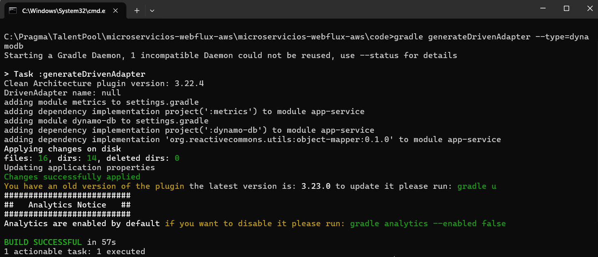

# Instructivo paso a paso creación microservicio APIREST con Webflux
> A continuación se indica el paso a paso que se debe realizar para continuar con el proyecto de creación de microservicios basados en la nube de AWS, esta guía comprende la creación de API REST con metodos HTTP a una tabla en dynamo db

### Requisitos: 

Debes haber realizado el proyecto base para ejecutar este paso a paso
[Crear proyecto base](./README-PROYECTO-BASE.md)

### Crear servicio API REST:

Para crear servicios REST se puede hacer de dos formas:

1. Con anotaciones
2. Con funciones

## API Rest con funciones

1. En el apartado infrastructure/entry-points ejecutar el sigiuente comando:

    ```
    gradle generateEntryPoint --type=webflux
    ```

    

2. Configuramos las rutas en el archivo application-local.yaml y las relacionamos en el código con el fin de que estas no esten fijas, sino que sean variables desde un archivo de configuración

    ```
    entries:
      reactive-web:
        path-base: "${PATH_BASE:/api/v1/microservicio-aws/}"
        get-all-rows: "/get-all-rows"
    ```

3. Crear el archivo ApiProperties.java en la ruta infrastructure/entry-points en el paquete co.com.microservicio.aws.api.config para mapear las rutas a una clase

    ```
    import org.springframework.boot.context.properties.ConfigurationProperties;
    import org.springframework.stereotype.Component;
    import lombok.Data;

    @Data
    @Component
    @ConfigurationProperties(prefix = "entries.reactive-web")
    public class ApiProperties {
        private String pathBase;
        private String getAllRows;
    }
    ```

4. En el archivo build.gradle del proyecto infrastructure/entry-points colocamos:
    ```
    dependencies {
        implementation project(':usecase')
        implementation project(':model')
        implementation "org.springframework.boot:spring-boot-starter-webflux:${springBootVersion}"
        implementation "org.springframework.boot:spring-boot-starter-actuator:${springBootVersion}"
        implementation 'io.micrometer:micrometer-registry-prometheus'
        implementation 'org.springdoc:springdoc-openapi-webflux-ui:1.8.0'
    }
    ```

5. En el proyecto infrastructure/entry-points paquete co.com.microservicio.aws.api creamos el paquete commons y agregamos la siguiente clase HeaderOpenApi, esta clase permite documentar los servicios y especificar los header que son requeridos para el servicio.

    ```
        import io.swagger.v3.oas.annotations.enums.ParameterIn;
        import lombok.experimental.UtilityClass;

        import static org.springdoc.core.fn.builders.parameter.Builder.parameterBuilder;
        import static org.springdoc.core.fn.builders.schema.Builder.schemaBuilder;

        @UtilityClass
        public class HeaderOpenApi {
            public final String TEXT = "";

            public static org.springdoc.core.fn.builders.parameter.Builder getHeaderMessageId() {
                return parameterBuilder().in(ParameterIn.HEADER).name("message-id")
                        .description("ID for transaction traceability. Must be provided " + "by the front in UUID format")
                        .schema(schemaBuilder().type(TEXT).example("8348c30c-1296-4882-84b8-d7306205ce26")).required(true);
            }

            public static org.springdoc.core.fn.builders.parameter.Builder getHeaderSessionTracker() {
                return parameterBuilder().in(ParameterIn.HEADER).name("session-tracker")
                        .description("ID for session traceability. Must be provided by the front in UUID format")
                        .schema(schemaBuilder().type(TEXT).example("c4e6bd04-5149-11e7-b114-b2f933d5fe81")).required(true);
            }

            public static org.springdoc.core.fn.builders.parameter.Builder getHeaderRequestTimestamp() {
                return parameterBuilder().in(ParameterIn.HEADER).name("request-timestamp")
                        .description("Date and Time the request is made")
                        .schema(schemaBuilder().type(TEXT).example("2023-03-14 19:30:59:000")).required(true);
            }

            public static org.springdoc.core.fn.builders.parameter.Builder getHeaderIP() {
                return parameterBuilder().in(ParameterIn.HEADER).name("x-forwarded-for")
                        .description("IP of the device in which the request was generated")
                        .schema(schemaBuilder().type(TEXT).example("127.0.0.1")).required(true);
            }

            public static org.springdoc.core.fn.builders.parameter.Builder getHeaderUserAgent() {
                return parameterBuilder().in(ParameterIn.HEADER).name("user-agent")
                        .description("User agent for device identification")
                        .schema(schemaBuilder().type(TEXT).example(
                                "{\"device\":\"iPhone\",\"os\":\"CPU iPhone OS 13_5_1\"," + "\"browser\":\"Version/13.1.1\"}"))
                        .required(true);
            }

            public static org.springdoc.core.fn.builders.parameter.Builder getHeaderPlatformType() {
                return parameterBuilder().in(ParameterIn.HEADER).name("platform-type")
                        .description("Type of platform where the request comes from (web - mobile)")
                        .schema(schemaBuilder().type(TEXT).example("mobile")).required(true);
            }

            public static org.springdoc.core.fn.builders.parameter.Builder getHeaderDocumentId() {
                return parameterBuilder().in(ParameterIn.HEADER).name("document-number")
                        .description("Identity document number of a client")
                        .schema(schemaBuilder().type(TEXT).example("210195722")).required(true);
            }

            public static org.springdoc.core.fn.builders.parameter.Builder getHeaderDocumentType() {
                return parameterBuilder().in(ParameterIn.HEADER).name("document-type")
                        .description("Type of identity document of a client").schema(schemaBuilder().type(TEXT).example("CC"))
                        .required(true);
            }

            public static org.springdoc.core.fn.builders.parameter.Builder getHeaderContentType() {
                return parameterBuilder().in(ParameterIn.HEADER).name("Content-Type")
                        .description("Type of content sent in the request")
                        .schema(schemaBuilder().type(TEXT).example("application/json")).required(true);
            }

        }
    ```

5. En el proyecto infrastructure/entry-points paquete co.com.microservicio.aws.api creamos el paquete doc y agregamos la siguiente clase OpenApiDoc, esta clase permite documentar los servicios, especificar los header que son requeridos para el servicio y las respuestas.

    ```
    import co.com.microservicio.aws.api.commons.HeaderOpenApi;
    import org.springdoc.core.fn.builders.operation.Builder;
    import java.util.function.Consumer;
    import static org.springdoc.core.fn.builders.apiresponse.Builder.responseBuilder;

    public class OpenApiDoc {
        public static final String SUCCESSFUL = "200";
        public static final String SUCCESSFUL_DESCRIPTION = "successful operation";
        public static final String BAD_REQUEST = "400";
        public static final String NOT_FOUND = "404";
        public static final String CONFLICT = "409";
        public static final String INTERNAL_SERVER_ERROR = "500";

        public static Consumer<Builder> executeListDataExampleOpenApi() {
            return ops -> ops.tag("List data example").operationId("/list-data-example")
                    .description("List data example").parameter(HeaderOpenApi.getHeaderMessageId())
                    .parameter(HeaderOpenApi.getHeaderSessionTracker())
                    .parameter(HeaderOpenApi.getHeaderRequestTimestamp()).parameter(HeaderOpenApi.getHeaderIP())
                    .parameter(HeaderOpenApi.getHeaderUserAgent()).parameter(HeaderOpenApi.getHeaderPlatformType())
                    .parameter(HeaderOpenApi.getHeaderDocumentId())
                    .parameter(HeaderOpenApi.getHeaderDocumentType()).parameter(HeaderOpenApi.getHeaderContentType())
                    .response(responseBuilder().responseCode(SUCCESSFUL).description(SUCCESSFUL_DESCRIPTION)
                            .implementation(Object.class))
                    .response(getTechnicalError()).response(getBusinessError()).response(getDefaultError()).build();
        }

        public static org.springdoc.core.fn.builders.apiresponse.Builder getTechnicalError() {
            return responseBuilder().responseCode(INTERNAL_SERVER_ERROR).description("Technical error")
                    .implementation(String.class);
        }

        public static org.springdoc.core.fn.builders.apiresponse.Builder getBusinessError() {
            return responseBuilder().responseCode(CONFLICT).description("Business error")
                    .implementation(String.class);
        }

        public static org.springdoc.core.fn.builders.apiresponse.Builder getDefaultError() {
            return responseBuilder().responseCode(BAD_REQUEST).description("Default error")
                    .implementation(String.class);
        }

        public static org.springdoc.core.fn.builders.apiresponse.Builder getNotFoundError() {
            return responseBuilder().responseCode(NOT_FOUND).description("Not Found error")
                    .implementation(String.class);
        }
    }

    ```

7. El archivo RouterRest del paquete co.com.microservicio.aws.api queda:
    ```
    import co.com.microservicio.aws.api.config.ApiProperties;
    import co.com.microservicio.aws.api.doc.OpenApiDoc;
    import lombok.RequiredArgsConstructor;
    import org.springframework.context.annotation.Bean;
    import org.springframework.context.annotation.Configuration;
    import org.springframework.web.reactive.function.server.RouterFunction;
    import org.springframework.web.reactive.function.server.ServerResponse;
    import org.springdoc.webflux.core.fn.SpringdocRouteBuilder;

    @Configuration
    @RequiredArgsConstructor
    public class RouterRest {
        private final ApiProperties properties;

        @Bean
        public RouterFunction<ServerResponse> routerFunction(Handler handler) {
            return SpringdocRouteBuilder.route()
                    .GET(properties.getPathBase().concat(properties.getGetAllRows()),
                            handler::getAllRows, OpenApiDoc.executeListDataExampleOpenApi())
                    .build();
        }
    }
    ```

8. Ejecutamos la aplicación y consumimos el servicio por postman, a continuación se detalla el Curl para importar en postman
    
    ```
        curl --location 'localhost:8080/api/v1/microservicio-aws/get-all-rows' \
        --header 'message-id: 7a214936-5e93-11ec-bf63-0242ac130002' \
        --header 'session-tracker: 0e295fc0-c84d-4b00-a710-24dd87f2fbfa' \
        --header 'request-timestamp: 2022-09-13 09:39:50:000' \
        --header 'x-forwarded-for: 192.168.0.1' \
        --header 'user-agent: {"device":"iPhone","os":"CPU iPhone OS 13_5_1","browser":"Version/13.1.1"}' \
        --header 'document-number: 1234567' \
        --header 'platform-type: web' \
        --header 'document-type: CC' \
        --header 'Content-Type: application/json'
    ```

    

9. usar logs en la aplicación, la clase LoggerBuilder se puede usar solamente en infrastructure o en application, nunca en domain
    
    - En la clase Handler cambiar por:
        ```
        public class Handler {
            private final LoggerBuilder logger;

            public Mono<ServerResponse> getAllRows(ServerRequest serverRequest) {
                var headers = serverRequest.headers().asHttpHeaders().toSingleValueMap();
                logger.info("My first api rest", headers.get("message-id"), "Api Rest", Handler.class.getName());
                return ServerResponse.ok().bodyValue("My first api rest");
            }
        }
        ```
    
    - El log se debe ver así formateado en Json Pretty:
        ```
        {
            "instant": {
                "epochSecond": 1749003600,
                "nanoOfSecond": 498104100
            },
            "thread": "reactor-http-nio-3",
            "level": "INFO",
            "loggerName": "co.com.microservicio.aws.log.LoggerBuilder",
            "message": "{\"dataLog\":{\"message\":\"My first api rest\",\"messageId\":\"7a214936-5e93-11ec-bf63-0242ac130002\",\"service\":\"Api Rest\",\"method\":\"co.com.microservicio.aws.api.Handler\",\"appName\":\"MicroservicioAws\"},\"request\":{\"headers\":null,\"body\":null},\"response\":{\"headers\":null,\"body\":null}}",
            "endOfBatch": false,
            "loggerFqcn": "org.apache.logging.log4j.spi.AbstractLogger",
            "threadId": 38,
            "threadPriority": 5
        }
        ```
10. Creamos la clase POJO Flight.java en el paquete co.com.microservicio.aws.model.flight para mapear todos los datos de la tabla de dynamoDB
        
    ```
    package co.com.microservicio.aws.model.flight;

    import lombok.AllArgsConstructor;
    import lombok.Data;
    import lombok.NoArgsConstructor;
    import java.io.Serial;
    import java.io.Serializable;

    @Data
    @NoArgsConstructor
    @AllArgsConstructor
    public class FlightTicket implements Serializable {
        @Serial
        private static final long serialVersionUID = 1L;

        private String documentNumber;
        private String ticket;
        private String status;
        private String flightNumber;
        private String origin;
        private String destination;
        private Double price;
        private String date;
    }
    ```

11. Creamos la clase FlightRepository en el paquete co.com.microservicio.aws.model.flight.gateway
    ```
    package co.com.microservicio.aws.model.flight.gateway;

    import co.com.microservicio.aws.model.flight.FlightTicket;
    import reactor.core.publisher.Mono;

    import java.util.Map;

    public interface FlightRepository {
        Mono<FlightTicket> getAllRows(Map<String, String> param);
    }
    ```

12. Creamos la clase FlightTicketUseCase.java en el paquete co.com.microservicio.aws.usecase.flight para obtener todos los datos de la tabla de dynamoDB, hacemos una pequeña validación del message-id para aplicar metodos webflux
    ```
    package co.com.microservicio.aws.usecase.flight;

    import co.com.microservicio.aws.model.flight.FlightTicket;
    import co.com.microservicio.aws.model.flight.gateway.FlightRepository;
    import lombok.RequiredArgsConstructor;
    import reactor.core.publisher.Mono;

    import java.util.Map;

    @RequiredArgsConstructor
    public class FlightTicketUseCase {
        private static final String KEY_SIZE = "size";
        private static final String ATTRIBUTE_IS_REQUIRED = "The attribute '%s' is required";
        private final FlightRepository flightRepository;

        public Mono<FlightTicket> getAllRows(Map<String, String> param){
            return Mono.just(param).filter(this::isEmpty)
                .flatMap(flightRepository::getAllRows)
                .switchIfEmpty(Mono.error(new IllegalStateException(String.format(ATTRIBUTE_IS_REQUIRED, KEY_SIZE))));
        }

        private Boolean isEmpty(Map<String, String> param){
            return !param.get(KEY_SIZE).isEmpty();
        }
    }
    ```

13. Modificamos la clase Handler.java para invocar el caso de uso
    ```
    package co.com.microservicio.aws.api;

    import co.com.microservicio.aws.log.LoggerBuilder;
    import co.com.microservicio.aws.log.TransactionLog;
    import co.com.microservicio.aws.model.flight.FlightTicket;
    import co.com.microservicio.aws.usecase.flight.FlightTicketUseCase;
    import lombok.RequiredArgsConstructor;
    import org.springframework.stereotype.Component;
    import org.springframework.web.reactive.function.server.ServerRequest;
    import org.springframework.web.reactive.function.server.ServerResponse;
    import reactor.core.publisher.Mono;

    import java.util.Collection;
    import java.util.List;
    import java.util.Map;
    import java.util.Set;

    @Component
    @RequiredArgsConstructor
    public class Handler {
        private static final String NAME_CLASS = Handler.class.getName();
        private static final String MESSAGE_SERVICE = "Service Api Rest get alls rows by size";
        private final LoggerBuilder logger;
        private final FlightTicketUseCase flightTicketUseCase;

        public Mono<ServerResponse> getAllRows(ServerRequest serverRequest) {
            var headers = serverRequest.headers().asHttpHeaders().toSingleValueMap();
            var messageId = headers.get("message-id");
            logger.info(TransactionLog.Request.builder().body(headers).build(), null,
                "My first api rest", messageId, MESSAGE_SERVICE, NAME_CLASS);

            return ServerResponse.ok().body(flightTicketUseCase.getAllRows(headers)
                .onErrorResume(e -> this.printFailed(e, messageId)), FlightTicket.class
            );
        }

        private Mono<FlightTicket> printFailed(Throwable throwable, String messageId) {
            logger.error(throwable.getMessage(), messageId, MESSAGE_SERVICE, NAME_CLASS);
            return Mono.empty();
        }
    }
    ```

14. Creamos la conexión con DynamoDB para implementar la interfaz de conexión entre el caso de uso y la infrastructura de conexión con DynamoDB
    
    - Ubicarse en la raiz del proyecto, abrir la consola de comandos y ejecutar el comando de creación del driven-adapter con DynamoDB
   ```
   gradle generateDrivenAdapter --type=dynamodb
   ``` 

   

15. En el paquete 'co.com.microservicio.aws.dynamodb' creamos la siguiente clase

   ```
    package co.com.microservicio.aws.dynamodb;

    import java.lang.annotation.ElementType;
    import java.lang.annotation.Retention;
    import java.lang.annotation.RetentionPolicy;
    import java.lang.annotation.Target;

    @Target({ ElementType.TYPE })
    @Retention(RetentionPolicy.RUNTIME)
    public @interface DynamoDbTableAdapter {
        String tableName() default "";
    }
   ```

16. En el paquete 'co.com.microservicio.aws.dynamodb.config' creamos la siguiente clase
    ```
    package co.com.microservicio.aws.dynamodb.config;

    import lombok.AccessLevel;
    import lombok.NoArgsConstructor;

    @NoArgsConstructor(access = AccessLevel.PRIVATE)
    public class SourceName {
        public static final String FLIGHT_TICKETS = "flight_tickets";
    }
    ```

17. En el paquete 'co.com.microservicio.aws.dynamodb.flight.model' creamos la siguiente clase de acuerdo a los datos a almacenar en la tabla
    ```
    package co.com.microservicio.aws.dynamodb.model;

    import co.com.microservicio.aws.dynamodb.DynamoDbTableAdapter;
    import co.com.microservicio.aws.dynamodb.config.SourceName;
    import lombok.Data;
    import lombok.Getter;
    import software.amazon.awssdk.enhanced.dynamodb.mapper.annotations.DynamoDbBean;
    import software.amazon.awssdk.enhanced.dynamodb.mapper.annotations.DynamoDbPartitionKey;
    import software.amazon.awssdk.enhanced.dynamodb.mapper.annotations.DynamoDbSecondaryPartitionKey;
    import software.amazon.awssdk.enhanced.dynamodb.mapper.annotations.DynamoDbSortKey;

    @Data
    @DynamoDbBean
    @DynamoDbTableAdapter(tableName = SourceName.FLIGHT_TICKETS)
    public class ModelEntityFlight {
        @Getter(onMethod_ = @DynamoDbPartitionKey)
        private String documentNumber;
        @Getter(onMethod_ = @DynamoDbSortKey)
        private String ticket;
        @Getter(onMethod_ = @DynamoDbSecondaryPartitionKey(indexNames = "statusIndex"))
        private String status;
        private String flightNumber;
        private String origin;
        private String destination;
        private Double price;
        private String date;
    }
    ```

18. Cambiamos la clase DynamoDBConfig en el paquete 'co.com.microservicio.aws.dynamodb.config' por el siguiente código
    ```
    package co.com.microservicio.aws.dynamodb.config;

    import org.springframework.beans.factory.annotation.Value;
    import org.springframework.context.annotation.Bean;
    import org.springframework.context.annotation.Configuration;
    import org.springframework.context.annotation.Profile;
    import software.amazon.awssdk.auth.credentials.ProfileCredentialsProvider;
    import software.amazon.awssdk.auth.credentials.WebIdentityTokenFileCredentialsProvider;
    import software.amazon.awssdk.enhanced.dynamodb.DynamoDbEnhancedAsyncClient;
    import software.amazon.awssdk.regions.Region;
    import software.amazon.awssdk.services.dynamodb.DynamoDbAsyncClient;

    import java.net.URI;

    @Configuration
    public class DynamoDBConfig {

        @Bean
        @Profile({ "local" })
        DynamoDbAsyncClient amazonDynamoDB(@Value("${aws.dynamodb.endpoint}") String endpoint,
                                        @Value("${aws.region}") String region) {
            return DynamoDbAsyncClient.builder().credentialsProvider(ProfileCredentialsProvider.create("default"))
                    .endpointOverride(URI.create(endpoint)).region(Region.of(region)).build();
        }

        @Bean
        @Profile({ "!local" })
        DynamoDbAsyncClient amazonDynamoDBAsync(@Value("${aws.region}") String region) {
            return DynamoDbAsyncClient.builder().credentialsProvider(WebIdentityTokenFileCredentialsProvider.create())
                    .region(Region.of(region)).build();
        }

        @Bean
        DynamoDbEnhancedAsyncClient getDynamoDbEnhancedAsyncClient(DynamoDbAsyncClient dynamoDbAsyncClient) {
            return DynamoDbEnhancedAsyncClient.builder().dynamoDbClient(dynamoDbAsyncClient).build();
        }

    }
    ```

19. En el archivo build.gradle del proyecto dynamo-db colocamos las siguientes dependencias
    ```
    dependencies {
        implementation project(':model')
        implementation 'org.springframework:spring-context'
        implementation 'software.amazon.awssdk:dynamodb-enhanced'
        implementation 'org.reactivecommons.utils:object-mapper-api:0.1.0'
        implementation 'org.springframework.boot:spring-boot-starter-validation'
        testImplementation 'org.reactivecommons.utils:object-mapper:0.1.0'
    }
    ```

20. En el paquete 'co.com.microservicio.aws.dynamodb.config' creamos la siguiente clase
    ```
    package co.com.microservicio.aws.dynamodb.config;

    import java.util.Map;

    import org.springframework.boot.context.properties.ConfigurationProperties;
    import org.springframework.boot.context.properties.EnableConfigurationProperties;
    import org.springframework.context.annotation.Configuration;

    import lombok.Data;

    @Data
    @Configuration
    @EnableConfigurationProperties
    @ConfigurationProperties(prefix = "adapters.repositories.tables")
    public class DynamoDBTablesProperties {
        private Map<String, String> namesmap;
    }
    ```

21. Cambiamos la clase DynamoDBConfigTest en el paquete 'co.com.microservicio.aws.dynamodb.config' por el siguiente código
    ```
    package co.com.microservicio.aws.dynamodb.config;

    import org.junit.jupiter.api.Test;
    import org.junit.jupiter.api.extension.ExtendWith;
    import org.mockito.Mock;
    import org.mockito.junit.jupiter.MockitoExtension;
    import software.amazon.awssdk.enhanced.dynamodb.DynamoDbEnhancedAsyncClient;
    import software.amazon.awssdk.metrics.MetricPublisher;
    import software.amazon.awssdk.services.dynamodb.DynamoDbAsyncClient;

    import static org.junit.jupiter.api.Assertions.assertNotNull;

    @ExtendWith(MockitoExtension.class)
    class DynamoDBConfigTest {

        @Mock
        private DynamoDbAsyncClient dynamoDbAsyncClient;
        private final DynamoDBConfig dynamoDBConfig = new DynamoDBConfig();

        @Test
        void testAmazonDynamoDB() {
            DynamoDbAsyncClient result = dynamoDBConfig.amazonDynamoDB("http://aws.dynamo.test", "region");
            assertNotNull(result);
        }

        @Test
        void testAmazonDynamoDBAsync() {
            DynamoDbAsyncClient result = dynamoDBConfig.amazonDynamoDBAsync("region");
            assertNotNull(result);
        }

        @Test
        void testGetDynamoDbEnhancedAsyncClient() {
            DynamoDbEnhancedAsyncClient result = dynamoDBConfig.getDynamoDbEnhancedAsyncClient(dynamoDbAsyncClient);
            assertNotNull(result);
        }
    }
    ```
22. En el paquete 'co.com.microservicio.aws.dynamodb' creamos la siguiente clase
    ```
    package co.com.microservicio.aws.dynamodb;

    import java.util.function.Function;

    import co.com.microservicio.aws.dynamodb.config.DynamoDBTablesProperties;
    import reactor.core.publisher.Mono;
    import software.amazon.awssdk.enhanced.dynamodb.DynamoDbAsyncTable;
    import software.amazon.awssdk.enhanced.dynamodb.DynamoDbEnhancedAsyncClient;
    import software.amazon.awssdk.enhanced.dynamodb.Key;
    import software.amazon.awssdk.enhanced.dynamodb.TableSchema;

    public class AdapterOperations<E, D> {
        protected DynamoDbEnhancedAsyncClient dbEnhancedAsyncClient;
        protected Function<E, D> fnToData;
        protected Function<D, E> fnToEntity;
        protected DynamoDbAsyncTable<D> dataTable;

        public AdapterOperations(DynamoDbEnhancedAsyncClient dbEnhancedAsyncClient,
                                DynamoDBTablesProperties tablesProperties, Function<E, D> fnToData, Function<D, E> fnToEntity,
                                Class<D> dataClass) {
            this.dbEnhancedAsyncClient = dbEnhancedAsyncClient;
            this.fnToData = fnToData;
            this.fnToEntity = fnToEntity;
            var dynamoDbTableAdapter = dataClass.getAnnotation(DynamoDbTableAdapter.class);
            var tableName = tablesProperties.getNamesmap().get(dynamoDbTableAdapter.tableName());
            dataTable = dbEnhancedAsyncClient.table(tableName, TableSchema.fromBean(dataClass));
        }

        protected D toData(E entity) {
            return fnToData.apply(entity);
        }

        protected E toEntity(D data) {
            return fnToEntity.apply(data);
        }

        protected Mono<E> findOne(Key id) {
            return Mono.fromFuture(dataTable.getItem(id)).map(this::toEntity);
        }

        protected Mono<E> update(E entity) {
            return Mono.fromFuture(dataTable.updateItem(toData(entity))).map(this::toEntity);
        }
    }
    ```

23. En el paquete 'co.com.microservicio.aws.model.flight' creamos la siguiente clase
    ```
    package co.com.microservicio.aws.model.flight;

    import java.io.Serializable;
    import lombok.AllArgsConstructor;
    import lombok.Builder;
    import lombok.Data;
    import lombok.NoArgsConstructor;

    @Data
    @NoArgsConstructor
    @AllArgsConstructor
    @Builder(toBuilder = true)
    public class ValidationResponse implements Serializable {
        private static final long serialVersionUID = 1L;
        private boolean valid;
        private String reason;
        private String validationCode;
    }
    ```

23. En el paquete 'co.com.microservicio.aws.dynamodb.flight.mapper' creamos la siguiente clase a cargo de mapear los datos de la clase DTO a la clase Entity
    ```
    package co.com.microservicio.aws.dynamodb.flight.mapper;

    import co.com.microservicio.aws.dynamodb.flight.model.ModelEntityFlight;
    import co.com.microservicio.aws.model.flight.FlightTicket;

    import java.util.List;

    import co.com.microservicio.aws.model.flight.ValidationResponse;
    import org.apache.logging.log4j.util.Strings;
    import org.mapstruct.Mapper;
    import org.mapstruct.Mapping;
    import org.mapstruct.Named;
    import org.mapstruct.ReportingPolicy;

    import com.fasterxml.jackson.core.type.TypeReference;
    import com.fasterxml.jackson.databind.ObjectMapper;

    import lombok.SneakyThrows;

    @Mapper(componentModel = "spring", unmappedTargetPolicy = ReportingPolicy.IGNORE)
    public interface FlightTicketDataMapper {
        ModelEntityFlight toData(FlightTicket flightTicket);

        @Mapping(target = "errors", source = "errors", qualifiedByName = "mapErrors")
        FlightTicket toEntity(ModelEntityFlight modelEntityFlight);

        @SneakyThrows
        default String getErrors(List<ValidationResponse> errors) {
            var mapper = new ObjectMapper();
            return errors != null ? mapper.writeValueAsString(errors) : null;
        }

        @SneakyThrows
        @Named("mapErrors")
        default List<ValidationResponse> getErrors(String errors) {
            var mapper = new ObjectMapper();
            return Strings.isBlank(errors) ? List.of() : mapper.readValue(errors, new TypeReference<>() {
            });
        }
    }
    ```

23. En el paquete 'co.com.microservicio.aws.dynamodb' creamos la siguiente clase correspondiente al adaptador que implementa la consulta en la bd
    ```

    ```


## API Rest con anotaciones


[< Volver](README-PROYECTO-JAVA-WEBFLUX.md)

---

**Author**: Pedro Luis Osorio Pavas [Linkedin](www.linkedin.com/in/pedro-luis-osorio-pavas-68b3a7106)  
**Start Date**: 01-06-2025  
**Update Date**: 01-06-2025.