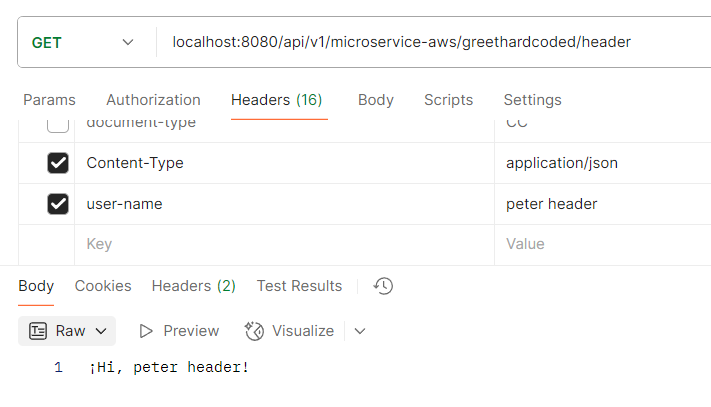

# Creación microservicio APIREST con Webflux
> A continuación se indica el paso a paso que se debe realizar para continuar con el proyecto de creación de microservicios basados en la nube de AWS, esta guía comprende la creación de API REST con metodos HTTP básicos

### Requisitos: 

⚠️ Debes haber realizado el proyecto base para continuar con este instructivo <br>
[Crear proyecto base](./2-1-crear-proyecto-base.md)

### Crear servicio API REST:
1. En el apartado infrastructure/entry-points ejecutar el sigiuente comando:

    ```
    gradle generateEntryPoint --type=webflux
    ```

    

2. En el archivo build.gradle del proyecto infrastructure/entry-points colocamos:
    ```
    dependencies {
        implementation project(':usecase')
        implementation project(':model')
        implementation project(':log')
        implementation "org.springframework.boot:spring-boot-starter-webflux:${springBootVersion}"
        implementation "org.springframework.boot:spring-boot-starter-actuator:${springBootVersion}"
        implementation 'io.micrometer:micrometer-registry-prometheus'
        implementation "org.springdoc:springdoc-openapi-webflux-ui:${openapi}"
    }
    ```

    y en build.gradle del proyecto general
    ```
    buildscript {
        ext {
            cleanArchitectureVersion = '3.22.4'
            springBootVersion = '3.4.4'
            sonarVersion = '6.1.0.5360'
            jacocoVersion = '0.8.13'
            pitestVersion = '1.15.0'
            lombokVersion = '1.18.38'
            log4jVersion = '2.24.3'
            openapi = '1.8.0'
            jacksonVersion = "2.18.3"
            reactiveCommonsVersion = '4.1.4'
            awsSecretManagerAsyncVersion ='4.4.0'
            awsSecretManagerSyncVersion = '3.2.0'
        }
    }
    ```

3. Actualizamos las dependencias de gradle

   

4. Configuramos las rutas en el archivo application-local.yaml y las relacionamos en el código con el fin de que estas no esten fijas, sino que sean variables desde un archivo de configuración

```
entries:
  reactive-web:
    path-base: "${PATH_BASE:/api/v1/microservice-aws}"
    greet: "/greet"
    greetReactive: "/greetReactive"
    greetReactiveQueryParam: "/greetReactiveQueryParam"
    greetReactivePathVariable: "/greetReactivePathVariable/{place}"
```

5. Crear el paquete **greet** en la ruta infrastructure > entry-points > src > main > java > co.com.microservicio.aws.api y borramos el código generado tanto en main > java como en los test unitarios

    

    

6. Crear el archivo ApiProperties.java en la ruta infrastructure/entry-points en el paquete co.com.microservicio.aws.api.greet.config para mapear las rutas en la clase Route

    ```
    import org.springframework.boot.context.properties.ConfigurationProperties;
    import org.springframework.stereotype.Component;
    import lombok.Data;

    @Data
    @Component
    @ConfigurationProperties(prefix = "entries.reactive-web")
    public class ApiProperties {
        private String pathBase;
        private String greet;
        private String greetReactive;
        private String greetReactiveQueryParam;
        private String greetReactivePathVariable;
    }
    ```

## Para crear servicios REST se puede hacer de diferentes formas, veamos:

### Con anotaciones Hard Coded:

1. En el archivo build.gradle del proyecto infrastructure > entry-points agregamos las siguientes líneas
    ```
    dependencies {
        ...
    }

    tasks.withType(JavaCompile).configureEach {
        options.compilerArgs += "-parameters"
    }
    ```
2. Actualizamos dependencias gradle

3. Crear clase GreetHardCodedRest.java en el paquete co.com.microservicio.aws.api.greet
    ```
    package co.com.microservicio.aws.api.greet;

    import org.springframework.web.bind.annotation.*;
    import reactor.core.publisher.Mono;

    @RestController
    @RequestMapping("/api/v1/microservice-aws/greethardcoded")
    public class GreetHardCodedRest {

        @GetMapping("/{name}")
        public Mono<String> greet(@PathVariable String name) {
            return Mono.just("¡Hi, " + name + "!");
        }

        @GetMapping("/header")
        public Mono<String> greetFromHeader(@RequestHeader("user-name") String name) {
            return Mono.just("¡Hi, " + name + "!");
        }

        @GetMapping
        public Mono<String> genericGreet() {
            return Mono.just("¡Hello, world!");
        }
    }
    ```
4. Ejecutamos la aplicación

5. Curl Postman para probar los servicios
    ```
    curl --location 'localhost:8080/api/v1/microservice-aws/greethardcoded' \
    --header 'Content-Type: application/json'
    ```

    ```
    curl --location 'localhost:8080/api/v1/microservice-aws/greethardcoded/peter' \
    --header 'Content-Type: application/json'
    ```

    ```
    curl --location 'localhost:8080/api/v1/microservice-aws/greethardcoded/header' \
    --header 'Content-Type: application/json' \
    --header 'user-name: peter header'
    ```
    

    Como importar los curl a postman

    

### Con anotaciones parameterizable:

1. Crear clase GreetRest.java en el paquete co.com.microservicio.aws.api.greet
    ```
    package co.com.microservicio.aws.api.greet;

    import org.springframework.web.bind.annotation.GetMapping;
    import org.springframework.web.bind.annotation.PathVariable;
    import org.springframework.web.bind.annotation.RequestHeader;
    import org.springframework.web.bind.annotation.RestController;
    import reactor.core.publisher.Mono;

    @RestController
    public class GreetRest {
        @GetMapping("${entries.reactive-web.path-base}${entries.reactive-web.greet}/{name}")
        public Mono<String> greet(@PathVariable("name") String name) {
            return Mono.just("¡Hi, " + name + "!");
        }

        @GetMapping("${entries.reactive-web.path-base}${entries.reactive-web.greet}/header")
        public Mono<String> greetFromHeader(@RequestHeader("user-name") String name) {
            return Mono.just("¡Hi, " + name + "!");
        }

        @GetMapping("${entries.reactive-web.path-base}${entries.reactive-web.greet}")
        public Mono<String> genericGreet() {
            return Mono.just("¡Hello, world!");
        }
    }
    ```
2. Ejecutamos la aplicación

3. Curl Postman para probar los servicios
    ```
    curl --location 'localhost:8080/api/v1/microservice-aws/greet' \
    --header 'Content-Type: application/json'
    ```

    ```
    curl --location 'localhost:8080/api/v1/microservice-aws/greet/peter' \
    --header 'Content-Type: application/json'
    ```

    ```
    curl --location 'localhost:8080/api/v1/microservice-aws/greet/header' \
    --header 'Content-Type: application/json' \
    --header 'user-name: peter header'
    ```
    

### Con funciones

1. Crear la clase GreetHandler.java en el paquete co.com.microservicio.aws.api.greet
    ```
    package co.com.microservicio.aws.api.greet;

    import co.com.microservicio.aws.log.LoggerBuilder;
    import lombok.RequiredArgsConstructor;
    import org.springframework.stereotype.Component;
    import org.springframework.web.reactive.function.server.ServerRequest;
    import org.springframework.web.reactive.function.server.ServerResponse;
    import reactor.core.publisher.Mono;

    @Component
    @RequiredArgsConstructor
    public class GreetHandler {
        private static final String NAME_CLASS = GreetHandler.class.getName();
        private static final String MESSAGE_SERVICE = "Service Api Rest greet";
        private static final String MESSAGE_ID = "message-id";

        private final LoggerBuilder logger;

        public Mono<ServerResponse> greet(ServerRequest serverRequest) {
            var headers = serverRequest.headers().asHttpHeaders().toSingleValueMap();
            printOnProcess(headers.get(MESSAGE_ID), "Api Rest simple");
            return ServerResponse.ok().bodyValue("¡Hi functional, " + headers.get("user-name") + "!");
        }

        public Mono<ServerResponse> greetQueryParam(ServerRequest serverRequest) {
            var place = serverRequest.queryParam("place").orElse("");
            var headers = serverRequest.headers().asHttpHeaders().toSingleValueMap();
            printOnProcess(headers.get(MESSAGE_ID), "Api Rest query param");
            return ServerResponse.ok().bodyValue("¡Hi functional query param, " + headers.get("user-name") + "! in " + place);
        }

        public Mono<ServerResponse> greetPathVariable(ServerRequest serverRequest) {
            var place = serverRequest.pathVariable("place");
            var headers = serverRequest.headers().asHttpHeaders().toSingleValueMap();
            printOnProcess(headers.get(MESSAGE_ID), "Api Rest path variable");
            return ServerResponse.ok().bodyValue("¡Hi functional path variable, " + headers.get("user-name") + "! in " + place);
        }
        
        private void printOnProcess(String messageId, String messageInfo){
            logger.info(MESSAGE_SERVICE, messageId, messageInfo, NAME_CLASS);
        }
    }

    ```

2. Crear la clase OpenAPIConfig en el paquete co.com.microservicio.aws.api.greet.config
    ```
    package co.com.microservicio.aws.api.greet.config;

    import io.swagger.v3.oas.models.OpenAPI;
    import io.swagger.v3.oas.models.info.Info;
    import org.springframework.context.annotation.Bean;
    import org.springframework.context.annotation.Configuration;

    @Configuration
    public class OpenAPIConfig {
        private static final String TITLE = "API Rest DynamoDB Microservice";
        private static final String VERSION = "1.0.0";
        private static final String DESCRIPTION = "Services for greet";
        @Bean
        public OpenAPI customOpenAPI() {
            return new OpenAPI().info(new Info().title(TITLE).version(VERSION).description(DESCRIPTION));
        }
    }
    ```

3. Crear la clase GreetOpenAPI en el paquete co.com.microservicio.aws.api.greet.doc
    ```
    package co.com.microservicio.aws.api.greet.doc;

    import lombok.experimental.UtilityClass;
    import org.springdoc.core.fn.builders.operation.Builder;

    import java.util.function.Consumer;

    import static org.springdoc.core.fn.builders.apiresponse.Builder.responseBuilder;
    import static org.springdoc.core.fn.builders.content.Builder.contentBuilder;
    import static org.springdoc.core.fn.builders.schema.Builder.schemaBuilder;
    import static org.springframework.http.HttpStatus.*;
    import static org.springframework.http.MediaType.APPLICATION_JSON;

    @UtilityClass
    public class GreetOpenAPI {

        private static final String OPERATION_ID = "Greet";
        private static final String DESCRIPTION = "Retrieve information of a payment";
        private static final String DESCRIPTION_OK = "When the response has status 200";
        private static final String DESCRIPTION_CONFLICT = "When the request fails";
        private static final String DESCRIPTION_ERROR = "Internal server error";
        private static final String TAG = "Payments";

        public static Consumer<Builder> greetRoute() {
            return ops -> ops
                    .operationId(OPERATION_ID)
                    .description(DESCRIPTION)
                    .tag(TAG)
                    .summary(OPERATION_ID)
                    .response(responseOk())
                    .response(responseBusiness())
                    .response(responseError())
                    .response(responseNotFound())
                    .response(responseBadRequest());
        }

        public static org.springdoc.core.fn.builders.apiresponse.Builder responseOk(){
            return responseBuilder().
                    responseCode(String.valueOf(OK.value()))
                    .description(DESCRIPTION_OK)
                    .content(contentBuilder()
                            .mediaType(APPLICATION_JSON.toString())
                            .schema(schemaBuilder()
                                    .implementation(String.class)));
        }

        public static org.springdoc.core.fn.builders.apiresponse.Builder responseBusiness(){
            return responseBuilder()
                    .responseCode(String.valueOf(CONFLICT.value()))
                    .description(DESCRIPTION_CONFLICT)
                    .implementation(Error.class);
        }

        public static org.springdoc.core.fn.builders.apiresponse.Builder responseError(){
            return responseBuilder()
                    .responseCode(String.valueOf(INTERNAL_SERVER_ERROR.value()))
                    .description(DESCRIPTION_ERROR)
                    .implementation(Error.class);
        }

        public static org.springdoc.core.fn.builders.apiresponse.Builder responseNotFound(){
            return responseBuilder()
                    .responseCode(String.valueOf(NOT_FOUND.value()))
                    .description(NOT_FOUND.getReasonPhrase())
                    .implementation(Error.class);
        }

        public static org.springdoc.core.fn.builders.apiresponse.Builder responseBadRequest() {
            return responseBuilder()
                    .responseCode(String.valueOf(BAD_REQUEST.value()))
                    .description(BAD_REQUEST.getReasonPhrase())
                    .implementation(Error.class);
        }

    }
    ```

4. Crear clase GreetRouterRest.java en el paquete co.com.microservicio.aws.api.greet
    ```
    package co.com.microservicio.aws.api.greet;

    import co.com.microservicio.aws.api.greet.config.ApiProperties;
    import co.com.microservicio.aws.api.greet.doc.GreetOpenAPI;
    import lombok.RequiredArgsConstructor;
    import org.springframework.context.annotation.Bean;
    import org.springframework.context.annotation.Configuration;
    import org.springframework.web.reactive.function.server.RouterFunction;
    import org.springframework.web.reactive.function.server.ServerResponse;
    import org.springdoc.webflux.core.fn.SpringdocRouteBuilder;

    @Configuration
    @RequiredArgsConstructor
    public class GreetRouterRest {
        private final ApiProperties properties;

        @Bean
        public RouterFunction<ServerResponse> routerFunction(GreetHandler greetHandler) {
            return SpringdocRouteBuilder.route()
                .GET(properties.getPathBase().concat(properties.getGreetReactive()),
                    greetHandler::greet, GreetOpenAPI.greetRoute())
                .GET(properties.getPathBase().concat(properties.getGreetReactiveQueryParam()),
                        greetHandler::greetQueryParam, GreetOpenAPI.greetRoute())
                .GET(properties.getPathBase().concat(properties.getGreetReactivePathVariable()),
                        greetHandler::greetPathVariable, GreetOpenAPI.greetRoute())
                .build();
        }
    }
    ```

5. Ejecutamos la aplicación

6. Curl Postman para probar los servicios
    - Reactive simple
    ```
    curl --location 'localhost:8080/api/v1/microservice-aws/greetReactive' \
    --header 'message-id: 7a214936-5e93-11ec-bf63-0242ac130002' \
    --header 'Content-Type: application/json' \
    --header 'user-name: peter header'
    ```

    

    - Reactive query param
    ```
    curl --location 'localhost:8080/api/v1/microservice-aws/greetReactiveQueryParam?place=Medellin' \
    --header 'message-id: 7a214936-5e93-11ec-bf63-0242ac130002' \
    --header 'Content-Type: application/json' \
    --header 'user-name: peter header'
    ```

    - Reactive path variable
    ```
    curl --location 'localhost:8080/api/v1/microservice-aws/greetReactivePathVariable/Medellin' \
    --header 'message-id: 7a214936-5e93-11ec-bf63-0242ac130002' \
    --header 'Content-Type: application/json' \
    --header 'user-name: peter header'
    ```
    
7. El log se debe ver así formateado en Json Pretty:
    ```
    {
        "instant": {
            "epochSecond": 1750566658,
            "nanoOfSecond": 178396800
        },
        "thread": "reactor-http-nio-3",
        "level": "INFO",
        "loggerName": "co.com.microservicio.aws.log.LoggerBuilder",
        "message": "{\"dataLog\":{\"message\":\"Service Api Rest greet\",\"messageId\":\"7a214936-5e93-11ec-bf63-0242ac130002\",\"service\":\"Api Rest\",\"method\":\"co.com.microservicio.aws.api.greet.GreetHandler\",\"appName\":\"MicroserviceAws\"},\"request\":{\"headers\":null,\"body\":null},\"response\":{\"headers\":null,\"body\":null}}",
        "endOfBatch": false,
        "loggerFqcn": "org.apache.logging.log4j.spi.AbstractLogger",
        "threadId": 58,
        "threadPriority": 5
    }
    ```

[< Volver al índice](README.md)

---

**Author**: Pedro Luis Osorio Pavas [Linkedin](https://www.linkedin.com/in/pedro-luis-osorio-pavas-68b3a7106)  
**Start Date**: 01-06-2025  
**Update Date**: 01-06-2025.