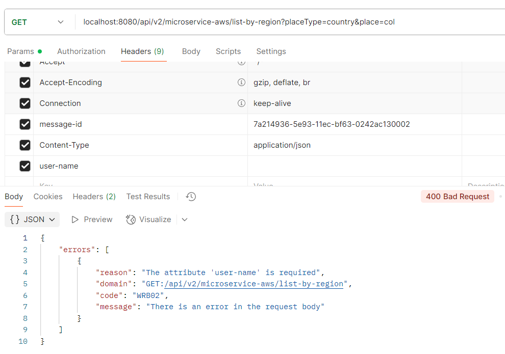
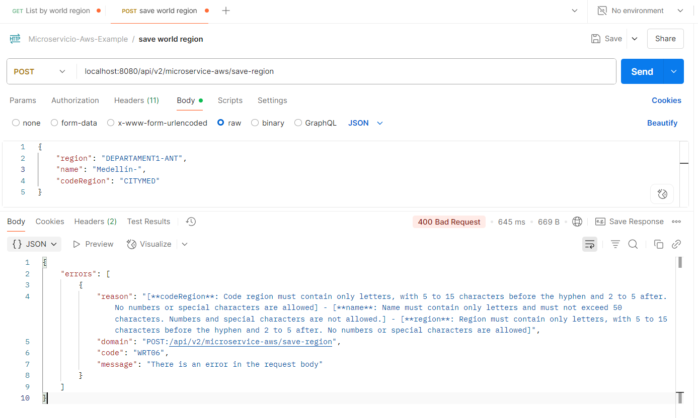

# Creación microservicio APIREST Java Webflux con DynamoDB - Manejo de errores

> A continuación se indica el paso a paso que se debe realizar para continuar con el proyecto de creación de microservicios basados en la nube de AWS, esta guía comprende el manejo de excepciones, mensajes para el usuario y validaciones de datos con expresiones regulares

### Requisitos: 

⚠️ Debes haber realizado el instructivo Api REST Crud DynamoDB<br>
[Realizar instructivo](./2-3-crear-api-rest-crud-dynamodb.md)

## Caso de uso:
Reportar errores técnicos o de negocio

## Criterios de aceptación:
- Informar al cliente sobre información requerida o reglas sobre los datos esperados
- Excepciones deben informarse al cliente sin exponer la estructura del proyecto.

## Crear Enums donde estarán la descripción de los errores

- WRB: Es World Region Business
- WRT: Es World Region Technical

- Ubicarse en el proyecto domain > model en el paquete co.com.microservicio.aws.commons.enums y crear la clase BusinessExceptionMessage.java

    ```
    package co.com.microservicio.aws.commons.enums;

    import lombok.AllArgsConstructor;
    import lombok.Getter;
    import lombok.ToString;

    @Getter
    @AllArgsConstructor
    @ToString
    public enum BusinessExceptionMessage {
        BUSINESS_ERROR("WRB01", "Error in a service", "Server error"),
        BUSINESS_USERNAME_REQUIRED("WRB02", "The attribute 'user-name' is required", "There is an error in the request body"),
        BUSINESS_OTRO_MENSAJE("WRB03", "Others message business", "Other");

        private final String code;
        private final String message;
        private final String typeMessage;

        public String getDescription() {
            return String.join(" - ", this.getCode(), this.getMessage());
        }
    }
    ```

- Ubicarse en el proyecto domain > model en el paquete co.com.microservicio.aws.commons.enums y crear la clase TechnicalExceptionMessage.java
    ```
    package co.com.microservicio.aws.commons.enums;

    import lombok.AllArgsConstructor;
    import lombok.Getter;
    import lombok.ToString;

    @Getter
    @AllArgsConstructor
    @ToString
    public enum TechnicalExceptionMessage {

        TECHNICAL_SERVER_ERROR("WRT01", "Internal server error"),
        TECHNICAL_REST_CLIENT_ERROR("WRT02", "An error has occurred in the Rest Client"),
        TECHNICAL_HEADER_MISSING("WRT03", "Missing parameters per header"),
        TECHNICAL_EVENT_EXCEPTION("WRT04", "An error has occurred sending event"),
        TECHNICAL_SECRET_EXCEPTION("WRT05", "An error occurred while trying to get AWS secrets"),
        TECHNICAL_REQUEST_ERROR("WRT06", "There is an error in the request body"),
        TECHNICAL_GENERATE_FILE_ERROR("WRT08", "An error occurred transforming the messaging to generate the file"),
        TECHNICAL_S3_EXCEPTION("WRT07", "An error occurred while trying to get S3 object"),
        TECHNICAL_S3_PUT_OBJECT_FAIL("WRT09", "An error has occurred upload an object in S3"),
        TECHNICAL_EXCEPTION_REPOSITORY("WRT10", "An error has occurred in the repository");

        private final String code;
        private final String message;

        public String getDescription() {
            return String.join(" - ", this.getCode(), this.getMessage());
        }
    }
    ```

## Crear el objeto de visualización para el cliente

- Ubicarse en el proyecto domain > model en el paquete co.com.microservicio.aws.commons.error y crear la clase Error.java
    ```
    package co.com.microservicio.aws.commons.error;

    import java.io.Serial;
    import java.io.Serializable;
    import java.util.List;

    import lombok.*;

    @Getter
    @AllArgsConstructor
    @NoArgsConstructor
    @Builder(toBuilder = true)
    public class Error implements Serializable {
        @Serial
        private static final long serialVersionUID = 1L;

        private List<Data> errors;

        @AllArgsConstructor
        @NoArgsConstructor
        @Getter
        @Builder(toBuilder = true)
        public static class Data implements Serializable {
            @Serial
            private static final long serialVersionUID = 1L;

            private String reason;
            private String domain;
            private String code;
            private String message;
        }
    }
    ```

## Crear las clases que se usarán para lanzar los Mono.error()

- Ubicarse en el proyecto domain > model en el paquete co.com.microservicio.aws.commons.exceptions y crear la clase TechnicalException.java
    ```
    package co.com.microservicio.aws.commons.exceptions;

    import java.io.Serial;
    import co.com.microservicio.aws.commons.enums.TechnicalExceptionMessage;
    import lombok.Getter;

    @Getter
    public class TechnicalException extends RuntimeException {
        @Serial
        private static final long serialVersionUID = 1L;

        private final TechnicalExceptionMessage typeTechnicalException;
        private final String reason;

        public TechnicalException(Throwable error, TechnicalExceptionMessage technicalExceptionMessage) {
            super(technicalExceptionMessage.getDescription(), error);
            this.typeTechnicalException = technicalExceptionMessage;
            this.reason = technicalExceptionMessage.getDescription();
        }

        public TechnicalException(TechnicalExceptionMessage technicalExceptionEnum) {
            super(technicalExceptionEnum.getMessage());
            this.typeTechnicalException = technicalExceptionEnum;
            this.reason = technicalExceptionEnum.getDescription();
        }

        public TechnicalException(String reason, TechnicalExceptionMessage errorMessage) {
            super(errorMessage.getMessage());
            this.reason = reason;
            this.typeTechnicalException = errorMessage;
        }
    }
    ```

- Ubicarse en el proyecto domain > model en el paquete co.com.microservicio.aws.commons.exceptions y crear la clase BusinessException.java
    ```
    package co.com.microservicio.aws.commons.exceptions;

    import java.io.Serial;
    import co.com.microservicio.aws.commons.error.Error;
    import co.com.microservicio.aws.commons.enums.BusinessExceptionMessage;
    import lombok.Getter;

    @Getter
    public class BusinessException extends RuntimeException {
        @Serial
        private static final long serialVersionUID = 1L;

        private final Error error;
        private final BusinessExceptionMessage typeBusinessException;

        public BusinessException(Error error) {
            super(error.getErrors().get(0).getMessage());
            this.error = error;
            this.typeBusinessException = BusinessExceptionMessage.BUSINESS_ERROR;
        }

        public BusinessException(Throwable error, BusinessExceptionMessage typeBusinessException) {
            super(typeBusinessException.getDescription(), error);
            this.error = Error.builder().build();
            this.typeBusinessException = typeBusinessException;
        }

        public BusinessException(BusinessExceptionMessage typeBusinessException) {
            super(typeBusinessException.getDescription());
            this.error = Error.builder().build();
            this.typeBusinessException = typeBusinessException;
        }
    }
    ```

## Crear ErrorFactory, la clase a cargo de recibir la excepción y construir Error el objeto de respuesta para el cliente.

- Ubicarse en el proyecto domain > model en el paquete co.com.microservicio.aws.commons.error y crear la clase ErrorFactory.java
    ```
    package co.com.microservicio.aws.commons.error;

    import java.util.List;

    import co.com.microservicio.aws.commons.enums.BusinessExceptionMessage;
    import co.com.microservicio.aws.commons.enums.TechnicalExceptionMessage;
    import co.com.microservicio.aws.commons.exceptions.BusinessException;
    import co.com.microservicio.aws.commons.exceptions.TechnicalException;
    import lombok.experimental.UtilityClass;

    import static co.com.microservicio.aws.commons.enums.TechnicalExceptionMessage.TECHNICAL_SERVER_ERROR;

    @UtilityClass
    public class ErrorFactory {

        public Error buildError(TechnicalExceptionMessage technicalExceptionEnum, String reason, String domain) {
            return Error.builder()
                    .errors(List.of(Error.Data.builder().reason(reason).domain(domain)
                            .code(technicalExceptionEnum.getCode()).message(technicalExceptionEnum.getMessage()).build()))
                    .build();
        }

        public Error buildErrorBusiness(BusinessExceptionMessage businessErrorMessage, String reason, String domain) {
            return Error
                    .builder().errors(List.of(Error.Data.builder().reason(reason).domain(domain)
                            .code(businessErrorMessage.getCode()).message(businessErrorMessage.getTypeMessage()).build()))
                    .build();
        }

        public Error fromTechnical(TechnicalException technicalException, String domain) {
            if (technicalException.getReason() == null || technicalException.getReason().isEmpty()) {
                return buildError(technicalException.getTypeTechnicalException(), technicalException.getMessage(), domain);
            } else {
                return buildErrorWithReason(technicalException, domain);
            }
        }

        public Error buildErrorWithReason(TechnicalException technicalException, String domain) {
            return buildError(technicalException.getTypeTechnicalException(), technicalException.getReason(), domain);
        }

        public Error fromBusiness(BusinessException businessException, String domain) {
            if (businessException.getTypeBusinessException() == BusinessExceptionMessage.BUSINESS_ERROR) {
                return businessException.getError();
            }
            return buildErrorBusiness(businessException.getTypeBusinessException(),
                    businessException.getTypeBusinessException().getMessage(), domain);
        }

        public Error fromDefaultTechnical(String reason, String domain) {
            return buildError(TECHNICAL_SERVER_ERROR, reason, domain);
        }
    }
    ```

## Crear la clase que va a capturar todos los Mono.error emitidos en el flujo

- Ubicarse en el proyecto infrastructure > entry-points > reactive-web en el paquete co.com.microservicio.aws.api.exception y crear la clase ExceptionHandler.java
    ```
    package co.com.microservicio.aws.api.exception;

    import java.util.function.Function;
    import static org.springframework.http.HttpStatus.BAD_REQUEST;
    import static org.springframework.http.HttpStatus.INTERNAL_SERVER_ERROR;

    import co.com.microservicio.aws.commons.error.ErrorFactory;
    import co.com.microservicio.aws.commons.exceptions.BusinessException;
    import co.com.microservicio.aws.commons.exceptions.TechnicalException;
    import org.springframework.boot.autoconfigure.web.WebProperties;
    import org.springframework.boot.autoconfigure.web.reactive.error.AbstractErrorWebExceptionHandler;
    import org.springframework.boot.web.reactive.error.ErrorAttributes;
    import org.springframework.context.ApplicationContext;
    import org.springframework.core.annotation.Order;
    import org.springframework.http.HttpStatus;
    import org.springframework.http.MediaType;
    import org.springframework.http.codec.ServerCodecConfigurer;
    import org.springframework.stereotype.Component;
    import org.springframework.web.reactive.function.server.RequestPredicates;
    import org.springframework.web.reactive.function.server.RouterFunction;
    import org.springframework.web.reactive.function.server.RouterFunctions;
    import org.springframework.web.reactive.function.server.ServerRequest;
    import org.springframework.web.reactive.function.server.ServerResponse;
    import reactor.core.publisher.Mono;

    @Order(-2)
    @Component
    public class ExceptionHandler extends AbstractErrorWebExceptionHandler {
        public static final String FORMAT_ERROR = "%s:%s";

        public ExceptionHandler(ErrorAttributes errorAttributes, ApplicationContext applicationContext,
                                ServerCodecConfigurer serverCodecConfigurer) {
            super(errorAttributes, new WebProperties.Resources(), applicationContext);
            this.setMessageWriters(serverCodecConfigurer.getWriters());
        }

        @Override
        protected RouterFunction<ServerResponse> getRoutingFunction(ErrorAttributes errorAttributes) {
            return RouterFunctions.route(RequestPredicates.all(), this::buildErrorResponse);
        }

        public Mono<ServerResponse> buildErrorResponse(final ServerRequest request) {
            return Mono.just(request).map(this::getError).flatMap(Mono::error)
                    .onErrorResume(TechnicalException.class, responseTechnicalError(request))
                    .onErrorResume(BusinessException.class, responseBusinessError(request))
                    .onErrorResume(responseDefaultError(request)).cast(ServerResponse.class);
        }

        private Function<BusinessException, Mono<ServerResponse>> responseBusinessError(ServerRequest request) {
            return e -> Mono
                    .just(ErrorFactory.fromBusiness(e,
                            String.format(FORMAT_ERROR, request.method().name(), request.path())))
                    .flatMap(this::responseFailBusiness);
        }

        private Function<TechnicalException, Mono<ServerResponse>> responseTechnicalError(ServerRequest request) {
            return e -> Mono
                    .just(ErrorFactory.fromTechnical(e,
                            String.format(FORMAT_ERROR, request.method().name(), request.path())))
                    .flatMap(this::responseFailBusiness);
        }

        private Function<Throwable, Mono<ServerResponse>> responseDefaultError(ServerRequest request) {
            return exception -> Mono
                    .just(ErrorFactory.fromDefaultTechnical(exception.getMessage(),
                            String.format(FORMAT_ERROR, request.method().name(), request.path())))
                    .flatMap(this::responseFail);
        }

        public <T> Mono<ServerResponse> buildResponse(T error, HttpStatus httpStatus) {
            return ServerResponse.status(httpStatus).contentType(MediaType.APPLICATION_JSON).bodyValue(error);
        }

        public <T> Mono<ServerResponse> responseFail(T body) {
            return buildResponse(body, INTERNAL_SERVER_ERROR);
        }

        public <T> Mono<ServerResponse> responseFailBusiness(T body) {
            return buildResponse(body, BAD_REQUEST);
        }
    }
    ```

    ¿Por qué usar @Order(-2)?
    - Spring ya tiene un DefaultErrorWebExceptionHandler que también extiende AbstractErrorWebExceptionHandler.

    - Si defines uno personalizado y no le das mayor prioridad (-2 o menor), el de Spring lo sobreescribirá o ejecutará antes.

    - @Order(-2) asegura que tu handler personalizado tenga precedencia y maneje los errores globales de tu manera.

## Adaptar las clases construidas para emitir el error y seguir imprimiendo logs

- Ubicarse en el proyecto infrastructure > entry-points > reactive-web en el paquete co.com.microservicio.aws.api.worldregion y modificar el metodo listByRegion de la clase WorldRegionHandler.java por el siguiente código
    ```
    public Mono<ServerResponse> listByRegion(ServerRequest serverRequest) {
        var request = this.buildRequestWithParams(serverRequest, METHOD_LISTCOUNTRIES);

        return worldRegionUseCase.listByRegion(request)
            .doOnError(e -> this.printFailed(e, request.getContext().getId()))
            .flatMap(response -> ServerResponse.ok().bodyValue(response));
    }
    ```

- Ubicarse en el proyecto domain > usecase en el paquete co.com.microservicio.aws.usecase.worldregion y modificar el metodo listByRegion de la clase WorldRegionUseCase.java por el siguiente código y realizar las respectivas importaciones
    ```
    public Mono<TransactionResponse> listByRegion(TransactionRequest request){
        return Mono.just(request)
            .filter(this::userIsRequired)
            .flatMap(req -> regionRepository.findByRegion(buildKeyRegion(req))
                    .collectList().flatMap(this::buildResponse)
            ).switchIfEmpty(Mono.defer(() -> Mono.error(new BusinessException(BUSINESS_USERNAME_REQUIRED))));
    }
    ```

## Ejecución de la prueba

- Validar que el user-name enviado en el header contenga un valor



## Explicación de como funciona la emisión de errores hacia el cliente

1. Se realiza la petición
2. El caso de uso valida la información del usuario
3. Se emite el error de tipo BusinessException con el enum que contiene el mensaje que queremos mostrar al usuario
4. El metodo invocado en el Handler ejecuta dentro del flujo la función doOnError para imprimir el log sin alterar el lanzamiento de la excepcion
5. La clase ExceptionHandler captura el evento
6. De acuerdo al tipo de Exception (BusinessException) en este caso invoca el metodo responseBusinessError
7. Se invoca a la clase ErrorFactory para que construya el mensaje para el usuario.
8. El usuario recibe el mensaje.

## Validaciones avanzadas para request body con expresiones regulares

1. Instalar helper util
    
    - Util: Contiene el validador body con expresiones regulares

    Abrir la consola de comandos y ejecutar el siguiente script en el directorio que contiene el build.gradle general
    ```
    gradle generateHelper --name=utils
    ```

2. Ubicarse en el proyecto helpers > utils y cambiar el archivo build.gradle
    ```
    dependencies {
        implementation project(':model')
        implementation "org.springframework.boot:spring-boot-starter-webflux:${springBootVersion}"
        implementation "org.springframework.boot:spring-boot-starter-validation:${springBootVersion}"
    }
    ```
    Actualizar dependencias

3. Modificar application-local.properties por lo siguiente:
```
entries:
  reactive-web:
    path-base: "${PATH_BASE:/api/v1/microservice-aws}"
    greet: "/greet"
    greetReactive: "/greetReactive"
    greetReactiveQueryParam: "/greetReactiveQueryParam"
    greetReactivePathVariable: "/greetReactivePathVariable/{place}"
  world-region-web:
    path-base: "${PATH_BASE:/api/v2/microservice-aws}"
    listByRegion: "/list-by-region"
    findOne: "/find-one"
    saveRegion: "/save-region"
    updateRegion: "/update-region"
    deleteRegion: "/delete-region"
  regex-body-wr:
    region: "${REGEX_WR_REGION:^[a-zA-Z]{5,15}-[a-zA-Z]{2,5}$}"
    name: "${REGEX_WR_NAME:^[a-zA-ZáéíóúÁÉÍÓÚñÑ\\s]{1,50}$}"
    code-region: "${REGEX_WR_CODE_REGION:^[a-zA-Z]{5,15}-[a-zA-Z]{2,5}$}"
```

4. Ubicarse en el proyecto helpers > utils en el paquete co.com.microservicio.aws.utils.validator y crear la clase RegionValidator.java
    ```
    package co.com.microservicio.aws.utils.validator;

    import co.com.microservicio.aws.utils.validator.gateways.ValidRegion;
    import org.springframework.beans.factory.annotation.Value;

    import jakarta.validation.ConstraintValidator;
    import jakarta.validation.ConstraintValidatorContext;

    public class RegionValidator implements ConstraintValidator<ValidRegion, String> {
        private String regionPattern;

        public RegionValidator(@Value("${entries.regex-body-wr.region}") String regionPattern) {
            this.regionPattern = regionPattern;
        }

        @Override
        public boolean isValid(String value, ConstraintValidatorContext context) {
            return value != null && value.matches(regionPattern);
        }
    }
    ```

5. Ubicarse en el proyecto helpers > utils en el paquete co.com.microservicio.aws.utils.validator.gateways y crear la clase ValidRegion.java
    ```
    package co.com.microservicio.aws.utils.validator.gateways;

    import java.lang.annotation.ElementType;
    import java.lang.annotation.Retention;
    import java.lang.annotation.RetentionPolicy;
    import java.lang.annotation.Target;

    import co.com.microservicio.aws.utils.validator.RegionValidator;
    import jakarta.validation.Constraint;
    import jakarta.validation.Payload;

    @Constraint(validatedBy = RegionValidator.class)
    @Target({ ElementType.METHOD, ElementType.FIELD, ElementType.ANNOTATION_TYPE, ElementType.PARAMETER })
    @Retention(RetentionPolicy.RUNTIME)
    public @interface ValidRegion {
        String message() default "Region must contain only letters, with up to 15 characters before the " +
                "hyphen and up to 5 after. No numbers or special characters are allowed";

        Class<?>[] groups() default {};

        Class<? extends Payload>[] payload() default {};
    }
    ```

6. Ubicarse en el proyecto helpers > utils en el paquete co.com.microservicio.aws.utils.validator y crear la clase NameValidator.java
    ```
    package co.com.microservicio.aws.utils.validator;

    import co.com.microservicio.aws.utils.validator.gateways.ValidName;
    import jakarta.validation.ConstraintValidator;
    import jakarta.validation.ConstraintValidatorContext;
    import org.springframework.beans.factory.annotation.Value;

    public class NameValidator implements ConstraintValidator<ValidName, String> {
        private String namePattern;

        public NameValidator(@Value("${entries.regex-body-wr.name}") String namePattern) {
            this.namePattern = namePattern;
        }

        @Override
        public boolean isValid(String value, ConstraintValidatorContext context) {
            return value != null && value.matches(namePattern);
        }
    }
    ```

7. Ubicarse en el proyecto helpers > utils en el paquete co.com.microservicio.aws.utils.validator y crear la clase ValidName.java
    ```
    package co.com.microservicio.aws.utils.validator.gateways;

    import co.com.microservicio.aws.utils.validator.NameValidator;
    import jakarta.validation.Constraint;
    import jakarta.validation.Payload;

    import java.lang.annotation.ElementType;
    import java.lang.annotation.Retention;
    import java.lang.annotation.RetentionPolicy;
    import java.lang.annotation.Target;

    @Constraint(validatedBy = NameValidator.class)
    @Target({ ElementType.METHOD, ElementType.FIELD, ElementType.ANNOTATION_TYPE, ElementType.PARAMETER })
    @Retention(RetentionPolicy.RUNTIME)
    public @interface ValidName {
        String message() default "Name must contain only letters and must not exceed 50 characters. " +
            "Numbers and special characters are not allowed.";

        Class<?>[] groups() default {};

        Class<? extends Payload>[] payload() default {};
    }
    ```

8. Ubicarse en el proyecto helpers > utils en el paquete co.com.microservicio.aws.utils.validator y crear la clase CodeRegionValidator.java
    ```
    package co.com.microservicio.aws.utils.validator;

    import co.com.microservicio.aws.utils.validator.gateways.ValidCodeRegion;
    import jakarta.validation.ConstraintValidator;
    import jakarta.validation.ConstraintValidatorContext;
    import org.springframework.beans.factory.annotation.Value;

    public class CodeRegionValidator implements ConstraintValidator<ValidCodeRegion, String> {
        private String codeRegionPattern;

        public CodeRegionValidator(@Value("${entries.regex-body-wr.code-region}") String codeRegionPattern) {
            this.codeRegionPattern = codeRegionPattern;
        }

        @Override
        public boolean isValid(String value, ConstraintValidatorContext context) {
            return value != null && value.matches(codeRegionPattern);
        }
    }
    ```

9. Ubicarse en el proyecto helpers > utils en el paquete co.com.microservicio.aws.utils.validator y crear la clase ValidCodeRegion.java
    ```
    package co.com.microservicio.aws.utils.validator.gateways;

    import java.lang.annotation.ElementType;
    import java.lang.annotation.Retention;
    import java.lang.annotation.RetentionPolicy;
    import java.lang.annotation.Target;

    import co.com.microservicio.aws.utils.validator.CodeRegionValidator;
    import jakarta.validation.Constraint;
    import jakarta.validation.Payload;

    @Constraint(validatedBy = CodeRegionValidator.class)
    @Target({ ElementType.METHOD, ElementType.FIELD, ElementType.ANNOTATION_TYPE, ElementType.PARAMETER })
    @Retention(RetentionPolicy.RUNTIME)
    public @interface ValidCodeRegion {
        String message() default "Code region must contain only letters, with 5 to 15 characters before the hyphen and 2 to 5 after. " +
                "No numbers or special characters are allowed";

        Class<?>[] groups() default {};

        Class<? extends Payload>[] payload() default {};
    }
    ```

10. Ubicarse en el proyecto infrastructure > entry-points > reactive-web en el paquete co.com.microservicio.aws.api.commons y crear la clase RequestUtil.java
    ```
    package co.com.microservicio.aws.api.commons;

    import java.util.List;
    import java.util.Set;
    import java.util.stream.Collectors;

    import co.com.microservicio.aws.commons.exceptions.TechnicalException;
    import co.com.microservicio.aws.log.LoggerBuilder;
    import co.com.microservicio.aws.log.TransactionLog;
    import org.springframework.stereotype.Component;
    import jakarta.validation.ConstraintViolation;
    import jakarta.validation.Validator;
    import lombok.RequiredArgsConstructor;
    import reactor.core.publisher.Mono;

    import static co.com.microservicio.aws.commons.enums.TechnicalExceptionMessage.TECHNICAL_REQUEST_ERROR;
    import static co.com.microservicio.aws.model.worldregion.util.LogMessage.MESSAGE_SERVICE;

    @Component
    @RequiredArgsConstructor
    public class RequestUtil {
        private static final String NAME_CLASS = RequestUtil.class.getName();
        private static final String MSG_VALID_REQUEST_DATA = "Validation with errors";
        private final LoggerBuilder logger;
        private final Validator validator;

        public <T> Mono<T> checkBodyRequest(T rq, String transactionId) {
            return Mono.defer(() -> validateDto(rq, transactionId)).thenReturn(rq);
        }

        private <T> Mono<Void> validateDto(T rq, String transactionId) {
            var message = "";

            Set<ConstraintViolation<T>> violations = validator.validate(rq);
            if (!violations.isEmpty()) {
                logger.info(TransactionLog.Request.builder().body(rq).build(),
                        TransactionLog.Response.builder().build(),
                        MSG_VALID_REQUEST_DATA, transactionId, MESSAGE_SERVICE, NAME_CLASS);

                message = getMessageValidationErrors(violations);
                logger.error(message, transactionId, MESSAGE_SERVICE, NAME_CLASS);
            }

            return message.isEmpty() ? Mono.empty() : Mono.error(new TechnicalException(message, TECHNICAL_REQUEST_ERROR));
        }

        private static String getMessageValidationErrors(Set<? extends ConstraintViolation<?>> constraintViolations) {
            return constraintViolations.stream().map(cv -> "[**" + cv.getPropertyPath() + "**: " + cv.getMessage() + "]")
                    .collect(Collectors.joining(" - "));
        }
    }
    ```

11. Ubicarse en el proyecto infrastructure > entry-points > reactive-web y modificamos el archivo build.gradle para agregar la dependencia del proyecto que creamos utils en helpers
    ```
    implementation project(':utils')
    ```
    Actulizar dependencias

12. Ubicarse en el proyecto infrastructure > entry-points > reactive-web en el paquete co.com.microservicio.aws.api.worldregion.rq y crear la clase WorldRegionRQ.java
    ```
    package co.com.microservicio.aws.api.worldregion.rq;

    import co.com.microservicio.aws.utils.validator.gateways.ValidCodeRegion;
    import co.com.microservicio.aws.utils.validator.gateways.ValidName;
    import co.com.microservicio.aws.utils.validator.gateways.ValidRegion;
    import lombok.AllArgsConstructor;
    import lombok.Builder;
    import lombok.Data;
    import lombok.NoArgsConstructor;

    import java.io.Serial;
    import java.io.Serializable;

    @Data
    @NoArgsConstructor
    @AllArgsConstructor
    @Builder(toBuilder = true)
    public class WorldRegionRQ implements Serializable {
        @Serial
        private static final long serialVersionUID = 1L;

        @ValidRegion
        private String region;
        private String code;
        @ValidName
        private String name;
        @ValidCodeRegion
        private String codeRegion;
        private String creationDate;
    }
    ```

13. Ubicarse en el proyecto infrastructure > entry-points > reactive-web en el paquete co.com.microservicio.aws.api.worldregion y modificamos la clase WorldRegionHandler.java
    ```
    package co.com.microservicio.aws.api.worldregion;

    import co.com.microservicio.aws.api.commons.RequestUtil;
    import co.com.microservicio.aws.api.worldregion.rq.WorldRegionRQ;
    import co.com.microservicio.aws.commons.ContextUtil;
    import co.com.microservicio.aws.log.LoggerBuilder;
    import co.com.microservicio.aws.log.TransactionLog;
    import co.com.microservicio.aws.model.worldregion.WorldRegion;
    import co.com.microservicio.aws.model.worldregion.rq.Context;
    import co.com.microservicio.aws.model.worldregion.rq.TransactionRequest;
    import co.com.microservicio.aws.usecase.worldregion.WorldRegionUseCase;
    import lombok.RequiredArgsConstructor;
    import org.springframework.stereotype.Component;
    import org.springframework.web.reactive.function.server.ServerRequest;
    import org.springframework.web.reactive.function.server.ServerResponse;
    import reactor.core.publisher.Mono;

    import static co.com.microservicio.aws.model.worldregion.util.LogMessage.*;
    import static co.com.microservicio.aws.model.worldregion.util.WorldRegionConstant.*;

    @Component
    @RequiredArgsConstructor
    public class WorldRegionHandler {
        private final RequestUtil requestUtil;
        private static final String NAME_CLASS = WorldRegionHandler.class.getName();
        private static final String EMPTY_VALUE = "";

        private final LoggerBuilder logger;
        private final WorldRegionUseCase worldRegionUseCase;

        public Mono<ServerResponse> listByRegion(ServerRequest serverRequest) {
            var request = this.buildRequestWithParams(serverRequest, METHOD_LISTCOUNTRIES);
            return worldRegionUseCase.listByRegion(request)
                .doOnError(e -> this.printFailed(e, request.getContext().getId()))
                .flatMap(response -> ServerResponse.ok().bodyValue(response));
        }

        public Mono<ServerResponse> findOne(ServerRequest serverRequest) {
            var request = this.buildRequestWithParams(serverRequest, METHOD_FINDONE);
            return worldRegionUseCase.findOne(request)
                .doOnError(e -> this.printFailed(e, request.getContext().getId()))
                .flatMap(response -> ServerResponse.ok().bodyValue(response));
        }

        public Mono<ServerResponse> save(ServerRequest serverRequest) {
            var headers = serverRequest.headers().asHttpHeaders().toSingleValueMap();
            var context = ContextUtil.buildContext(headers);
            printOnProcess(context, METHOD_SAVE);

            return this.getWorldRegionRequest(serverRequest)
                    .flatMap(worldRegionUseCase::save)
                    .flatMap(msg -> ServerResponse.ok().bodyValue(msg));
        }

        public Mono<ServerResponse> update(ServerRequest serverRequest) {
            var headers = serverRequest.headers().asHttpHeaders().toSingleValueMap();
            var context = ContextUtil.buildContext(headers);
            printOnProcess(context, METHOD_UPDATE);

            return this.getWorldRegionRequest(serverRequest)
                    .flatMap(worldRegionUseCase::update)
                    .flatMap(msg -> ServerResponse.ok().bodyValue(msg));
        }

        public Mono<ServerResponse> delete(ServerRequest serverRequest) {
            var request = this.buildRequestWithParams(serverRequest, METHOD_DELETE);
            return worldRegionUseCase.delete(request)
                    .doOnError(e -> this.printFailed(e, request.getContext().getId()))
                    .flatMap(response -> ServerResponse.ok().bodyValue(response));
        }

        private Mono<TransactionRequest> getWorldRegionRequest(ServerRequest serverRequest) {
            var headers = serverRequest.headers().asHttpHeaders().toSingleValueMap();
            var context = ContextUtil.buildContext(headers);
            return serverRequest.bodyToMono(WorldRegionRQ.class)
                    .flatMap(wr -> requestUtil.checkBodyRequest(wr, context.getId()))
                    .flatMap(wr -> Mono.just(TransactionRequest.builder()
                        .context(context).item(
                            WorldRegion.builder()
                            .region(wr.getRegion()).code(wr.getCode()).name(wr.getName())
                            .codeRegion(wr.getCodeRegion()).creationDate(wr.getCreationDate())
                            .build()
                        ).build()));
        }

        private TransactionRequest buildRequestWithParams(ServerRequest serverRequest, String method){
            var placeType = serverRequest.queryParam(PARAM_PLACE_TYPE).orElse(EMPTY_VALUE);
            var place = serverRequest.queryParam(PARAM_PLACE).orElse(EMPTY_VALUE);
            var code = serverRequest.queryParam(PARAM_CODE).orElse(EMPTY_VALUE);
            var headers = serverRequest.headers().asHttpHeaders().toSingleValueMap();
            var context = ContextUtil.buildContext(headers);
            printOnProcess(context, method);

            return TransactionRequest.builder()
                    .context(context)
                    .param(TransactionRequest.Param.builder().placeType(placeType).place(place).code(code).build())
                    .build();
        }

        private void printFailed(Throwable throwable, String messageId) {
            logger.error(throwable.getMessage(), messageId, MESSAGE_SERVICE, NAME_CLASS);
        }

        private void printOnProcess(Context context, String messageInfo){
            logger.info(TransactionLog.Request.builder().body(context).build(),
                    TransactionLog.Response.builder().build(),
                    messageInfo, context.getId(), MESSAGE_SERVICE, NAME_CLASS);
        }
    }
    ```

11. Validación de la implementación con el metodo guardar

    - Prueba postman
    

    - Prueba logs
    ```
    printOnProcess()

    {
        "instant": {
            "epochSecond": 1751215453,
            "nanoOfSecond": 865449600
        },
        "thread": "reactor-http-nio-3",
        "level": "INFO",
        "loggerName": "co.com.microservicio.aws.log.LoggerBuilder",
        "message": "{\"dataLog\":{\"message\":\"Save one world region\",\"messageId\":\"7a214936-5e93-11ec-bf63-0242ac130002\",\"service\":\"Service Api Rest world regions\",\"method\":\"co.com.microservicio.aws.api.worldregion.WorldRegionHandler\",\"appName\":\"MicroserviceAws\"},\"request\":{\"headers\":null,\"body\":{\"id\":\"7a214936-5e93-11ec-bf63-0242ac130002\",\"customer\":{\"ip\":\"\",\"username\":\"user dummy\",\"device\":{\"userAgent\":\"\",\"platformType\":\"\"}}}},\"response\":{\"headers\":null,\"body\":null}}",
        "endOfBatch": false,
        "loggerFqcn": "org.apache.logging.log4j.spi.AbstractLogger",
        "threadId": 58,
        "threadPriority": 5
    }

    Informativo Validations con errores
    {
        "instant": {
            "epochSecond": 1751215454,
            "nanoOfSecond": 109292100
        },
        "thread": "reactor-http-nio-3",
        "level": "INFO",
        "loggerName": "co.com.microservicio.aws.log.LoggerBuilder",
        "message": "{\"dataLog\":{\"message\":\"Validation with errors\",\"messageId\":\"7a214936-5e93-11ec-bf63-0242ac130002\",\"service\":\"Service Api Rest world regions\",\"method\":\"co.com.microservicio.aws.api.commons.RequestUtil\",\"appName\":\"MicroserviceAws\"},\"request\":{\"headers\":null,\"body\":{\"region\":\"DEPARTAMENT1-ANT\",\"code\":null,\"name\":\"Medellín-\",\"codeRegion\":\"CITYMED\",\"creationDate\":null}},\"response\":{\"headers\":null,\"body\":null}}",
        "endOfBatch": false,
        "loggerFqcn": "org.apache.logging.log4j.spi.AbstractLogger",
        "threadId": 58,
        "threadPriority": 5
    }

    Respuesta al cliente
    {
        "instant": {
            "epochSecond": 1751215454,
            "nanoOfSecond": 111334600
        },
        "thread": "reactor-http-nio-3",
        "level": "ERROR",
        "loggerName": "co.com.microservicio.aws.log.LoggerBuilder",
        "message": "{\"dataLog\":{\"message\":\"[**codeRegion**: Code region must contain only letters, with 5 to 15 characters before the hyphen and 2 to 5 after. No numbers or special characters are allowed] - [**name**: Name must contain only letters and must not exceed 50 characters. Numbers and special characters are not allowed.] - [**region**: Region must contain only letters, with 5 to 15 characters before the hyphen and 2 to 5 after. No numbers or special characters are allowed]\",\"messageId\":\"7a214936-5e93-11ec-bf63-0242ac130002\",\"service\":\"Service Api Rest world regions\",\"method\":\"co.com.microservicio.aws.api.commons.RequestUtil\",\"appName\":\"MicroserviceAws\"},\"request\":{\"headers\":null,\"body\":null},\"response\":{\"headers\":null,\"body\":null}}",
        "endOfBatch": false,
        "loggerFqcn": "org.apache.logging.log4j.spi.AbstractLogger",
        "threadId": 58,
        "threadPriority": 5
    }
    ```

[< Volver al índice](README.md)

---

⚠️ Este contenido no puede ser usado con fines comerciales. Ver [LICENSE.md](LICENSE.md)