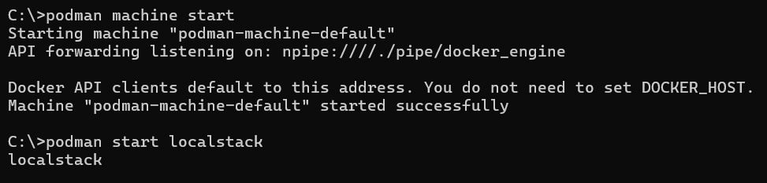
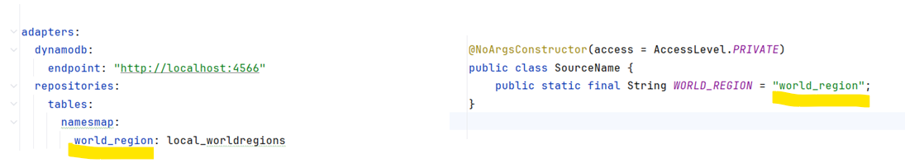
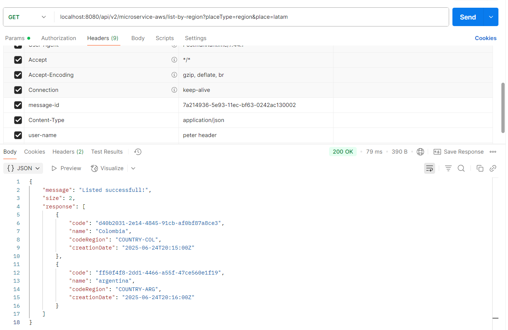
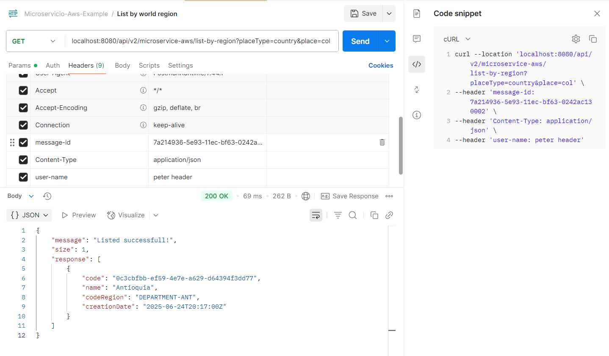
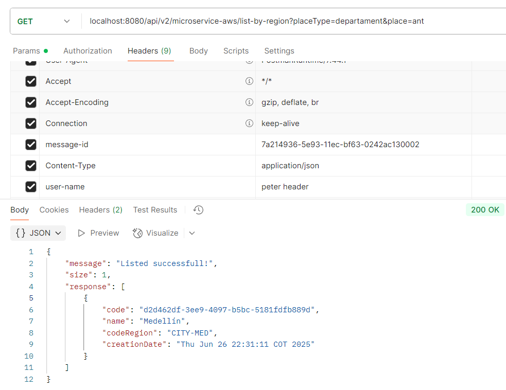
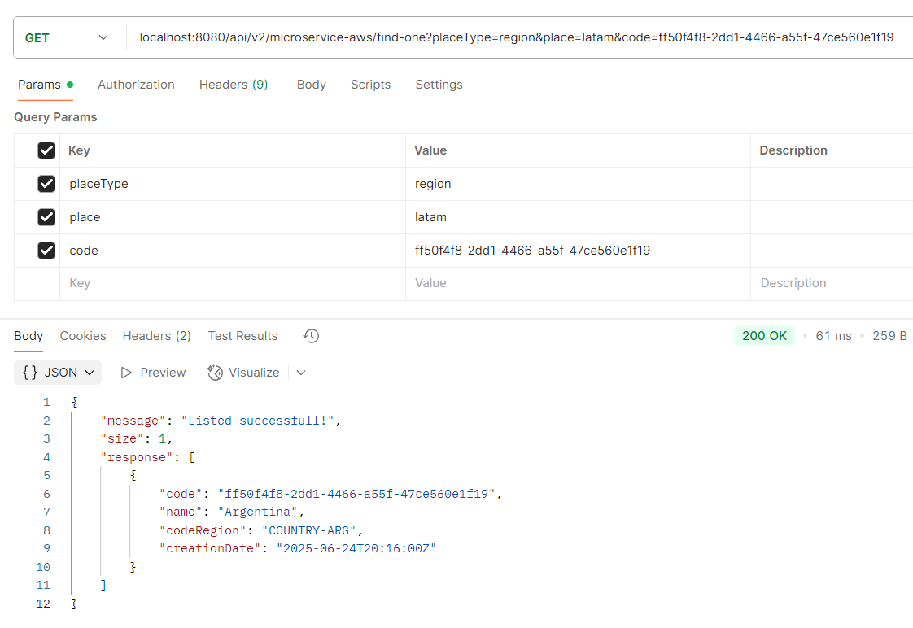
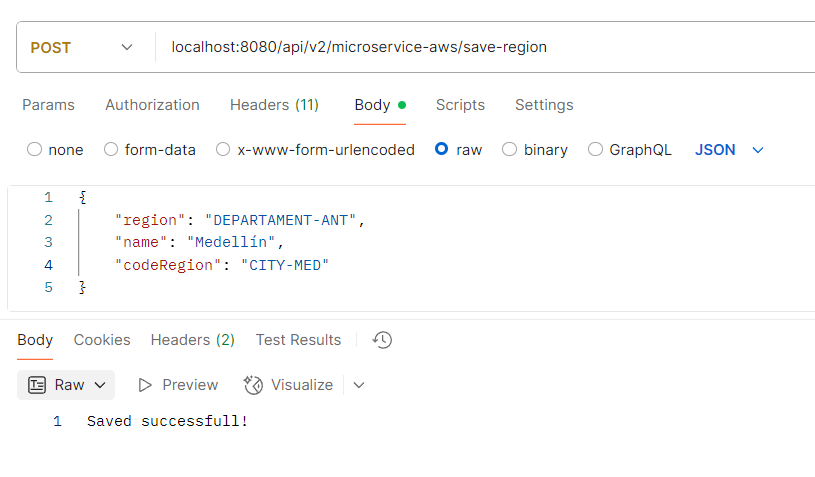
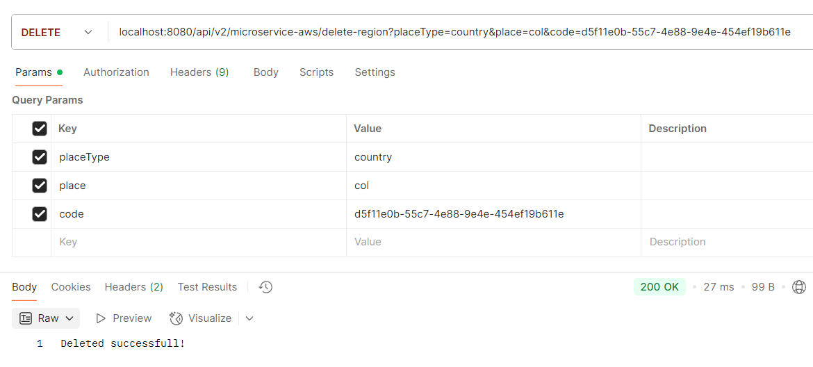
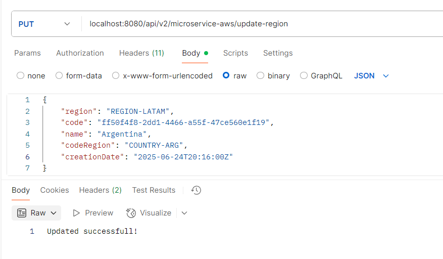

# Creación microservicio APIREST Java Webflux con DynamoDB
> A continuación se indica el paso a paso que se debe realizar para continuar con el proyecto de creación de microservicios basados en la nube de AWS, esta guía comprende la creación de API REST con metodos HTTP a una tabla en dynamo db con un caso practico real

### Requisitos: 

⚠️ Debes haber realizado el instructivo de ambiente local para comprender los comandos que usaremos<br>
[Ver documentación ambiente local](./1-1-podman-localstack-aws.md)

⚠️ Debes haber comprendido el funcionamiento de creación de tablas en DynamoDB <br>
[Ver documentación dynamoDB](./1-2-1-dynamodb.md)

⚠️ Debes haber realizado el proyecto base para continuar con este instructivo <br>
[Crear proyecto base](./2-1-crear-proyecto-base.md)

⚠️ Debes haber realizado el proyecto api rest para continuar con este instructivo <br>
[Crear proyecto base](./2-2-crear-api-rest.md)

⚠️ Debes haber comprendido algunos de los flujos en programación reactiva<br>
[Spring webflux](./1-3-spring-webflux.md)

## Caso de uso:
Permitir crear, actualizar, borrar y consultar la ubicación geográfica partiendo del nivel más general (país) hasta el más específico (unidad o conjunto residencial).

## Criterios de aceptación:
- Listar todos los paises por region
- Listar departamentos por pais
- Listar ciudad por departamento
- Listar un item en especifico
- Registrar item en la tabla
- Borrar item
- Actualizar nombre a un item

## Creación de la tabla dynamoDB en ambiente local

1. Comandos ambiente local (si usas docker cambias *podman* por *docker*)
    ```
    podman machine start
    podman start localstack
    ```

    

2. Creación de la estructura de la tabla
    ```
    aws --endpoint-url=http://localhost:4566 dynamodb create-table --table-name local_worldregions --attribute-definitions AttributeName=region,AttributeType=S AttributeName=code,AttributeType=S --key-schema AttributeName=region,KeyType=HASH AttributeName=code,KeyType=RANGE --provisioned-throughput ReadCapacityUnits=5,WriteCapacityUnits=5
    ```
    ### Aclaración de atributos en el comando `aws dynamodb create-table`

    - partitionkey → `region`, country-col, region-latam, etc.

    - sortkey → `code` (usaremos UUID para simular unicidad)

    ### Buenas prácticas de diseño
    | Concepto                      | Explicación breve                                                                 |
    |------------------------------|------------------------------------------------------------------------------------|
    | 🔑 partitionKey debe repetirse | Así puedes agrupar varios ítems relacionados y usar query por PK.                 |
    | 📚 sortKey debe diferenciar ítems | Dentro del grupo de PK, sirve para ordenar o filtrar.                            |
    | 🔍 getItem(PK, SK)            | Recupera 1 solo ítem (requiere ambos).                                            |
    | 📈 query(PK)                  | Recupera todos los ítems con esa PK (opcionalmente con condiciones en SK).       |

    ### Conclusiones:

    - ✔️ Usa partitionKey para agrupar ítems relacionados
    - ✔️ Usa sortKey para ordenar o identificar únicos dentro del grupo
    - ✔️ La combinación PK+SK es lo que hace único un ítem
    - ✔️ Puedes hacer query(PK) sin SK para traer todos los del grupo

3. Así queda creada la tabla
    ```
    {
        "TableDescription": {
            "AttributeDefinitions": [
                {
                    "AttributeName": "region",
                    "AttributeType": "S"
                },
                {
                    "AttributeName": "code",
                    "AttributeType": "S"
                }
            ],
            "TableName": "local_worldregions",
            "KeySchema": [
                {
                    "AttributeName": "region",
                    "KeyType": "HASH"
                },
                {
                    "AttributeName": "code",
                    "KeyType": "RANGE"
                }
            ],
            "TableStatus": "ACTIVE",
            "CreationDateTime": "2025-06-24T23:30:18.460000-05:00",
            "ProvisionedThroughput": {
                "LastIncreaseDateTime": "1969-12-31T19:00:00-05:00",
                "LastDecreaseDateTime": "1969-12-31T19:00:00-05:00",
                "NumberOfDecreasesToday": 0,
                "ReadCapacityUnits": 5,
                "WriteCapacityUnits": 5
            },
            "TableSizeBytes": 0,
            "ItemCount": 0,
            "TableArn": "arn:aws:dynamodb:us-east-1:000000000000:table/local_worldregions"
        }
    }
    ```

4. Ingreso items a la tabla (*Los comandos estan organizados para ejecutar en command line de windows*)
    ```
    aws --endpoint-url=http://localhost:4566 dynamodb put-item --table-name local_worldregions --item "{\"region\":{\"S\":\"REGION-LATAM\"},\"code\":{\"S\":\"d40b2031-2e14-4845-91cb-af0bf87a8ce3\"},\"name\":{\"S\":\"Colombia\"},\"codeRegion\":{\"S\":\"COUNTRY-COL\"},\"creationDate\":{\"S\":\"2025-06-24T20:15:00Z\"}}"

    aws --endpoint-url=http://localhost:4566 dynamodb put-item --table-name local_worldregions --item "{\"region\":{\"S\":\"REGION-LATAM\"},\"code\":{\"S\":\"ff50f4f8-2dd1-4466-a55f-47ce560e1f19\"},\"name\":{\"S\":\"argentina\"},\"codeRegion\":{\"S\":\"COUNTRY-ARG\"},\"creationDate\":{\"S\":\"2025-06-24T20:16:00Z\"}}"

    aws --endpoint-url=http://localhost:4566 dynamodb put-item --table-name local_worldregions --item "{\"region\":{\"S\":\"COUNTRY-COL\"},\"code\":{\"S\":\"0c3cbfbb-ef59-4e7e-a629-d64394f3dd77\"},\"name\":{\"S\":\"Antioquia\"},\"codeRegion\":{\"S\":\"DEPARTMENT-ANT\"},\"creationDate\":{\"S\":\"2025-06-24T20:17:00Z\"}}"

    aws --endpoint-url=http://localhost:4566 dynamodb put-item --table-name local_worldregions --item "{\"region\":{\"S\":\"DEPARTMENT-ANT\"},\"code\":{\"S\":\"f46a680a-5b1d-4d18-a01b-a07e90176e3c\"},\"name\":{\"S\":\"Medellin\"},\"codeRegion\":{\"S\":\"CITY-MED\"},\"creationDate\":{\"S\":\"2025-06-24T20:18:00Z\"}}"
    ```

## Creación de la capa de dominio y servicios REST

1. Ubicarse en el proyecto domain > model en el paquete co.com.microservicio.aws.model, creamos la clase POJO WolrdRegion.java para mapear todos los datos de la tabla de dynamoDB
        
    ```
    package co.com.microservicio.aws.model.worldregion;

    import lombok.AllArgsConstructor;
    import lombok.Builder;
    import lombok.Data;
    import lombok.NoArgsConstructor;
    import java.io.Serial;
    import java.io.Serializable;

    @Data
    @NoArgsConstructor
    @AllArgsConstructor
    @Builder(toBuilder = true)
    public class WorldRegion implements Serializable {
        @Serial
        private static final long serialVersionUID = 1L;

        private String region;
        private String code;
        private String name;
        private String codeRegion;
        private String creationDate;
    }
    ```

2. Primero definimos nuestros modelos de transporte, enfocándonos en crear las clases necesarias para comunicar la capa REST con el caso de uso. Estas clases contienen la información relevante para el funcionamiento interno del microservicio, así como los datos que podrían ser útiles para integrar con otros microservicios o para ser publicados como eventos en colas o buses de mensajería.

    - Ubicarse en el proyecto domain > model en el paquete co.com.microservicio.aws.model.worldregion.rq y crear la clase Context.java
    ```
    package co.com.microservicio.aws.model.worldregion.rq;

    import lombok.AllArgsConstructor;
    import lombok.Builder;
    import lombok.Getter;
    import lombok.NoArgsConstructor;
    import lombok.Setter;

    @Getter
    @Setter
    @NoArgsConstructor
    @AllArgsConstructor
    @Builder(toBuilder = true)
    public class Context {
        private String id;
        private Customer customer;

        @Getter
        @Setter
        @NoArgsConstructor
        @AllArgsConstructor
        @Builder(toBuilder = true)
        public static class Customer {
            private String ip;
            private String username;
            private Device device;
        }

        @Getter
        @Setter
        @NoArgsConstructor
        @AllArgsConstructor
        @Builder(toBuilder = true)
        public static class Device {
            private String userAgent;
            private String platformType;
        }
    }
    ```

    - Ubicarse en el proyecto domain > model en el paquete co.com.microservicio.aws.model.worldregion.rq y crear la clase TransactionRequest.java
    ```
    package co.com.microservicio.aws.model.worldregion.rq;

    import co.com.microservicio.aws.model.worldregion.WorldRegion;
    import lombok.*;

    import java.io.Serial;
    import java.io.Serializable;

    @Getter
    @Setter
    @NoArgsConstructor
    @AllArgsConstructor
    @Builder(toBuilder = true)
    public class TransactionRequest implements Serializable {
        @Serial
        private static final long serialVersionUID = 1L;

        private transient Context context;
        private transient Param param;
        private transient WorldRegion item;

        @Getter
        @Setter
        @NoArgsConstructor
        @AllArgsConstructor
        @Builder(toBuilder = true)
        public static class Param {
            private String placeType;
            private String place;
            private String code;
        }
    }
    ```

    **Nota:** Utilizamos la palabra clave transient para excluir ciertos campos del proceso de serialización. Esto significa que, al convertir un objeto en un flujo de bytes (por ejemplo, para enviarlo por red, almacenarlo en un archivo o en caché), los campos marcados como transient no se incluirán. Aunque estos datos pueden ser útiles para enviar a una cola o integrarse con otros sistemas, en esos casos se deberá construir un objeto específico para tal propósito. En el contexto de este requerimiento, no es necesario serializar dichos campos, ya que contienen información sensible o estrictamente técnica que no debe persistirse ni exponerse

3. Ahora creamos nuestra clase de respuesta la cual contiene información del proceso y resultado esperado.

    - Ubicarse en el proyecto domain > model en el paquete co.com.microservicio.aws.model.worldregion.rs y crear la clase  WorldRegionResponse.java
    ```
    package co.com.microservicio.aws.model.worldregion.rs;

    import lombok.*;

    import java.io.Serial;
    import java.io.Serializable;

    @Getter
    @Setter
    @NoArgsConstructor
    @AllArgsConstructor
    @Builder(toBuilder = true)
    public class WorldRegionResponse implements Serializable {
        @Serial
        private static final long serialVersionUID = 1L;

        private String code;
        private String name;
        private String codeRegion;
        private String creationDate;
    }
    ```

    - Ubicarse en el proyecto domain > model en el paquete co.com.microservicio.aws.model.worldregion.rs y crear la clase  TransactionResponse.java
    ```
    package co.com.microservicio.aws.model.worldregion.rs;

    import lombok.*;

    import java.io.Serial;
    import java.io.Serializable;
    import java.util.List;

    @Getter
    @Setter
    @NoArgsConstructor
    @AllArgsConstructor
    @Builder(toBuilder = true)
    public class TransactionResponse implements Serializable {
        @Serial
        private static final long serialVersionUID = 1L;

        private String message;
        private String size;
        private List<WorldRegionResponse> response;
    }
    ```

    - Ubicarse en el proyecto domain > model en el paquete co.com.microservicio.aws.model.worldregion.util y crear la clase  WorldRegionConstant.java
    ```
    package co.com.microservicio.aws.model.worldregion.util;

    import lombok.AccessLevel;
    import lombok.NoArgsConstructor;

    @NoArgsConstructor(access = AccessLevel.PRIVATE)
    public class WorldRegionConstant {
        public static final String PARAM_PLACE_TYPE = "placeType";
        public static final String PARAM_PLACE = "place";
        public static final String PARAM_CODE = "code";
        public static final String SEPARATOR_CODE = "-";
        public static final String MSG_LIST_SUCCESS = "Listed successfull!";
        public static final String MSG_SAVED_SUCCESS = "Saved successfull!";
        public static final String MSG_UPDATED_SUCCESS = "Updated successfull!";
        public static final String MSG_DELETED_SUCCESS = "Deleted successfull!";
    }
    ```

    - Ubicarse en el proyecto domain > model en el paquete co.com.microservicio.aws.model.worldregion.util y crear la clase LogMessage.java
    ```
    package co.com.microservicio.aws.model.worldregion.util;

    import lombok.AccessLevel;
    import lombok.NoArgsConstructor;

    @NoArgsConstructor(access = AccessLevel.PRIVATE)
    public class LogMessage {
        public static final String MESSAGE_SERVICE = "Service Api Rest world regions";
        public static final String METHOD_LISTCOUNTRIES = "List all by region";
        public static final String METHOD_FINDONE = "Find one world region";
        public static final String METHOD_SAVE = "Save one world region";
        public static final String METHOD_UPDATE = "Update one world region";
        public static final String METHOD_DELETE = "Delete one world region";
    }
    ```

4. Ubicarse en el proyecto domain > model en el paquete co.com.microservicio.aws.model.worldregion.gateway y crear la clase  WorldRegionRepository.java
    ```
    package co.com.microservicio.aws.model.worldregion.gateway;

    import co.com.microservicio.aws.model.worldregion.WorldRegion;
    import reactor.core.publisher.Flux;
    import reactor.core.publisher.Mono;

    public interface WorldRegionRepository {

        Flux<WorldRegion> findByRegion(String region);

        Mono<WorldRegion> findOne(String region, String code);

        Mono<WorldRegion> save(WorldRegion worldRegion);

        Mono<WorldRegion> update(WorldRegion worldRegion);

        Mono<WorldRegion> delete(String region, String code);
    }
    ```

5. Ubicarse en el proyecto domain > usecase en el paquete co.com.microservicio.aws.usecase.worldregion y crear la clase WorldRegionUseCase.java para cumplir con los criterios de aceptación; hacemos una validación del user-name para aplicar metodos webflux y lanzar errores que de momento se registrarán en logs.
    ```
    package co.com.microservicio.aws.usecase.worldregion;

    import co.com.microservicio.aws.model.worldregion.WorldRegion;
    import co.com.microservicio.aws.model.worldregion.gateway.WorldRegionRepository;
    import co.com.microservicio.aws.model.worldregion.rq.Context;
    import co.com.microservicio.aws.model.worldregion.rq.TransactionRequest;
    import co.com.microservicio.aws.model.worldregion.rs.TransactionResponse;
    import co.com.microservicio.aws.model.worldregion.rs.WorldRegionResponse;
    import co.com.microservicio.aws.model.worldregion.util.WorldRegionConstant;
    import lombok.RequiredArgsConstructor;
    import reactor.core.publisher.Mono;

    import java.util.Date;
    import java.util.List;
    import java.util.Optional;
    import java.util.UUID;

    @RequiredArgsConstructor
    public class WorldRegionUseCase {
        private static final String KEY_USER_NAME = "user-name";
        private static final String ATTRIBUTE_IS_REQUIRED = "The attribute '%s' is required";

        private final WorldRegionRepository regionRepository;

        public Mono<TransactionResponse> listByRegion(TransactionRequest request){
            return Mono.just(request)
                .filter(this::userIsRequired)
                .flatMap(req -> regionRepository.findByRegion(buildKeyRegion(req))
                        .collectList().flatMap(this::buildResponse)
                ).switchIfEmpty(Mono.error(new IllegalStateException(
                        String.format(ATTRIBUTE_IS_REQUIRED, KEY_USER_NAME))));
        }

        public Mono<TransactionResponse> findOne(TransactionRequest request){
            return Mono.just(request)
                    .filter(this::userIsRequired)
                    .flatMap(req -> regionRepository.findOne(buildKeyRegion(req), request.getParam().getCode()))
                    .flatMap(wr -> this.buildResponse(List.of(wr)))
                    .switchIfEmpty(Mono.error(new IllegalStateException(
                            String.format(ATTRIBUTE_IS_REQUIRED, KEY_USER_NAME))));
        }

        public Mono<String> save(TransactionRequest request){
            return Mono.just(request)
                    .filter(this::userIsRequired)
                    .map(TransactionRequest::getItem)
                    .map(wr -> WorldRegion
                            .builder()
                            .region(wr.getRegion().toUpperCase())
                            .name(wr.getName())
                            .code(UUID.randomUUID().toString())
                            .codeRegion(wr.getCodeRegion().toUpperCase())
                            .creationDate(new Date().toString()).build())
                    .flatMap(regionRepository::save)
                    .thenReturn(WorldRegionConstant.MSG_SAVED_SUCCESS);
        }

        public Mono<String> update(TransactionRequest request){
            return Mono.just(request)
                    .filter(this::userIsRequired)
                    .map(TransactionRequest::getItem)
                    .flatMap(regionRepository::update)
                    .thenReturn(WorldRegionConstant.MSG_UPDATED_SUCCESS);
        }

        public Mono<String> delete(TransactionRequest request){
            return Mono.just(request)
                    .filter(this::userIsRequired)
                    .flatMap(req -> regionRepository.delete(buildKeyRegion(req), request.getParam().getCode()))
                    .thenReturn(WorldRegionConstant.MSG_DELETED_SUCCESS);
        }

        private Boolean userIsRequired(TransactionRequest request){
            return Optional.ofNullable(request)
                    .map(TransactionRequest::getContext)
                    .map(Context::getCustomer).map(Context.Customer::getUsername)
                    .filter(username -> !username.isEmpty())
                    .isPresent();
        }

        private String buildKeyRegion(TransactionRequest request){
            return request.getParam().getPlaceType().toUpperCase()
                    .concat(WorldRegionConstant.SEPARATOR_CODE).concat(request.getParam().getPlace().toUpperCase());
        }

        private Mono<TransactionResponse> buildResponse(List<WorldRegion> worldRegions){
            var simplifiedList = worldRegions.stream()
                .map(wr -> WorldRegionResponse.builder()
                    .code(wr.getCode())
                    .name(wr.getName())
                    .codeRegion(wr.getCodeRegion())
                    .creationDate(wr.getCreationDate())
                    .build())
                .toList();

            TransactionResponse response = TransactionResponse.builder()
                    .message(WorldRegionConstant.MSG_LIST_SUCCESS)
                    .size(worldRegions.size())
                    .response(simplifiedList)
                    .build();

            return Mono.just(response);
        }
    }
    ```

6. Instalar helper básico
    
    - Commons: Contiene información sobre: Estructura para extracción de información de los headers, manipulación de fechas, entre otros.

    Ejecutar en el directorio que contiene el build.gradle general
    ```
    gradle generateHelper --name=commons
    ```

7. Ubicarse en el proyecto infrastructure > helpers > commons en el paquete co.com.microservicio.aws.commons y crear la clase HeadersUtil.java
    ```
    package co.com.microservicio.aws.commons;

    import java.util.LinkedHashMap;
    import java.util.Map;
    import java.util.regex.Pattern;

    import lombok.experimental.UtilityClass;

    @UtilityClass
    public class HeadersUtil {

        private static final String CHARS_TO_CLEAR = "<>(;|'";
        private static final String REGEXP_CHARS_TO_CLEAR = "[" + CHARS_TO_CLEAR + "]";
        private static final Pattern PATTERN_CHARS_TO_CLEAR = Pattern.compile(REGEXP_CHARS_TO_CLEAR);

        public static Map<String, String> clearChars(Map<String, String> headers) {
            var localHeaders = new LinkedHashMap<String, String>();
            if (null != headers && !headers.isEmpty()) {
                for (Map.Entry<String, String> entry : headers.entrySet()) {
                    localHeaders.put(entry.getKey(), PATTERN_CHARS_TO_CLEAR.matcher(entry.getValue()).replaceAll(" "));
                }
            }
            return localHeaders;
        }
    }
    ```

8. Ubicarse en el proyecto infrastructure > helpers > commons en el paquete co.com.microservicio.aws.commons y crear la clase ContextUtil.java
    ```
    package co.com.microservicio.aws.commons;

    import co.com.microservicio.aws.model.worldregion.rq.Context;
    import lombok.experimental.UtilityClass;

    import java.util.Map;
    import java.util.Optional;

    @UtilityClass
    public class ContextUtil {
        private static final String EMPTY_VALUE = "";

        public static Context buildContext(Map<String, String> headers) {
            var localHeaders = HeadersUtil.clearChars(headers);
            return Context.builder().id(Optional.ofNullable(localHeaders.get("message-id")).orElse(EMPTY_VALUE))
                    .customer(buildCustomer(localHeaders)).build();
        }

        private static Context.Customer buildCustomer(Map<String, String> headers) {
            return Context.Customer.builder().ip(Optional.ofNullable(headers.get("ip")).orElse(EMPTY_VALUE))
                    .username(Optional.ofNullable(headers.get("user-name")).orElse(EMPTY_VALUE))
                    .device(buildDevice(headers)).build();
        }

        private static Context.Device buildDevice(Map<String, String> headers) {
            return Context.Device.builder().userAgent(Optional.ofNullable(headers.get("user-agent")).orElse(EMPTY_VALUE))
                    .platformType(Optional.ofNullable(headers.get("platform-type")).orElse(EMPTY_VALUE)).build();
        }
    }
    ```

9. Modificamos el build.gradle de la aplicación infrastructure > entry-points > reactive-web para agregar la dependencia de helpers > commons
    ```
    implementation project(':commons')
    ``` 

10. Ubicarse en el proyecto infrastructure > entry-points > reactive-web en el paquete co.com.microservicio.aws.api.worldregion y crear la clase WorldRegionHandler.java  
    ```
    package co.com.microservicio.aws.api.worldregion;

    import co.com.microservicio.aws.commons.ContextUtil;
    import co.com.microservicio.aws.log.LoggerBuilder;
    import co.com.microservicio.aws.log.TransactionLog;
    import co.com.microservicio.aws.model.worldregion.WorldRegion;
    import co.com.microservicio.aws.model.worldregion.rq.Context;
    import co.com.microservicio.aws.model.worldregion.rq.TransactionRequest;
    import co.com.microservicio.aws.model.worldregion.rs.TransactionResponse;
    import co.com.microservicio.aws.usecase.worldregion.WorldRegionUseCase;
    import lombok.RequiredArgsConstructor;
    import org.springframework.stereotype.Component;
    import org.springframework.web.reactive.function.server.ServerRequest;
    import org.springframework.web.reactive.function.server.ServerResponse;
    import reactor.core.publisher.Mono;

    import static co.com.microservicio.aws.model.worldregion.util.LogMessage.*;
    import static co.com.microservicio.aws.model.worldregion.util.WorldRegionConstant.*;

    @Component
    @RequiredArgsConstructor
    public class WorldRegionHandler {
        private static final String NAME_CLASS = WorldRegionHandler.class.getName();
        private static final String EMPTY_VALUE = "";

        private final LoggerBuilder logger;
        private final WorldRegionUseCase worldRegionUseCase;

        public Mono<ServerResponse> listByRegion(ServerRequest serverRequest) {
            var request = this.buildRequestWithParams(serverRequest, METHOD_LISTCOUNTRIES);
            return ServerResponse.ok().body(worldRegionUseCase.listByRegion(request)
                    .onErrorResume(e -> this.printFailed(e, request.getContext().getId())), TransactionResponse.class
            );
        }

        public Mono<ServerResponse> findOne(ServerRequest serverRequest) {
            var request = this.buildRequestWithParams(serverRequest, METHOD_FINDONE);
            return ServerResponse.ok().body(worldRegionUseCase.findOne(request)
                .onErrorResume(e -> this.printFailed(e, request.getContext().getId())), TransactionResponse.class
            );
        }

        public Mono<ServerResponse> save(ServerRequest serverRequest) {
            var headers = serverRequest.headers().asHttpHeaders().toSingleValueMap();
            var context = ContextUtil.buildContext(headers);
            printOnProcess(context, METHOD_SAVE);

            return this.getWorldRegionRequest(serverRequest)
                    .flatMap(worldRegionUseCase::save)
                    .flatMap(msg -> ServerResponse.ok().bodyValue(msg));
        }

        public Mono<ServerResponse> update(ServerRequest serverRequest) {
            var headers = serverRequest.headers().asHttpHeaders().toSingleValueMap();
            var context = ContextUtil.buildContext(headers);
            printOnProcess(context, METHOD_UPDATE);

            return this.getWorldRegionRequest(serverRequest)
                    .flatMap(worldRegionUseCase::update)
                    .flatMap(msg -> ServerResponse.ok().bodyValue(msg));
        }

        public Mono<ServerResponse> delete(ServerRequest serverRequest) {
            var request = this.buildRequestWithParams(serverRequest, METHOD_DELETE);
            return ServerResponse.ok().body(worldRegionUseCase.delete(request), String.class);
        }

        private Mono<TransactionRequest> getWorldRegionRequest(ServerRequest serverRequest) {
            var headers = serverRequest.headers().asHttpHeaders().toSingleValueMap();
            var context = ContextUtil.buildContext(headers);
            return serverRequest.bodyToMono(WorldRegion.class)
                    .flatMap(wr -> Mono.just(TransactionRequest.builder()
                            .context(context).item(wr).build()));
        }

        private TransactionRequest buildRequestWithParams(ServerRequest serverRequest, String method){
            var placeType = serverRequest.queryParam(PARAM_PLACE_TYPE).orElse(EMPTY_VALUE);
            var place = serverRequest.queryParam(PARAM_PLACE).orElse(EMPTY_VALUE);
            var code = serverRequest.queryParam(PARAM_CODE).orElse(EMPTY_VALUE);
            var headers = serverRequest.headers().asHttpHeaders().toSingleValueMap();
            var context = ContextUtil.buildContext(headers);
            printOnProcess(context, method);

            return TransactionRequest.builder()
                    .context(context)
                    .param(TransactionRequest.Param.builder().placeType(placeType).place(place).code(code).build())
                    .build();
        }

        private Mono<TransactionResponse> printFailed(Throwable throwable, String messageId) {
            logger.error(throwable.getMessage(), messageId, MESSAGE_SERVICE, NAME_CLASS);
            return Mono.empty();
        }

        private void printOnProcess(Context context, String messageInfo){
            logger.info(TransactionLog.Request.builder().body(context).build(),
                    TransactionLog.Response.builder().build(),
                    messageInfo, context.getId(), MESSAGE_SERVICE, NAME_CLASS);
        }
    }
    ``` 

11. Ubicarse en el proyecto applications > app-service Modificamos el archivo application-local.yaml para agregar las nuevas rutas, debe quedar así:

```
entries:
  reactive-web:
    path-base: "${PATH_BASE:/api/v1/microservice-aws}"
    greet: "/greet"
    greetReactive: "/greetReactive"
    greetReactiveQueryParam: "/greetReactiveQueryParam"
    greetReactivePathVariable: "/greetReactivePathVariable/{place}"
  world-region-web:
    path-base: "${PATH_BASE:/api/v2/microservice-aws}"
    listByRegion: "/list-by-region"
    findOne: "/find-one"
    saveRegion: "/save-region"
    updateRegion: "/update-region"
    deleteRegion: "/delete-region"
``` 

12. Ubicarse en el proyecto infrastructure > entry-points > reactive-web en el paquete co.com.microservicio.aws.api.worldregion.config y crear la clase ApiWorldRegionProperties.java
    ```
    package co.com.microservicio.aws.api.worldregion.config;

    import lombok.Data;
    import org.springframework.boot.context.properties.ConfigurationProperties;
    import org.springframework.stereotype.Component;

    @Data
    @Component
    @ConfigurationProperties(prefix = "entries.world-region-web")
    public class ApiWorldRegionProperties {
        private String pathBase;
        private String listByRegion;
        private String findOne;
        private String saveRegion;
        private String updateRegion;
        private String deleteRegion;
    }
    ``` 

13. Ubicarse en el proyecto infrastructure > entry-points > reactive-web en el paquete co.com.microservicio.aws.api.worldregion.doc y crear la clase WorldRegionOpenAPI.java
    ```
    package co.com.microservicio.aws.api.worldregion.doc;

    import lombok.experimental.UtilityClass;
    import org.springdoc.core.fn.builders.operation.Builder;
    import java.util.function.Consumer;

    import static org.springdoc.core.fn.builders.apiresponse.Builder.responseBuilder;
    import static org.springdoc.core.fn.builders.content.Builder.contentBuilder;
    import static org.springdoc.core.fn.builders.schema.Builder.schemaBuilder;
    import static org.springframework.http.HttpStatus.*;
    import static org.springframework.http.MediaType.APPLICATION_JSON;

    @UtilityClass
    public class WorldRegionOpenAPI {

        private static final String OPERATION_ID = "Greet";
        private static final String DESCRIPTION = "Retrieve information of a world regions";
        private static final String DESCRIPTION_OK = "When the response has status 200";
        private static final String DESCRIPTION_CONFLICT = "When the request fails";
        private static final String DESCRIPTION_ERROR = "Internal server error";
        private static final String TAG = "Payments";

        public static Consumer<Builder> greetRoute() {
            return ops -> ops
                    .operationId(OPERATION_ID)
                    .description(DESCRIPTION)
                    .tag(TAG)
                    .summary(OPERATION_ID)
                    .response(responseOk())
                    .response(responseBusiness())
                    .response(responseError())
                    .response(responseNotFound())
                    .response(responseBadRequest());
        }

        public static org.springdoc.core.fn.builders.apiresponse.Builder responseOk(){
            return responseBuilder().
                    responseCode(String.valueOf(OK.value()))
                    .description(DESCRIPTION_OK)
                    .content(contentBuilder()
                            .mediaType(APPLICATION_JSON.toString())
                            .schema(schemaBuilder()
                                    .implementation(String.class)));
        }

        public static org.springdoc.core.fn.builders.apiresponse.Builder responseBusiness(){
            return responseBuilder()
                    .responseCode(String.valueOf(CONFLICT.value()))
                    .description(DESCRIPTION_CONFLICT)
                    .implementation(Error.class);
        }

        public static org.springdoc.core.fn.builders.apiresponse.Builder responseError(){
            return responseBuilder()
                    .responseCode(String.valueOf(INTERNAL_SERVER_ERROR.value()))
                    .description(DESCRIPTION_ERROR)
                    .implementation(Error.class);
        }

        public static org.springdoc.core.fn.builders.apiresponse.Builder responseNotFound(){
            return responseBuilder()
                    .responseCode(String.valueOf(NOT_FOUND.value()))
                    .description(NOT_FOUND.getReasonPhrase())
                    .implementation(Error.class);
        }

        public static org.springdoc.core.fn.builders.apiresponse.Builder responseBadRequest() {
            return responseBuilder()
                    .responseCode(String.valueOf(BAD_REQUEST.value()))
                    .description(BAD_REQUEST.getReasonPhrase())
                    .implementation(Error.class);
        }

    }
    ```

14. Ubicarse en el proyecto infrastructure > entry-points > reactive-web en el paquete co.com.microservicio.aws.api.worldregion y crear la clase WorldRegionRouterRest.java
    ```
    package co.com.microservicio.aws.api.worldregion;

    import co.com.microservicio.aws.api.greet.doc.GreetOpenAPI;
    import co.com.microservicio.aws.api.worldregion.config.ApiWorldRegionProperties;
    import lombok.RequiredArgsConstructor;
    import org.springdoc.webflux.core.fn.SpringdocRouteBuilder;
    import org.springframework.context.annotation.Bean;
    import org.springframework.context.annotation.Configuration;
    import org.springframework.web.reactive.function.server.RouterFunction;
    import org.springframework.web.reactive.function.server.ServerResponse;

    @Configuration
    @RequiredArgsConstructor
    public class WorldRegionRouterRest {
        private final ApiWorldRegionProperties properties;

        @Bean
        public RouterFunction<ServerResponse> routerWorldRegionFunction(WorldRegionHandler worldRegionHandler) {
            return SpringdocRouteBuilder.route()
                .GET(createRoute(properties.getListByRegion()), worldRegionHandler::listByRegion,
                        GreetOpenAPI.greetRoute())
                .GET(createRoute(properties.getFindOne()), worldRegionHandler::findOne,
                        GreetOpenAPI.greetRoute())
                .POST(createRoute(properties.getSaveRegion()), worldRegionHandler::save,
                        GreetOpenAPI.greetRoute())
                .PUT(createRoute(properties.getUpdateRegion()), worldRegionHandler::update,
                        GreetOpenAPI.greetRoute())
                .DELETE(createRoute(properties.getDeleteRegion()), worldRegionHandler::delete,
                        GreetOpenAPI.greetRoute())
                .build();
        }

        private String createRoute(String route){
            return properties.getPathBase().concat(route);
        }
    }
    ```

## Creación del driver de conexión con dynamoDB

1. Creamos la conexión con DynamoDB para implementar la interfaz de conexión entre el caso de uso y la infrastructura de conexión con DynamoDB
    
    - Ubicarse en la raiz del proyecto, abrir la consola de comandos y ejecutar el comando de creación del driven-adapter con DynamoDB
   ```
   gradle generateDrivenAdapter --type=dynamodb
   ```

   

2. Ubicarse en el proyecto infrastructure > driven-adapters > dynamo-db en el paquete co.com.microservicio.aws.dynamodb y crear la clase DynamoDbTableAdapter.java

   ```
    package co.com.microservicio.aws.dynamodb;

    import java.lang.annotation.ElementType;
    import java.lang.annotation.Retention;
    import java.lang.annotation.RetentionPolicy;
    import java.lang.annotation.Target;

    @Target({ ElementType.TYPE })
    @Retention(RetentionPolicy.RUNTIME)
    public @interface DynamoDbTableAdapter {
        String tableName() default "";
    }
   ```

3. Ubicarse en el proyecto infrastructure > driven-adapters > dynamo-db en el paquete co.com.microservicio.aws.dynamodb.config y crear la clase 
    ```
    package co.com.microservicio.aws.dynamodb.config;

    import lombok.AccessLevel;
    import lombok.NoArgsConstructor;

    @NoArgsConstructor(access = AccessLevel.PRIVATE)
    public class SourceName {
        public static final String WORLD_REGION = "world_region";
    }
    ```

    **Importante**: se debe colocar tal cual está en el archivo de configuración

    

4. Ubicarse en el proyecto infrastructure > driven-adapters > dynamo-db en el paquete 'co.com.microservicio.aws.dynamodb.model' y crear la clase  ModelEntityWorldRegion.java de acuerdo a los datos a almacenar en la tabla
    ```
    package co.com.microservicio.aws.dynamodb.model;

    import co.com.microservicio.aws.dynamodb.DynamoDbTableAdapter;
    import co.com.microservicio.aws.dynamodb.config.SourceName;
    import lombok.Data;
    import lombok.Getter;
    import software.amazon.awssdk.enhanced.dynamodb.mapper.annotations.*;

    @Data
    @DynamoDbBean
    @DynamoDbTableAdapter(tableName = SourceName.WORLD_REGION)
    public class ModelEntityWorldRegion {
        @Getter(onMethod_ = @DynamoDbPartitionKey)
        private String region;

        @Getter(onMethod_ = @DynamoDbSortKey)
        private String code;

        private String name;
        private String codeRegion;
        private String creationDate;
    }
    ```

5. Ubicarse en el proyecto infrastructure > driven-adapters > dynamo-db en el paquete 'co.com.microservicio.aws.dynamodb.config' y modificar la clase DynamoDBConfig.java por el siguiente código 
    ```
    package co.com.microservicio.aws.dynamodb.config;

    import org.springframework.beans.factory.annotation.Value;
    import org.springframework.context.annotation.Bean;
    import org.springframework.context.annotation.Configuration;
    import org.springframework.context.annotation.Profile;
    import software.amazon.awssdk.auth.credentials.ProfileCredentialsProvider;
    import software.amazon.awssdk.auth.credentials.WebIdentityTokenFileCredentialsProvider;
    import software.amazon.awssdk.core.SdkSystemSetting;
    import software.amazon.awssdk.enhanced.dynamodb.DynamoDbEnhancedAsyncClient;
    import software.amazon.awssdk.regions.Region;
    import software.amazon.awssdk.services.dynamodb.DynamoDbAsyncClient;

    import java.net.URI;

    @Configuration
    public class DynamoDBConfig {
        @Bean
        @Profile({"local"})
        public DynamoDbAsyncClient amazonDynamoDB(@Value("${adapters.dynamodb.endpoint}") String endpoint) {
            return DynamoDbAsyncClient.builder()
                    .credentialsProvider(ProfileCredentialsProvider.create("default"))
                    .endpointOverride(URI.create(endpoint))
                    .region(Region.of(SdkSystemSetting.AWS_REGION.environmentVariable()))
                    .build();
        }
        @Bean
        @Profile({"!local"})
        public DynamoDbAsyncClient amazonDynamoDBAsync(@Value("${adapters.dynamodb.region}") String region) {
            return DynamoDbAsyncClient.builder()
                    .credentialsProvider(WebIdentityTokenFileCredentialsProvider.create())
                    .region(Region.of(region)).build();
        }
        @Bean
        public DynamoDbEnhancedAsyncClient dynamoClient(DynamoDbAsyncClient dynamoDbAsyncClient){
            return DynamoDbEnhancedAsyncClient.builder()
                    .dynamoDbClient(dynamoDbAsyncClient)
                    .build();
        }
    }
    ```

6. Ubicarse en el proyecto infrastructure > driven-adapters > dynamo-db > test en el paquete 'co.com.microservicio.aws.dynamodb.config' y modificar la clase DynamoDBConfigTest.java por el siguiente código
    ```
    package co.com.microservicio.aws.dynamodb.config;

    import org.junit.jupiter.api.Test;
    import org.junit.jupiter.api.extension.ExtendWith;
    import org.mockito.Mock;
    import org.mockito.junit.jupiter.MockitoExtension;
    import software.amazon.awssdk.enhanced.dynamodb.DynamoDbEnhancedAsyncClient;
    import software.amazon.awssdk.services.dynamodb.DynamoDbAsyncClient;

    import static org.junit.jupiter.api.Assertions.assertNotNull;

    @ExtendWith(MockitoExtension.class)
    class DynamoDBConfigTest {

        @Mock
        private DynamoDbAsyncClient dynamoDbAsyncClient;
        private final DynamoDBConfig dynamoDBConfig = new DynamoDBConfig();

        @Test
        void testAmazonDynamoDB() {
            DynamoDbAsyncClient result = dynamoDBConfig.amazonDynamoDB("http://aws.dynamo.test");
            assertNotNull(result);
        }

        @Test
        void testAmazonDynamoDBAsync() {
            DynamoDbAsyncClient result = dynamoDBConfig.amazonDynamoDBAsync("us-east-1");
            assertNotNull(result);
        }

        @Test
        void testGetDynamoDbEnhancedAsyncClient() {
            DynamoDbEnhancedAsyncClient result = dynamoDBConfig.dynamoClient(dynamoDbAsyncClient);
            assertNotNull(result);
        }
    }
    ```

7. Ubicarse en el proyecto infrastructure > driven-adapters > dynamo-db y en el archivo build.gradle colocamos las siguientes dependencias
    ```
    dependencies {
        implementation project(':model')
        implementation 'org.springframework:spring-context'
        implementation 'software.amazon.awssdk:dynamodb-enhanced'
        implementation 'org.reactivecommons.utils:object-mapper-api:0.1.0'
        implementation 'org.springframework.boot:spring-boot-starter-validation'
        implementation 'org.springframework.boot:spring-boot-starter-actuator'
        implementation 'org.mapstruct:mapstruct:1.3.1.Final'
        implementation "com.fasterxml.jackson.core:jackson-databind:${jacksonVersion}"

        annotationProcessor 'org.mapstruct:mapstruct-processor:1.3.1.Final'

        testImplementation 'org.reactivecommons.utils:object-mapper:0.1.0'
    }
    ```

8. Ubicarse en el proyecto infrastructure > driven-adapters > dynamo-db en el paquete co.com.microservicio.aws.dynamodb.config y crear la clase DynamoDBTablesProperties.java
    ```
    package co.com.microservicio.aws.dynamodb.config;

    import java.util.Map;
    import org.springframework.boot.context.properties.ConfigurationProperties;
    import org.springframework.boot.context.properties.EnableConfigurationProperties;
    import org.springframework.context.annotation.Configuration;
    import lombok.Data;

    @Data
    @Configuration
    @EnableConfigurationProperties
    @ConfigurationProperties(prefix = "adapters.repositories.tables")
    public class DynamoDBTablesProperties {
        private Map<String, String> namesmap;
    }
    ```

9. Ubicarse en el proyecto infrastructure > driven-adapters > dynamo-db en el paquete co.com.microservicio.aws.dynamodb y crear la clase DynamoDBOperations.java
    ```
    package co.com.microservicio.aws.dynamodb;

    import co.com.microservicio.aws.dynamodb.config.DynamoDBTablesProperties;
    import reactor.core.publisher.Flux;
    import reactor.core.publisher.Mono;
    import software.amazon.awssdk.enhanced.dynamodb.DynamoDbAsyncTable;
    import software.amazon.awssdk.enhanced.dynamodb.DynamoDbEnhancedAsyncClient;
    import software.amazon.awssdk.enhanced.dynamodb.Key;
    import software.amazon.awssdk.enhanced.dynamodb.TableSchema;

    import java.util.function.Function;

    public class DynamoDBOperations<E, D>{
        protected DynamoDbEnhancedAsyncClient dbEnhancedAsyncClient;
        protected Function<E, D> fnToData;
        protected Function<D, E> fnToEntity;
        protected DynamoDbAsyncTable<D> dataTable;

        public DynamoDBOperations(DynamoDbEnhancedAsyncClient dbEnhancedAsyncClient,
                                DynamoDBTablesProperties tablesProperties, Function<E, D> fnToData,
                                Function<D, E> fnToEntity, Class<D> dataClass) {

            this.dbEnhancedAsyncClient = dbEnhancedAsyncClient;
            this.fnToData = fnToData;
            this.fnToEntity = fnToEntity;
            DynamoDbTableAdapter dynamoDbTableAdapter = dataClass.getAnnotation(DynamoDbTableAdapter.class);
            String tableName = tablesProperties.getNamesmap().get(dynamoDbTableAdapter.tableName());
            dataTable = dbEnhancedAsyncClient.table(tableName, TableSchema.fromBean(dataClass));
        }

        public Mono<E> save(E entity) {
            return Mono.just(entity).map(this::toData).flatMap(this::saveData).thenReturn(entity);
        }

        protected Mono<E> findOne(Key id) {
            return Mono.fromFuture(dataTable.getItem(id)).map(this::toEntity);
        }

        protected Mono<E> delete(Key id) {
            return deleteData(id).map(this::toEntity);
        }

        protected Mono<E> update(E entity) {
            return Mono.fromFuture(dataTable.updateItem(toData(entity))).map(this::toEntity);
        }

        protected Mono<D> saveData(D data) {
            return Mono.fromFuture(dataTable.putItem(data)).thenReturn(data);
        }

        protected Mono<D> deleteData(Key id) {
            return Mono.fromFuture(dataTable.deleteItem(id));
        }

        protected Flux<E> doQueryMany(Flux<D> query) {
            return query.map(this::toEntity);
        }

        protected D toData(E entity) {
            return fnToData.apply(entity);
        }

        protected E toEntity(D data) {
            return data != null ? fnToEntity.apply(data) : null;
        }
    }
    ```

10. Ubicarse en el proyecto infrastructure > driven-adapters > dynamo-db en el paquete co.com.microservicio.aws.dynamodb y crear la clase AdapterOperations.java
    ```
    package co.com.microservicio.aws.dynamodb;

    import co.com.microservicio.aws.dynamodb.config.DynamoDBTablesProperties;
    import reactor.core.publisher.Flux;
    import reactor.core.publisher.Mono;
    import software.amazon.awssdk.enhanced.dynamodb.DynamoDbEnhancedAsyncClient;
    import software.amazon.awssdk.enhanced.dynamodb.model.QueryEnhancedRequest;

    import java.util.function.Function;

    public class AdapterOperations<E, D> extends DynamoDBOperations<E, D> {

        public AdapterOperations(DynamoDbEnhancedAsyncClient dbEnhancedAsyncClient,
                                DynamoDBTablesProperties tablesProperties,
                                Function<E, D> fnToData, Function<D, E> fnToEntity,
                                Class<D> dataClass) {

            super(dbEnhancedAsyncClient, tablesProperties, fnToData, fnToEntity, dataClass);
        }

        @Override
        protected E toEntity(D data) {
            return fnToEntity.apply(data);
        }

        protected Flux<E> findByQuery(QueryEnhancedRequest queryRequest) {
            return Mono.just(dataTable)
                    .flatMap(index -> Mono.from(index.query(queryRequest)))
                    .flatMapMany(page -> doQueryMany(Flux.fromIterable(page.items())))
                    .onErrorResume(err -> Flux.empty());
        }

    }
    ```

11. Ubicarse en el proyecto infrastructure > driven-adapters > dynamo-db en el paquete co.com.microservicio.aws.dynamodb.mapper y crear la clase WorldRegionDataMapper.java a cargo de mapear los datos de la clase DTO a la clase Entity o viceversa
    ```
    package co.com.microservicio.aws.dynamodb.mapper;

    import co.com.microservicio.aws.dynamodb.model.ModelEntityWorldRegion;
    import co.com.microservicio.aws.model.worldregion.WorldRegion;
    import org.mapstruct.Mapper;
    import org.mapstruct.ReportingPolicy;

    @Mapper(componentModel = "spring", unmappedTargetPolicy = ReportingPolicy.IGNORE)
    public interface WorldRegionDataMapper {
        ModelEntityWorldRegion toEntity(WorldRegion worldRegion);
        WorldRegion toData(ModelEntityWorldRegion modelEntityWorldRegion);
    }
    ```

12. Eliminamos las clases autogeneradas: TemplateAdapterOperationsTest, DynamoDBTemplateAdapter, ModelEntity

13. Ubicarse en el proyecto infrastructure > driven-adapters > dynamo-db en el paquete co.com.microservicio.aws.dynamodb.mapper y crear la clase WorldRegionRepositoryAdapter.java
    ```
    package co.com.microservicio.aws.dynamodb;

    import co.com.microservicio.aws.dynamodb.config.DynamoDBTablesProperties;
    import co.com.microservicio.aws.dynamodb.mapper.WorldRegionDataMapper;
    import co.com.microservicio.aws.dynamodb.model.ModelEntityWorldRegion;
    import co.com.microservicio.aws.model.worldregion.WorldRegion;
    import co.com.microservicio.aws.model.worldregion.gateway.WorldRegionRepository;
    import org.springframework.stereotype.Component;
    import reactor.core.publisher.Flux;
    import reactor.core.publisher.Mono;
    import software.amazon.awssdk.enhanced.dynamodb.DynamoDbEnhancedAsyncClient;
    import software.amazon.awssdk.enhanced.dynamodb.Key;
    import software.amazon.awssdk.enhanced.dynamodb.model.QueryConditional;
    import software.amazon.awssdk.enhanced.dynamodb.model.QueryEnhancedRequest;

    @Component
    public class WorldRegionRepositoryAdapter
            extends AdapterOperations<WorldRegion, ModelEntityWorldRegion>
            implements WorldRegionRepository {

        public WorldRegionRepositoryAdapter(DynamoDbEnhancedAsyncClient dbEnhancedAsyncClient,
                                            DynamoDBTablesProperties tablesProperties,
                                            WorldRegionDataMapper mapper) {

            super(dbEnhancedAsyncClient, tablesProperties, mapper::toEntity,
                    mapper::toData, ModelEntityWorldRegion.class);

        }

        @Override
        public Flux<WorldRegion> findByRegion(String region) {
            QueryEnhancedRequest request = QueryEnhancedRequest
                    .builder()
                    .queryConditional(QueryConditional.keyEqualTo(buildKey(region)))
                    .build();

            return super.findByQuery(request);
        }

        @Override
        public Mono<WorldRegion> findOne(String region, String code) {
            return super.findOne(buildKey(region, code));
        }

        @Override
        public Mono<WorldRegion> update(WorldRegion worldRegion) {
            return super.update(worldRegion);
        }

        @Override
        public Mono<WorldRegion> delete(String region, String code) {
            return super.delete(buildKey(region, code));
        }

        private Key buildKey(String partitionValue, String sortValue) {
            return Key.builder().partitionValue(partitionValue).sortValue(sortValue).build();
        }

        private Key buildKey(String partitionValue) {
            return Key.builder().partitionValue(partitionValue).build();
        }
    }
    ```

14. Ejecutar la aplicación y esta debe subir correctamente

15. Estos son los curls para probar los servicios y los requerimientos al inicio de este documento

    - Listar todos los paises por region
    ```
    curl --location 'localhost:8080/api/v2/microservice-aws/list-by-region?placeType=region&place=latam' \
    --header 'message-id: 7a214936-5e93-11ec-bf63-0242ac130002' \
    --header 'Content-Type: application/json' \
    --header 'user-name: peter header'
    ```

    

    - Listar departamentos por pais
    ```
    curl --location 'localhost:8080/api/v2/microservice-aws/list-by-region?placeType=country&place=col' \
    --header 'message-id: 7a214936-5e93-11ec-bf63-0242ac130002' \
    --header 'Content-Type: application/json' \
    --header 'user-name: peter header'
    ```

    

    - Listar ciudad por departamento
    ```
    curl --location 'localhost:8080/api/v2/microservice-aws/list-by-region?placeType=departament&place=ant' \
    --header 'message-id: 7a214936-5e93-11ec-bf63-0242ac130002' \
    --header 'Content-Type: application/json' \
    --header 'user-name: peter header'
    ```

    

    - Listar un item en especifico
    ```
    curl --location 'localhost:8080/api/v2/microservice-aws/find-one?placeType=region&place=latam&code=ff50f4f8-2dd1-4466-a55f-47ce560e1f19' \
    --header 'message-id: 7a214936-5e93-11ec-bf63-0242ac130002' \
    --header 'Content-Type: application/json' \
    --header 'user-name: user dummy'
    ```

    

    - Registrar item en la tabla
    ```
    curl --location 'localhost:8080/api/v2/microservice-aws/save-region' \
    --header 'message-id: 7a214936-5e93-11ec-bf63-0242ac130002' \
    --header 'Content-Type: application/json' \
    --header 'user-name: user dummy' \
    --data '{
        "region": "DEPARTAMENT-ANT",
        "name": "Medellín",
        "codeRegion": "CITY-MED"
    }'
    ```

    

    - Borrar item
    ```
    dato incorrecto porque medellín debería pertenecer a un departamento y no a un pais:
    {
        "code": "d5f11e0b-55c7-4e88-9e4e-454ef19b611e",
        "name": "Medellín",
        "codeRegion": "CITY-MED",
        "creationDate": "Thu Jun 26 22:30:00 COT 2025"
    }

    petición para delete:

    curl --location --request DELETE 'localhost:8080/api/v2/microservice-aws/delete-region?placeType=country&place=col&code=d5f11e0b-55c7-4e88-9e4e-454ef19b611e' \
    --header 'message-id: 7a214936-5e93-11ec-bf63-0242ac130002' \
    --header 'Content-Type: application/json' \
    --header 'user-name: user dummy'
    ```

    

    - Actualizar nombre a un item (nombre está todo en minuscula)
    ```
    before:
    {
        "region": "REGION-LATAM",
        "code": "ff50f4f8-2dd1-4466-a55f-47ce560e1f19",
        "name": "argentina",
        "codeRegion": "COUNTRY-ARG",
        "creationDate": "2025-06-24T20:16:00Z"
    }
    
    petición:

    curl --location --request PUT 'localhost:8080/api/v2/microservice-aws/update-region' \
    --header 'message-id: 7a214936-5e93-11ec-bf63-0242ac130002' \
    --header 'Content-Type: application/json' \
    --header 'user-name: user dummy' \
    --data '{
        "region": "REGION-LATAM",
        "code": "ff50f4f8-2dd1-4466-a55f-47ce560e1f19",
        "name": "Argentina",
        "codeRegion": "COUNTRY-ARG",
        "creationDate": "2025-06-24T20:16:00Z"
    }'

    after:
    {
        "message": "Listed successfull!",
        "size": 1,
        "response": [
            {
                "code": "ff50f4f8-2dd1-4466-a55f-47ce560e1f19",
                "name": "Argentina",
                "codeRegion": "COUNTRY-ARG",
                "creationDate": "2025-06-24T20:16:00Z"
            }
        ]
    }
    ```

    

[< Volver al índice](README.md)

---

**Author**: Pedro Luis Osorio Pavas [Linkedin](https://www.linkedin.com/in/pedro-luis-osorio-pavas-68b3a7106)  
**Start Date**: 01-06-2025  
**Update Date**: 01-06-2025.