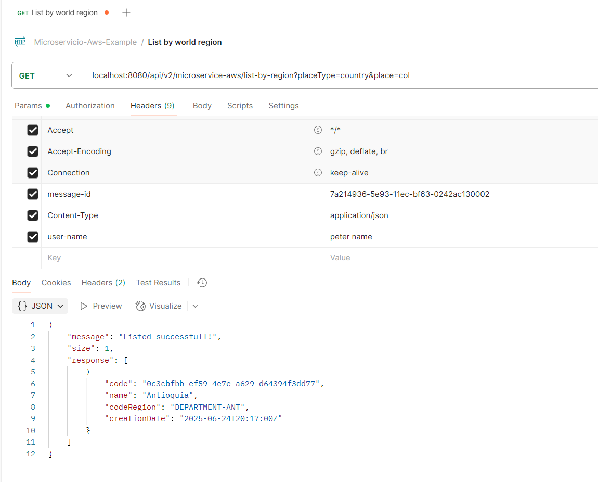

# Creación microservicio APIREST Java Webflux con DynamoDB - Estrategia de parámetros

> A continuación se indica el paso a paso que se debe realizar para continuar con el proyecto de creación de microservicios basados en la nube de AWS, esta guía comprende el uso de variables configurados en el proyecto, consumo servicio api rest y  mocks de api rest

### Requisitos: 

⚠️ Debes haber realizado el instructivo de ambiente local para comprender los comandos que usaremos<br>
[Ver documentación ambiente local](./1-1-podman-localstack-aws.md)

⚠️ Debes haber comprendido el funcionamiento de Mocks de servicios API <br>
[Ver documentación Wiremock](./1-2-4-wiremock-apirest.md)

⚠️ Debes haber realizado el instructivo Api REST Crud DynamoDB<br>
[Realizar instructivo](./2-3-1-crear-api-rest-informar-errores.md)

## Caso de uso:
- Parametrización de reglas local, consumo apirest
- Auditar cada Metodo en el API Rest

## Criterios de aceptación:
- Configurar parámetros en la aplicación
- Leer parámetros de un sistema externo
- Imprimir logs auditoría por cada metodo creado

## A continuación se proponen diferentes situaciones a modo de estudio

> Vamos a suponer que necesitamos auditar que usuario realiza alguna de las acciones en las api que tenemos (listar, crear, obtener uno, actualizar y borrar), para lograr esto vamos a usar un parámetro de tal forma de que si está activo se guarda auditoría, sino, entonces no se guarda; para ver alternativas de parametrización vamos a hacerlo de forma diferente para cada metodo (Listar, Crear, Borrar).

## Recuros base:

1. Agregar nuevas variables en el application-local.yaml

- Ubicarse en el proyecto application > app-service en la carpeta de resources modificamos el archivo application-local.yaml para agregar al final:
```
audit:
  world-region:
    audit-on-list: ${APPLY_AUDIT_LIST_WR:true}
 ```

2. Crear proyecto de carga de variables para llevar estas hasta los casos de uso a través de puertos y adaptadores

    - Ubicarse en la raíz del proyecto, abrir la consola de comandos y ejecutar
        ```
        gradle generateEntryPoint --type=generic --name load-variables
        ```

    - Ubicarse en el proyecto infrastructure > entry-points > load-variables y modificar el archivo build.gradle
        ```
        dependencies {
            implementation project(':model')
            implementation "org.springframework.boot:spring-boot-starter-webflux:${springBootVersion}"
            implementation "org.springframework.boot:spring-boot-starter-validation:${springBootVersion}"
        }
        ```
        Refrescar dependencias

    - Ubicarse en el proyecto infrastructure > entry-points > load-variables en el paquete co.com.microservicio.aws.loadvariables.properties y crear la clase ApplyAuditListProperties.java
        ```
        package co.com.microservicio.aws.loadvariables.properties;

        import lombok.AllArgsConstructor;
        import lombok.Getter;
        import lombok.NoArgsConstructor;
        import lombok.Setter;
        import org.springframework.boot.context.properties.ConfigurationProperties;
        import org.springframework.context.annotation.Configuration;

        @Getter
        @Setter
        @NoArgsConstructor
        @AllArgsConstructor
        @Configuration
        @ConfigurationProperties(prefix = "audit.world-region")
        public class AuditConfigProperties {
            private boolean auditOnList;
        }
        ```

3. Crear proyecto de eventos rabbit para conectar con el servicio AWS y aprovechar la comunicación asincrona por mensajería: Para este caso y d emomento planearemos una solución de impresión de logs en consola

    - Ubicarse en la raíz del proyecto, abrir la consola de comandos y ejecutar
        ```
        gradle generateDrivenAdapter --type=generic --name async-event-bus
        ```

    - Ubicarse en el proyecto infrastructure > driven-adapters > secrets y modificar el archivo build.gradle
        ```
        dependencies {
            implementation project(':model')
            implementation project(':log')
            implementation "org.springframework.boot:spring-boot-starter-webflux:${springBootVersion}"
            implementation "org.springframework.boot:spring-boot-starter-validation:${springBootVersion}"
        }
        ```
        Refrescar dependencias

4. Crear proyecto de consumo de servicio REST para obtener el parámetro de aplicar auditoría al guardar, en este caso haremos uso de un proveedor de respuestas de servicios REST (wiremock)

    - Ubicarse en la raíz del proyecto, abrir la consola de comandos y ejecutar
        ```
        gradle generateDrivenAdapter --type=restconsumer --url localhost --from-swagger swagger.yaml
        ```

    - Ubicarse en el proyecto infrastructure > driven-adapters > secrets y modificar el archivo build.gradle
        ```
        dependencies {
            implementation project(':model')
            implementation project(':log')
            implementation "org.springframework.boot:spring-boot-starter-webflux:${springBootVersion}"
            implementation "org.springframework.boot:spring-boot-starter-validation:${springBootVersion}"
        }
        ```
        Refrescar dependencias

## Implementación casos de uso

1. Parametrización por aplicación (Metodo Listar): 

    - ¿Por qué elegir esta opción?

        > Si bien parametrizar en un sistema externo podría ofrecer una solución más flexible a largo plazo, en algunos casos esto implica mayor esfuerzo de desarrollo o depender de servicios que aún no están disponibles. Por ello, y en línea con el principio de agilidad que buscamos en los microservicios, optamos por parametrizar directamente en el microservicio, lo cual permite avanzar rápidamente sin comprometer la estabilidad ni la configuración por entorno.

    - Ubicarse en el proyecto domain > model en el paquete co.com.microservicio.aws.variables.gateway y crear la clase LoadVariablesGateway.java
        ```
        public interface LoadVariablesGateway {
            boolean isAuditOnList();
        }
        ```

    - Ubicarse en el proyecto infrastructure > entry-points > load-variables en el paquete co.com.microservicio.aws.loadvariables y crear la clase LoadVariablesAdapter.java
        ```
        package co.com.microservicio.aws.loadvariables;

        import co.com.microservicio.aws.loadvariables.properties.AuditConfigProperties;
        import co.com.microservicio.aws.variables.gateway.LoadVariablesGateway;
        import lombok.RequiredArgsConstructor;
        import org.springframework.stereotype.Component;

        @Component
        @RequiredArgsConstructor
        public class LoadVariablesAdapter implements LoadVariablesGateway {
            private final AuditConfigProperties auditConfigProperties;

            @Override
            public boolean isAuditOnList() {
                return auditConfigProperties.isAuditOnList();
            }
        }
        ```

    - Ubicarse en el proyecto domain > model en el paquete co.com.microservicio.aws.event.gateway y crear la clase EventGateway.java 
        ```
        package co.com.microservicio.aws.event.gateway;

        import co.com.microservicio.aws.model.worldregion.rq.TransactionRequest;
        import reactor.core.publisher.Mono;

        public interface EventGateway {
            Mono<Void> emitEvent(TransactionRequest request);
        }
        ```

    - Ubicarse en el proyecto infrastructura > driven-adapters > asyn-event-bus en el paquete co.com.microservicio.aws.asynceventbus y crear la clase ReactiveEventsAdapter.java 
        ```
        package co.com.microservicio.aws.asynceventbus;

        import co.com.microservicio.aws.event.gateway.EventGateway;
        import co.com.microservicio.aws.log.LoggerBuilder;
        import co.com.microservicio.aws.model.worldregion.rq.TransactionRequest;
        import lombok.RequiredArgsConstructor;
        import org.springframework.stereotype.Component;
        import reactor.core.publisher.Mono;

        @Component
        @RequiredArgsConstructor
        public class ReactiveEventsAdapter implements EventGateway {
            private final LoggerBuilder logger;

            @Override
            public Mono<Void> emitEvent(TransactionRequest request) {
                logger.info(request.getContext().getCustomer().getUsername(),
                        request.getContext().getId(), "audit on list", "emitEvent");
                return Mono.empty();
            }
        }
        ```

    - Ubicarse en el proyecto domain > usecase en el paquete co.com.microservicio.aws.usecase.sentevent y crear la clase SentEventUseCase.java 
        ```
        package co.com.microservicio.aws.usecase.sentevent;

        import co.com.microservicio.aws.event.gateway.EventGateway;
        import co.com.microservicio.aws.model.worldregion.rq.TransactionRequest;
        import co.com.microservicio.aws.variables.gateway.LoadVariablesGateway;
        import lombok.RequiredArgsConstructor;

        @RequiredArgsConstructor
        public class SentEventUseCase {
            private final LoadVariablesGateway loadVariablesGateway;
            private final EventGateway eventGateway;

            public void sendAudit(TransactionRequest request){
                if (loadVariablesGateway.isAuditOnList()){
                    eventGateway.emitEvent(request);
                }
            }
        }
        ```

    - Ubicarse en el proyecto domain > usecase en el paquete co.com.microservicio.aws.usecase.worldregion y modificar la clase WorldRegionUseCase.java en el metodo listByRegion para incluir un llamado a la auditoría de tal forma que si falla no dañe el flujo y continúe.
        ```
        private final SentEventUseCase sentEventUseCase;

        public Mono<TransactionResponse> listByRegion(TransactionRequest request){
            return Mono.just(request)
                .filter(this::userIsRequired)
                .flatMap(req -> regionRepository.findByRegion(buildKeyRegion(req))
                    .collectList().flatMap(this::buildResponse))
                .doOnNext(res -> sentEventUseCase.sendAudit(request))
                .switchIfEmpty(Mono.defer(() -> Mono.error(new BusinessException(BUSINESS_USERNAME_REQUIRED))));
        }
        ```
    
    - Realizar prueba

        

        Logs: efectivamente se imprimió la auditoría del usuario que ejecutó la acción de listar

        ```
        {
            "instant": {
                "epochSecond": 1751424690,
                "nanoOfSecond": 448444600
            },
            "thread": "reactor-http-nio-3",
            "level": "INFO",
            "loggerName": "co.com.microservicio.aws.log.LoggerBuilder",
            "message": "{\"dataLog\":{\"message\":\"List all by region\",\"messageId\":\"7a214936-5e93-11ec-bf63-0242ac130002\",\"service\":\"Service Api Rest world regions\",\"method\":\"co.com.microservicio.aws.api.worldregion.WorldRegionHandler\",\"appName\":\"MicroserviceAws\"},\"request\":{\"headers\":null,\"body\":{\"id\":\"7a214936-5e93-11ec-bf63-0242ac130002\",\"customer\":{\"ip\":\"\",\"username\":\"peter name\",\"device\":{\"userAgent\":\"\",\"platformType\":\"\"}}}},\"response\":{\"headers\":null,\"body\":null}}",
            "endOfBatch": false,
            "loggerFqcn": "org.apache.logging.log4j.spi.AbstractLogger",
            "threadId": 58,
            "threadPriority": 5
        }
        {
            "instant": {
                "epochSecond": 1751424690,
                "nanoOfSecond": 749513000
            },
            "thread": "sdk-async-response-1-0",
            "level": "INFO",
            "loggerName": "co.com.microservicio.aws.log.LoggerBuilder",
            "message": "{\"dataLog\":{\"message\":\"peter name\",\"messageId\":\"7a214936-5e93-11ec-bf63-0242ac130002\",\"service\":\"audit on list\",\"method\":\"emitEvent\",\"appName\":\"MicroserviceAws\"},\"request\":{\"headers\":null,\"body\":null},\"response\":{\"headers\":null,\"body\":null}}",
            "endOfBatch": false,
            "loggerFqcn": "org.apache.logging.log4j.spi.AbstractLogger",
            "threadId": 67,
            "threadPriority": 5
        }
        ```

    2. Parametrización consumiendo API Rest externo (Metodo Guardar): 

[< Volver al índice](README.md)

---

**Author**: Pedro Luis Osorio Pavas [Linkedin](https://www.linkedin.com/in/pedro-luis-osorio-pavas-68b3a7106)  
**Start Date**: 01-06-2025  
**Update Date**: 01-06-2025.