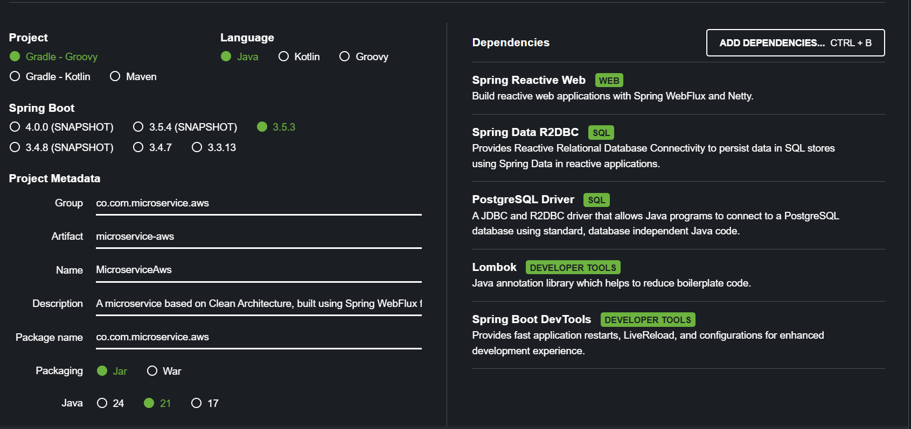
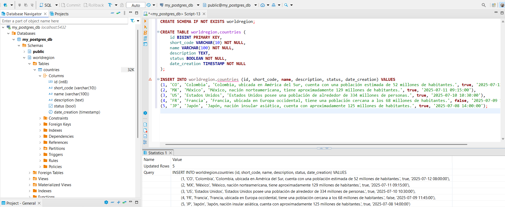
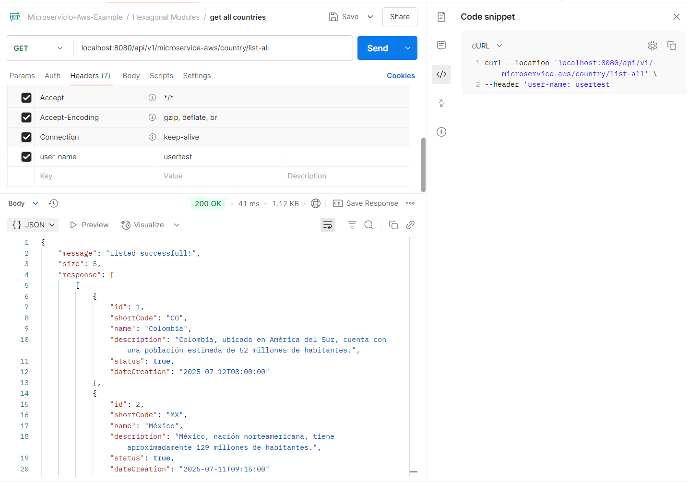
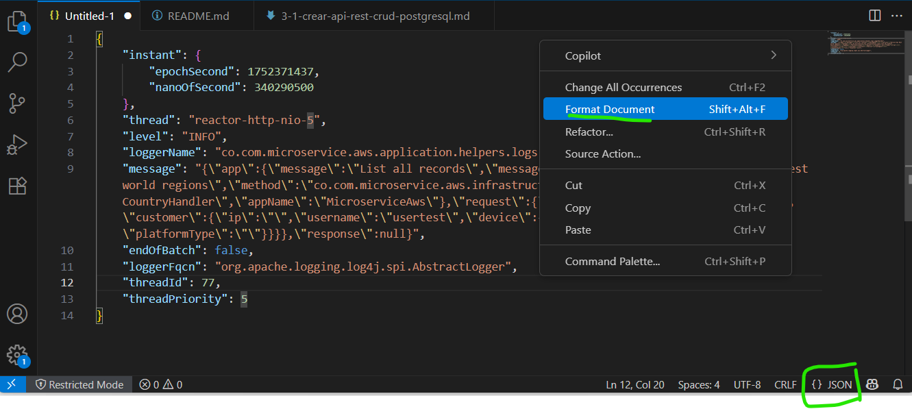

# Instructivo paso a paso CRUD Postgresql database
> A continuación se realiza la creación base del proyecto basada en microservicios por contexto y arquitectura limpia

### Requisitos

- ⚠️ Java 17 o superior
- ⚠️ Gradle 8.8 o posterior
- ⚠️ Docker o Podman
- ⚠️ Postman
- ⚠️ Intellij

### Clean Architecture: 

Introducción a arquitectura limpia [>> Ver](https://medium.com/@diego.coder/introducci%C3%B3n-a-las-clean-architectures-723fe9fe17fa)

### Indice

* [1. Crear proyecto](#id1)
* [2. Crear la aplicación](#id2)
* [3. Crear la conexión con postgresql](#id3)
* [4. Crear la instancia de base de datos en Podman](#id4)
* [5. Realizar pruebas (listall - save)](#id5)
* [6. Completar la aplicación con otros metodos](#id6)
* [7. Realizar pruebas (update - delete - findby)](#id7)
* [8. Crear la conexión con mysql](#id8)
* [9. Crear la instancia de base de datos en Podman](#id9)

# <div id='id1'/>
# 1. Crear y configurar el proyecto:

1. Datos del proyecto
    - Visitar el sitio [Spring initializr](https://start.spring.io/)
    - Información:
      - group: co.com.microservice.aws
      - artifact: microservice-aws
      - name: MicroserviceAWS
      - description: A microservice based on Clean Architecture, built using Spring WebFlux for reactive, non-blocking operations, and performing CRUD operations on a PostgreSQL database.
      - package-name: co.com.microservice.aws
      - packaging: jar 

    - Dependencias base:
      - Spring Reactive Web (spring-boot-starter-webflux)
      - Spring Data R2DBC (spring-boot-starter-data-r2dbc)
      - R2DBC PostgreSQL Driver (io.r2dbc:r2dbc-postgresql)
      - Lombok (org.projectlombok:lombok)
      - Spring Boot DevTools

    

    - Generar el proyecto y descomprimir el proyecto

2. Cargar proyecto en intellij y crear paquetes de arquitectura limpia

3. Configurar el proyecto

    - Ubicarse en la raiz del proyecto y modificar el archivo settings.gradle por
        ```
        pluginManagement {
            repositories {
                gradlePluginPortal()
            }
        }

        rootProject.name = 'microservice-aws'
        ```
        Actualizar dependencias

    - Ubicarse en la raiz del proyecto y modificar el archivo build.gradle por
        ```
        plugins {
            id 'java'
            id 'org.springframework.boot' version '3.5.3'
            id 'io.spring.dependency-management' version '1.1.7'
        }

        group = 'co.com.microservice.aws'
        version = '0.0.1-SNAPSHOT'

        java {
            toolchain {
                languageVersion = JavaLanguageVersion.of(21)
            }
        }

        configurations {
            compileOnly {
                extendsFrom annotationProcessor
            }
        }

        repositories {
            mavenCentral()
        }

        dependencies {
            implementation 'org.springframework.boot:spring-boot-starter-data-r2dbc'
            implementation 'org.springframework.boot:spring-boot-starter-webflux'
            implementation "org.apache.logging.log4j:log4j-core:2.24.3"
            implementation "org.apache.logging.log4j:log4j-api:2.24.3"
            implementation "org.apache.logging.log4j:log4j-to-slf4j:2.24.3"
            implementation 'com.fasterxml.jackson.core:jackson-databind'
            implementation 'io.r2dbc:r2dbc-h2'
            implementation 'org.mapstruct:mapstruct:1.5.2.Final'
            // Driver R2DBC para MySQL usando jasync
            implementation 'com.github.jasync-sql:jasync-r2dbc-mysql:2.1.16'

            developmentOnly 'org.springframework.boot:spring-boot-devtools'
            compileOnly 'org.projectlombok:lombok'
            runtimeOnly 'org.postgresql:postgresql'
            runtimeOnly 'org.postgresql:r2dbc-postgresql'
            runtimeOnly 'com.mysql:mysql-connector-j'

            annotationProcessor 'org.projectlombok:lombok'
            annotationProcessor 'org.mapstruct:mapstruct-processor:1.5.2.Final'

            testImplementation 'org.springframework.boot:spring-boot-starter-test'
            testImplementation 'io.projectreactor:reactor-test'
            testRuntimeOnly 'org.junit.platform:junit-platform-launcher'
        }

        // Para evitar conflicto con Logback
        configurations {
            all {
                exclude group: 'org.apache.logging.log4j', module: 'log4j-to-slf4j'
                exclude group: 'org.springframework.boot', module: 'spring-boot-starter-logging'
            }
        }

        tasks.named('test') {
            useJUnitPlatform()
        }

        //options.incremental = false recompila siempre todos los archivos del proyecto
        tasks.withType(JavaCompile).configureEach {
            options.compilerArgs += ["-parameters"]
            options.incremental = false
        }
        ```
        Actualizar dependencias

    - Ubicarse en src > main > resources y crear el archivo application.yaml y de igual forma application-local.yaml con lo siguiente
```
server:
  port: ${APP_PORT:8080}

spring:
  application:
    name: "${APP_NAME:MicroserviceAws}"
  r2dbc:
    url: r2dbc:h2:mem:///testdb;DB_CLOSE_DELAY=-1;DB_CLOSE_ON_EXIT=FALSE
    username: sa
    password:

management:
  health:
    probes:
      enabled: true
  endpoint:
    health:
      show-details: ${SHOW_DETAILS:never}
      enabled: true
      cache:
        time-to-live: "10s"
  endpoints:
    web:
      base-path: "${PATH_BASE:/api/v1/microservice-aws/}"
      path-mapping:
        health: "health"
        liveness: "liveness"
        readiness: "readiness"
      exposure:
        include: "health, liveness, readiness, metrics"

logging:
  level:
    root: ${LOG4J_LEVEL:INFO}

entries:
  web:
    path-base: "${PATH_BASE:/api/v1/microservice-aws}"
    path-countries: "${PATH_COUNTRY:/country}"
    listAll: "/list-all"
    findByShortCode: "/findByShortCode/{shortCode}"
    save: "/save"
    update: "/update"
    delete: "/delete/{id}"
  regex-body-wr:
    name: "${REGEX_COUNTRY_NAME:^[a-zA-ZáéíóúÁÉÍÓÚñÑ\\s]{3,50}$}"
    codeShort: "${REGEX_COUNTRY_CODE_SHORT:^[a-zA-Z]{3,4}$}"

adapters:
  postgresql:
    url: r2dbc:postgresql://localhost:5432/my_postgres_db
    usr: postgres
    psw: 123456
  mysql:
    url: r2dbc:mysql://localhost:3306/my_mysql_db
    usr: myroot
    psw: myroot123
```

- Abrir el archivo MicroserviceAwsApplication.java y click derecho y ejecutar la aplicación
    
    

- Configurar la aplicación para ejecutar de forma local
    ```
    SPRING_PROFILES_ACTIVE=local
    ```

    

# <div id='id2'/>
# 2. Crear la aplicación

- Ubicarse en src > main > resources y crear el archivo log4j2.properties
    ```
    status = error
    name = MicroserviceAWS
    appender.console.type = Console
    appender.console.name = STDOUT
    appender.console.layout.type = JsonLayout
    appender.console.layout.compact = true
    appender.console.layout.eventEol = true
    appender.console.layout.includeStacktrace = true
    appender.console.layout.includeThreadContext = false
    appender.console.layout.properties = false

    appender.console.layout.includeTimeMillis = false

    rootLogger.level = info
    rootLogger.appenderRefs = stdout
    rootLogger.appenderRef.stdout.ref = STDOUT
    ```

- Ubicarse en el paquete co.com.microservice.aws.application.helpers.logs y crear la clase TransactionLog.java
    ```
    package co.com.microservice.aws.application.helpers.logs;

    import java.io.Serial;
    import java.io.Serializable;
    import java.util.Map;

    import lombok.*;

    @Getter
    @Setter
    @NoArgsConstructor
    @AllArgsConstructor
    @ToString
    @Builder(toBuilder = true)
    public class TransactionLog {
        @Serial
        private static final long serialVersionUID = 1L;

        private Application app;
        private Request request;
        private Response response;

        @Getter
        @Setter
        @NoArgsConstructor
        @AllArgsConstructor
        @ToString
        @Builder(toBuilder = true)
        public static class Application implements Serializable {
            @Serial
            private static final long serialVersionUID = 1L;

            private String message;
            private String messageId;
            private String service;
            private String method;
            private String appName;
        }

        @Getter
        @Setter
        @NoArgsConstructor
        @AllArgsConstructor
        @ToString
        @Builder(toBuilder = true)
        public static class Request implements Serializable {
            @Serial
            private static final long serialVersionUID = 1L;

            private Map<String, String> headers;
            private transient Object body;
        }

        @Getter
        @Setter
        @NoArgsConstructor
        @AllArgsConstructor
        @ToString
        @Builder(toBuilder = true)
        public static class Response implements Serializable {
            @Serial
            private static final long serialVersionUID = 1L;

            private Map<String, String> headers;
            private transient Object body;
        }
    }
    ```        

- Ubicarse en el paquete co.com.microservice.aws.application.helpers.logs y crear la clase LoggerBuilder.java

    ```
    package co.com.microservice.aws.application.helpers.logs;

    import com.fasterxml.jackson.core.JsonProcessingException;
    import com.fasterxml.jackson.databind.ObjectMapper;
    import lombok.Getter;
    import lombok.extern.log4j.Log4j2;
    import org.apache.logging.log4j.message.ObjectMessage;
    import org.springframework.beans.factory.annotation.Value;
    import org.springframework.stereotype.Component;

    @Log4j2
    @Getter
    @Component
    public class LoggerBuilder {
        private final String appName;
        private final ObjectMapper objectMapper;

        public LoggerBuilder(@Value("${spring.application.name}") String appName, ObjectMapper objectMapper) {
            this.appName = appName;
            this.objectMapper = objectMapper;
        }

        public void info(TransactionLog.Request rq, String message, String messageId, String service, String method) {
            log.info(new ObjectMessage(buildObjectReq(rq, buildDataLog(message, messageId, service, method))));
        }

        public void info(TransactionLog.Response rs, String message, String messageId, String service, String method) {
            log.info(new ObjectMessage(buildObjectRes(rs, buildDataLog(message, messageId, service, method))));
        }

        public void info(String message, String messageId, String service, String method) {
            log.info(new ObjectMessage(buildObjectApp(buildDataLog(message, messageId, service, method))));
        }

        public void error(Throwable throwable) {
            log.error("Unexpected error occurred:", throwable);
        }

        public void info(String message) {
            log.info(message);
        }

        private TransactionLog.Application buildDataLog(String message, String messageId, String service, String method){
            return new TransactionLog.Application(message, messageId, service, method, appName);
        }

        private String buildObjectReq(TransactionLog.Request rq, TransactionLog.Application data) {
            return buildObject(TransactionLog.builder().app(data).request(rq).build());
        }

        private String buildObjectRes(TransactionLog.Response rs, TransactionLog.Application data) {
            return buildObject(TransactionLog.builder().app(data).response(rs).build());
        }

        private String buildObjectApp(TransactionLog.Application data) {
            return buildObject(TransactionLog.builder().app(data).build());
        }

        private String buildObject(TransactionLog logObject) {
            try {
                return objectMapper.writeValueAsString(logObject);
            } catch (JsonProcessingException e) {
                return logObject.toString();
            }
        }
    }
    ```

- Ubicarse en el paquete co.com.microservice.aws.domain.model.commons.enums y crear la clase BusinessExceptionMessage.java
    - WRB: Es World Region Business

    ```
    package co.com.microservice.aws.domain.model.commons.enums;

    import lombok.AllArgsConstructor;
    import lombok.Getter;
    import lombok.ToString;

    @Getter
    @AllArgsConstructor
    @ToString
    public enum TechnicalExceptionMessage {

        TECHNICAL_SERVER_ERROR("WRT01", "Internal server error"),
        TECHNICAL_REST_CLIENT_ERROR("WRT02", "An error has occurred in the Rest Client"),
        TECHNICAL_HEADER_MISSING("WRT03", "Missing parameters per header"),
        TECHNICAL_REQUEST_ERROR("WRT04", "There is an error in the request body"),
        TECHNICAL_EXCEPTION_REPOSITORY("WRT05", "An error has occurred in the repository");

        private final String code;
        private final String message;

        public String getDescription() {
            return String.join(" - ", this.getCode(), this.getMessage());
        }
    }
    ```

- Ubicarse en el paquete co.com.microservice.aws.domain.model.commons.enums y crear la clase TechnicalExceptionMessage.java
    - WRT: Es World Region Technical
    ```
    package co.com.microservice.aws.domain.model.commons.enums;

    import lombok.AllArgsConstructor;
    import lombok.Getter;
    import lombok.ToString;

    @Getter
    @AllArgsConstructor
    @ToString
    public enum TechnicalExceptionMessage {

        TECHNICAL_SERVER_ERROR("WRT01", "Internal server error"),
        TECHNICAL_REST_CLIENT_ERROR("WRT02", "An error has occurred in the Rest Client"),
        TECHNICAL_HEADER_MISSING("WRT03", "Missing parameters per header"),
        TECHNICAL_REQUEST_ERROR("WRT04", "There is an error in the request body"),
        TECHNICAL_EXCEPTION_REPOSITORY("WRT05", "An error has occurred in the repository");

        private final String code;
        private final String message;

        public String getDescription() {
            return String.join(" - ", this.getCode(), this.getMessage());
        }
    }
    ```
    
- Ubicarse en el paquete co.com.microservice.aws.domain.model.commons.error y crear la clase Error.java
    ```
    package co.com.microservice.aws.domain.model.commons.error;

    import java.io.Serial;
    import java.io.Serializable;
    import java.util.List;

    import lombok.*;

    @Getter
    @AllArgsConstructor
    @NoArgsConstructor
    @Builder(toBuilder = true)
    public class Error implements Serializable {
        @Serial
        private static final long serialVersionUID = 1L;

        private List<Data> errors;

        @AllArgsConstructor
        @NoArgsConstructor
        @Getter
        @Builder(toBuilder = true)
        public static class Data implements Serializable {
            @Serial
            private static final long serialVersionUID = 1L;

            private String reason;
            private String domain;
            private String code;
            private String message;
        }
    }
    ```
    
- Ubicarse en el paquete co.com.microservice.aws.domain.model.commons.exception y crear la clase TechnicalException.java
    ```
    package co.com.microservice.aws.domain.model.commons.exception;

    import java.io.Serial;
    import co.com.microservice.aws.domain.model.commons.enums.TechnicalExceptionMessage;
    import lombok.Getter;

    @Getter
    public class TechnicalException extends RuntimeException {
        @Serial
        private static final long serialVersionUID = 1L;

        private final TechnicalExceptionMessage typeTechnicalException;
        private final String reason;

        public TechnicalException(Throwable error, TechnicalExceptionMessage technicalExceptionMessage) {
            super(technicalExceptionMessage.getDescription(), error);
            this.typeTechnicalException = technicalExceptionMessage;
            this.reason = technicalExceptionMessage.getDescription();
        }

        public TechnicalException(TechnicalExceptionMessage technicalExceptionEnum) {
            super(technicalExceptionEnum.getMessage());
            this.typeTechnicalException = technicalExceptionEnum;
            this.reason = technicalExceptionEnum.getDescription();
        }

        public TechnicalException(String reason, TechnicalExceptionMessage errorMessage) {
            super(errorMessage.getMessage());
            this.reason = reason;
            this.typeTechnicalException = errorMessage;
        }
    }
    ```
    
- Ubicarse en el paquete co.com.microservice.aws.domain.model.commons.exception y crear la clase BusinessException.java
    ```
    package co.com.microservice.aws.domain.model.commons.exception;

    import co.com.microservice.aws.domain.model.commons.enums.BusinessExceptionMessage;
    import co.com.microservice.aws.domain.model.commons.error.Error;
    import lombok.Getter;

    import java.io.Serial;

    @Getter
    public class BusinessException extends RuntimeException {
        @Serial
        private static final long serialVersionUID = 1L;

        private final Error error;
        private final BusinessExceptionMessage typeBusinessException;

        public BusinessException(Error error) {
            super(error.getErrors().get(0).getMessage());
            this.error = error;
            this.typeBusinessException = BusinessExceptionMessage.BUSINESS_ERROR;
        }

        public BusinessException(Throwable error, BusinessExceptionMessage typeBusinessException) {
            super(typeBusinessException.getDescription(), error);
            this.error = Error.builder().build();
            this.typeBusinessException = typeBusinessException;
        }

        public BusinessException(BusinessExceptionMessage typeBusinessException) {
            super(typeBusinessException.getDescription());
            this.error = Error.builder().build();
            this.typeBusinessException = typeBusinessException;
        }
    }
    ```
    
- Ubicarse en el paquete co.com.microservice.aws.domain.model.commons.error y crear la clase ErrorFactory.java
    ```
    package co.com.microservice.aws.domain.model.commons.error;

    import co.com.microservice.aws.domain.model.commons.enums.BusinessExceptionMessage;
    import co.com.microservice.aws.domain.model.commons.enums.TechnicalExceptionMessage;
    import co.com.microservice.aws.domain.model.commons.exception.BusinessException;
    import co.com.microservice.aws.domain.model.commons.exception.TechnicalException;
    import lombok.experimental.UtilityClass;

    import java.util.List;

    import static co.com.microservice.aws.domain.model.commons.enums.TechnicalExceptionMessage.TECHNICAL_SERVER_ERROR;

    @UtilityClass
    public class ErrorFactory {

        public Error buildError(TechnicalExceptionMessage technicalExceptionEnum, String reason, String domain) {
            return Error.builder()
                    .errors(List.of(Error.Data.builder().reason(reason).domain(domain)
                            .code(technicalExceptionEnum.getCode()).message(technicalExceptionEnum.getMessage()).build()))
                    .build();
        }

        public Error buildErrorBusiness(BusinessExceptionMessage businessErrorMessage, String reason, String domain) {
            return Error
                    .builder().errors(List.of(Error.Data.builder().reason(reason).domain(domain)
                            .code(businessErrorMessage.getCode()).message(businessErrorMessage.getTypeMessage()).build()))
                    .build();
        }

        public Error fromTechnical(TechnicalException technicalException, String domain) {
            if (technicalException.getReason() == null || technicalException.getReason().isEmpty()) {
                return buildError(technicalException.getTypeTechnicalException(), technicalException.getMessage(), domain);
            } else {
                return buildErrorWithReason(technicalException, domain);
            }
        }

        public Error buildErrorWithReason(TechnicalException technicalException, String domain) {
            return buildError(technicalException.getTypeTechnicalException(), technicalException.getReason(), domain);
        }

        public Error fromBusiness(BusinessException businessException, String domain) {
            if (businessException.getTypeBusinessException() == BusinessExceptionMessage.BUSINESS_ERROR) {
                return businessException.getError();
            }
            return buildErrorBusiness(businessException.getTypeBusinessException(),
                    businessException.getTypeBusinessException().getMessage(), domain);
        }

        public Error fromDefaultTechnical(String reason, String domain) {
            return buildError(TECHNICAL_SERVER_ERROR, reason, domain);
        }
    }
    ```
    
- Ubicarse en el paquete co.com.microservice.aws.infrastructure.input.rest.api.exception y crear la clase ExceptionHandler.java
    ```
    package co.com.microservice.aws.infrastructure.input.rest.api.exception;

    import co.com.microservice.aws.domain.model.commons.error.ErrorFactory;
    import co.com.microservice.aws.domain.model.commons.exception.BusinessException;
    import co.com.microservice.aws.domain.model.commons.exception.TechnicalException;
    import org.springframework.boot.autoconfigure.web.WebProperties;
    import org.springframework.boot.autoconfigure.web.reactive.error.AbstractErrorWebExceptionHandler;
    import org.springframework.boot.web.reactive.error.ErrorAttributes;
    import org.springframework.context.ApplicationContext;
    import org.springframework.core.annotation.Order;
    import org.springframework.http.HttpStatus;
    import org.springframework.http.MediaType;
    import org.springframework.http.codec.ServerCodecConfigurer;
    import org.springframework.stereotype.Component;
    import org.springframework.web.reactive.function.server.*;
    import reactor.core.publisher.Mono;

    import java.util.function.Function;

    import static org.springframework.http.HttpStatus.BAD_REQUEST;
    import static org.springframework.http.HttpStatus.INTERNAL_SERVER_ERROR;

    @Order(-2)
    @Component
    public class ExceptionHandler extends AbstractErrorWebExceptionHandler {
        public static final String FORMAT_ERROR = "%s:%s";

        public ExceptionHandler(ErrorAttributes errorAttributes, ApplicationContext applicationContext,
                                ServerCodecConfigurer serverCodecConfigurer) {
            super(errorAttributes, new WebProperties.Resources(), applicationContext);
            this.setMessageWriters(serverCodecConfigurer.getWriters());
        }

        @Override
        protected RouterFunction<ServerResponse> getRoutingFunction(ErrorAttributes errorAttributes) {
            return RouterFunctions.route(RequestPredicates.all(), this::buildErrorResponse);
        }

        public Mono<ServerResponse> buildErrorResponse(final ServerRequest request) {
            return Mono.just(request).map(this::getError).flatMap(Mono::error)
                    .onErrorResume(TechnicalException.class, responseTechnicalError(request))
                    .onErrorResume(BusinessException.class, responseBusinessError(request))
                    .onErrorResume(responseDefaultError(request)).cast(ServerResponse.class);
        }

        private Function<BusinessException, Mono<ServerResponse>> responseBusinessError(ServerRequest request) {
            return e -> Mono
                    .just(ErrorFactory.fromBusiness(e,
                            String.format(FORMAT_ERROR, request.method().name(), request.path())))
                    .flatMap(this::responseFailBusiness);
        }

        private Function<TechnicalException, Mono<ServerResponse>> responseTechnicalError(ServerRequest request) {
            return e -> Mono
                    .just(ErrorFactory.fromTechnical(e,
                            String.format(FORMAT_ERROR, request.method().name(), request.path())))
                    .flatMap(this::responseFailBusiness);
        }

        private Function<Throwable, Mono<ServerResponse>> responseDefaultError(ServerRequest request) {
            return exception -> Mono
                    .just(ErrorFactory.fromDefaultTechnical(exception.getMessage(),
                            String.format(FORMAT_ERROR, request.method().name(), request.path())))
                    .flatMap(this::responseFail);
        }

        public <T> Mono<ServerResponse> buildResponse(T error, HttpStatus httpStatus) {
            return ServerResponse.status(httpStatus).contentType(MediaType.APPLICATION_JSON).bodyValue(error);
        }

        public <T> Mono<ServerResponse> responseFail(T body) {
            return buildResponse(body, INTERNAL_SERVER_ERROR);
        }

        public <T> Mono<ServerResponse> responseFailBusiness(T body) {
            return buildResponse(body, BAD_REQUEST);
        }
    }
    ```

    ¿Por qué usar @Order(-2)?

    Spring ya tiene un DefaultErrorWebExceptionHandler que también extiende AbstractErrorWebExceptionHandler.

    Si defines uno personalizado y no le das mayor prioridad (-2 o menor), el de Spring lo sobreescribirá o ejecutará antes.

    @Order(-2) asegura que tu handler personalizado tenga precedencia y maneje los errores globales de tu manera.

- Ubicarse en el paquete co.com.microservice.aws.domain.model y crear la clase Country.java
    ```
    package co.com.microservice.aws.domain.model;

    import lombok.AllArgsConstructor;
    import lombok.Builder;
    import lombok.Data;
    import lombok.NoArgsConstructor;
    import java.io.Serial;
    import java.io.Serializable;
    import java.time.LocalDateTime;

    @Data
    @NoArgsConstructor
    @AllArgsConstructor
    @Builder(toBuilder = true)
    public class Country implements Serializable {
        @Serial
        private static final long serialVersionUID = 1L;

        private Long id;
        private String shortCode;
        private String name;
        private String description;
        private boolean status;
        private LocalDateTime dateCreation;
    }
    ```

- Ubicarse en el paquete co.com.microservice.aws.domain.model.rq y crear la clase Context.java
    ```
    package co.com.microservice.aws.domain.model.rq;

    import lombok.AllArgsConstructor;
    import lombok.Builder;
    import lombok.Getter;
    import lombok.NoArgsConstructor;
    import lombok.Setter;

    @Getter
    @Setter
    @NoArgsConstructor
    @AllArgsConstructor
    @Builder(toBuilder = true)
    public class Context {
        private String id;
        private Customer customer;

        @Getter
        @Setter
        @NoArgsConstructor
        @AllArgsConstructor
        @Builder(toBuilder = true)
        public static class Customer {
            private String ip;
            private String username;
            private Device device;
        }

        @Getter
        @Setter
        @NoArgsConstructor
        @AllArgsConstructor
        @Builder(toBuilder = true)
        public static class Device {
            private String userAgent;
            private String platformType;
        }
    }
    ```
- Ubicarse en el paquete co.com.microservice.aws.domain.model.rq y crear la clase TransactionRequest.java
    ```
    package co.com.microservice.aws.domain.model.rq;

    import lombok.*;

    import java.io.Serial;
    import java.io.Serializable;
    import java.util.List;

    @Getter
    @Setter
    @NoArgsConstructor
    @AllArgsConstructor
    @Builder(toBuilder = true)
    public class TransactionRequest implements Serializable {
        @Serial
        private static final long serialVersionUID = 1L;

        private transient Context context;
        private transient Object item;
        private transient List<Object> items;
    }
    ```
- Ubicarse en el paquete co.com.microservice.aws.domain.model.rs y crear la clase TransactionResponse.java
    ```
    package co.com.microservice.aws.domain.model.rs;

    import lombok.*;

    import java.io.Serial;
    import java.io.Serializable;
    import java.util.List;

    @Getter
    @Setter
    @NoArgsConstructor
    @AllArgsConstructor
    @Builder(toBuilder = true)
    public class TransactionResponse implements Serializable {
        @Serial
        private static final long serialVersionUID = 1L;

        private String message;
        private int size;
        private List<Object> response;
    }
    ```
- Ubicarse en el paquete co.com.microservice.aws.application.helpers.commons y crear la clase HeadersUtil.java
    ```
    package co.com.microservice.aws.application.helpers.commons;

    import java.util.LinkedHashMap;
    import java.util.Map;
    import java.util.regex.Pattern;

    import lombok.experimental.UtilityClass;

    @UtilityClass
    public class HeadersUtil {

        private static final String CHARS_TO_CLEAR = "<>(;|'";
        private static final String REGEXP_CHARS_TO_CLEAR = "[" + CHARS_TO_CLEAR + "]";
        private static final Pattern PATTERN_CHARS_TO_CLEAR = Pattern.compile(REGEXP_CHARS_TO_CLEAR);

        public static Map<String, String> clearChars(Map<String, String> headers) {
            var localHeaders = new LinkedHashMap<String, String>();
            if (null != headers && !headers.isEmpty()) {
                for (Map.Entry<String, String> entry : headers.entrySet()) {
                    localHeaders.put(entry.getKey(), PATTERN_CHARS_TO_CLEAR.matcher(entry.getValue()).replaceAll(" "));
                }
            }
            return localHeaders;
        }
    }
    ```
- Ubicarse en el paquete co.com.microservice.aws.application.helpers.commons y crear la clase ContextUtil.java
    ```
    package co.com.microservice.aws.application.helpers.commons;

    import co.com.microservice.aws.domain.model.rq.Context;
    import lombok.experimental.UtilityClass;

    import java.util.Map;
    import java.util.Optional;

    @UtilityClass
    public class ContextUtil {
        private static final String EMPTY_VALUE = "";

        public static Context buildContext(Map<String, String> headers) {
            var localHeaders = HeadersUtil.clearChars(headers);
            return Context.builder().id(Optional.ofNullable(localHeaders.get("message-id")).orElse(EMPTY_VALUE))
                    .customer(buildCustomer(localHeaders)).build();
        }

        private static Context.Customer buildCustomer(Map<String, String> headers) {
            return Context.Customer.builder().ip(Optional.ofNullable(headers.get("ip")).orElse(EMPTY_VALUE))
                    .username(Optional.ofNullable(headers.get("user-name")).orElse(EMPTY_VALUE))
                    .device(buildDevice(headers)).build();
        }

        private static Context.Device buildDevice(Map<String, String> headers) {
            return Context.Device.builder().userAgent(Optional.ofNullable(headers.get("user-agent")).orElse(EMPTY_VALUE))
                    .platformType(Optional.ofNullable(headers.get("platform-type")).orElse(EMPTY_VALUE)).build();
        }
    }
    ```
- Ubicarse en el paquete co.com.microservice.aws.domain.usecase.in y crear la clase ListAllUseCase.java
    ```
    package co.com.microservice.aws.domain.usecase.in;

    import co.com.microservice.aws.domain.model.rq.TransactionRequest;
    import co.com.microservice.aws.domain.model.rs.TransactionResponse;
    import reactor.core.publisher.Mono;

    public interface ListAllUseCase {
        Mono<TransactionResponse> listAll(TransactionRequest request);
    }
    ```
- Ubicarse en el paquete co.com.microservice.aws.domain.usecase.in y crear la clase ListAllUseCase.java
    ```
    package co.com.microservice.aws.domain.usecase.in;

    import co.com.microservice.aws.domain.model.rq.TransactionRequest;
    import co.com.microservice.aws.domain.model.rs.TransactionResponse;
    import reactor.core.publisher.Mono;

    public interface SaveUseCase {
        Mono<String> save(TransactionRequest request);
    }
    ```
- Ubicarse en el paquete co.com.microservice.aws.domain.usecase.out y crear la clase ListAllPort.java
    ```
    package co.com.microservice.aws.domain.usecase.out;

    import co.com.microservice.aws.domain.model.rq.Context;
    import reactor.core.publisher.Flux;

    public interface ListAllPort<T> {
        Flux<T> listAll(Context context);
    }
    ```
- Ubicarse en el paquete co.com.microservice.aws.infrastructure.input.rest.api.exception y crear la clase SavePort.java
    ```
    package co.com.microservice.aws.domain.usecase.out;

    import co.com.microservice.aws.domain.model.rq.Context;
    import reactor.core.publisher.Mono;

    public interface SavePort<T> {
        Mono<T> save(T t, Context context);
    }
    ```
- Ubicarse en el paquete co.com.microservice.aws.domain.model.commons.util y crear la clase ResponseMessageConstant.java
    ```
    package co.com.microservice.aws.domain.model.commons.util;

    import lombok.AccessLevel;
    import lombok.NoArgsConstructor;

    @NoArgsConstructor(access = AccessLevel.PRIVATE)
    public class ResponseMessageConstant {
        public static final String MSG_LIST_SUCCESS = "Listed successfull!";
        public static final String MSG_SAVED_SUCCESS = "Saved successfull!";
        public static final String MSG_UPDATED_SUCCESS = "Updated successfull!";
        public static final String MSG_DELETED_SUCCESS = "Deleted successfull!";
    }
    ```
- Ubicarse en el paquete co.com.microservice.aws.domain.model.commons.util y crear la clase LogMessage.java
    ```
    package co.com.microservice.aws.domain.model.commons.util;

    import lombok.AccessLevel;
    import lombok.NoArgsConstructor;

    @NoArgsConstructor(access = AccessLevel.PRIVATE)
    public class LogMessage {
        public static final String MESSAGE_SERVICE = "Service Api Rest world regions";
        public static final String METHOD_LISTCOUNTRIES = "List all by region";
        public static final String METHOD_FINDONE = "Find one world region";
        public static final String METHOD_SAVE = "Save one world region";
        public static final String METHOD_UPDATE = "Update one world region";
        public static final String METHOD_DELETE = "Delete one world region";
    }
    ```
- Ubicarse en el paquete co.com.microservice.aws.application.helpers.commons y crear la clase UseCase.java
    ```
    package co.com.microservice.aws.application.helpers.commons;

    import org.springframework.core.annotation.AliasFor;
    import org.springframework.stereotype.Component;

    import java.lang.annotation.*;

    @Target({ElementType.TYPE})
    @Retention(RetentionPolicy.RUNTIME)
    @Documented
    @Component
    public @interface UseCase {
        @AliasFor(annotation = Component.class)
        String value() default "";
    }
    ```
- Ubicarse en el paquete co.com.microservice.aws.application.usecase y crear la clase CountryUseCase.java
    ```
    package co.com.microservice.aws.application.usecase;

    import co.com.microservice.aws.application.helpers.commons.UseCase;
    import co.com.microservice.aws.domain.model.Country;
    import co.com.microservice.aws.domain.model.commons.exception.TechnicalException;
    import co.com.microservice.aws.domain.model.commons.util.ResponseMessageConstant;
    import co.com.microservice.aws.domain.model.rq.Context;
    import co.com.microservice.aws.domain.model.rq.TransactionRequest;
    import co.com.microservice.aws.domain.model.rs.TransactionResponse;
    import co.com.microservice.aws.domain.usecase.in.ListAllUseCase;
    import co.com.microservice.aws.domain.usecase.in.SaveUseCase;
    import co.com.microservice.aws.domain.usecase.out.ListAllPort;
    import co.com.microservice.aws.domain.usecase.out.SavePort;
    import lombok.RequiredArgsConstructor;
    import reactor.core.publisher.Mono;

    import java.util.Collections;
    import java.util.List;
    import java.util.Optional;

    import static co.com.microservice.aws.domain.model.commons.enums.TechnicalExceptionMessage.TECHNICAL_REQUEST_ERROR;

    @UseCase("countryUseCase")
    @RequiredArgsConstructor
    public class CountryUseCase implements SaveUseCase, ListAllUseCase {
        private static final String KEY_USER_NAME = "user-name";
        private static final String ATTRIBUTE_IS_REQUIRED = "The attribute '%s' is required";

        private final SavePort<Country> countrySaver;
        private final ListAllPort<Country> countryLister;

        @Override
        public Mono<TransactionResponse> listAll(TransactionRequest request) {
            return Mono.just(request)
                .filter(this::userIsRequired)
                .flatMap(req -> countryLister.listAll(req.getContext()).collectList().flatMap(this::buildResponse)
                ).switchIfEmpty(Mono.defer(() -> Mono.error(new BusinessException(BUSINESS_USERNAME_REQUIRED))));
        }

        @Override
        public Mono<String> save(TransactionRequest request) {
            return Mono.just(request)
                .filter(this::userIsRequired)
                .map(TransactionRequest::getItem)
                .flatMap(this::buildCountry)
                .flatMap(country -> countrySaver.save(country, request.getContext()))
                .thenReturn(ResponseMessageConstant.MSG_SAVED_SUCCESS);
        }

        private Boolean userIsRequired(TransactionRequest request){
            return Optional.ofNullable(request)
                .map(TransactionRequest::getContext)
                .map(Context::getCustomer).map(Context.Customer::getUsername)
                .filter(username -> !username.isEmpty())
                .isPresent();
        }

        private Mono<Country> buildCountry(Object object){
            if (object instanceof Country country) {
                return Mono.just(Country.builder().name(country.getName())
                        .shortCode(country.getShortCode()).status(country.isStatus())
                        .dateCreation(country.getDateCreation())
                        .build());
            } else {
                return Mono.error(new TechnicalException(TECHNICAL_REQUEST_ERROR));
            }
        }

        private Mono<TransactionResponse> buildResponse(List<Country> countries){
            var simplifiedList = countries.stream()
                .map(country -> Country.builder().id(country.getId()).name(country.getName())
                    .shortCode(country.getShortCode()).status(country.isStatus())
                    .dateCreation(country.getDateCreation())
                    .build())
                .toList();

            TransactionResponse response = TransactionResponse.builder()
                .message(ResponseMessageConstant.MSG_LIST_SUCCESS)
                .size(countries.size())
                .response(Collections.singletonList(simplifiedList))
                .build();

            return Mono.just(response);
        }
    }
    ```
- Ubicarse en el paquete co.com.microservice.aws.infrastructure.input.rest.api.config y crear la clase RouterProperties.java
    ```
    package co.com.microservice.aws.infrastructure.input.rest.api.config;

    import lombok.Data;
    import org.springframework.boot.context.properties.ConfigurationProperties;
    import org.springframework.stereotype.Component;

    @Data
    @Component
    @ConfigurationProperties(prefix = "entries.web")
    public class RouterProperties {
        private String pathBase;
        private String pathCountries;
        private String listAll;
        private String findByShortCode;
        private String save;
        private String update;
        private String delete;
    }
    ```
- Ubicarse en el paquete co.com.microservice.aws.infrastructure.input.rest.api.handler y crear la clase CountryHandler.java
    ```
    package co.com.microservice.aws.infrastructure.input.rest.api.handler;

    import co.com.microservice.aws.application.helpers.commons.ContextUtil;
    import co.com.microservice.aws.application.helpers.logs.LoggerBuilder;
    import co.com.microservice.aws.application.helpers.logs.TransactionLog;
    import co.com.microservice.aws.domain.model.Country;
    import co.com.microservice.aws.domain.model.rq.Context;
    import co.com.microservice.aws.domain.model.rq.TransactionRequest;
    import co.com.microservice.aws.domain.usecase.in.*;
    import org.springframework.beans.factory.annotation.Qualifier;
    import org.springframework.stereotype.Component;
    import org.springframework.web.reactive.function.server.ServerRequest;
    import org.springframework.web.reactive.function.server.ServerResponse;
    import reactor.core.publisher.Mono;

    import java.util.Map;

    import static co.com.microservice.aws.domain.model.commons.util.LogMessage.*;

    @Component
    public class CountryHandler {
        private static final String NAME_CLASS = CountryHandler.class.getName();

        private final LoggerBuilder logger;
        private final ListAllUseCase useCaseLister;
        private final SaveUseCase useCaseSaver;
        private final UpdateUseCase useCaseUpdater;
        private final DeleteUseCase useCaseDeleter;
        private final FindByShortCodeUseCase useCaseFinder;

        public CountryHandler(
                LoggerBuilder logger,
                @Qualifier("countryUseCase") ListAllUseCase useCaseLister,
                @Qualifier("countryUseCase") SaveUseCase useCaseSaver,
                @Qualifier("countryUseCase") UpdateUseCase useCaseUpdater,
                @Qualifier("countryUseCase") DeleteUseCase useCaseDeleter,
                @Qualifier("countryUseCase") FindByShortCodeUseCase useCaseFinder
        ) {
            this.logger = logger;
            this.useCaseLister = useCaseLister;
            this.useCaseSaver = useCaseSaver;
            this.useCaseUpdater = useCaseUpdater;
            this.useCaseDeleter = useCaseDeleter;
            this.useCaseFinder = useCaseFinder;
        }

        public Mono<ServerResponse> listAll(ServerRequest serverRequest) {
            var request = this.buildRequestWithParams(serverRequest, METHOD_LISTCOUNTRIES, Map.of("none", "none"));
            return useCaseLister.listAll(request)
                    .doOnError(this::printFailed)
                    .flatMap(response -> ServerResponse.ok().bodyValue(response));
        }

        public Mono<ServerResponse> save(ServerRequest serverRequest) {
            var headers = serverRequest.headers().asHttpHeaders().toSingleValueMap();
            var context = ContextUtil.buildContext(headers);
            printOnProcess(context, METHOD_SAVE);

            return this.getRequest(serverRequest)
                    .flatMap(useCaseSaver::save)
                    .flatMap(msg -> ServerResponse.ok().bodyValue(msg));
        }

        public Mono<ServerResponse> findOne(ServerRequest serverRequest) {
            var request = this.buildRequestWithParamsFind(serverRequest, METHOD_FINDONE);
            return useCaseFinder.findByShortCode(request)
                    .doOnError(this::printFailed)
                    .flatMap(response -> ServerResponse.ok().bodyValue(response));
        }

        public Mono<ServerResponse> update(ServerRequest serverRequest) {
            var headers = serverRequest.headers().asHttpHeaders().toSingleValueMap();
            var context = ContextUtil.buildContext(headers);
            printOnProcess(context, METHOD_UPDATE);

            return this.getRequest(serverRequest)
                    .flatMap(useCaseUpdater::update)
                    .flatMap(msg -> ServerResponse.ok().bodyValue(msg));
        }

        public Mono<ServerResponse> delete(ServerRequest serverRequest) {
            var request = this.buildRequestWithParamsDelete(serverRequest, METHOD_DELETE);
            return useCaseDeleter.delete(request)
                    .doOnError(this::printFailed)
                    .flatMap(response -> ServerResponse.ok().bodyValue(response));
        }

        private Mono<TransactionRequest> getRequest(ServerRequest serverRequest) {
            var headers = serverRequest.headers().asHttpHeaders().toSingleValueMap();
            var context = ContextUtil.buildContext(headers);
            return serverRequest.bodyToMono(Country.class)
                    .flatMap(country -> Mono.just(TransactionRequest.builder()
                            .context(context).item(country).build()));
        }

        private TransactionRequest buildRequestWithParamsFind(ServerRequest serverRequest, String method){
            var shortCode = serverRequest.pathVariable("shortCode");
            return this.buildRequestWithParams(serverRequest, method, Map.of("shortCode", shortCode));
        }

        private TransactionRequest buildRequestWithParamsDelete(ServerRequest serverRequest, String method){
            var shortCode = serverRequest.pathVariable("id");
            return this.buildRequestWithParams(serverRequest, method, Map.of("id", shortCode));
        }

        private TransactionRequest buildRequestWithParams(ServerRequest serverRequest,
                                                        String method, Map<String, String> param){
            var headers = serverRequest.headers().asHttpHeaders().toSingleValueMap();
            var context = ContextUtil.buildContext(headers);
            printOnProcess(context, method);

            return TransactionRequest.builder()
                    .context(context)
                    .params(param)
                    .build();
        }

        private void printFailed(Throwable throwable) {
            logger.error(throwable);
        }

        private void printOnProcess(Context context, String messageInfo){
            logger.info(TransactionLog.Request.builder().body(context).build(),
                    messageInfo, context.getId(), MESSAGE_SERVICE, NAME_CLASS);
        }
    }
    ```
- Ubicarse en el paquete co.com.microservice.aws.infrastructure.input.rest.api.router y crear la clase CountryRouterRest.java
    ```
    package co.com.microservice.aws.infrastructure.input.rest.api.router;

    import co.com.microservice.aws.infrastructure.input.rest.api.config.RouterProperties;
    import co.com.microservice.aws.infrastructure.input.rest.api.handler.CountryHandler;
    import lombok.RequiredArgsConstructor;
    import org.springframework.context.annotation.Bean;
    import org.springframework.context.annotation.Configuration;
    import org.springframework.web.reactive.function.server.RouterFunction;
    import org.springframework.web.reactive.function.server.RouterFunctions;
    import org.springframework.web.reactive.function.server.ServerResponse;

    @Configuration
    @RequiredArgsConstructor
    public class CountryRouterRest {
        private final RouterProperties properties;

        @Bean
        public RouterFunction<ServerResponse> routerCountryFunction(CountryHandler countryHandler) {
            return RouterFunctions.route()
                    .GET(createRoute(properties.getListAll()), countryHandler::listAll)
                    .POST(createRoute(properties.getSave()), countryHandler::save)
                    .build();
        }

        private String createRoute(String route){
            return properties.getPathBase().concat(properties.getPathCountries()).concat(route);
        }
    }
    ```

# <div id='id3'/>
# 3. Crear la conexión a Postgresql

- Ubicarse en el paquete co.com.microservice.aws.infrastructure.output.postgresql.entity y crear la clase CountryEntity.java
    ```
    package co.com.microservice.aws.infrastructure.output.postgresql.entity;

    import lombok.AllArgsConstructor;
    import lombok.Data;
    import lombok.NoArgsConstructor;
    import org.springframework.data.annotation.Id;
    import org.springframework.data.relational.core.mapping.Table;

    import java.time.LocalDateTime;

    @Table(name = "countries", schema = "worldregion")
    @Data
    @NoArgsConstructor
    @AllArgsConstructor
    public class CountryEntity {
        @Id
        private Long id;
        private String shortCode;
        private String name;
        private String description;
        private boolean status;
        private LocalDateTime dateCreation;
    }
    ```
- Ubicarse en el paquete co.com.microservice.aws.infrastructure.output.postgresql.mapper y crear la clase CountryEntityMapper.java
    ```
    package co.com.microservice.aws.infrastructure.output.postgresql.mapper;

    import co.com.microservice.aws.domain.model.Country;
    import co.com.microservice.aws.infrastructure.output.postgresql.entity.CountryEntity;
    import org.mapstruct.Mapper;
    import org.mapstruct.ReportingPolicy;

    @Mapper(componentModel = "spring")
    public interface CountryEntityMapper {
        CountryEntity toEntityFromModel(Country objectModel);
        Country toModelFromEntity(CountryEntity objectEntity);
    }
    ```
- Ubicarse en el paquete co.com.microservice.aws.infrastructure.output.postgresql.repository y crear la clase CountryRepository.java
    ```
    package co.com.microservice.aws.infrastructure.output.postgresql.repository;

    import co.com.microservice.aws.infrastructure.output.postgresql.entity.CountryEntity;
    import org.springframework.data.r2dbc.repository.R2dbcRepository;

    public interface CountryRepository extends R2dbcRepository<CountryEntity, Long> {
    }
    ```
- Ubicarse en el paquete co.com.microservice.aws.infrastructure.output.postgresql y crear la clase CountryAdapter.java
    ```
    package co.com.microservice.aws.infrastructure.output.postgresql;

    import co.com.microservice.aws.domain.model.Country;
    import co.com.microservice.aws.domain.model.rq.Context;
    import co.com.microservice.aws.domain.usecase.out.ListAllPort;
    import co.com.microservice.aws.domain.usecase.out.SavePort;
    import co.com.microservice.aws.infrastructure.output.postgresql.mapper.CountryEntityMapper;
    import co.com.microservice.aws.infrastructure.output.postgresql.repository.CountryRepository;
    import lombok.RequiredArgsConstructor;
    import org.springframework.stereotype.Component;
    import reactor.core.publisher.Flux;
    import reactor.core.publisher.Mono;

    @Component
    @RequiredArgsConstructor
    public class CountryAdapter implements SavePort<Country>, ListAllPort<Country> {
        private final CountryEntityMapper mapper;
        private final CountryRepository countryRepository;

        @Override
        public Mono<Country> save(Country country, Context context) {
            return Mono.just(country)
                    .map(mapper::toEntityFromModel)
                    .flatMap(countryRepository::save)
                    .map(mapper::toModelFromEntity);
        }

        @Override
        public Flux<Country> listAll(Context context) {
            return countryRepository.findAll()
                    .map(mapper::toModelFromEntity);
        }
    }
    ```
- Ubicarse en el paquete co.com.microservice.aws.infrastructure.output.postgresql.config y crear la clase PostgresConfig.java
    ```
    package co.com.microservice.aws.infrastructure.output.postgresql.config;

    import io.r2dbc.spi.ConnectionFactory;
    import lombok.RequiredArgsConstructor;
    import org.springframework.beans.factory.annotation.Value;
    import org.springframework.context.annotation.Bean;
    import org.springframework.context.annotation.Configuration;
    import org.springframework.boot.context.properties.EnableConfigurationProperties;
    import io.r2dbc.spi.ConnectionFactories;
    import io.r2dbc.spi.ConnectionFactoryOptions;

    import static io.r2dbc.spi.ConnectionFactoryOptions.*;

    @Configuration
    @RequiredArgsConstructor
    public class PostgresConfig {

        @Bean
        public ConnectionFactory postgresConnectionFactory(@Value("${adapters.postgresql.url}") String url,
                                                        @Value("${adapters.postgresql.usr}") String usr,
                                                        @Value("${adapters.postgresql.psw}") String psw) {
            ConnectionFactoryOptions options = ConnectionFactoryOptions.parse(url)
                    .mutate()
                    .option(USER, usr)
                    .option(PASSWORD, psw)
                    .build();

            return ConnectionFactories.get(options);
        }
    }
    ```

# <div id='id4'/>
# 4. Crear la instancia de base de datos en Podman

- Abrir la consola de comandos para descargar la imagen de Postgresql y subir el contenedor en Podman o Docker
    ```
    podman machine start
    podman pull docker.io/library/postgres:16
    ```
- Ejecutar el contenedor
    ```
    podman run --name postgres-db -e POSTGRES_USER=postgres -e POSTGRES_PASSWORD=123456 -e POSTGRES_DB=my_postgres_db -p 5432:5432 -d postgres:16

    ```
- Conectar a la bd con DBeaver

    

- Creamos la tabla
    ```
    DROP TABLE IF EXISTS worldregion.countries;

    CREATE SCHEMA IF NOT EXISTS worldregion;

    CREATE SEQUENCE worldregion.countries_id_seq
        START WITH 1
        INCREMENT BY 1
        NO MINVALUE
        NO MAXVALUE
        CACHE 1;
    
    CREATE TABLE worldregion.countries (
        id BIGINT PRIMARY KEY DEFAULT nextval('worldregion.countries_id_seq'),
        short_code VARCHAR(10) NOT NULL,
        name VARCHAR(100) NOT NULL,
        description TEXT,
        status BOOLEAN NOT NULL,
        date_creation TIMESTAMP NOT NULL
    );

    CREATE SEQUENCE IF NOT EXISTS worldregion.countries_id_seq;

    ALTER TABLE worldregion.countries
        ALTER COLUMN id SET DEFAULT nextval('worldregion.countries_id_seq');
    ```

- Realizamos el insert de la información
    ```
    INSERT INTO worldregion.countries (short_code, name, description, status, date_creation) VALUES
    ('CO', 'Colombia', 'Colombia, ubicada en América del Sur, cuenta con una población estimada de 52 millones de habitantes.', 
    true, '2025-07-12 08:00:00')

    INSERT INTO worldregion.countries (short_code, name, description, status, date_creation) VALUES
    ('MX', 'México', 'México, nación norteamericana, tiene aproximadamente 129 millones de habitantes.', true, '2025-07-11 09:15:00'),
    ('US', 'Estados Unidos', 'Estados Unidos posee una población de alrededor de 334 millones de personas.', true, '2025-07-10 10:30:00'),
    ('FR', 'Francia', 'Francia, ubicada en Europa occidental, tiene una población cercana a los 68 millones de habitantes.', false, '2025-07-09 11:45:00'),
    ('JP', 'Japón', 'Japón, nación insular asiática, cuenta con aproximadamente 125 millones de habitantes.', true, '2025-07-08 14:00:00');
    ```

- Ejecutar la creación de la tabla

    

# <div id='id5'/>
# 5. Realizar pruebas (listall - save)

- Ejecutar la aplicación
- Probamos "list-all" por postman: curls caso error
    ```
    curl --location 'localhost:8080/api/v1/microservice-aws/country/list-all'
    ```
    

- Probamos "list-all" por postman: curls caso exitoso
    ```
    curl --location 'localhost:8080/api/v1/microservice-aws/country/list-all' \
    --header 'user-name: usertest' \
    --header 'message-id: 7a214936-5e93-11ec-bf63-0242ac130002' \
    --header 'ip: 172.34.45.12' \
    --header 'user-agent: application/json' \
    --header 'platform-type: postman'
    ```
    

- Ver logs

    

- Probamos "save" por postman:
    ```
    curl --location 'localhost:8080/api/v1/microservice-aws/country/save' \
    --header 'user-name: usertest' \
    --header 'message-id: 7a214936-5e93-11ec-bf63-0242ac130002' \
    --header 'ip: 172.34.45.12' \
    --header 'user-agent: application/json' \
    --header 'platform-type: postman' \
    --header 'Content-Type: application/json' \
    --data '{
        "shortCode": "ESP",
        "name": "España",
        "description": "Cuenta con una población estimada de 40 millones de habitantes.",
        "status": true,
        "dateCreation": "2025-07-12T08:00:00"
    }'
    ```

- Ver logs
    ```
    {
        "instant": {
            "epochSecond": 1752374275,
            "nanoOfSecond": 418281500
        },
        "thread": "reactor-http-nio-9",
        "level": "INFO",
        "loggerName": "co.com.microservice.aws.application.helpers.logs.LoggerBuilder",
        "message": "{\"app\":{\"message\":\"Save one record\",\"messageId\":\"7a214936-5e93-11ec-bf63-0242ac130002\",\"service\":\"Service Api Rest world regions\",\"method\":\"co.com.microservice.aws.infrastructure.input.rest.api.handler.CountryHandler\",\"appName\":\"MicroserviceAws\"},\"request\":{\"headers\":null,\"body\":{\"id\":\"7a214936-5e93-11ec-bf63-0242ac130002\",\"customer\":{\"ip\":\"172.34.45.12\",\"username\":\"usertest\",\"device\":{\"userAgent\":\"application/json\",\"platformType\":\"postman\"}}}},\"response\":null}",
        "endOfBatch": false,
        "loggerFqcn": "org.apache.logging.log4j.spi.AbstractLogger",
        "threadId": 81,
        "threadPriority": 5
    }
    ```

# <div id='id6'/>
# 6. Completar la aplicación con otros metodos, refactorizando

- Ubicarse en el paquete co.com.microservice.aws.domain.usecase.in y crear la clase UpdateUseCase.java
    ```
    package co.com.microservice.aws.domain.usecase.in;

    import co.com.microservice.aws.domain.model.rq.TransactionRequest;
    import reactor.core.publisher.Mono;

    public interface UpdateUseCase {
        Mono<String> update(TransactionRequest request);
    }
    ```

- Ubicarse en el paquete co.com.microservice.aws.domain.usecase.in y crear la clase DeleteUseCase.java
    ```
    package co.com.microservice.aws.domain.usecase.in;

    import co.com.microservice.aws.domain.model.rq.TransactionRequest;
    import reactor.core.publisher.Mono;

    public interface DeleteUseCase {
        Mono<String> delete(TransactionRequest request);
    }
    ```

- Ubicarse en el paquete co.com.microservice.aws.domain.usecase.in y crear la clase FindByShortCodeUseCase.java
    ```
    package co.com.microservice.aws.domain.usecase.in;

    import co.com.microservice.aws.domain.model.rq.TransactionRequest;
    import reactor.core.publisher.Mono;

    public interface FindByShortCodeUseCase {
        Mono<TransactionResponse> findByShortCode(TransactionRequest request);
    }
    ```

- Ubicarse en el paquete co.com.microservice.aws.domain.usecase.in y crear la clase CountryUseCase.java
    ```
    package co.com.microservice.aws.domain.usecase.in;

    public interface CountryUseCase extends SaveUseCase, UpdateUseCase, DeleteUseCase,
            ListAllUseCase, FindByShortCodeUseCase{
    }
    ```

- Ubicarse en el paquete co.com.microservice.aws.domain.model.rq y modificar la clase TransactionRequest.java
    ```
    package co.com.microservice.aws.domain.model.rq;

    import lombok.*;

    import java.io.Serial;
    import java.io.Serializable;
    import java.util.List;
    import java.util.Map;

    @Getter
    @Setter
    @NoArgsConstructor
    @AllArgsConstructor
    @Builder(toBuilder = true)
    public class TransactionRequest implements Serializable {
        @Serial
        private static final long serialVersionUID = 1L;

        private transient Context context;
        private transient Object item;
        private transient List<Object> items;
        private transient Map<String, String> params;
    }
    ```

- Ubicarse en el paquete co.com.microservice.aws.infrastructure.input.rest.api.handler y modificar la clase CountryHandler.java
    ```
    package co.com.microservice.aws.infrastructure.input.rest.api.handler;

    import co.com.microservice.aws.application.helpers.commons.ContextUtil;
    import co.com.microservice.aws.application.helpers.logs.LoggerBuilder;
    import co.com.microservice.aws.application.helpers.logs.TransactionLog;
    import co.com.microservice.aws.domain.model.Country;
    import co.com.microservice.aws.domain.model.rq.Context;
    import co.com.microservice.aws.domain.model.rq.TransactionRequest;
    import co.com.microservice.aws.domain.usecase.in.CountryUseCase;
    import lombok.RequiredArgsConstructor;
    import org.springframework.stereotype.Component;
    import org.springframework.web.reactive.function.server.ServerRequest;
    import org.springframework.web.reactive.function.server.ServerResponse;
    import reactor.core.publisher.Mono;

    import java.util.Map;

    import static co.com.microservice.aws.domain.model.commons.util.LogMessage.*;

    @Component
    @RequiredArgsConstructor
    public class CountryHandler {
        private static final String NAME_CLASS = CountryHandler.class.getName();

        private final LoggerBuilder logger;
        private final CountryUseCase countryUseCase;

        public Mono<ServerResponse> listAll(ServerRequest serverRequest) {
            var request = this.buildRequestWithParams(serverRequest, METHOD_LISTCOUNTRIES, Map.of("none", "none"));
            return countryUseCase.listAll(request)
                    .doOnError(this::printFailed)
                    .flatMap(response -> ServerResponse.ok().bodyValue(response));
        }

        public Mono<ServerResponse> save(ServerRequest serverRequest) {
            var headers = serverRequest.headers().asHttpHeaders().toSingleValueMap();
            var context = ContextUtil.buildContext(headers);
            printOnProcess(context, METHOD_SAVE);

            return this.getRequest(serverRequest)
                    .flatMap(countryUseCase::save)
                    .flatMap(msg -> ServerResponse.ok().bodyValue(msg));
        }

        public Mono<ServerResponse> findOne(ServerRequest serverRequest) {
            var request = this.buildRequestWithParamsFind(serverRequest, METHOD_FINDONE);
            return countryUseCase.findByShortCode(request)
                    .doOnError(this::printFailed)
                    .flatMap(response -> ServerResponse.ok().bodyValue(response));
        }

        public Mono<ServerResponse> update(ServerRequest serverRequest) {
            var headers = serverRequest.headers().asHttpHeaders().toSingleValueMap();
            var context = ContextUtil.buildContext(headers);
            printOnProcess(context, METHOD_UPDATE);

            return this.getRequest(serverRequest)
                    .flatMap(countryUseCase::update)
                    .flatMap(msg -> ServerResponse.ok().bodyValue(msg));
        }

        public Mono<ServerResponse> delete(ServerRequest serverRequest) {
            var request = this.buildRequestWithParamsDelete(serverRequest, METHOD_DELETE);
            return countryUseCase.delete(request)
                    .doOnError(this::printFailed)
                    .flatMap(response -> ServerResponse.ok().bodyValue(response));
        }

        private Mono<TransactionRequest> getRequest(ServerRequest serverRequest) {
            var headers = serverRequest.headers().asHttpHeaders().toSingleValueMap();
            var context = ContextUtil.buildContext(headers);
            return serverRequest.bodyToMono(Country.class)
                    .flatMap(country -> Mono.just(TransactionRequest.builder()
                            .context(context).item(country).build()));
        }

        private TransactionRequest buildRequestWithParamsFind(ServerRequest serverRequest, String method){
            var shortCode = serverRequest.pathVariable("shortCode");
            return this.buildRequestWithParams(serverRequest, method, Map.of("shortCode", shortCode));
        }

        private TransactionRequest buildRequestWithParamsDelete(ServerRequest serverRequest, String method){
            var shortCode = serverRequest.pathVariable("id");
            return this.buildRequestWithParams(serverRequest, method, Map.of("id", shortCode));
        }

        private TransactionRequest buildRequestWithParams(ServerRequest serverRequest,
                                                        String method, Map<String, String> param){
            var headers = serverRequest.headers().asHttpHeaders().toSingleValueMap();
            var context = ContextUtil.buildContext(headers);
            printOnProcess(context, method);

            return TransactionRequest.builder()
                    .context(context)
                    .params(param)
                    .build();
        }

        private void printFailed(Throwable throwable) {
            logger.error(throwable);
        }

        private void printOnProcess(Context context, String messageInfo){
            logger.info(TransactionLog.Request.builder().body(context).build(),
                    messageInfo, context.getId(), MESSAGE_SERVICE, NAME_CLASS);
        }
    }
    ```
- Ubicarse en el paquete co.com.microservice.aws.domain.usecase.out y crear la clase UpdatePort.java
    ```
    package co.com.microservice.aws.domain.usecase.out;

    import reactor.core.publisher.Mono;

    public interface UpdatePort<T> {
        Mono<T> update(T t);
    }
    ```
- Ubicarse en el paquete co.com.microservice.aws.domain.usecase.out y crear la clase DeletePort.java
    ```
    package co.com.microservice.aws.domain.usecase.out;

    import reactor.core.publisher.Mono;

    public interface DeletePort<T> {
        Mono<Void> delete(T t);
    }
    ```
- Ubicarse en el paquete co.com.microservice.aws.domain.usecase.out y crear la clase FindByShortCodePort.java
    ```
    package co.com.microservice.aws.domain.usecase.out;

    import reactor.core.publisher.Mono;

    public interface FindByShortCodePort<T> {
        Mono<T> findByShortCode(T t);
    }
    ```
- Ubicarse en el paquete co.com.microservice.aws.domain.model.commons.enums y modificar la clase BusinessExceptionMessage.java
    ```
    package co.com.microservice.aws.domain.model.commons.enums;

    import lombok.AllArgsConstructor;
    import lombok.Getter;
    import lombok.ToString;

    @Getter
    @AllArgsConstructor
    @ToString
    public enum BusinessExceptionMessage {
        BUSINESS_ERROR("WRB01", "Error in a service", "Server error"),
        BUSINESS_USERNAME_REQUIRED("WRB02", "The attribute 'user-name' is required", "There is an error in the request body"),
        BUSINESS_RECORD_NOT_FOUND("WRB03", "The record not found", "Bussiness error"),
        BUSINESS_OTRO_MENSAJE("WRB03", "Others message business", "Other");

        private final String code;
        private final String message;
        private final String typeMessage;

        public String getDescription() {
            return String.join(" - ", this.getCode(), this.getMessage());
        }
    }
    ```
- Ubicarse en el paquete co.com.microservice.aws.application.usecase y modificar la clase CountryUseCaseImpl.java
    ```
    package co.com.microservice.aws.application.usecase;

    import co.com.microservice.aws.application.helpers.commons.UseCase;
    import co.com.microservice.aws.domain.model.Country;
    import co.com.microservice.aws.domain.model.commons.exception.BusinessException;
    import co.com.microservice.aws.domain.model.commons.exception.TechnicalException;
    import co.com.microservice.aws.domain.model.commons.util.ResponseMessageConstant;
    import co.com.microservice.aws.domain.model.rq.Context;
    import co.com.microservice.aws.domain.model.rq.TransactionRequest;
    import co.com.microservice.aws.domain.model.rs.TransactionResponse;
    import co.com.microservice.aws.domain.usecase.in.*;
    import co.com.microservice.aws.domain.usecase.out.*;
    import lombok.RequiredArgsConstructor;
    import reactor.core.publisher.Mono;

    import java.util.Collections;
    import java.util.List;
    import java.util.Optional;

    import static co.com.microservice.aws.domain.model.commons.enums.BusinessExceptionMessage.BUSINESS_RECORD_NOT_FOUND;
    import static co.com.microservice.aws.domain.model.commons.enums.BusinessExceptionMessage.BUSINESS_USERNAME_REQUIRED;
    import static co.com.microservice.aws.domain.model.commons.enums.TechnicalExceptionMessage.TECHNICAL_REQUEST_ERROR;

    @UseCase
    @RequiredArgsConstructor
    public class CountryUseCaseImpl implements CountryUseCase {
        private static final String KEY_USER_NAME = "user-name";
        private static final String ATTRIBUTE_IS_REQUIRED = "The attribute '%s' is required";

        private final SavePort<Country> countrySaver;
        private final ListAllPort<Country> countryLister;
        private final UpdatePort<Country> countryUpdater;
        private final DeletePort<Country> countryDeleter;
        private final FindByShortCodePort<Country> countryFinder;

        @Override
        public Mono<TransactionResponse> listAll(TransactionRequest request) {
            return Mono.just(request)
                .filter(this::userIsRequired)
                .flatMap(req -> countryLister.listAll(req.getContext()).collectList().flatMap(this::buildResponse)
                ).switchIfEmpty(Mono.defer(() -> Mono.error(new BusinessException(BUSINESS_USERNAME_REQUIRED))));
        }

        @Override
        public Mono<String> save(TransactionRequest request) {
            return Mono.just(request)
                .filter(this::userIsRequired)
                .map(TransactionRequest::getItem)
                .flatMap(this::buildCountry)
                .flatMap(country -> countrySaver.save(country, request.getContext()))
                .thenReturn(ResponseMessageConstant.MSG_SAVED_SUCCESS);
        }

        @Override
        public Mono<String> delete(TransactionRequest request) {
            return Mono.just(request)
                    .filter(this::userIsRequired)
                    .map(rq -> Country.builder().id(Long.valueOf(rq.getParams().get("id"))).build())
                    .flatMap(countryDeleter::delete)
                    .thenReturn(ResponseMessageConstant.MSG_DELETED_SUCCESS);
        }

        @Override
        public Mono<TransactionResponse> findByShortCode(TransactionRequest request) {
            return Mono.just(request)
                    .filter(this::userIsRequired)
                    .map(rq -> Country.builder().shortCode(rq.getParams().get("shortCode")).build())
                    .flatMap(countryFinder::findByShortCode)
                    .switchIfEmpty(Mono.defer(() -> Mono.error(new BusinessException(BUSINESS_RECORD_NOT_FOUND))))
                    .flatMap(c -> this.buildResponse(List.of(c))
                    ).switchIfEmpty(Mono.defer(() -> Mono.error(new BusinessException(BUSINESS_USERNAME_REQUIRED))));
        }

        @Override
        public Mono<String> update(TransactionRequest request) {
            return Mono.just(request)
                    .filter(this::userIsRequired)
                    .map(TransactionRequest::getItem)
                    .flatMap(this::executeUpdate)
                    .thenReturn(ResponseMessageConstant.MSG_UPDATED_SUCCESS);
        }

        private Boolean userIsRequired(TransactionRequest request){
            return Optional.ofNullable(request)
                .map(TransactionRequest::getContext)
                .map(Context::getCustomer).map(Context.Customer::getUsername)
                .filter(username -> !username.isEmpty())
                .isPresent();
        }

        private Mono<Country> buildCountry(Object object){
            if (object instanceof Country country) {
                return Mono.just(Country.builder().name(country.getName())
                    .shortCode(country.getShortCode()).status(country.isStatus())
                    .dateCreation(country.getDateCreation()).description(country.getDescription())
                    .build());
            } else {
                return Mono.error(new TechnicalException(TECHNICAL_REQUEST_ERROR));
            }
        }

        private Mono<Country> executeUpdate(Object object){
            if (object instanceof Country country) {
                return countryFinder.findByShortCode(Country.builder().shortCode(country.getShortCode()).build())
                        .switchIfEmpty(Mono.defer(() -> Mono.error(new BusinessException(BUSINESS_RECORD_NOT_FOUND))))
                        .map(ca -> Country.builder().id(ca.getId()).name(country.getName())
                                .shortCode(country.getShortCode()).status(country.isStatus())
                                .dateCreation(country.getDateCreation()).description(country.getDescription())
                                .build())
                        .flatMap(countryUpdater::update);
            } else {
                return Mono.error(new TechnicalException(TECHNICAL_REQUEST_ERROR));
            }
        }

        private Mono<TransactionResponse> buildResponse(List<Country> countries){
            TransactionResponse response = TransactionResponse.builder()
                .message(ResponseMessageConstant.MSG_LIST_SUCCESS)
                .size(countries.size())
                .response(Collections.singletonList(countries))
                .build();

            return Mono.just(response);
        }
    }
    ```
- Ubicarse en el paquete co.com.microservice.aws.infrastructure.output.postgresql.repository y modificar la clase CountryRepository.java
    ```
    package co.com.microservice.aws.infrastructure.output.postgresql.repository;

    import co.com.microservice.aws.infrastructure.output.postgresql.entity.CountryEntity;
    import org.springframework.data.r2dbc.repository.R2dbcRepository;
    import reactor.core.publisher.Mono;

    public interface CountryRepository extends R2dbcRepository<CountryEntity, Long> {
        Mono<CountryEntity> findByShortCode(String shortCode);
    }
    ```
- Ubicarse en el paquete co.com.microservice.aws.infrastructure.output.postgresql y modificar la clase CountryAdapter.java
    ```
    package co.com.microservice.aws.infrastructure.output.postgresql;

    import co.com.microservice.aws.domain.model.Country;
    import co.com.microservice.aws.domain.model.rq.Context;
    import co.com.microservice.aws.domain.usecase.out.*;
    import co.com.microservice.aws.infrastructure.output.postgresql.mapper.CountryEntityMapper;
    import co.com.microservice.aws.infrastructure.output.postgresql.repository.CountryRepository;
    import lombok.RequiredArgsConstructor;
    import org.springframework.stereotype.Component;
    import reactor.core.publisher.Flux;
    import reactor.core.publisher.Mono;

    @Component
    @RequiredArgsConstructor
    public class CountryAdapter implements SavePort<Country>, ListAllPort<Country>,
            UpdatePort<Country>, DeletePort<Country>, FindByShortCodePort<Country> {
        private final CountryEntityMapper mapper;
        private final CountryRepository countryRepository;

        @Override
        public Mono<Country> save(Country country, Context context) {
            return Mono.just(country)
                    .map(mapper::toEntityFromModel)
                    .flatMap(countryRepository::save)
                    .map(mapper::toModelFromEntity);
        }

        @Override
        public Flux<Country> listAll(Context context) {
            return countryRepository.findAll().map(mapper::toModelFromEntity);
        }

        @Override
        public Mono<Void> delete(Country country) {
            return Mono.just(country)
                    .map(mapper::toEntityFromModel)
                    .flatMap(countryRepository::delete);
        }

        @Override
        public Mono<Country> findByShortCode(Country country) {
            return Mono.just(country)
                    .map(Country::getShortCode)
                    .flatMap(countryRepository::findByShortCode)
                    .map(mapper::toModelFromEntity);
        }

        @Override
        public Mono<Country> update(Country country) {
            return Mono.just(country)
                    .map(mapper::toEntityFromModel)
                    .flatMap(countryRepository::save)
                    .map(mapper::toModelFromEntity);
        }
    }
    ```
- Ubicarse en el paquete co.com.microservice.aws.infrastructure.input.rest.api.router y modificar la clase CountryRouterRest.java
    ```
    package co.com.microservice.aws.infrastructure.input.rest.api.router;

    import co.com.microservice.aws.infrastructure.input.rest.api.config.RouterProperties;
    import co.com.microservice.aws.infrastructure.input.rest.api.handler.CountryHandler;
    import lombok.RequiredArgsConstructor;
    import org.springframework.context.annotation.Bean;
    import org.springframework.context.annotation.Configuration;
    import org.springframework.web.reactive.function.server.RouterFunction;
    import org.springframework.web.reactive.function.server.RouterFunctions;
    import org.springframework.web.reactive.function.server.ServerResponse;

    @Configuration
    @RequiredArgsConstructor
    public class CountryRouterRest {
        private final RouterProperties properties;

        @Bean
        public RouterFunction<ServerResponse> routerCountryFunction(CountryHandler countryHandler) {
            return RouterFunctions.route()
                    .GET(createRoute(properties.getListAll()), countryHandler::listAll)
                    .POST(createRoute(properties.getSave()), countryHandler::save)
                    .DELETE(createRoute(properties.getDelete()), countryHandler::delete)
                    .PUT(createRoute(properties.getUpdate()), countryHandler::update)
                    .GET(createRoute(properties.getFindByShortCode()), countryHandler::findOne)
                    .build();
        }

        private String createRoute(String route){
            return properties.getPathBase().concat(properties.getPathCountries()).concat(route);
        }
    }
    ```
# <div id='id7'/>
# 7. Realizar pruebas (update - delete - findby)

- Curls "findByShortCode"
    ```
    curl --location --request GET 'localhost:8080/api/v1/microservice-aws/country/findByShortCode/CO' \
    --header 'user-name: usertest' \
    --header 'message-id: 7a214936-5e93-11ec-bf63-0242ac130002' \
    --header 'ip: 172.34.45.12' \
    --header 'user-agent: application/json' \
    --header 'platform-type: postman' \
    --header 'Content-Type: application/json' \
    --data '{
        "shortCode": "ESP",
        "name": "España",
        "description": "Cuenta con una población estimada de 40 millones de habitantes.",
        "status": true,
        "dateCreation": "2025-07-12T08:00:00"
    }'
    ```
- Curls "delete"
    ```
    curl --location --request DELETE 'localhost:8080/api/v1/microservice-aws/country/delete/7' \
    --header 'user-name: usertest' \
    --header 'message-id: 7a214936-5e93-11ec-bf63-0242ac130002' \
    --header 'ip: 172.34.45.12' \
    --header 'user-agent: application/json' \
    --header 'platform-type: postman' \
    --header 'Content-Type: application/json' \
    --data '{
        "shortCode": "ESP",
        "name": "España",
        "description": "Cuenta con una población estimada de 40 millones de habitantes.",
        "status": true,
        "dateCreation": "2025-07-12T08:00:00"
    }'
    ```
- Curls "update"
    ```
    curl --location --request PUT 'localhost:8080/api/v1/microservice-aws/country/update' \
    --header 'user-name: usertest' \
    --header 'message-id: 7a214936-5e93-11ec-bf63-0242ac130002' \
    --header 'ip: 172.34.45.12' \
    --header 'user-agent: application/json' \
    --header 'platform-type: postman' \
    --header 'Content-Type: application/json' \
    --data '{
        "shortCode": "ESP",
        "name": "España",
        "description": "población de 42 millones",
        "status": true,
        "dateCreation": "2025-07-12T08:00:00"
    }'
    ```

---

# <div id='id8'/>
# 8. Crear la conexión a Mysql

- Se debe reconfigurar la conexión de postgresql para mantener dos conexiones activas en el mismo proyecto

- Ubicarse en el paquete co.com.microservice.aws.infrastructure.output.postgresql.config y modificar la clase PostgresConfig.java
    ```
    package co.com.microservice.aws.infrastructure.output.postgresql.config;

    import io.r2dbc.spi.ConnectionFactories;
    import io.r2dbc.spi.ConnectionFactory;
    import io.r2dbc.spi.ConnectionFactoryOptions;
    import lombok.RequiredArgsConstructor;
    import org.springframework.beans.factory.annotation.Qualifier;
    import org.springframework.beans.factory.annotation.Value;
    import org.springframework.context.annotation.Bean;
    import org.springframework.context.annotation.Configuration;
    import org.springframework.data.r2dbc.core.R2dbcEntityTemplate;

    import static io.r2dbc.spi.ConnectionFactoryOptions.PASSWORD;
    import static io.r2dbc.spi.ConnectionFactoryOptions.USER;

    @Configuration
    @RequiredArgsConstructor
    public class PostgresConfig {

        @Bean(name = "postgresConnectionFactory")
        public ConnectionFactory postgresConnectionFactory(@Value("${adapters.postgresql.url}") String url,
                                                        @Value("${adapters.postgresql.usr}") String usr,
                                                        @Value("${adapters.postgresql.psw}") String psw) {
            ConnectionFactoryOptions options = ConnectionFactoryOptions.parse(url)
                    .mutate()
                    .option(USER, usr)
                    .option(PASSWORD, psw)
                    .build();

            return ConnectionFactories.get(options);
        }

        @Bean(name = "postgresEntityTemplate")
        public R2dbcEntityTemplate postgresEntityTemplate(@Qualifier("postgresConnectionFactory") ConnectionFactory connectionFactory) {
            return new R2dbcEntityTemplate(connectionFactory);
        }
    }
    ```

- Ubicarse en el paquete co.com.microservice.aws.infrastructure.output.postgresql.config y crear la clase PostgresRepositoryConfig.java
    ```
    package co.com.microservice.aws.infrastructure.output.postgresql.config;

    import org.springframework.context.annotation.Configuration;
    import org.springframework.data.r2dbc.repository.config.EnableR2dbcRepositories;

    @Configuration
    @EnableR2dbcRepositories(
            basePackages = "co.com.microservice.aws.infrastructure.output.postgresql.repository",
            entityOperationsRef = "postgresEntityTemplate"
    )
    public class PostgresRepositoryConfig {
    }
    ```
    
- Ubicarse en el paquete co.com.microservice.aws.infrastructure.output.mysql.entity y crear la clase ParameterEntity.java
    ```
    package co.com.microservice.aws.infrastructure.output.mysql.entity;
    import lombok.*;
    import org.springframework.data.annotation.Id;
    import org.springframework.data.relational.core.mapping.Table;

    import java.time.LocalDateTime;

    @Table(name = "parameters")
    @Data
    @NoArgsConstructor
    @AllArgsConstructor
    public class ParameterEntity {
        @Id
        private Long id;
        private String name;
        private Boolean value;
        private LocalDateTime dateCreation;
    }
    ```

- Ubicarse en el paquete co.com.microservice.aws.domain.model y crear la clase Parameter.java
    ```
    package co.com.microservice.aws.domain.model;

    import lombok.AllArgsConstructor;
    import lombok.Builder;
    import lombok.Data;
    import lombok.NoArgsConstructor;

    import java.io.Serial;
    import java.io.Serializable;
    import java.time.LocalDateTime;

    @Data
    @NoArgsConstructor
    @AllArgsConstructor
    @Builder(toBuilder = true)
    public class Parameter implements Serializable {
        @Serial
        private static final long serialVersionUID = 1L;
        
        private Long id;
        private String name;
        private Boolean value;
        private LocalDateTime dateCreation;
    }
    ```

- Ubicarse en el paquete co.com.microservice.aws.infrastructure.output.mysql.mapper y crear la clase ParameterEntityMapper.java
    ```
    package co.com.microservice.aws.infrastructure.output.mysql.mapper;

    import co.com.microservice.aws.domain.model.Parameter;
    import co.com.microservice.aws.infrastructure.output.mysql.entity.ParameterEntity;
    import org.mapstruct.Mapper;

    @Mapper(componentModel = "spring")
    public interface ParameterEntityMapper {
        ParameterEntity toEntityFromModel(Parameter objectModel);
        Parameter toModelFromEntity(ParameterEntity objectEntity);
    }
    ```
- Ubicarse en el paquete co.com.microservice.aws.domain.usecase.out y crear la clase ParemeterRepository.java
    ```
    package co.com.microservice.aws.infrastructure.output.mysql.repository;

    import co.com.microservice.aws.infrastructure.output.mysql.entity.ParameterEntity;
    import org.springframework.data.r2dbc.repository.R2dbcRepository;
    import reactor.core.publisher.Mono;

    public interface ParemeterRepository extends R2dbcRepository<ParameterEntity, Long> {
        Mono<ParameterEntity> findByName(String name);
    }
    ```
- Ubicarse en el paquete co.com.microservice.aws.domain.usecase.out y crear la clase FindByNamePort.java
    ```
    package co.com.microservice.aws.domain.usecase.out;

    import reactor.core.publisher.Mono;

    public interface FindByNamePort<T> {
        Mono<T> findByName(T t);
    }
    ```
- Ubicarse en el paquete co.com.microservice.aws.infrastructure.output.mysql y crear la clase ParameterAdapter.java
    ```
    package co.com.microservice.aws.infrastructure.output.mysql;

    import co.com.microservice.aws.domain.model.Parameter;
    import co.com.microservice.aws.domain.usecase.out.FindByNamePort;
    import co.com.microservice.aws.infrastructure.output.mysql.mapper.ParameterEntityMapper;
    import co.com.microservice.aws.infrastructure.output.mysql.repository.ParameterRepository;
    import lombok.RequiredArgsConstructor;
    import org.springframework.stereotype.Component;
    import reactor.core.publisher.Mono;

    @Component
    @RequiredArgsConstructor
    public class ParameterAdapter implements FindByNamePort<Parameter> {
        private final ParameterEntityMapper mapper;
        private final ParameterRepository parameterRepository;

        @Override
        public Mono<Parameter> findByName(Parameter parameter) {
            return Mono.just(parameter)
                    .map(Parameter::getName)
                    .flatMap(parameterRepository::findByName)
                    .map(mapper::toModelFromEntity);
        }
    }
    ```

- Ubicarse en el paquete co.com.microservice.aws.infrastructure.output.mysql.config y crear la clase MysqlConfig.java
    ```
    package co.com.microservice.aws.infrastructure.output.mysql.config;

    import io.r2dbc.spi.ConnectionFactories;
    import io.r2dbc.spi.ConnectionFactory;
    import io.r2dbc.spi.ConnectionFactoryOptions;
    import lombok.RequiredArgsConstructor;
    import org.springframework.beans.factory.annotation.Qualifier;
    import org.springframework.beans.factory.annotation.Value;
    import org.springframework.context.annotation.Bean;
    import org.springframework.context.annotation.Configuration;
    import org.springframework.data.r2dbc.core.R2dbcEntityTemplate;

    import static io.r2dbc.spi.ConnectionFactoryOptions.PASSWORD;
    import static io.r2dbc.spi.ConnectionFactoryOptions.USER;

    @Configuration
    @RequiredArgsConstructor
    public class MysqlConfig {

        @Bean(name = "mysqlConnectionFactory")
        public ConnectionFactory MysqlConfig(@Value("${adapters.mysql.url}") String url,
                                            @Value("${adapters.mysql.usr}") String usr,
                                            @Value("${adapters.mysql.psw}") String psw) {
            ConnectionFactoryOptions options = ConnectionFactoryOptions.parse(url)
                    .mutate()
                    .option(USER, usr)
                    .option(PASSWORD, psw)
                    .build();

            return ConnectionFactories.get(options);
        }

        @Bean(name = "mysqlEntityTemplate")
        public R2dbcEntityTemplate mysqlEntityTemplate(@Qualifier("mysqlConnectionFactory") ConnectionFactory connectionFactory) {
            return new R2dbcEntityTemplate(connectionFactory);
        }
    }
    ```

- Ubicarse en el paquete co.com.microservice.aws.infrastructure.output.mysql.config y crear la clase MysqlRepositoryConfig.java
    ```
    package co.com.microservice.aws.infrastructure.output.mysql.config;

    import org.springframework.context.annotation.Configuration;
    import org.springframework.data.r2dbc.repository.config.EnableR2dbcRepositories;

    @Configuration
    @EnableR2dbcRepositories(
            basePackages = "co.com.microservice.aws.infrastructure.output.mysql.repository",
            entityOperationsRef = "mysqlEntityTemplate"
    )
    public class MysqlRepositoryConfig {
    }
    ```

- Ubicarse en el paquete co.com.microservice.aws.domain.usecase.in y crear la clase FindByNameUseCase.java
    ```
    package co.com.microservice.aws.domain.usecase.in;

    import co.com.microservice.aws.domain.model.rq.TransactionRequest;
    import co.com.microservice.aws.domain.model.rs.TransactionResponse;
    import reactor.core.publisher.Mono;

    public interface FindByNameUseCase {
        Mono<TransactionResponse> findByName(TransactionRequest request);
    }
    ```

- Ubicarse en el paquete co.com.microservice.aws.domain.usecase.in y crear la clase FindByNameUseCase.java
    ```
    package co.com.microservice.aws.domain.usecase.in;

    import co.com.microservice.aws.domain.model.rq.TransactionRequest;
    import co.com.microservice.aws.domain.model.rs.TransactionResponse;
    import reactor.core.publisher.Mono;

    public interface FindByNameUseCase {
        Mono<TransactionResponse> findByName(TransactionRequest request);
    }
    ```

- Ubicarse en el paquete co.com.microservice.aws.application.usecase y crear la clase ParameterUseCase.java
    ```
    package co.com.microservice.aws.application.usecase;

    import co.com.microservice.aws.application.helpers.commons.UseCase;
    import co.com.microservice.aws.domain.model.Parameter;
    import co.com.microservice.aws.domain.model.commons.exception.BusinessException;
    import co.com.microservice.aws.domain.model.commons.util.ResponseMessageConstant;
    import co.com.microservice.aws.domain.model.rq.TransactionRequest;
    import co.com.microservice.aws.domain.model.rs.TransactionResponse;
    import co.com.microservice.aws.domain.usecase.in.FindByNameUseCase;
    import co.com.microservice.aws.domain.usecase.out.FindByNamePort;
    import lombok.RequiredArgsConstructor;
    import reactor.core.publisher.Mono;

    import java.util.Collections;
    import java.util.List;

    import static co.com.microservice.aws.domain.model.commons.enums.BusinessExceptionMessage.BUSINESS_RECORD_NOT_FOUND;

    @UseCase
    @RequiredArgsConstructor
    public class ParameterUseCase implements FindByNameUseCase {
        private final FindByNamePort<Parameter> parameterFinder;

        @Override
        public Mono<TransactionResponse> findByName(TransactionRequest request) {
            return Mono.just(request)
                    .map(rq -> Parameter.builder().name(rq.getParams().get("param1")).build())
                    .flatMap(parameterFinder::findByName)
                    .switchIfEmpty(Mono.defer(() -> Mono.error(new BusinessException(BUSINESS_RECORD_NOT_FOUND))))
                    .flatMap(c -> this.buildResponse(List.of(c)));
        }

        private Mono<TransactionResponse> buildResponse(List<Parameter> parameters){
            TransactionResponse response = TransactionResponse.builder()
                    .message(ResponseMessageConstant.MSG_LIST_SUCCESS)
                    .size(parameters.size())
                    .response(Collections.singletonList(parameters))
                    .build();

            return Mono.just(response);
        }
    }
    ```

- Ubicarse en el paquete co.com.microservice.aws.application.config y crear la clase ParameterLoaderConfig.java para cargar los parámetros desde el inicio de la aplicación, posteriormente estos se podrían cargar en una cache para acceder a su valor, para efectos del ejercicio se imprime en los logs
    ```
    package co.com.microservice.aws.application.config;

    import co.com.microservice.aws.application.helpers.logs.LoggerBuilder;
    import co.com.microservice.aws.application.helpers.logs.TransactionLog;
    import co.com.microservice.aws.domain.model.rq.TransactionRequest;
    import co.com.microservice.aws.domain.usecase.in.FindByNameUseCase;
    import lombok.RequiredArgsConstructor;
    import org.springframework.boot.context.event.ApplicationReadyEvent;
    import org.springframework.context.event.EventListener;
    import org.springframework.stereotype.Component;

    import java.util.Map;
    import java.util.UUID;

    @Component
    @RequiredArgsConstructor
    public class ParameterLoaderConfig {
        private final FindByNameUseCase useCasefinder;
        private final LoggerBuilder logger;

        @EventListener(ApplicationReadyEvent.class)
        public void initialParamterStatus() {
            var parameters = Map.of("param1", "Aply_audit", "param2", "Message_in_spanish");
            TransactionRequest req = TransactionRequest.builder().params(parameters).build();

            useCasefinder.findByName(req)
                    .doOnNext(param -> logger.info(
                            TransactionLog.Response.builder().body(param).build(),
                            "List parameters", UUID.randomUUID().toString(),
                            "ParameterLoaderConfig", "initialParamterStatus"))
                    .doOnError(error -> logger.info("Error al cargar parámetros: " + error.getMessage(), "", "", ""))
                    .subscribe();
        }
    }
    ```

# <div id='id9'/>
# 9. Crear la instancia de base de datos en Podman

- Abrir la consola de comandos para descargar la imagen de Postgresql y subir el contenedor en Podman o Docker
    ```
    podman machine start
    podman pull docker.io/library/mysql:8.4
    ```
- Ejecutar el contenedor
    ```
    podman run -d --name mysql-container -e MYSQL_ROOT_PASSWORD=root123 -e MYSQL_DATABASE=my_mysql_db -e MYSQL_USER=myroot -e MYSQL_PASSWORD=myroot123 -p 3306:3306 mysql:8.4
    ```
- Conectar a la bd con DBeaver

    

- Creamos la tabla
    ```
    CREATE TABLE IF NOT EXISTS parameters (
        id BIGINT AUTO_INCREMENT PRIMARY KEY,
        name VARCHAR(100) NOT NULL,
        value BOOLEAN NOT NULL DEFAULT TRUE,
        date_creation TIMESTAMP DEFAULT CURRENT_TIMESTAMP
    );
    ```

- Realizamos el insert de la información
    ```
    INSERT INTO parameters (name) VALUES
    ('Aply_audit'),
    ('Message_in_spanish');
    ```

- Logs de cargar el parámetro: inicia la aplicación y posteriormente muestra la información del parámetro
    ```
    {
        "instant": {
            "epochSecond": 1752607560,
            "nanoOfSecond": 762734500
        },
        "thread": "restartedMain",
        "level": "INFO",
        "loggerName": "co.com.microservice.aws.MicroserviceAwsApplication",
        "message": "Started MicroserviceAwsApplication in 2.812 seconds (process running for 3.716)",
        "endOfBatch": false,
        "loggerFqcn": "org.apache.commons.logging.LogAdapter$Log4jLog",
        "threadId": 42,
        "threadPriority": 5
    }
    {
        "instant": {
            "epochSecond": 1752607560,
            "nanoOfSecond": 996090700
        },
        "thread": "ForkJoinPool.commonPool-worker-1",
        "level": "INFO",
        "loggerName": "co.com.microservice.aws.application.helpers.logs.LoggerBuilder",
        "message": "{\"app\":{\"message\":\"List parameters\",\"messageId\":\"df13976d-3e95-467d-bed1-12d797814435\",\"service\":\"ParameterLoaderConfig\",\"method\":\"initialParamterStatus\",\"appName\":\"MicroserviceAws\"},\"request\":null,\"response\":{\"headers\":null,\"body\":{\"message\":\"Listed successfull!\",\"size\":1,\"response\":[[{\"id\":1,\"name\":\"Aply_audit\",\"value\":true,\"dateCreation\":\"2025-07-15T16:50:56\"}]]}}}",
        "endOfBatch": false,
        "loggerFqcn": "org.apache.logging.log4j.spi.AbstractLogger",
        "threadId": 59,
        "threadPriority": 5
    }
    ```

⚠️ Este contenido no puede ser usado con fines comerciales. Ver [LICENSE.md](LICENSE.md)