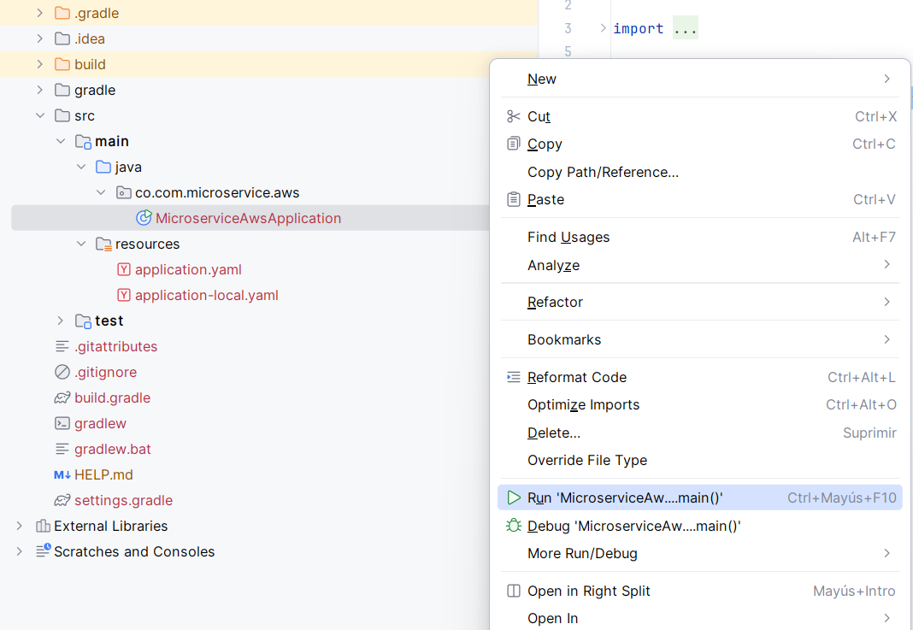

# Instructivo paso a paso CRUD Postgresql database
> A continuación se realiza la creación base del proyecto basada en microservicios por contexto y arquitectura limpia

### Requisitos

- ⚠️ Java 17 o superior
- ⚠️ Gradle 8.8 o posterior
- ⚠️ Docker o Podman
- ⚠️ Postman
- ⚠️ Intellij

### Clean Architecture: 

[Plugin documentación](https://bancolombia.github.io/scaffold-clean-architecture/docs/intro)

### Crear proyecto:

1. Datos del proyecto
    - Visitar el sitio [Spring initializr](https://start.spring.io/)
    - Información:
      - group: co.com.microservice.aws
      - artifact: microservice-aws
      - name: MicroserviceAWS
      - description: A microservice based on Clean Architecture, built using Spring WebFlux for reactive, non-blocking operations, and performing CRUD operations on a PostgreSQL database.
      - package-name: co.com.microservice.aws
      - packaging: jar 

    - Dependencias base:
      - Spring Reactive Web (spring-boot-starter-webflux)
      - Spring Data R2DBC (spring-boot-starter-data-r2dbc)
      - R2DBC PostgreSQL Driver (io.r2dbc:r2dbc-postgresql)
      - Lombok (org.projectlombok:lombok)
      - Spring Boot DevTools

    

    - Generar el proyecto y descomprimir el proyecto

2. Cargar proyecto en intellij y crear paquetes de arquitectura limpia

3. Configurar el proyecto

    - Ubicarse en la raiz del proyecto y modificar el archivo settings.gradle por
        ```
        pluginManagement {
            repositories {
                gradlePluginPortal()
            }
        }

        rootProject.name = 'microservice-aws'
        ```
        Actualizar dependencias

    - Ubicarse en la raiz del proyecto y modificar el archivo build.gradle por
        ```
        plugins {
            id 'java'
            id 'org.springframework.boot' version '3.5.3'
            id 'io.spring.dependency-management' version '1.1.7'
        }

        group = 'co.com.microservice.aws'
        version = '0.0.1-SNAPSHOT'

        java {
            toolchain {
                languageVersion = JavaLanguageVersion.of(21)
            }
        }

        configurations {
            compileOnly {
                extendsFrom annotationProcessor
            }
        }

        repositories {
            mavenCentral()
        }

        dependencies {
            implementation 'org.springframework.boot:spring-boot-starter-data-r2dbc'
            implementation 'org.springframework.boot:spring-boot-starter-webflux'
            implementation "org.apache.logging.log4j:log4j-core:2.24.3"
            implementation "org.apache.logging.log4j:log4j-api:2.24.3"
            implementation "org.apache.logging.log4j:log4j-to-slf4j:2.24.3"
            implementation 'com.fasterxml.jackson.core:jackson-databind'
            implementation 'io.r2dbc:r2dbc-h2'
            compileOnly 'org.projectlombok:lombok'
            developmentOnly 'org.springframework.boot:spring-boot-devtools'
            runtimeOnly 'org.postgresql:postgresql'
            runtimeOnly 'org.postgresql:r2dbc-postgresql'
            annotationProcessor 'org.projectlombok:lombok'
            testImplementation 'org.springframework.boot:spring-boot-starter-test'
            testImplementation 'io.projectreactor:reactor-test'
            testRuntimeOnly 'org.junit.platform:junit-platform-launcher'
        }

        // Para evitar conflicto con Logback
        configurations {
            all {
                exclude group: 'org.apache.logging.log4j', module: 'log4j-to-slf4j'
                exclude group: 'org.springframework.boot', module: 'spring-boot-starter-logging'
            }
        }

        tasks.named('test') {
            useJUnitPlatform()
        }
        ```
        Actualizar dependencias

    - Ubicarse en src > main > resources y crear el archivo application.yaml y de igual forma application-local.yaml con lo siguiente
        ```
        server:
        port: ${APP_PORT:8080}

        spring:
        application:
            name: "${APP_NAME:MicroserviceAws}"
        r2dbc:
            url: r2dbc:h2:mem:///testdb;DB_CLOSE_DELAY=-1;DB_CLOSE_ON_EXIT=FALSE
            username: sa
            password:

        management:
        health:
            probes:
            enabled: true
        endpoint:
            health:
            show-details: ${SHOW_DETAILS:never}
            enabled: true
            cache:
                time-to-live: "10s"
        endpoints:
            web:
            base-path: "${PATH_BASE:/api/v1/microservice-aws/}"
            path-mapping:
                health: "health"
                liveness: "liveness"
                readiness: "readiness"
            exposure:
                include: "health, liveness, readiness, metrics"

        logging:
        level:
            root: ${LOG4J_LEVEL:INFO}

        entries:
        countries-web:
            path-base: "${PATH_BASE:/api/v2/microservice-aws}"
            listAll: "/list-all"
            findOne: "/find-one/{name}"
            save: "/save"
            update: "/update"
            delete: "/delete/{id}"
        regex-body-wr:
            name: "${REGEX_COUNTRY_NAME:^[a-zA-ZáéíóúÁÉÍÓÚñÑ\\s]{3,50}$}"
            codeShort: "${REGEX_COUNTRY_CODE_SHORT:^[a-zA-Z]{3,4}$}"

        adapters:
        postgresql:
            url: r2dbc:postgresql://localhost:5432/my_postgres_db
            username: postgres
            password: postgres123
        mysql:
            url: r2dbc:mysql://localhost:3306/my_mysql_db
            username: root
            password: root123
        ```

    - Abrir el archivo MicroserviceAwsApplication.java y click derecho y ejecutar la aplicación
    
        

    - Configurar la aplicación para ejecutar de forma local
        ```
        SPRING_PROFILES_ACTIVE=local
        ```

        

    - Ubicarse en src > main > resources y crear el archivo log4j2.properties
        ```
        status = error
        name = MicroserviceAWS
        appender.console.type = Console
        appender.console.name = STDOUT
        appender.console.layout.type = JsonLayout
        appender.console.layout.compact = true
        appender.console.layout.eventEol = true
        appender.console.layout.includeStacktrace = true
        appender.console.layout.includeThreadContext = false
        appender.console.layout.properties = false

        appender.console.layout.includeTimeMillis = false

        rootLogger.level = info
        rootLogger.appenderRefs = stdout
        rootLogger.appenderRef.stdout.ref = STDOUT
        ```

    - Ubicarse en src > main > java y crear la estructura de arquitectura limpia
        

    - Ubicarse en src > main > java y crear la estructura de arquitectura limpia
        ```

        ```

    - Ubicarse en src > main > java y crear la estructura de arquitectura limpia
        ```

        ```