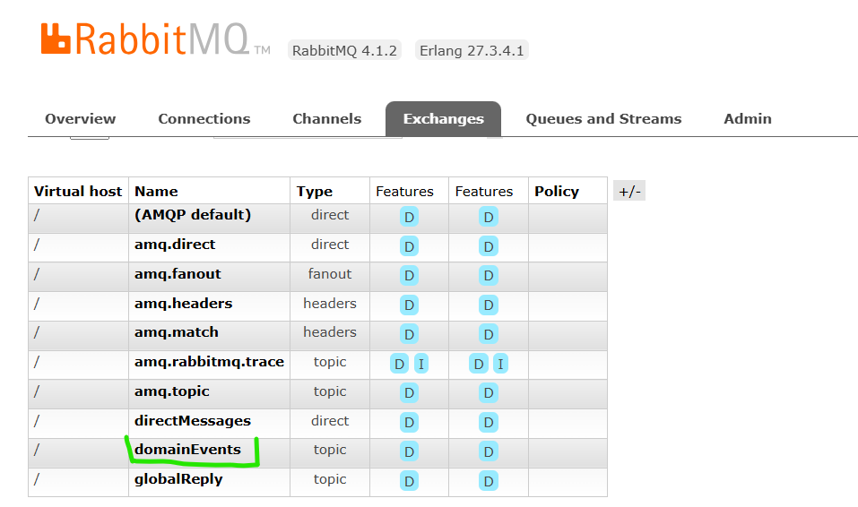

# Instructivo paso a paso Postgresql, Mysql database; Secrets, Redis, Cron, RabbitMQ (Publicador - Consumidor)

> A continuación se describe la configuración base de un proyecto construido bajo principios de microservicios y arquitectura limpia, integrando un sólido stack tecnológico.

⚠️ Este contenido no puede ser usado con fines comerciales. Ver [LICENSE.md](LICENSE.md)

### Requisitos

- ⚠️ Java 17 o superior
- ⚠️ Gradle 8.8 o posterior
- ⚠️ Docker o Podman
- ⚠️ Postman
- ⚠️ Intellij
- ⚠️ Instalar Plugin lombok en intellij

### Indice

* [1. Crear proyecto](#id1)
* [2. Crear la aplicación](#id2)
* [3. Crear la conexión con postgresql](#id3)
* [4. Crear la instancia de base de datos en Podman](#id4)
* [5. Realizar pruebas (listall - save)](#id5)
* [6. Completar la aplicación con otros metodos](#id6)
* [7. Realizar pruebas (update - delete - findby)](#id7)
* [8. Crear la conexión con mysql](#id8)
* [9. Crear la instancia de base de datos en Podman](#id9)
* [10. Crear conexión secrets-manager](#id10)
* [11. Crear conexión redis-cache](#id11)
* [12. Configurar uso de CRON](#id12)
* [13. Configurar uso de Rabbit MQ](#id13)
* [14. Configurar consumo de APIs Externas con Webclient](#id14)

# <div id='id1'/>
# 1. Crear y configurar el proyecto:

1. Datos del proyecto
    - Visitar el sitio [Spring initializr](https://start.spring.io/)
    - Información:
      - group: co.com.microservice.aws
      - artifact: microservice-aws
      - name: MicroserviceAWS
      - description: A microservice based on Clean Architecture, built using Spring WebFlux for reactive, non-blocking operations, and performing CRUD operations on a PostgreSQL database.
      - package-name: co.com.microservice.aws
      - packaging: jar 

    - Dependencias base:
      - Spring Reactive Web (spring-boot-starter-webflux)
      - Spring Data R2DBC (spring-boot-starter-data-r2dbc)
      - R2DBC PostgreSQL Driver (io.r2dbc:r2dbc-postgresql)
      - Lombok (org.projectlombok:lombok)
      - Spring Boot DevTools

    

    - Generar el proyecto y descomprimir el proyecto

2. Cargar proyecto en intellij y crear paquetes de arquitectura limpia, en el paso a paso se especificarán los paquetes donde debe crearse la clase, si el paquete no existe, este debe crearse de acuerdo a la estructura propuesta

3. Configurar el proyecto

    - Ubicarse en la raiz del proyecto y modificar el archivo settings.gradle por
        ```
        pluginManagement {
            repositories {
                gradlePluginPortal()
            }
        }

        rootProject.name = 'microservice-aws'
        ```
        Actualizar dependencias

    - Ubicarse en la raiz del proyecto y modificar el archivo build.gradle por
        ```
        plugins {
            id 'java'
            id 'org.springframework.boot' version '3.5.3'
            id 'io.spring.dependency-management' version '1.1.7'
        }

        group = 'co.com.microservice.aws'
        version = '0.0.1-SNAPSHOT'

        java {
            toolchain {
                languageVersion = JavaLanguageVersion.of(21)
            }
        }

        configurations {
            compileOnly {
                extendsFrom annotationProcessor
            }
        }

        repositories {
            mavenCentral()
        }

        dependencies {
            implementation 'org.springframework.boot:spring-boot-starter-data-r2dbc'
            implementation 'org.springframework.boot:spring-boot-starter-webflux'
            implementation "org.apache.logging.log4j:log4j-core:2.24.3"
            implementation "org.apache.logging.log4j:log4j-api:2.24.3"
            implementation "org.apache.logging.log4j:log4j-to-slf4j:2.24.3"
            implementation 'com.fasterxml.jackson.core:jackson-databind'
            implementation 'io.r2dbc:r2dbc-h2'
            implementation 'org.mapstruct:mapstruct:1.5.2.Final'
            // Driver R2DBC para MySQL usando jasync
            implementation 'com.github.jasync-sql:jasync-r2dbc-mysql:2.1.16'

            developmentOnly 'org.springframework.boot:spring-boot-devtools'
            compileOnly 'org.projectlombok:lombok'
            runtimeOnly 'org.postgresql:postgresql'
            runtimeOnly 'org.postgresql:r2dbc-postgresql'
            runtimeOnly 'com.mysql:mysql-connector-j'

            annotationProcessor 'org.projectlombok:lombok'
            annotationProcessor 'org.mapstruct:mapstruct-processor:1.5.2.Final'

            testImplementation 'org.springframework.boot:spring-boot-starter-test'
            testImplementation 'io.projectreactor:reactor-test'
            testRuntimeOnly 'org.junit.platform:junit-platform-launcher'
        }

        // Para evitar conflicto con Logback
        configurations {
            all {
                exclude group: 'org.apache.logging.log4j', module: 'log4j-to-slf4j'
                exclude group: 'org.springframework.boot', module: 'spring-boot-starter-logging'
            }
        }

        tasks.named('test') {
            useJUnitPlatform()
        }

        //options.incremental = false recompila siempre todos los archivos del proyecto
        tasks.withType(JavaCompile).configureEach {
            options.compilerArgs += ["-parameters"]
            options.incremental = false
        }
        ```
        Actualizar dependencias

    - Ubicarse en src > main > resources y crear el archivo application.yaml y de igual forma application-local.yaml con lo siguiente
```
server:
  port: ${APP_PORT:8080}

spring:
  application:
    name: "${APP_NAME:MicroserviceAws}"
  r2dbc:
    url: r2dbc:h2:mem:///testdb;DB_CLOSE_DELAY=-1;DB_CLOSE_ON_EXIT=FALSE
    username: sa
    password:

management:
  health:
    probes:
      enabled: true
  endpoint:
    health:
      show-details: ${SHOW_DETAILS:never}
      enabled: true
      cache:
        time-to-live: "10s"
  endpoints:
    web:
      base-path: "${PATH_BASE:/api/v1/microservice-aws/}"
      path-mapping:
        health: "health"
        liveness: "liveness"
        readiness: "readiness"
      exposure:
        include: "health, liveness, readiness, metrics"

logging:
  level:
    root: ${LOG4J_LEVEL:INFO}

entries:
  web:
    path-base: "${PATH_BASE:/api/v1/microservice-aws}"
    path-countries: "${PATH_COUNTRY:/country}"
    listAll: "/list-all"
    findByShortCode: "/findByShortCode/{shortCode}"
    save: "/save"
    update: "/update"
    delete: "/delete/{id}"
  regex-body-wr:
    name: "${REGEX_COUNTRY_NAME:^[a-zA-ZáéíóúÁÉÍÓÚñÑ\\s]{3,50}$}"
    codeShort: "${REGEX_COUNTRY_CODE_SHORT:^[a-zA-Z]{3,4}$}"

adapters:
  postgresql:
    url: r2dbc:postgresql://localhost:5432/my_postgres_db
    usr: postgres
    psw: 123456
  mysql:
    url: r2dbc:mysql://localhost:3306/my_mysql_db
    usr: myroot
    psw: myroot123
```

- Abrir el archivo MicroserviceAwsApplication.java y click derecho y ejecutar la aplicación
    
    

- Configurar la aplicación para ejecutar de forma local
    ```
    SPRING_PROFILES_ACTIVE=local
    ```

    

# <div id='id2'/>
# 2. Crear la aplicación

- Ubicarse en src > main > resources y crear el archivo log4j2.properties
    ```
    status = error
    name = MicroserviceAWS
    appender.console.type = Console
    appender.console.name = STDOUT
    appender.console.layout.type = JsonLayout
    appender.console.layout.compact = true
    appender.console.layout.eventEol = true
    appender.console.layout.includeStacktrace = true
    appender.console.layout.includeThreadContext = false
    appender.console.layout.properties = false

    appender.console.layout.includeTimeMillis = false

    rootLogger.level = info
    rootLogger.appenderRefs = stdout
    rootLogger.appenderRef.stdout.ref = STDOUT
    ```

- 💡 **Tip**, si en algun momento requieres mover una clase a un paquete, lo haces haciendo click derecho sobre la clase, elegir opción refactor, luego la opción move class y escribes el paquete o en los "..." puedes elegir en forma de arbol el paquete donde deseas ubicar la clase

- Ubicarse en el paquete co.com.microservice.aws.application.helpers.logs y crear la clase TransactionLog.java
    ```
    package co.com.microservice.aws.application.helpers.logs;

    import java.io.Serial;
    import java.io.Serializable;
    import java.util.Map;

    import lombok.*;

    @Getter
    @Setter
    @NoArgsConstructor
    @AllArgsConstructor
    @ToString
    @Builder(toBuilder = true)
    public class TransactionLog {
        @Serial
        private static final long serialVersionUID = 1L;

        private Application app;
        private Request request;
        private Response response;

        @Getter
        @Setter
        @NoArgsConstructor
        @AllArgsConstructor
        @ToString
        @Builder(toBuilder = true)
        public static class Application implements Serializable {
            @Serial
            private static final long serialVersionUID = 1L;

            private String message;
            private String messageId;
            private String service;
            private String method;
            private String appName;
        }

        @Getter
        @Setter
        @NoArgsConstructor
        @AllArgsConstructor
        @ToString
        @Builder(toBuilder = true)
        public static class Request implements Serializable {
            @Serial
            private static final long serialVersionUID = 1L;

            private Map<String, String> headers;
            private transient Object body;
        }

        @Getter
        @Setter
        @NoArgsConstructor
        @AllArgsConstructor
        @ToString
        @Builder(toBuilder = true)
        public static class Response implements Serializable {
            @Serial
            private static final long serialVersionUID = 1L;

            private Map<String, String> headers;
            private transient Object body;
        }
    }
    ```        

- Ubicarse en el paquete co.com.microservice.aws.application.helpers.logs y crear la clase LoggerBuilder.java

    ```
    package co.com.microservice.aws.application.helpers.logs;

    import com.fasterxml.jackson.core.JsonProcessingException;
    import com.fasterxml.jackson.databind.ObjectMapper;
    import lombok.Getter;
    import lombok.extern.log4j.Log4j2;
    import org.apache.logging.log4j.message.ObjectMessage;
    import org.springframework.beans.factory.annotation.Value;
    import org.springframework.stereotype.Component;

    @Log4j2
    @Getter
    @Component
    public class LoggerBuilder {
        private final String appName;
        private final ObjectMapper objectMapper;

        public LoggerBuilder(@Value("${spring.application.name}") String appName, ObjectMapper objectMapper) {
            this.appName = appName;
            this.objectMapper = objectMapper;
        }

        public void info(TransactionLog.Request rq, String message, String messageId, String service, String method) {
            log.info(new ObjectMessage(buildObjectReq(rq, buildDataLog(message, messageId, service, method))));
        }

        public void info(TransactionLog.Response rs, String message, String messageId, String service, String method) {
            log.info(new ObjectMessage(buildObjectRes(rs, buildDataLog(message, messageId, service, method))));
        }

        public void info(String message, String messageId, String service, String method) {
            log.info(new ObjectMessage(buildObjectApp(buildDataLog(message, messageId, service, method))));
        }

        public void error(Throwable throwable) {
            log.error("Unexpected error occurred:", throwable);
        }

        public void info(String message) {
            log.info(message);
        }

        private TransactionLog.Application buildDataLog(String message, String messageId, String service, String method){
            return new TransactionLog.Application(message, messageId, service, method, appName);
        }

        private String buildObjectReq(TransactionLog.Request rq, TransactionLog.Application data) {
            return buildObject(TransactionLog.builder().app(data).request(rq).build());
        }

        private String buildObjectRes(TransactionLog.Response rs, TransactionLog.Application data) {
            return buildObject(TransactionLog.builder().app(data).response(rs).build());
        }

        private String buildObjectApp(TransactionLog.Application data) {
            return buildObject(TransactionLog.builder().app(data).build());
        }

        private String buildObject(TransactionLog logObject) {
            try {
                return objectMapper.writeValueAsString(logObject);
            } catch (JsonProcessingException e) {
                return logObject.toString();
            }
        }
    }
    ```

- Ubicarse en el paquete co.com.microservice.aws.domain.model.commons.enums y crear la clase BusinessExceptionMessage.java
    - WRB: Es World Region Business

    ```
    package co.com.microservice.aws.domain.model.commons.enums;

    import lombok.AllArgsConstructor;
    import lombok.Getter;
    import lombok.ToString;

    @Getter
    @AllArgsConstructor
    @ToString
    public enum TechnicalExceptionMessage {

        TECHNICAL_SERVER_ERROR("WRT01", "Internal server error"),
        TECHNICAL_REST_CLIENT_ERROR("WRT02", "An error has occurred in the Rest Client"),
        TECHNICAL_HEADER_MISSING("WRT03", "Missing parameters per header"),
        TECHNICAL_REQUEST_ERROR("WRT04", "There is an error in the request body"),
        TECHNICAL_EXCEPTION_REPOSITORY("WRT05", "An error has occurred in the repository");

        private final String code;
        private final String message;

        public String getDescription() {
            return String.join(" - ", this.getCode(), this.getMessage());
        }
    }
    ```

- Ubicarse en el paquete co.com.microservice.aws.domain.model.commons.enums y crear la clase TechnicalExceptionMessage.java
    - WRT: Es World Region Technical
    ```
    package co.com.microservice.aws.domain.model.commons.enums;

    import lombok.AllArgsConstructor;
    import lombok.Getter;
    import lombok.ToString;

    @Getter
    @AllArgsConstructor
    @ToString
    public enum TechnicalExceptionMessage {

        TECHNICAL_SERVER_ERROR("WRT01", "Internal server error"),
        TECHNICAL_REST_CLIENT_ERROR("WRT02", "An error has occurred in the Rest Client"),
        TECHNICAL_HEADER_MISSING("WRT03", "Missing parameters per header"),
        TECHNICAL_REQUEST_ERROR("WRT04", "There is an error in the request body"),
        TECHNICAL_EXCEPTION_REPOSITORY("WRT05", "An error has occurred in the repository");

        private final String code;
        private final String message;

        public String getDescription() {
            return String.join(" - ", this.getCode(), this.getMessage());
        }
    }
    ```
    
- Ubicarse en el paquete co.com.microservice.aws.domain.model.commons.error y crear la clase Error.java
    ```
    package co.com.microservice.aws.domain.model.commons.error;

    import java.io.Serial;
    import java.io.Serializable;
    import java.util.List;

    import lombok.*;

    @Getter
    @AllArgsConstructor
    @NoArgsConstructor
    @Builder(toBuilder = true)
    public class Error implements Serializable {
        @Serial
        private static final long serialVersionUID = 1L;

        private List<Data> errors;

        @AllArgsConstructor
        @NoArgsConstructor
        @Getter
        @Builder(toBuilder = true)
        public static class Data implements Serializable {
            @Serial
            private static final long serialVersionUID = 1L;

            private String reason;
            private String domain;
            private String code;
            private String message;
        }
    }
    ```
    
- Ubicarse en el paquete co.com.microservice.aws.domain.model.commons.exception y crear la clase TechnicalException.java
    ```
    package co.com.microservice.aws.domain.model.commons.exception;

    import java.io.Serial;
    import co.com.microservice.aws.domain.model.commons.enums.TechnicalExceptionMessage;
    import lombok.Getter;

    @Getter
    public class TechnicalException extends RuntimeException {
        @Serial
        private static final long serialVersionUID = 1L;

        private final TechnicalExceptionMessage typeTechnicalException;
        private final String reason;

        public TechnicalException(Throwable error, TechnicalExceptionMessage technicalExceptionMessage) {
            super(technicalExceptionMessage.getDescription(), error);
            this.typeTechnicalException = technicalExceptionMessage;
            this.reason = technicalExceptionMessage.getDescription();
        }

        public TechnicalException(TechnicalExceptionMessage technicalExceptionEnum) {
            super(technicalExceptionEnum.getMessage());
            this.typeTechnicalException = technicalExceptionEnum;
            this.reason = technicalExceptionEnum.getDescription();
        }

        public TechnicalException(String reason, TechnicalExceptionMessage errorMessage) {
            super(errorMessage.getMessage());
            this.reason = reason;
            this.typeTechnicalException = errorMessage;
        }
    }
    ```
    
- Ubicarse en el paquete co.com.microservice.aws.domain.model.commons.exception y crear la clase BusinessException.java
    ```
    package co.com.microservice.aws.domain.model.commons.exception;

    import co.com.microservice.aws.domain.model.commons.enums.BusinessExceptionMessage;
    import co.com.microservice.aws.domain.model.commons.error.Error;
    import lombok.Getter;

    import java.io.Serial;

    @Getter
    public class BusinessException extends RuntimeException {
        @Serial
        private static final long serialVersionUID = 1L;

        private final Error error;
        private final BusinessExceptionMessage typeBusinessException;

        public BusinessException(Error error) {
            super(error.getErrors().get(0).getMessage());
            this.error = error;
            this.typeBusinessException = BusinessExceptionMessage.BUSINESS_ERROR;
        }

        public BusinessException(Throwable error, BusinessExceptionMessage typeBusinessException) {
            super(typeBusinessException.getDescription(), error);
            this.error = Error.builder().build();
            this.typeBusinessException = typeBusinessException;
        }

        public BusinessException(BusinessExceptionMessage typeBusinessException) {
            super(typeBusinessException.getDescription());
            this.error = Error.builder().build();
            this.typeBusinessException = typeBusinessException;
        }
    }
    ```
    
- Ubicarse en el paquete co.com.microservice.aws.domain.model.commons.error y crear la clase ErrorFactory.java
    ```
    package co.com.microservice.aws.domain.model.commons.error;

    import co.com.microservice.aws.domain.model.commons.enums.BusinessExceptionMessage;
    import co.com.microservice.aws.domain.model.commons.enums.TechnicalExceptionMessage;
    import co.com.microservice.aws.domain.model.commons.exception.BusinessException;
    import co.com.microservice.aws.domain.model.commons.exception.TechnicalException;
    import lombok.experimental.UtilityClass;

    import java.util.List;

    import static co.com.microservice.aws.domain.model.commons.enums.TechnicalExceptionMessage.TECHNICAL_SERVER_ERROR;

    @UtilityClass
    public class ErrorFactory {

        public Error buildError(TechnicalExceptionMessage technicalExceptionEnum, String reason, String domain) {
            return Error.builder()
                    .errors(List.of(Error.Data.builder().reason(reason).domain(domain)
                            .code(technicalExceptionEnum.getCode()).message(technicalExceptionEnum.getMessage()).build()))
                    .build();
        }

        public Error buildErrorBusiness(BusinessExceptionMessage businessErrorMessage, String reason, String domain) {
            return Error
                    .builder().errors(List.of(Error.Data.builder().reason(reason).domain(domain)
                            .code(businessErrorMessage.getCode()).message(businessErrorMessage.getTypeMessage()).build()))
                    .build();
        }

        public Error fromTechnical(TechnicalException technicalException, String domain) {
            if (technicalException.getReason() == null || technicalException.getReason().isEmpty()) {
                return buildError(technicalException.getTypeTechnicalException(), technicalException.getMessage(), domain);
            } else {
                return buildErrorWithReason(technicalException, domain);
            }
        }

        public Error buildErrorWithReason(TechnicalException technicalException, String domain) {
            return buildError(technicalException.getTypeTechnicalException(), technicalException.getReason(), domain);
        }

        public Error fromBusiness(BusinessException businessException, String domain) {
            if (businessException.getTypeBusinessException() == BusinessExceptionMessage.BUSINESS_ERROR) {
                return businessException.getError();
            }
            return buildErrorBusiness(businessException.getTypeBusinessException(),
                    businessException.getTypeBusinessException().getMessage(), domain);
        }

        public Error fromDefaultTechnical(String reason, String domain) {
            return buildError(TECHNICAL_SERVER_ERROR, reason, domain);
        }
    }
    ```
    
- Ubicarse en el paquete co.com.microservice.aws.infrastructure.input.rest.api.exception y crear la clase ExceptionHandler.java
    ```
    package co.com.microservice.aws.infrastructure.input.rest.api.exception;

    import co.com.microservice.aws.domain.model.commons.error.ErrorFactory;
    import co.com.microservice.aws.domain.model.commons.exception.BusinessException;
    import co.com.microservice.aws.domain.model.commons.exception.TechnicalException;
    import org.springframework.boot.autoconfigure.web.WebProperties;
    import org.springframework.boot.autoconfigure.web.reactive.error.AbstractErrorWebExceptionHandler;
    import org.springframework.boot.web.reactive.error.ErrorAttributes;
    import org.springframework.context.ApplicationContext;
    import org.springframework.core.annotation.Order;
    import org.springframework.http.HttpStatus;
    import org.springframework.http.MediaType;
    import org.springframework.http.codec.ServerCodecConfigurer;
    import org.springframework.stereotype.Component;
    import org.springframework.web.reactive.function.server.*;
    import reactor.core.publisher.Mono;

    import java.util.function.Function;

    import static org.springframework.http.HttpStatus.BAD_REQUEST;
    import static org.springframework.http.HttpStatus.INTERNAL_SERVER_ERROR;

    @Order(-2)
    @Component
    public class ExceptionHandler extends AbstractErrorWebExceptionHandler {
        public static final String FORMAT_ERROR = "%s:%s";

        public ExceptionHandler(ErrorAttributes errorAttributes, ApplicationContext applicationContext,
                                ServerCodecConfigurer serverCodecConfigurer) {
            super(errorAttributes, new WebProperties.Resources(), applicationContext);
            this.setMessageWriters(serverCodecConfigurer.getWriters());
        }

        @Override
        protected RouterFunction<ServerResponse> getRoutingFunction(ErrorAttributes errorAttributes) {
            return RouterFunctions.route(RequestPredicates.all(), this::buildErrorResponse);
        }

        public Mono<ServerResponse> buildErrorResponse(final ServerRequest request) {
            return Mono.just(request).map(this::getError).flatMap(Mono::error)
                    .onErrorResume(TechnicalException.class, responseTechnicalError(request))
                    .onErrorResume(BusinessException.class, responseBusinessError(request))
                    .onErrorResume(responseDefaultError(request)).cast(ServerResponse.class);
        }

        private Function<BusinessException, Mono<ServerResponse>> responseBusinessError(ServerRequest request) {
            return e -> Mono
                    .just(ErrorFactory.fromBusiness(e,
                            String.format(FORMAT_ERROR, request.method().name(), request.path())))
                    .flatMap(this::responseFailBusiness);
        }

        private Function<TechnicalException, Mono<ServerResponse>> responseTechnicalError(ServerRequest request) {
            return e -> Mono
                    .just(ErrorFactory.fromTechnical(e,
                            String.format(FORMAT_ERROR, request.method().name(), request.path())))
                    .flatMap(this::responseFailBusiness);
        }

        private Function<Throwable, Mono<ServerResponse>> responseDefaultError(ServerRequest request) {
            return exception -> Mono
                    .just(ErrorFactory.fromDefaultTechnical(exception.getMessage(),
                            String.format(FORMAT_ERROR, request.method().name(), request.path())))
                    .flatMap(this::responseFail);
        }

        public <T> Mono<ServerResponse> buildResponse(T error, HttpStatus httpStatus) {
            return ServerResponse.status(httpStatus).contentType(MediaType.APPLICATION_JSON).bodyValue(error);
        }

        public <T> Mono<ServerResponse> responseFail(T body) {
            return buildResponse(body, INTERNAL_SERVER_ERROR);
        }

        public <T> Mono<ServerResponse> responseFailBusiness(T body) {
            return buildResponse(body, BAD_REQUEST);
        }
    }
    ```

    ¿Por qué usar @Order(-2)?

    Spring ya tiene un DefaultErrorWebExceptionHandler que también extiende AbstractErrorWebExceptionHandler.

    Si defines uno personalizado y no le das mayor prioridad (-2 o menor), el de Spring lo sobreescribirá o ejecutará antes.

    @Order(-2) asegura que tu handler personalizado tenga precedencia y maneje los errores globales de tu manera.

- Ubicarse en el paquete co.com.microservice.aws.domain.model y crear la clase Country.java
    ```
    package co.com.microservice.aws.domain.model;

    import lombok.AllArgsConstructor;
    import lombok.Builder;
    import lombok.Data;
    import lombok.NoArgsConstructor;
    import java.io.Serial;
    import java.io.Serializable;
    import java.time.LocalDateTime;

    @Data
    @NoArgsConstructor
    @AllArgsConstructor
    @Builder(toBuilder = true)
    public class Country implements Serializable {
        @Serial
        private static final long serialVersionUID = 1L;

        private Long id;
        private String shortCode;
        private String name;
        private String description;
        private boolean status;
        private LocalDateTime dateCreation;
    }
    ```

- Ubicarse en el paquete co.com.microservice.aws.domain.model.rq y crear la clase Context.java
    ```
    package co.com.microservice.aws.domain.model.rq;

    import lombok.AllArgsConstructor;
    import lombok.Builder;
    import lombok.Getter;
    import lombok.NoArgsConstructor;
    import lombok.Setter;

    @Getter
    @Setter
    @NoArgsConstructor
    @AllArgsConstructor
    @Builder(toBuilder = true)
    public class Context {
        private String id;
        private Customer customer;

        @Getter
        @Setter
        @NoArgsConstructor
        @AllArgsConstructor
        @Builder(toBuilder = true)
        public static class Customer {
            private String ip;
            private String username;
            private Device device;
        }

        @Getter
        @Setter
        @NoArgsConstructor
        @AllArgsConstructor
        @Builder(toBuilder = true)
        public static class Device {
            private String userAgent;
            private String platformType;
        }
    }
    ```
- Ubicarse en el paquete co.com.microservice.aws.domain.model.rq y crear la clase TransactionRequest.java
    ```
    package co.com.microservice.aws.domain.model.rq;

    import lombok.*;

    import java.io.Serial;
    import java.io.Serializable;
    import java.util.List;

    @Getter
    @Setter
    @NoArgsConstructor
    @AllArgsConstructor
    @Builder(toBuilder = true)
    public class TransactionRequest implements Serializable {
        @Serial
        private static final long serialVersionUID = 1L;

        private transient Context context;
        private transient Object item;
        private transient List<Object> items;
    }
    ```
- Ubicarse en el paquete co.com.microservice.aws.domain.model.rs y crear la clase TransactionResponse.java
    ```
    package co.com.microservice.aws.domain.model.rs;

    import lombok.*;

    import java.io.Serial;
    import java.io.Serializable;
    import java.util.List;

    @Getter
    @Setter
    @NoArgsConstructor
    @AllArgsConstructor
    @Builder(toBuilder = true)
    public class TransactionResponse implements Serializable {
        @Serial
        private static final long serialVersionUID = 1L;

        private String message;
        private int size;
        private List<Object> response;
    }
    ```
- Ubicarse en el paquete co.com.microservice.aws.application.helpers.commons y crear la clase HeadersUtil.java
    ```
    package co.com.microservice.aws.application.helpers.commons;

    import java.util.LinkedHashMap;
    import java.util.Map;
    import java.util.regex.Pattern;

    import lombok.experimental.UtilityClass;

    @UtilityClass
    public class HeadersUtil {

        private static final String CHARS_TO_CLEAR = "<>(;|'";
        private static final String REGEXP_CHARS_TO_CLEAR = "[" + CHARS_TO_CLEAR + "]";
        private static final Pattern PATTERN_CHARS_TO_CLEAR = Pattern.compile(REGEXP_CHARS_TO_CLEAR);

        public static Map<String, String> clearChars(Map<String, String> headers) {
            var localHeaders = new LinkedHashMap<String, String>();
            if (null != headers && !headers.isEmpty()) {
                for (Map.Entry<String, String> entry : headers.entrySet()) {
                    localHeaders.put(entry.getKey(), PATTERN_CHARS_TO_CLEAR.matcher(entry.getValue()).replaceAll(" "));
                }
            }
            return localHeaders;
        }
    }
    ```
- Ubicarse en el paquete co.com.microservice.aws.application.helpers.commons y crear la clase ContextUtil.java
    ```
    package co.com.microservice.aws.application.helpers.commons;

    import co.com.microservice.aws.domain.model.rq.Context;
    import lombok.experimental.UtilityClass;

    import java.util.Map;
    import java.util.Optional;

    @UtilityClass
    public class ContextUtil {
        private static final String EMPTY_VALUE = "";

        public static Context buildContext(Map<String, String> headers) {
            var localHeaders = HeadersUtil.clearChars(headers);
            return Context.builder().id(Optional.ofNullable(localHeaders.get("message-id")).orElse(EMPTY_VALUE))
                    .customer(buildCustomer(localHeaders)).build();
        }

        private static Context.Customer buildCustomer(Map<String, String> headers) {
            return Context.Customer.builder().ip(Optional.ofNullable(headers.get("ip")).orElse(EMPTY_VALUE))
                    .username(Optional.ofNullable(headers.get("user-name")).orElse(EMPTY_VALUE))
                    .device(buildDevice(headers)).build();
        }

        private static Context.Device buildDevice(Map<String, String> headers) {
            return Context.Device.builder().userAgent(Optional.ofNullable(headers.get("user-agent")).orElse(EMPTY_VALUE))
                    .platformType(Optional.ofNullable(headers.get("platform-type")).orElse(EMPTY_VALUE)).build();
        }
    }
    ```
- Ubicarse en el paquete co.com.microservice.aws.domain.usecase.in y crear la clase ListAllUseCase.java
    ```
    package co.com.microservice.aws.domain.usecase.in;

    import co.com.microservice.aws.domain.model.rq.TransactionRequest;
    import co.com.microservice.aws.domain.model.rs.TransactionResponse;
    import reactor.core.publisher.Mono;

    public interface ListAllUseCase {
        Mono<TransactionResponse> listAll(TransactionRequest request);
    }
    ```
- Ubicarse en el paquete co.com.microservice.aws.domain.usecase.in y crear la clase SaveUseCase.java
    ```
    package co.com.microservice.aws.domain.usecase.in;

    import co.com.microservice.aws.domain.model.rq.TransactionRequest;
    import reactor.core.publisher.Mono;

    public interface SaveUseCase {
        Mono<String> save(TransactionRequest request);
    }
    ```
- Ubicarse en el paquete co.com.microservice.aws.domain.usecase.out y crear la clase ListAllPort.java
    ```
    package co.com.microservice.aws.domain.usecase.out;

    import co.com.microservice.aws.domain.model.rq.Context;
    import reactor.core.publisher.Flux;

    public interface ListAllPort<T> {
        Flux<T> listAll(Context context);
    }
    ```
- Ubicarse en el paquete co.com.microservice.aws.domain.usecase.out y crear la clase SavePort.java
    ```
    package co.com.microservice.aws.domain.usecase.out;

    import co.com.microservice.aws.domain.model.rq.Context;
    import reactor.core.publisher.Mono;

    public interface SavePort<T> {
        Mono<T> save(T t, Context context);
    }
    ```
- Ubicarse en el paquete co.com.microservice.aws.domain.model.commons.util y crear la clase ResponseMessageConstant.java
    ```
    package co.com.microservice.aws.domain.model.commons.util;

    import lombok.AccessLevel;
    import lombok.NoArgsConstructor;

    @NoArgsConstructor(access = AccessLevel.PRIVATE)
    public class ResponseMessageConstant {
        public static final String MSG_LIST_SUCCESS = "Listed successfull!";
        public static final String MSG_SAVED_SUCCESS = "Saved successfull!";
        public static final String MSG_UPDATED_SUCCESS = "Updated successfull!";
        public static final String MSG_DELETED_SUCCESS = "Deleted successfull!";
    }
    ```
- Ubicarse en el paquete co.com.microservice.aws.domain.model.commons.util y crear la clase LogMessage.java
    ```
    package co.com.microservice.aws.domain.model.commons.util;

    import lombok.AccessLevel;
    import lombok.NoArgsConstructor;

    @NoArgsConstructor(access = AccessLevel.PRIVATE)
    public class LogMessage {
        public static final String MESSAGE_SERVICE = "Service Api Rest world regions";
        public static final String METHOD_LISTCOUNTRIES = "List all by region";
        public static final String METHOD_FINDONE = "Find one world region";
        public static final String METHOD_SAVE = "Save one world region";
        public static final String METHOD_UPDATE = "Update one world region";
        public static final String METHOD_DELETE = "Delete one world region";
    }
    ```
- Ubicarse en el paquete co.com.microservice.aws.application.helpers.commons y crear la clase UseCase.java
    ```
    package co.com.microservice.aws.application.helpers.commons;

    import org.springframework.core.annotation.AliasFor;
    import org.springframework.stereotype.Component;

    import java.lang.annotation.*;

    @Target({ElementType.TYPE})
    @Retention(RetentionPolicy.RUNTIME)
    @Documented
    @Component
    public @interface UseCase {
        @AliasFor(annotation = Component.class)
        String value() default "";
    }
    ```
- Ubicarse en el paquete co.com.microservice.aws.application.usecase y crear la clase CountryUseCase.java
    ```
    package co.com.microservice.aws.application.usecase;

    import co.com.microservice.aws.application.helpers.commons.UseCase;
    import co.com.microservice.aws.domain.model.Country;
    import co.com.microservice.aws.domain.model.commons.exception.TechnicalException;
    import co.com.microservice.aws.domain.model.commons.util.ResponseMessageConstant;
    import co.com.microservice.aws.domain.model.rq.Context;
    import co.com.microservice.aws.domain.model.rq.TransactionRequest;
    import co.com.microservice.aws.domain.model.rs.TransactionResponse;
    import co.com.microservice.aws.domain.usecase.in.ListAllUseCase;
    import co.com.microservice.aws.domain.usecase.in.SaveUseCase;
    import co.com.microservice.aws.domain.usecase.out.ListAllPort;
    import co.com.microservice.aws.domain.usecase.out.SavePort;
    import lombok.RequiredArgsConstructor;
    import reactor.core.publisher.Mono;

    import java.util.Collections;
    import java.util.List;
    import java.util.Optional;

    import static co.com.microservice.aws.domain.model.commons.enums.TechnicalExceptionMessage.TECHNICAL_REQUEST_ERROR;

    @UseCase("countryUseCase")
    @RequiredArgsConstructor
    public class CountryUseCase implements SaveUseCase, ListAllUseCase {
        private static final String KEY_USER_NAME = "user-name";
        private static final String ATTRIBUTE_IS_REQUIRED = "The attribute '%s' is required";

        private final SavePort<Country> countrySaver;
        private final ListAllPort<Country> countryLister;

        @Override
        public Mono<TransactionResponse> listAll(TransactionRequest request) {
            return Mono.just(request)
                .filter(this::userIsRequired)
                .flatMap(req -> countryLister.listAll(req.getContext()).collectList().flatMap(this::buildResponse)
                ).switchIfEmpty(Mono.defer(() -> Mono.error(new BusinessException(BUSINESS_USERNAME_REQUIRED))));
        }

        @Override
        public Mono<String> save(TransactionRequest request) {
            return Mono.just(request)
                .filter(this::userIsRequired)
                .map(TransactionRequest::getItem)
                .flatMap(this::buildCountry)
                .flatMap(country -> countrySaver.save(country, request.getContext()))
                .thenReturn(ResponseMessageConstant.MSG_SAVED_SUCCESS);
        }

        private Boolean userIsRequired(TransactionRequest request){
            return Optional.ofNullable(request)
                .map(TransactionRequest::getContext)
                .map(Context::getCustomer).map(Context.Customer::getUsername)
                .filter(username -> !username.isEmpty())
                .isPresent();
        }

        private Mono<Country> buildCountry(Object object){
            if (object instanceof Country country) {
                return Mono.just(Country.builder().name(country.getName())
                        .shortCode(country.getShortCode()).status(country.isStatus())
                        .dateCreation(country.getDateCreation())
                        .build());
            } else {
                return Mono.error(new TechnicalException(TECHNICAL_REQUEST_ERROR));
            }
        }

        private Mono<TransactionResponse> buildResponse(List<Country> countries){
            var simplifiedList = countries.stream()
                .map(country -> Country.builder().id(country.getId()).name(country.getName())
                    .shortCode(country.getShortCode()).status(country.isStatus())
                    .dateCreation(country.getDateCreation())
                    .build())
                .toList();

            TransactionResponse response = TransactionResponse.builder()
                .message(ResponseMessageConstant.MSG_LIST_SUCCESS)
                .size(countries.size())
                .response(Collections.singletonList(simplifiedList))
                .build();

            return Mono.just(response);
        }
    }
    ```
- Ubicarse en el paquete co.com.microservice.aws.infrastructure.input.rest.api.config y crear la clase RouterProperties.java
    ```
    package co.com.microservice.aws.infrastructure.input.rest.api.config;

    import lombok.Data;
    import org.springframework.boot.context.properties.ConfigurationProperties;
    import org.springframework.stereotype.Component;

    @Data
    @Component
    @ConfigurationProperties(prefix = "entries.web")
    public class RouterProperties {
        private String pathBase;
        private String pathCountries;
        private String listAll;
        private String findByShortCode;
        private String save;
        private String update;
        private String delete;
    }
    ```
- Ubicarse en el paquete co.com.microservice.aws.infrastructure.input.rest.api.handler y crear la clase CountryHandler.java
    ```
    package co.com.microservice.aws.infrastructure.input.rest.api.handler;

    import co.com.microservice.aws.application.helpers.commons.ContextUtil;
    import co.com.microservice.aws.application.helpers.logs.LoggerBuilder;
    import co.com.microservice.aws.application.helpers.logs.TransactionLog;
    import co.com.microservice.aws.domain.model.Country;
    import co.com.microservice.aws.domain.model.rq.Context;
    import co.com.microservice.aws.domain.model.rq.TransactionRequest;
    import co.com.microservice.aws.domain.usecase.in.*;
    import org.springframework.beans.factory.annotation.Qualifier;
    import org.springframework.stereotype.Component;
    import org.springframework.web.reactive.function.server.ServerRequest;
    import org.springframework.web.reactive.function.server.ServerResponse;
    import reactor.core.publisher.Mono;

    import java.util.Map;

    import static co.com.microservice.aws.domain.model.commons.util.LogMessage.*;

    @Component
    public class CountryHandler {
        private static final String NAME_CLASS = CountryHandler.class.getName();

        private final LoggerBuilder logger;
        private final ListAllUseCase useCaseLister;
        private final SaveUseCase useCaseSaver;
        private final UpdateUseCase useCaseUpdater;
        private final DeleteUseCase useCaseDeleter;
        private final FindByShortCodeUseCase useCaseFinder;

        public CountryHandler(
                LoggerBuilder logger,
                @Qualifier("countryUseCase") ListAllUseCase useCaseLister,
                @Qualifier("countryUseCase") SaveUseCase useCaseSaver,
                @Qualifier("countryUseCase") UpdateUseCase useCaseUpdater,
                @Qualifier("countryUseCase") DeleteUseCase useCaseDeleter,
                @Qualifier("countryUseCase") FindByShortCodeUseCase useCaseFinder
        ) {
            this.logger = logger;
            this.useCaseLister = useCaseLister;
            this.useCaseSaver = useCaseSaver;
            this.useCaseUpdater = useCaseUpdater;
            this.useCaseDeleter = useCaseDeleter;
            this.useCaseFinder = useCaseFinder;
        }

        public Mono<ServerResponse> listAll(ServerRequest serverRequest) {
            var request = this.buildRequestWithParams(serverRequest, METHOD_LISTCOUNTRIES, Map.of("none", "none"));
            return useCaseLister.listAll(request)
                    .doOnError(this::printFailed)
                    .flatMap(response -> ServerResponse.ok().bodyValue(response));
        }

        public Mono<ServerResponse> save(ServerRequest serverRequest) {
            var headers = serverRequest.headers().asHttpHeaders().toSingleValueMap();
            var context = ContextUtil.buildContext(headers);
            printOnProcess(context, METHOD_SAVE);

            return this.getRequest(serverRequest)
                    .flatMap(useCaseSaver::save)
                    .flatMap(msg -> ServerResponse.ok().bodyValue(msg));
        }

        public Mono<ServerResponse> findOne(ServerRequest serverRequest) {
            var request = this.buildRequestWithParamsFind(serverRequest, METHOD_FINDONE);
            return useCaseFinder.findByShortCode(request)
                    .doOnError(this::printFailed)
                    .flatMap(response -> ServerResponse.ok().bodyValue(response));
        }

        public Mono<ServerResponse> update(ServerRequest serverRequest) {
            var headers = serverRequest.headers().asHttpHeaders().toSingleValueMap();
            var context = ContextUtil.buildContext(headers);
            printOnProcess(context, METHOD_UPDATE);

            return this.getRequest(serverRequest)
                    .flatMap(useCaseUpdater::update)
                    .flatMap(msg -> ServerResponse.ok().bodyValue(msg));
        }

        public Mono<ServerResponse> delete(ServerRequest serverRequest) {
            var request = this.buildRequestWithParamsDelete(serverRequest, METHOD_DELETE);
            return useCaseDeleter.delete(request)
                    .doOnError(this::printFailed)
                    .flatMap(response -> ServerResponse.ok().bodyValue(response));
        }

        private Mono<TransactionRequest> getRequest(ServerRequest serverRequest) {
            var headers = serverRequest.headers().asHttpHeaders().toSingleValueMap();
            var context = ContextUtil.buildContext(headers);
            return serverRequest.bodyToMono(Country.class)
                    .flatMap(country -> Mono.just(TransactionRequest.builder()
                            .context(context).item(country).build()));
        }

        private TransactionRequest buildRequestWithParamsFind(ServerRequest serverRequest, String method){
            var shortCode = serverRequest.pathVariable("shortCode");
            return this.buildRequestWithParams(serverRequest, method, Map.of("shortCode", shortCode));
        }

        private TransactionRequest buildRequestWithParamsDelete(ServerRequest serverRequest, String method){
            var shortCode = serverRequest.pathVariable("id");
            return this.buildRequestWithParams(serverRequest, method, Map.of("id", shortCode));
        }

        private TransactionRequest buildRequestWithParams(ServerRequest serverRequest,
                                                        String method, Map<String, String> param){
            var headers = serverRequest.headers().asHttpHeaders().toSingleValueMap();
            var context = ContextUtil.buildContext(headers);
            printOnProcess(context, method);

            return TransactionRequest.builder()
                    .context(context)
                    .params(param)
                    .build();
        }

        private void printFailed(Throwable throwable) {
            logger.error(throwable);
        }

        private void printOnProcess(Context context, String messageInfo){
            logger.info(TransactionLog.Request.builder().body(context).build(),
                    messageInfo, context.getId(), MESSAGE_SERVICE, NAME_CLASS);
        }
    }
    ```

- Ubicarse en el paquete co.com.microservice.aws.infrastructure.input.rest.api.router y crear la clase CountryRouterRest.java
    ```
    package co.com.microservice.aws.infrastructure.input.rest.api.router;

    import co.com.microservice.aws.infrastructure.input.rest.api.config.RouterProperties;
    import co.com.microservice.aws.infrastructure.input.rest.api.handler.CountryHandler;
    import lombok.RequiredArgsConstructor;
    import org.springframework.context.annotation.Bean;
    import org.springframework.context.annotation.Configuration;
    import org.springframework.web.reactive.function.server.RouterFunction;
    import org.springframework.web.reactive.function.server.RouterFunctions;
    import org.springframework.web.reactive.function.server.ServerResponse;

    @Configuration
    @RequiredArgsConstructor
    public class CountryRouterRest {
        private final RouterProperties properties;

        @Bean
        public RouterFunction<ServerResponse> routerCountryFunction(CountryHandler countryHandler) {
            return RouterFunctions.route()
                    .GET(createRoute(properties.getListAll()), countryHandler::listAll)
                    .POST(createRoute(properties.getSave()), countryHandler::save)
                    .build();
        }

        private String createRoute(String route){
            return properties.getPathBase().concat(properties.getPathCountries()).concat(route);
        }
    }
    ```

# <div id='id3'/>
# 3. Crear la conexión a Postgresql

- Ubicarse en el paquete co.com.microservice.aws.infrastructure.output.postgresql.entity y crear la clase CountryEntity.java
    ```
    package co.com.microservice.aws.infrastructure.output.postgresql.entity;

    import lombok.AllArgsConstructor;
    import lombok.Data;
    import lombok.NoArgsConstructor;
    import org.springframework.data.annotation.Id;
    import org.springframework.data.relational.core.mapping.Table;

    import java.time.LocalDateTime;

    @Table(name = "countries", schema = "worldregion")
    @Data
    @NoArgsConstructor
    @AllArgsConstructor
    public class CountryEntity {
        @Id
        private Long id;
        private String shortCode;
        private String name;
        private String description;
        private boolean status;
        private LocalDateTime dateCreation;
    }
    ```
- Ubicarse en el paquete co.com.microservice.aws.infrastructure.output.postgresql.mapper y crear la clase CountryEntityMapper.java
    ```
    package co.com.microservice.aws.infrastructure.output.postgresql.mapper;

    import co.com.microservice.aws.domain.model.Country;
    import co.com.microservice.aws.infrastructure.output.postgresql.entity.CountryEntity;
    import org.mapstruct.Mapper;
    import org.mapstruct.ReportingPolicy;

    @Mapper(componentModel = "spring")
    public interface CountryEntityMapper {
        CountryEntity toEntityFromModel(Country objectModel);
        Country toModelFromEntity(CountryEntity objectEntity);
    }
    ```
- Ubicarse en el paquete co.com.microservice.aws.infrastructure.output.postgresql.repository y crear la clase CountryRepository.java
    ```
    package co.com.microservice.aws.infrastructure.output.postgresql.repository;

    import co.com.microservice.aws.infrastructure.output.postgresql.entity.CountryEntity;
    import org.springframework.data.r2dbc.repository.R2dbcRepository;

    public interface CountryRepository extends R2dbcRepository<CountryEntity, Long> {
    }
    ```
- Ubicarse en el paquete co.com.microservice.aws.infrastructure.output.postgresql y crear la clase CountryAdapter.java
    ```
    package co.com.microservice.aws.infrastructure.output.postgresql;

    import co.com.microservice.aws.domain.model.Country;
    import co.com.microservice.aws.domain.model.rq.Context;
    import co.com.microservice.aws.domain.usecase.out.ListAllPort;
    import co.com.microservice.aws.domain.usecase.out.SavePort;
    import co.com.microservice.aws.infrastructure.output.postgresql.mapper.CountryEntityMapper;
    import co.com.microservice.aws.infrastructure.output.postgresql.repository.CountryRepository;
    import lombok.RequiredArgsConstructor;
    import org.springframework.stereotype.Component;
    import reactor.core.publisher.Flux;
    import reactor.core.publisher.Mono;

    @Component
    @RequiredArgsConstructor
    public class CountryAdapter implements SavePort<Country>, ListAllPort<Country> {
        private final CountryEntityMapper mapper;
        private final CountryRepository countryRepository;

        @Override
        public Mono<Country> save(Country country, Context context) {
            return Mono.just(country)
                    .map(mapper::toEntityFromModel)
                    .flatMap(countryRepository::save)
                    .map(mapper::toModelFromEntity);
        }

        @Override
        public Flux<Country> listAll(Context context) {
            return countryRepository.findAll()
                    .map(mapper::toModelFromEntity);
        }
    }
    ```
- Ubicarse en el paquete co.com.microservice.aws.infrastructure.output.postgresql.config y crear la clase PostgresConfig.java
    ```
    package co.com.microservice.aws.infrastructure.output.postgresql.config;

    import io.r2dbc.spi.ConnectionFactory;
    import lombok.RequiredArgsConstructor;
    import org.springframework.beans.factory.annotation.Value;
    import org.springframework.context.annotation.Bean;
    import org.springframework.context.annotation.Configuration;
    import org.springframework.boot.context.properties.EnableConfigurationProperties;
    import io.r2dbc.spi.ConnectionFactories;
    import io.r2dbc.spi.ConnectionFactoryOptions;

    import static io.r2dbc.spi.ConnectionFactoryOptions.*;

    @Configuration
    @RequiredArgsConstructor
    public class PostgresConfig {

        @Bean
        public ConnectionFactory postgresConnectionFactory(@Value("${adapters.postgresql.url}") String url,
                                                        @Value("${adapters.postgresql.usr}") String usr,
                                                        @Value("${adapters.postgresql.psw}") String psw) {
            ConnectionFactoryOptions options = ConnectionFactoryOptions.parse(url)
                    .mutate()
                    .option(USER, usr)
                    .option(PASSWORD, psw)
                    .build();

            return ConnectionFactories.get(options);
        }
    }
    ```

# <div id='id4'/>
# 4. Crear la instancia de base de datos en Podman

- Abrir la consola de comandos para descargar la imagen de Postgresql y subir el contenedor en Podman o Docker
    ```
    podman machine start
    podman pull docker.io/library/postgres:16
    ```
- Ejecutar el contenedor
    ```
    podman run --name postgres-db -e POSTGRES_USER=postgres -e POSTGRES_PASSWORD=123456 -e POSTGRES_DB=my_postgres_db -p 5432:5432 -d postgres:16

    ```
- Conectar a la bd con DBeaver

    

- Creamos la tabla
    ```
    DROP TABLE IF EXISTS worldregion.countries;

    CREATE SCHEMA IF NOT EXISTS worldregion;

    CREATE SEQUENCE worldregion.countries_id_seq
        START WITH 1
        INCREMENT BY 1
        NO MINVALUE
        NO MAXVALUE
        CACHE 1;
    
    CREATE TABLE worldregion.countries (
        id BIGINT PRIMARY KEY DEFAULT nextval('worldregion.countries_id_seq'),
        short_code VARCHAR(10) NOT NULL,
        name VARCHAR(100) NOT NULL,
        description TEXT,
        status BOOLEAN NOT NULL,
        date_creation TIMESTAMP NOT NULL
    );

    CREATE SEQUENCE IF NOT EXISTS worldregion.countries_id_seq;

    ALTER TABLE worldregion.countries
        ALTER COLUMN id SET DEFAULT nextval('worldregion.countries_id_seq');
    ```

- Realizamos el insert de la información
    ```
    INSERT INTO worldregion.countries (short_code, name, description, status, date_creation) VALUES
    ('CO', 'Colombia', 'Colombia, ubicada en América del Sur, cuenta con una población estimada de 52 millones de habitantes.', 
    true, '2025-07-12 08:00:00')

    INSERT INTO worldregion.countries (short_code, name, description, status, date_creation) VALUES
    ('MX', 'México', 'México, nación norteamericana, tiene aproximadamente 129 millones de habitantes.', true, '2025-07-11 09:15:00'),
    ('US', 'Estados Unidos', 'Estados Unidos posee una población de alrededor de 334 millones de personas.', true, '2025-07-10 10:30:00'),
    ('FR', 'Francia', 'Francia, ubicada en Europa occidental, tiene una población cercana a los 68 millones de habitantes.', false, '2025-07-09 11:45:00'),
    ('JP', 'Japón', 'Japón, nación insular asiática, cuenta con aproximadamente 125 millones de habitantes.', true, '2025-07-08 14:00:00');
    ```

- Ejecutar la creación de la tabla

    

# <div id='id5'/>
# 5. Realizar pruebas (listall - save)

- Ejecutar la aplicación
- Probamos "list-all" por postman: curls caso error
    ```
    curl --location 'localhost:8080/api/v1/microservice-aws/country/list-all'
    ```
    

- Probamos "list-all" por postman: curls caso exitoso
    ```
    curl --location 'localhost:8080/api/v1/microservice-aws/country/list-all' \
    --header 'user-name: usertest' \
    --header 'message-id: 7a214936-5e93-11ec-bf63-0242ac130002' \
    --header 'ip: 172.34.45.12' \
    --header 'user-agent: application/json' \
    --header 'platform-type: postman'
    ```
    

- Ver logs

    

- Probamos "save" por postman:
    ```
    curl --location 'localhost:8080/api/v1/microservice-aws/country/save' \
    --header 'user-name: usertest' \
    --header 'message-id: 7a214936-5e93-11ec-bf63-0242ac130002' \
    --header 'ip: 172.34.45.12' \
    --header 'user-agent: application/json' \
    --header 'platform-type: postman' \
    --header 'Content-Type: application/json' \
    --data '{
        "shortCode": "ESP",
        "name": "España",
        "description": "Cuenta con una población estimada de 40 millones de habitantes.",
        "status": true,
        "dateCreation": "2025-07-12T08:00:00"
    }'
    ```

- Ver logs
    ```
    {
        "instant": {
            "epochSecond": 1752374275,
            "nanoOfSecond": 418281500
        },
        "thread": "reactor-http-nio-9",
        "level": "INFO",
        "loggerName": "co.com.microservice.aws.application.helpers.logs.LoggerBuilder",
        "message": "{\"app\":{\"message\":\"Save one record\",\"messageId\":\"7a214936-5e93-11ec-bf63-0242ac130002\",\"service\":\"Service Api Rest world regions\",\"method\":\"co.com.microservice.aws.infrastructure.input.rest.api.handler.CountryHandler\",\"appName\":\"MicroserviceAws\"},\"request\":{\"headers\":null,\"body\":{\"id\":\"7a214936-5e93-11ec-bf63-0242ac130002\",\"customer\":{\"ip\":\"172.34.45.12\",\"username\":\"usertest\",\"device\":{\"userAgent\":\"application/json\",\"platformType\":\"postman\"}}}},\"response\":null}",
        "endOfBatch": false,
        "loggerFqcn": "org.apache.logging.log4j.spi.AbstractLogger",
        "threadId": 81,
        "threadPriority": 5
    }
    ```

# <div id='id6'/>
# 6. Completar la aplicación con otros metodos, refactorizando

- Ubicarse en el paquete co.com.microservice.aws.domain.usecase.in y crear la clase UpdateUseCase.java
    ```
    package co.com.microservice.aws.domain.usecase.in;

    import co.com.microservice.aws.domain.model.rq.TransactionRequest;
    import reactor.core.publisher.Mono;

    public interface UpdateUseCase {
        Mono<String> update(TransactionRequest request);
    }
    ```

- Ubicarse en el paquete co.com.microservice.aws.domain.usecase.in y crear la clase DeleteUseCase.java
    ```
    package co.com.microservice.aws.domain.usecase.in;

    import co.com.microservice.aws.domain.model.rq.TransactionRequest;
    import reactor.core.publisher.Mono;

    public interface DeleteUseCase {
        Mono<String> delete(TransactionRequest request);
    }
    ```

- Ubicarse en el paquete co.com.microservice.aws.domain.usecase.in y crear la clase FindByShortCodeUseCase.java
    ```
    package co.com.microservice.aws.domain.usecase.in;

    import co.com.microservice.aws.domain.model.rq.TransactionRequest;
    import reactor.core.publisher.Mono;

    public interface FindByShortCodeUseCase {
        Mono<TransactionResponse> findByShortCode(TransactionRequest request);
    }
    ```

- Ubicarse en el paquete co.com.microservice.aws.domain.usecase.in y crear la clase CountryUseCase.java
    ```
    package co.com.microservice.aws.domain.usecase.in;

    public interface CountryUseCase extends SaveUseCase, UpdateUseCase, DeleteUseCase,
            ListAllUseCase, FindByShortCodeUseCase{
    }
    ```

- Ubicarse en el paquete co.com.microservice.aws.domain.model.rq y modificar la clase TransactionRequest.java
    ```
    package co.com.microservice.aws.domain.model.rq;

    import lombok.*;

    import java.io.Serial;
    import java.io.Serializable;
    import java.util.List;
    import java.util.Map;

    @Getter
    @Setter
    @NoArgsConstructor
    @AllArgsConstructor
    @Builder(toBuilder = true)
    public class TransactionRequest implements Serializable {
        @Serial
        private static final long serialVersionUID = 1L;

        private transient Context context;
        private transient Object item;
        private transient List<Object> items;
        private transient Map<String, String> params;
    }
    ```

- Ubicarse en el paquete co.com.microservice.aws.infrastructure.input.rest.api.handler y modificar la clase CountryHandler.java
    ```
    package co.com.microservice.aws.infrastructure.input.rest.api.handler;

    import co.com.microservice.aws.application.helpers.commons.ContextUtil;
    import co.com.microservice.aws.application.helpers.logs.LoggerBuilder;
    import co.com.microservice.aws.application.helpers.logs.TransactionLog;
    import co.com.microservice.aws.domain.model.Country;
    import co.com.microservice.aws.domain.model.rq.Context;
    import co.com.microservice.aws.domain.model.rq.TransactionRequest;
    import co.com.microservice.aws.domain.usecase.in.CountryUseCase;
    import lombok.RequiredArgsConstructor;
    import org.springframework.stereotype.Component;
    import org.springframework.web.reactive.function.server.ServerRequest;
    import org.springframework.web.reactive.function.server.ServerResponse;
    import reactor.core.publisher.Mono;

    import java.util.Map;

    import static co.com.microservice.aws.domain.model.commons.util.LogMessage.*;

    @Component
    @RequiredArgsConstructor
    public class CountryHandler {
        private static final String NAME_CLASS = CountryHandler.class.getName();

        private final LoggerBuilder logger;
        private final CountryUseCase countryUseCase;

        public Mono<ServerResponse> listAll(ServerRequest serverRequest) {
            var request = this.buildRequestWithParams(serverRequest, METHOD_LISTCOUNTRIES, Map.of("none", "none"));
            return countryUseCase.listAll(request)
                    .doOnError(this::printFailed)
                    .flatMap(response -> ServerResponse.ok().bodyValue(response));
        }

        public Mono<ServerResponse> save(ServerRequest serverRequest) {
            var headers = serverRequest.headers().asHttpHeaders().toSingleValueMap();
            var context = ContextUtil.buildContext(headers);
            printOnProcess(context, METHOD_SAVE);

            return this.getRequest(serverRequest)
                    .flatMap(countryUseCase::save)
                    .flatMap(msg -> ServerResponse.ok().bodyValue(msg));
        }

        public Mono<ServerResponse> findOne(ServerRequest serverRequest) {
            var request = this.buildRequestWithParamsFind(serverRequest, METHOD_FINDONE);
            return countryUseCase.findByShortCode(request)
                    .doOnError(this::printFailed)
                    .flatMap(response -> ServerResponse.ok().bodyValue(response));
        }

        public Mono<ServerResponse> update(ServerRequest serverRequest) {
            var headers = serverRequest.headers().asHttpHeaders().toSingleValueMap();
            var context = ContextUtil.buildContext(headers);
            printOnProcess(context, METHOD_UPDATE);

            return this.getRequest(serverRequest)
                    .flatMap(countryUseCase::update)
                    .flatMap(msg -> ServerResponse.ok().bodyValue(msg));
        }

        public Mono<ServerResponse> delete(ServerRequest serverRequest) {
            var request = this.buildRequestWithParamsDelete(serverRequest, METHOD_DELETE);
            return countryUseCase.delete(request)
                    .doOnError(this::printFailed)
                    .flatMap(response -> ServerResponse.ok().bodyValue(response));
        }

        private Mono<TransactionRequest> getRequest(ServerRequest serverRequest) {
            var headers = serverRequest.headers().asHttpHeaders().toSingleValueMap();
            var context = ContextUtil.buildContext(headers);
            return serverRequest.bodyToMono(Country.class)
                    .flatMap(country -> Mono.just(TransactionRequest.builder()
                            .context(context).item(country).build()));
        }

        private TransactionRequest buildRequestWithParamsFind(ServerRequest serverRequest, String method){
            var shortCode = serverRequest.pathVariable("shortCode");
            return this.buildRequestWithParams(serverRequest, method, Map.of("shortCode", shortCode));
        }

        private TransactionRequest buildRequestWithParamsDelete(ServerRequest serverRequest, String method){
            var shortCode = serverRequest.pathVariable("id");
            return this.buildRequestWithParams(serverRequest, method, Map.of("id", shortCode));
        }

        private TransactionRequest buildRequestWithParams(ServerRequest serverRequest,
                                                        String method, Map<String, String> param){
            var headers = serverRequest.headers().asHttpHeaders().toSingleValueMap();
            var context = ContextUtil.buildContext(headers);
            printOnProcess(context, method);

            return TransactionRequest.builder()
                    .context(context)
                    .params(param)
                    .build();
        }

        private void printFailed(Throwable throwable) {
            logger.error(throwable);
        }

        private void printOnProcess(Context context, String messageInfo){
            logger.info(TransactionLog.Request.builder().body(context).build(),
                    messageInfo, context.getId(), MESSAGE_SERVICE, NAME_CLASS);
        }
    }
    ```
- Ubicarse en el paquete co.com.microservice.aws.domain.usecase.out y crear la clase UpdatePort.java
    ```
    package co.com.microservice.aws.domain.usecase.out;

    import reactor.core.publisher.Mono;

    public interface UpdatePort<T> {
        Mono<T> update(T t);
    }
    ```
- Ubicarse en el paquete co.com.microservice.aws.domain.usecase.out y crear la clase DeletePort.java
    ```
    package co.com.microservice.aws.domain.usecase.out;

    import reactor.core.publisher.Mono;

    public interface DeletePort<T> {
        Mono<Void> delete(T t);
    }
    ```
- Ubicarse en el paquete co.com.microservice.aws.domain.usecase.out y crear la clase FindByShortCodePort.java
    ```
    package co.com.microservice.aws.domain.usecase.out;

    import reactor.core.publisher.Mono;

    public interface FindByShortCodePort<T> {
        Mono<T> findByShortCode(T t);
    }
    ```
- Ubicarse en el paquete co.com.microservice.aws.domain.model.commons.enums y modificar la clase BusinessExceptionMessage.java
    ```
    package co.com.microservice.aws.domain.model.commons.enums;

    import lombok.AllArgsConstructor;
    import lombok.Getter;
    import lombok.ToString;

    @Getter
    @AllArgsConstructor
    @ToString
    public enum BusinessExceptionMessage {
        BUSINESS_ERROR("WRB01", "Error in a service", "Server error"),
        BUSINESS_USERNAME_REQUIRED("WRB02", "The attribute 'user-name' is required", "There is an error in the request body"),
        BUSINESS_RECORD_NOT_FOUND("WRB03", "The record not found", "Bussiness error"),
        BUSINESS_OTRO_MENSAJE("WRB03", "Others message business", "Other");

        private final String code;
        private final String message;
        private final String typeMessage;

        public String getDescription() {
            return String.join(" - ", this.getCode(), this.getMessage());
        }
    }
    ```
- Ubicarse en el paquete co.com.microservice.aws.application.usecase y modificar la clase CountryUseCaseImpl.java
    ```
    package co.com.microservice.aws.application.usecase;

    import co.com.microservice.aws.application.helpers.commons.UseCase;
    import co.com.microservice.aws.domain.model.Country;
    import co.com.microservice.aws.domain.model.commons.exception.BusinessException;
    import co.com.microservice.aws.domain.model.commons.exception.TechnicalException;
    import co.com.microservice.aws.domain.model.commons.util.ResponseMessageConstant;
    import co.com.microservice.aws.domain.model.rq.Context;
    import co.com.microservice.aws.domain.model.rq.TransactionRequest;
    import co.com.microservice.aws.domain.model.rs.TransactionResponse;
    import co.com.microservice.aws.domain.usecase.in.*;
    import co.com.microservice.aws.domain.usecase.out.*;
    import lombok.RequiredArgsConstructor;
    import reactor.core.publisher.Mono;

    import java.util.Collections;
    import java.util.List;
    import java.util.Optional;

    import static co.com.microservice.aws.domain.model.commons.enums.BusinessExceptionMessage.BUSINESS_RECORD_NOT_FOUND;
    import static co.com.microservice.aws.domain.model.commons.enums.BusinessExceptionMessage.BUSINESS_USERNAME_REQUIRED;
    import static co.com.microservice.aws.domain.model.commons.enums.TechnicalExceptionMessage.TECHNICAL_REQUEST_ERROR;

    @UseCase
    @RequiredArgsConstructor
    public class CountryUseCaseImpl implements CountryUseCase {
        private static final String KEY_USER_NAME = "user-name";
        private static final String ATTRIBUTE_IS_REQUIRED = "The attribute '%s' is required";

        private final SavePort<Country> countrySaver;
        private final ListAllPort<Country> countryLister;
        private final UpdatePort<Country> countryUpdater;
        private final DeletePort<Country> countryDeleter;
        private final FindByShortCodePort<Country> countryFinder;

        @Override
        public Mono<TransactionResponse> listAll(TransactionRequest request) {
            return Mono.just(request)
                .filter(this::userIsRequired)
                .flatMap(req -> countryLister.listAll(req.getContext()).collectList().flatMap(this::buildResponse)
                ).switchIfEmpty(Mono.defer(() -> Mono.error(new BusinessException(BUSINESS_USERNAME_REQUIRED))));
        }

        @Override
        public Mono<String> save(TransactionRequest request) {
            return Mono.just(request)
                .filter(this::userIsRequired)
                .map(TransactionRequest::getItem)
                .flatMap(this::buildCountry)
                .flatMap(country -> countrySaver.save(country, request.getContext()))
                .thenReturn(ResponseMessageConstant.MSG_SAVED_SUCCESS);
        }

        @Override
        public Mono<String> delete(TransactionRequest request) {
            return Mono.just(request)
                    .filter(this::userIsRequired)
                    .map(rq -> Country.builder().id(Long.valueOf(rq.getParams().get("id"))).build())
                    .flatMap(countryDeleter::delete)
                    .thenReturn(ResponseMessageConstant.MSG_DELETED_SUCCESS);
        }

        @Override
        public Mono<TransactionResponse> findByShortCode(TransactionRequest request) {
            return Mono.just(request)
                    .filter(this::userIsRequired)
                    .map(rq -> Country.builder().shortCode(rq.getParams().get("shortCode")).build())
                    .flatMap(countryFinder::findByShortCode)
                    .switchIfEmpty(Mono.defer(() -> Mono.error(new BusinessException(BUSINESS_RECORD_NOT_FOUND))))
                    .flatMap(c -> this.buildResponse(List.of(c))
                    ).switchIfEmpty(Mono.defer(() -> Mono.error(new BusinessException(BUSINESS_USERNAME_REQUIRED))));
        }

        @Override
        public Mono<String> update(TransactionRequest request) {
            return Mono.just(request)
                    .filter(this::userIsRequired)
                    .map(TransactionRequest::getItem)
                    .flatMap(this::executeUpdate)
                    .thenReturn(ResponseMessageConstant.MSG_UPDATED_SUCCESS);
        }

        private Boolean userIsRequired(TransactionRequest request){
            return Optional.ofNullable(request)
                .map(TransactionRequest::getContext)
                .map(Context::getCustomer).map(Context.Customer::getUsername)
                .filter(username -> !username.isEmpty())
                .isPresent();
        }

        private Mono<Country> buildCountry(Object object){
            if (object instanceof Country country) {
                return Mono.just(Country.builder().name(country.getName())
                    .shortCode(country.getShortCode()).status(country.isStatus())
                    .dateCreation(country.getDateCreation()).description(country.getDescription())
                    .build());
            } else {
                return Mono.error(new TechnicalException(TECHNICAL_REQUEST_ERROR));
            }
        }

        private Mono<Country> executeUpdate(Object object){
            if (object instanceof Country country) {
                return countryFinder.findByShortCode(Country.builder().shortCode(country.getShortCode()).build())
                        .switchIfEmpty(Mono.defer(() -> Mono.error(new BusinessException(BUSINESS_RECORD_NOT_FOUND))))
                        .map(ca -> Country.builder().id(ca.getId()).name(country.getName())
                                .shortCode(country.getShortCode()).status(country.isStatus())
                                .dateCreation(country.getDateCreation()).description(country.getDescription())
                                .build())
                        .flatMap(countryUpdater::update);
            } else {
                return Mono.error(new TechnicalException(TECHNICAL_REQUEST_ERROR));
            }
        }

        private Mono<TransactionResponse> buildResponse(List<Country> countries){
            TransactionResponse response = TransactionResponse.builder()
                .message(ResponseMessageConstant.MSG_LIST_SUCCESS)
                .size(countries.size())
                .response(new ArrayList<>(countries))
                .build();

            return Mono.just(response);
        }
    }
    ```
- Ubicarse en el paquete co.com.microservice.aws.infrastructure.output.postgresql.repository y modificar la clase CountryRepository.java
    ```
    package co.com.microservice.aws.infrastructure.output.postgresql.repository;

    import co.com.microservice.aws.infrastructure.output.postgresql.entity.CountryEntity;
    import org.springframework.data.r2dbc.repository.R2dbcRepository;
    import reactor.core.publisher.Mono;

    public interface CountryRepository extends R2dbcRepository<CountryEntity, Long> {
        Mono<CountryEntity> findByShortCode(String shortCode);
    }
    ```
- Ubicarse en el paquete co.com.microservice.aws.infrastructure.output.postgresql y modificar la clase CountryAdapter.java
    ```
    package co.com.microservice.aws.infrastructure.output.postgresql;

    import co.com.microservice.aws.domain.model.Country;
    import co.com.microservice.aws.domain.model.rq.Context;
    import co.com.microservice.aws.domain.usecase.out.*;
    import co.com.microservice.aws.infrastructure.output.postgresql.mapper.CountryEntityMapper;
    import co.com.microservice.aws.infrastructure.output.postgresql.repository.CountryRepository;
    import lombok.RequiredArgsConstructor;
    import org.springframework.stereotype.Component;
    import reactor.core.publisher.Flux;
    import reactor.core.publisher.Mono;

    @Component
    @RequiredArgsConstructor
    public class CountryAdapter implements SavePort<Country>, ListAllPort<Country>,
            UpdatePort<Country>, DeletePort<Country>, FindByShortCodePort<Country> {
        private final CountryEntityMapper mapper;
        private final CountryRepository countryRepository;

        @Override
        public Mono<Country> save(Country country, Context context) {
            return Mono.just(country)
                    .map(mapper::toEntityFromModel)
                    .flatMap(countryRepository::save)
                    .map(mapper::toModelFromEntity);
        }

        @Override
        public Flux<Country> listAll(Context context) {
            return countryRepository.findAll().map(mapper::toModelFromEntity);
        }

        @Override
        public Mono<Void> delete(Country country) {
            return Mono.just(country)
                    .map(mapper::toEntityFromModel)
                    .flatMap(countryRepository::delete);
        }

        @Override
        public Mono<Country> findByShortCode(Country country) {
            return Mono.just(country)
                    .map(Country::getShortCode)
                    .flatMap(countryRepository::findByShortCode)
                    .map(mapper::toModelFromEntity);
        }

        @Override
        public Mono<Country> update(Country country) {
            return Mono.just(country)
                    .map(mapper::toEntityFromModel)
                    .flatMap(countryRepository::save)
                    .map(mapper::toModelFromEntity);
        }
    }
    ```
- Ubicarse en el paquete co.com.microservice.aws.infrastructure.input.rest.api.router y modificar la clase CountryRouterRest.java
    ```
    package co.com.microservice.aws.infrastructure.input.rest.api.router;

    import co.com.microservice.aws.infrastructure.input.rest.api.config.RouterProperties;
    import co.com.microservice.aws.infrastructure.input.rest.api.handler.CountryHandler;
    import lombok.RequiredArgsConstructor;
    import org.springframework.context.annotation.Bean;
    import org.springframework.context.annotation.Configuration;
    import org.springframework.web.reactive.function.server.RouterFunction;
    import org.springframework.web.reactive.function.server.RouterFunctions;
    import org.springframework.web.reactive.function.server.ServerResponse;

    @Configuration
    @RequiredArgsConstructor
    public class CountryRouterRest {
        private final RouterProperties properties;

        @Bean
        public RouterFunction<ServerResponse> routerCountryFunction(CountryHandler countryHandler) {
            return RouterFunctions.route()
                    .GET(createRoute(properties.getListAll()), countryHandler::listAll)
                    .POST(createRoute(properties.getSave()), countryHandler::save)
                    .DELETE(createRoute(properties.getDelete()), countryHandler::delete)
                    .PUT(createRoute(properties.getUpdate()), countryHandler::update)
                    .GET(createRoute(properties.getFindByShortCode()), countryHandler::findOne)
                    .build();
        }

        private String createRoute(String route){
            return properties.getPathBase().concat(properties.getPathCountries()).concat(route);
        }
    }
    ```
# <div id='id7'/>
# 7. Realizar pruebas (update - delete - findby)

- Curls "findByShortCode"
    ```
    curl --location --request GET 'localhost:8080/api/v1/microservice-aws/country/findByShortCode/CO' \
    --header 'user-name: usertest' \
    --header 'message-id: 7a214936-5e93-11ec-bf63-0242ac130002' \
    --header 'ip: 172.34.45.12' \
    --header 'user-agent: application/json' \
    --header 'platform-type: postman' \
    --header 'Content-Type: application/json' \
    --data '{
        "shortCode": "ESP",
        "name": "España",
        "description": "Cuenta con una población estimada de 40 millones de habitantes.",
        "status": true,
        "dateCreation": "2025-07-12T08:00:00"
    }'
    ```
- Curls "delete"
    ```
    curl --location --request DELETE 'localhost:8080/api/v1/microservice-aws/country/delete/7' \
    --header 'user-name: usertest' \
    --header 'message-id: 7a214936-5e93-11ec-bf63-0242ac130002' \
    --header 'ip: 172.34.45.12' \
    --header 'user-agent: application/json' \
    --header 'platform-type: postman' \
    --header 'Content-Type: application/json' \
    --data '{
        "shortCode": "ESP",
        "name": "España",
        "description": "Cuenta con una población estimada de 40 millones de habitantes.",
        "status": true,
        "dateCreation": "2025-07-12T08:00:00"
    }'
    ```
- Curls "update"
    ```
    curl --location --request PUT 'localhost:8080/api/v1/microservice-aws/country/update' \
    --header 'user-name: usertest' \
    --header 'message-id: 7a214936-5e93-11ec-bf63-0242ac130002' \
    --header 'ip: 172.34.45.12' \
    --header 'user-agent: application/json' \
    --header 'platform-type: postman' \
    --header 'Content-Type: application/json' \
    --data '{
        "shortCode": "ESP",
        "name": "España",
        "description": "población de 42 millones",
        "status": true,
        "dateCreation": "2025-07-12T08:00:00"
    }'
    ```

---

# <div id='id8'/>
# 8. Crear la conexión a Mysql

- Se debe reconfigurar la conexión de postgresql para mantener dos conexiones activas en el mismo proyecto

- Ubicarse en el paquete co.com.microservice.aws.infrastructure.output.postgresql.config y modificar la clase PostgresConfig.java
    ```
    package co.com.microservice.aws.infrastructure.output.postgresql.config;

    import io.r2dbc.spi.ConnectionFactories;
    import io.r2dbc.spi.ConnectionFactory;
    import io.r2dbc.spi.ConnectionFactoryOptions;
    import lombok.RequiredArgsConstructor;
    import org.springframework.beans.factory.annotation.Qualifier;
    import org.springframework.beans.factory.annotation.Value;
    import org.springframework.context.annotation.Bean;
    import org.springframework.context.annotation.Configuration;
    import org.springframework.data.r2dbc.core.R2dbcEntityTemplate;

    import static io.r2dbc.spi.ConnectionFactoryOptions.PASSWORD;
    import static io.r2dbc.spi.ConnectionFactoryOptions.USER;

    @Configuration
    @RequiredArgsConstructor
    public class PostgresConfig {

        @Bean(name = "postgresConnectionFactory")
        public ConnectionFactory postgresConnectionFactory(@Value("${adapters.postgresql.url}") String url,
                                                        @Value("${adapters.postgresql.usr}") String usr,
                                                        @Value("${adapters.postgresql.psw}") String psw) {
            ConnectionFactoryOptions options = ConnectionFactoryOptions.parse(url)
                    .mutate()
                    .option(USER, usr)
                    .option(PASSWORD, psw)
                    .build();

            return ConnectionFactories.get(options);
        }

        @Bean(name = "postgresEntityTemplate")
        public R2dbcEntityTemplate postgresEntityTemplate(@Qualifier("postgresConnectionFactory") ConnectionFactory connectionFactory) {
            return new R2dbcEntityTemplate(connectionFactory);
        }
    }
    ```

- Ubicarse en el paquete co.com.microservice.aws.infrastructure.output.postgresql.config y crear la clase PostgresRepositoryConfig.java
    ```
    package co.com.microservice.aws.infrastructure.output.postgresql.config;

    import org.springframework.context.annotation.Configuration;
    import org.springframework.data.r2dbc.repository.config.EnableR2dbcRepositories;

    @Configuration
    @EnableR2dbcRepositories(
            basePackages = "co.com.microservice.aws.infrastructure.output.postgresql.repository",
            entityOperationsRef = "postgresEntityTemplate"
    )
    public class PostgresRepositoryConfig {
    }
    ```
    
- Ubicarse en el paquete co.com.microservice.aws.infrastructure.output.mysql.entity y crear la clase ParameterEntity.java
    ```
    package co.com.microservice.aws.infrastructure.output.mysql.entity;
    import lombok.*;
    import org.springframework.data.annotation.Id;
    import org.springframework.data.relational.core.mapping.Table;

    import java.time.LocalDateTime;

    @Table(name = "parameters")
    @Data
    @NoArgsConstructor
    @AllArgsConstructor
    public class ParameterEntity {
        @Id
        private Long id;
        private String name;
        private Boolean value;
        private LocalDateTime dateCreation;
    }
    ```

- Ubicarse en el paquete co.com.microservice.aws.domain.model y crear la clase Parameter.java
    ```
    package co.com.microservice.aws.domain.model;

    import lombok.AllArgsConstructor;
    import lombok.Builder;
    import lombok.Data;
    import lombok.NoArgsConstructor;

    import java.io.Serial;
    import java.io.Serializable;
    import java.time.LocalDateTime;

    @Data
    @NoArgsConstructor
    @AllArgsConstructor
    @Builder(toBuilder = true)
    public class Parameter implements Serializable {
        @Serial
        private static final long serialVersionUID = 1L;
        
        private Long id;
        private String name;
        private Boolean value;
        private LocalDateTime dateCreation;
    }
    ```

- Ubicarse en el paquete co.com.microservice.aws.infrastructure.output.mysql.mapper y crear la clase ParameterEntityMapper.java
    ```
    package co.com.microservice.aws.infrastructure.output.mysql.mapper;

    import co.com.microservice.aws.domain.model.Parameter;
    import co.com.microservice.aws.infrastructure.output.mysql.entity.ParameterEntity;
    import org.mapstruct.Mapper;

    @Mapper(componentModel = "spring")
    public interface ParameterEntityMapper {
        ParameterEntity toEntityFromModel(Parameter objectModel);
        Parameter toModelFromEntity(ParameterEntity objectEntity);
    }
    ```
- Ubicarse en el paquete co.com.microservice.aws.domain.usecase.out y crear la clase ParemeterRepository.java
    ```
    package co.com.microservice.aws.infrastructure.output.mysql.repository;

    import co.com.microservice.aws.infrastructure.output.mysql.entity.ParameterEntity;
    import org.springframework.data.r2dbc.repository.R2dbcRepository;
    import reactor.core.publisher.Mono;

    public interface ParemeterRepository extends R2dbcRepository<ParameterEntity, Long> {
        Mono<ParameterEntity> findByName(String name);
    }
    ```
- Ubicarse en el paquete co.com.microservice.aws.domain.usecase.out y crear la clase FindByNamePort.java
    ```
    package co.com.microservice.aws.domain.usecase.out;

    import reactor.core.publisher.Mono;

    public interface FindByNamePort<T> {
        Mono<T> findByName(T t);
    }
    ```
- Ubicarse en el paquete co.com.microservice.aws.infrastructure.output.mysql y crear la clase ParameterAdapter.java
    ```
    package co.com.microservice.aws.infrastructure.output.mysql;

    import co.com.microservice.aws.domain.model.Parameter;
    import co.com.microservice.aws.domain.usecase.out.FindByNamePort;
    import co.com.microservice.aws.infrastructure.output.mysql.mapper.ParameterEntityMapper;
    import co.com.microservice.aws.infrastructure.output.mysql.repository.ParameterRepository;
    import lombok.RequiredArgsConstructor;
    import org.springframework.stereotype.Component;
    import reactor.core.publisher.Mono;

    @Component
    @RequiredArgsConstructor
    public class ParameterAdapter implements FindByNamePort<Parameter> {
        private final ParameterEntityMapper mapper;
        private final ParameterRepository parameterRepository;

        @Override
        public Mono<Parameter> findByName(Parameter parameter) {
            return Mono.just(parameter)
                    .map(Parameter::getName)
                    .flatMap(parameterRepository::findByName)
                    .map(mapper::toModelFromEntity);
        }
    }
    ```

- Ubicarse en el paquete co.com.microservice.aws.infrastructure.output.mysql.config y crear la clase MysqlConfig.java
    ```
    package co.com.microservice.aws.infrastructure.output.mysql.config;

    import io.r2dbc.spi.ConnectionFactories;
    import io.r2dbc.spi.ConnectionFactory;
    import io.r2dbc.spi.ConnectionFactoryOptions;
    import lombok.RequiredArgsConstructor;
    import org.springframework.beans.factory.annotation.Qualifier;
    import org.springframework.beans.factory.annotation.Value;
    import org.springframework.context.annotation.Bean;
    import org.springframework.context.annotation.Configuration;
    import org.springframework.data.r2dbc.core.R2dbcEntityTemplate;

    import static io.r2dbc.spi.ConnectionFactoryOptions.PASSWORD;
    import static io.r2dbc.spi.ConnectionFactoryOptions.USER;

    @Configuration
    @RequiredArgsConstructor
    public class MysqlConfig {

        @Bean(name = "mysqlConnectionFactory")
        public ConnectionFactory MysqlConfig(@Value("${adapters.mysql.url}") String url,
                                            @Value("${adapters.mysql.usr}") String usr,
                                            @Value("${adapters.mysql.psw}") String psw) {
            ConnectionFactoryOptions options = ConnectionFactoryOptions.parse(url)
                    .mutate()
                    .option(USER, usr)
                    .option(PASSWORD, psw)
                    .build();

            return ConnectionFactories.get(options);
        }

        @Bean(name = "mysqlEntityTemplate")
        public R2dbcEntityTemplate mysqlEntityTemplate(@Qualifier("mysqlConnectionFactory") ConnectionFactory connectionFactory) {
            return new R2dbcEntityTemplate(connectionFactory);
        }
    }
    ```

- Ubicarse en el paquete co.com.microservice.aws.infrastructure.output.mysql.config y crear la clase MysqlRepositoryConfig.java
    ```
    package co.com.microservice.aws.infrastructure.output.mysql.config;

    import org.springframework.context.annotation.Configuration;
    import org.springframework.data.r2dbc.repository.config.EnableR2dbcRepositories;

    @Configuration
    @EnableR2dbcRepositories(
            basePackages = "co.com.microservice.aws.infrastructure.output.mysql.repository",
            entityOperationsRef = "mysqlEntityTemplate"
    )
    public class MysqlRepositoryConfig {
    }
    ```

- Ubicarse en el paquete co.com.microservice.aws.domain.usecase.in y crear la clase FindByNameUseCase.java
    ```
    package co.com.microservice.aws.domain.usecase.in;

    import co.com.microservice.aws.domain.model.rq.TransactionRequest;
    import co.com.microservice.aws.domain.model.rs.TransactionResponse;
    import reactor.core.publisher.Mono;

    public interface FindByNameUseCase {
        Mono<TransactionResponse> findByName(TransactionRequest request);
    }
    ```

- Ubicarse en el paquete co.com.microservice.aws.domain.usecase.in y crear la clase FindByNameUseCase.java
    ```
    package co.com.microservice.aws.domain.usecase.in;

    import co.com.microservice.aws.domain.model.rq.TransactionRequest;
    import co.com.microservice.aws.domain.model.rs.TransactionResponse;
    import reactor.core.publisher.Mono;

    public interface FindByNameUseCase {
        Mono<TransactionResponse> findByName(TransactionRequest request);
    }
    ```

- Ubicarse en el paquete co.com.microservice.aws.domain.usecase.in y crear la clase ParameterUseCase.java
    ```
    package co.com.microservice.aws.domain.usecase.in;

    public interface ParameterUseCase extends FindByNameUseCase{
    }
    ```

- Ubicarse en el paquete co.com.microservice.aws.application.usecase y crear la clase ParameterUseCaseImpl.java
    ```
    package co.com.microservice.aws.application.usecase;

    import co.com.microservice.aws.application.helpers.commons.UseCase;
    import co.com.microservice.aws.domain.model.Parameter;
    import co.com.microservice.aws.domain.model.commons.enums.CacheKey;
    import co.com.microservice.aws.domain.model.commons.util.ResponseMessageConstant;
    import co.com.microservice.aws.domain.model.rq.TransactionRequest;
    import co.com.microservice.aws.domain.model.rs.TransactionResponse;
    import co.com.microservice.aws.domain.usecase.in.ParameterUseCase;
    import co.com.microservice.aws.domain.usecase.out.FindByNamePort;
    import co.com.microservice.aws.domain.usecase.out.RedisPort;
    import lombok.RequiredArgsConstructor;
    import reactor.core.publisher.Mono;

    import java.util.Collections;
    import java.util.List;

    @UseCase
    @RequiredArgsConstructor
    public class ParameterUseCaseImpl implements ParameterUseCase {
        private final FindByNamePort<Parameter> parameterFinder;
        private final RedisPort redisPort;

        @Override
        public Mono<TransactionResponse> findByName(TransactionRequest request) {
            return Mono.just(request)
                    .map(rq -> Parameter.builder().name(rq.getParams().get("param1")).build())
                    .flatMap(parameterFinder::findByName)
                    .flatMap(pv -> redisPort.save(CacheKey.APPLY_AUDIT.getKey(), pv.toString()).thenReturn(pv))
                    .flatMap(c -> this.buildResponse(List.of(c)));
        }

        private Mono<TransactionResponse> buildResponse(List<Parameter> parameters){
            TransactionResponse response = TransactionResponse.builder()
                    .message(ResponseMessageConstant.MSG_LIST_SUCCESS)
                    .size(parameters.size())
                    .response(new ArrayList<>(parameters))
                    .build();

            return Mono.just(response);
        }
    }
    ```

- Ubicarse en el paquete co.com.microservice.aws.application.config y crear la clase ParameterLoaderConfig.java para cargar los parámetros desde el inicio de la aplicación, posteriormente estos se podrían cargar en una cache para acceder a su valor, para efectos del ejercicio se imprime en los logs
    ```
    package co.com.microservice.aws.application.config;

    import co.com.microservice.aws.application.helpers.logs.LoggerBuilder;
    import co.com.microservice.aws.application.helpers.logs.TransactionLog;
    import co.com.microservice.aws.domain.model.rq.TransactionRequest;
    import co.com.microservice.aws.domain.usecase.in.ParameterUseCase;
    import lombok.RequiredArgsConstructor;
    import org.springframework.boot.context.event.ApplicationReadyEvent;
    import org.springframework.context.event.EventListener;
    import org.springframework.core.annotation.Order;
    import org.springframework.stereotype.Component;

    import java.util.Map;
    import java.util.UUID;

    @Component
    @RequiredArgsConstructor
    public class ParameterLoaderConfig {
        private final ParameterUseCase useCasefinder;
        private final LoggerBuilder logger;

        @Order(1)
        @EventListener(ApplicationReadyEvent.class)
        public void initialParamterStatus() {
            var parameters = Map.of("param1", "Aply_audit", "param2", "Message_in_spanish");
            TransactionRequest req = TransactionRequest.builder().params(parameters).build();

            useCasefinder.findByName(req)
                    .doOnNext(param -> logger.info(
                            TransactionLog.Response.builder().body(param).build(),
                            "List parameters", UUID.randomUUID().toString(),
                            "ParameterLoaderConfig", "initialParamterStatus"))
                    .doOnError(error -> logger.info("Error al cargar parámetros: " + error.getMessage(), "", "", ""))
                    .subscribe();
        }
    }
    ```

# <div id='id9'/>
# 9. Crear la instancia de base de datos en Podman

- Abrir la consola de comandos para descargar la imagen de Postgresql y subir el contenedor en Podman o Docker
    ```
    podman machine start
    podman pull docker.io/library/mysql:8.4
    ```
- Ejecutar el contenedor
    ```
    podman run -d --name mysql-container -e MYSQL_ROOT_PASSWORD=root123 -e MYSQL_DATABASE=my_mysql_db -e MYSQL_USER=myroot -e MYSQL_PASSWORD=myroot123 -p 3306:3306 mysql:8.4
    ```
- Conectar a la bd con DBeaver

    

- Creamos la tabla
    ```
    CREATE TABLE IF NOT EXISTS parameters (
        id BIGINT AUTO_INCREMENT PRIMARY KEY,
        name VARCHAR(100) NOT NULL,
        value BOOLEAN NOT NULL DEFAULT TRUE,
        date_creation TIMESTAMP DEFAULT CURRENT_TIMESTAMP
    );
    ```

- Realizamos el insert de la información
    ```
    INSERT INTO parameters (name) VALUES
    ('Aply_audit'),
    ('Message_in_spanish');
    ```

- Logs de cargar el parámetro: inicia la aplicación y posteriormente muestra la información del parámetro
    ```
    {
        "instant": {
            "epochSecond": 1752607560,
            "nanoOfSecond": 762734500
        },
        "thread": "restartedMain",
        "level": "INFO",
        "loggerName": "co.com.microservice.aws.MicroserviceAwsApplication",
        "message": "Started MicroserviceAwsApplication in 2.812 seconds (process running for 3.716)",
        "endOfBatch": false,
        "loggerFqcn": "org.apache.commons.logging.LogAdapter$Log4jLog",
        "threadId": 42,
        "threadPriority": 5
    }
    {
        "instant": {
            "epochSecond": 1752607560,
            "nanoOfSecond": 996090700
        },
        "thread": "ForkJoinPool.commonPool-worker-1",
        "level": "INFO",
        "loggerName": "co.com.microservice.aws.application.helpers.logs.LoggerBuilder",
        "message": "{\"app\":{\"message\":\"List parameters\",\"messageId\":\"df13976d-3e95-467d-bed1-12d797814435\",\"service\":\"ParameterLoaderConfig\",\"method\":\"initialParamterStatus\",\"appName\":\"MicroserviceAws\"},\"request\":null,\"response\":{\"headers\":null,\"body\":{\"message\":\"Listed successfull!\",\"size\":1,\"response\":[[{\"id\":1,\"name\":\"Aply_audit\",\"value\":true,\"dateCreation\":\"2025-07-15T16:50:56\"}]]}}}",
        "endOfBatch": false,
        "loggerFqcn": "org.apache.logging.log4j.spi.AbstractLogger",
        "threadId": 59,
        "threadPriority": 5
    }
    ```
# <div id='id10'/>
# 10. Crear conexión secrets-manager

Si bien la configuración de las conexiones a la base de datos se pueden realizar desde un pipeline release, esta información se considera sensible en ambientes productivos, por lo tanto, lo mejor es usar el servicio de secrets-manager de AWS

- Ubicarse en el archivo application.yaml y cambiar driven adapters por lo siguiente: eliminamos las conexiones a bd ya que se guardarán en un secreto.
```
adapters:
  secrets-manager:
    region: "${AWS_REGION:us-east-1}"
    endpoint: ${PARAM_URL:http://localhost:4566}
    namePostgresql: "${SECRET_NAME_POSTGRE:local-postgresql}"
    nameMysql: "${SECRET_NAME_MYSQL:local-mysql}"
    nameRedis: "${SECRET_NAME_REDIS:local-redis}"
    nameRabbitMq: "${SECRET_NAME_RABBIT_MQ:local-rabbitmq}"
  redis:
    expireTime: ${CACHE_EXPIRE_SECONDS:10}
```

- Ubicarse en el paquete co.com.microservice.aws.application.helpers.secretsmanager y crear la clase SecretsConnectionProperties.java
    ```
    package co.com.microservice.aws.application.helpers.secretsmanager;

    import org.springframework.boot.context.properties.ConfigurationProperties;
    import org.springframework.context.annotation.Configuration;

    import lombok.Getter;
    import lombok.Setter;

    @Setter
    @Getter
    @Configuration
    @ConfigurationProperties(prefix = "adapters.secrets-manager")
    public class SecretsConnectionProperties {
        private String region;
        private String endpoint;
    }
    ```

- Ubicarse en el paquete co.com.microservice.aws.application.helpers.secretsmanager y crear la clase SecretsManagerAsyncConfig.java
    ```
    package co.com.microservice.aws.application.helpers.secretsmanager;

    import org.springframework.context.annotation.Bean;
    import org.springframework.context.annotation.Configuration;
    import org.springframework.context.annotation.Profile;

    import software.amazon.awssdk.auth.credentials.DefaultCredentialsProvider;
    import software.amazon.awssdk.regions.Region;
    import software.amazon.awssdk.services.secretsmanager.SecretsManagerClient;

    import java.net.URI;

    @Configuration
    public class SecretsManagerAsyncConfig {
        public static final String AWS_SECRET_MANAGER_ASYNC = "awsSecretManagerSyncConnector";

        @Profile("!local")
        @Bean(name = AWS_SECRET_MANAGER_ASYNC)
        public SecretsManagerClient secretsManagerClient(final SecretsConnectionProperties properties) {
            return SecretsManagerClient.builder()
                    .region(Region.of(properties.getRegion()))
                    .credentialsProvider(DefaultCredentialsProvider.create())
                    .build();
        }

        @Profile("local")
        @Bean(name = AWS_SECRET_MANAGER_ASYNC)
        public SecretsManagerClient localManagerAsync(final SecretsConnectionProperties properties) {
            return SecretsManagerClient.builder()
                    .endpointOverride(URI.create(properties.getEndpoint()))
                    .region(Region.of(properties.getRegion()))
                    .credentialsProvider(DefaultCredentialsProvider.create())
                    .build();
        }
    }
    ```

- Ubicarse en el paquete co.com.microservice.aws.application.helpers.utils y crear la clase SecretUtil.java
    ```
    package co.com.microservice.aws.application.helpers.utils;

    import com.fasterxml.jackson.core.type.TypeReference;
    import com.fasterxml.jackson.databind.ObjectMapper;
    import lombok.experimental.UtilityClass;

    import java.io.IOException;
    import java.util.Collections;
    import java.util.Map;

    @UtilityClass
    public class SecretUtil {

        public static Map<String, String> parseSecret(String json) {
            try {
                ObjectMapper mapper = new ObjectMapper();
                return mapper.readValue(json, new TypeReference<>() {});
            } catch (IOException e) {
                return Collections.emptyMap();
            }
        }
    }
    ```

- Ubicarse en el paquete co.com.microservice.aws.infrastructure.output.postgresql.config y modificar la clase PostgresConfig.java
    ```
    package co.com.microservice.aws.infrastructure.output.postgresql.config;

    import co.com.microservice.aws.application.helpers.utils.SecretUtil;
    import io.r2dbc.spi.ConnectionFactories;
    import io.r2dbc.spi.ConnectionFactory;
    import io.r2dbc.spi.ConnectionFactoryOptions;
    import org.springframework.beans.factory.annotation.Qualifier;
    import org.springframework.beans.factory.annotation.Value;
    import org.springframework.context.annotation.Bean;
    import org.springframework.context.annotation.Configuration;
    import org.springframework.data.r2dbc.core.R2dbcEntityTemplate;
    import software.amazon.awssdk.services.secretsmanager.SecretsManagerClient;
    import software.amazon.awssdk.services.secretsmanager.model.GetSecretValueRequest;
    import software.amazon.awssdk.services.secretsmanager.model.GetSecretValueResponse;

    import java.util.Map;

    import static io.r2dbc.spi.ConnectionFactoryOptions.PASSWORD;
    import static io.r2dbc.spi.ConnectionFactoryOptions.USER;

    @Configuration
    public class PostgresConfig {
        private final SecretsManagerClient secretsClient;
        private final String secretNameBd;

        public PostgresConfig(@Qualifier("awsSecretManagerSyncConnector") SecretsManagerClient secretsClient,
                            @Value("${adapters.secrets-manager.namePostgresql}") String secretNameBd){
            this.secretsClient = secretsClient;
            this.secretNameBd = secretNameBd;
        }

        @Bean(name = "postgresConnectionFactory")
        public ConnectionFactory postgresConnectionFactory() {
            GetSecretValueRequest request = GetSecretValueRequest.builder()
                    .secretId(secretNameBd)
                    .build();

            GetSecretValueResponse response = secretsClient.getSecretValue(request);
            String secretJson = response.secretString();

            Map<String, String> secrets = SecretUtil.parseSecret(secretJson);

            ConnectionFactoryOptions options = ConnectionFactoryOptions.parse(secrets.get("url"))
                    .mutate()
                    .option(USER, secrets.get("usr"))
                    .option(PASSWORD, secrets.get("psw"))
                    .build();

            return ConnectionFactories.get(options);
        }

        @Bean(name = "postgresEntityTemplate")
        public R2dbcEntityTemplate postgresEntityTemplate(
                @Qualifier("postgresConnectionFactory") ConnectionFactory connectionFactory) {
            return new R2dbcEntityTemplate(connectionFactory);
        }
    }
    ```

- Ubicarse en el paquete co.com.microservice.aws.infrastructure.output.mysql.config y modificar la clase MysqlConfig.java
    ```
    package co.com.microservice.aws.infrastructure.output.mysql.config;

    import co.com.microservice.aws.application.helpers.utils.SecretUtil;
    import io.r2dbc.spi.ConnectionFactories;
    import io.r2dbc.spi.ConnectionFactory;
    import io.r2dbc.spi.ConnectionFactoryOptions;
    import org.springframework.beans.factory.annotation.Qualifier;
    import org.springframework.beans.factory.annotation.Value;
    import org.springframework.context.annotation.Bean;
    import org.springframework.context.annotation.Configuration;
    import org.springframework.data.r2dbc.core.R2dbcEntityTemplate;
    import software.amazon.awssdk.services.secretsmanager.SecretsManagerClient;
    import software.amazon.awssdk.services.secretsmanager.model.GetSecretValueRequest;
    import software.amazon.awssdk.services.secretsmanager.model.GetSecretValueResponse;

    import java.util.Map;

    import static io.r2dbc.spi.ConnectionFactoryOptions.PASSWORD;
    import static io.r2dbc.spi.ConnectionFactoryOptions.USER;

    @Configuration
    public class MysqlConfig {
        private final SecretsManagerClient secretsClient;
        private final String secretNameBd;

        public MysqlConfig(@Qualifier("awsSecretManagerSyncConnector") SecretsManagerClient secretsClient,
                            @Value("${adapters.secrets-manager.nameMysql}") String secretNameBd){
            this.secretsClient = secretsClient;
            this.secretNameBd = secretNameBd;
        }

        @Bean(name = "mysqlConnectionFactory")
        public ConnectionFactory mysqlConfig() {
            GetSecretValueRequest request = GetSecretValueRequest.builder()
                    .secretId(secretNameBd)
                    .build();

            GetSecretValueResponse response = secretsClient.getSecretValue(request);
            String secretJson = response.secretString();

            Map<String, String> secrets = SecretUtil.parseSecret(secretJson);

            ConnectionFactoryOptions options = ConnectionFactoryOptions.parse(secrets.get("url"))
                    .mutate()
                    .option(USER, secrets.get("usr"))
                    .option(PASSWORD, secrets.get("psw"))
                    .build();

            return ConnectionFactories.get(options);
        }

        @Bean(name = "mysqlEntityTemplate")
        public R2dbcEntityTemplate mysqlEntityTemplate(@Qualifier("mysqlConnectionFactory") ConnectionFactory connectionFactory) {
            return new R2dbcEntityTemplate(connectionFactory);
        }
    }
    ```

- Preparar el ambiente local creando los secretos, en la consola de comandos (windows en este caso) ejecutar los siguientes:
    ```
    podman start localstack

    aws secretsmanager create-secret --name local-postgresql --description "Connection to local PostgreSQL" --secret-string "{\"url\":\"r2dbc:postgresql://localhost:5432/my_postgres_db\",\"usr\":\"postgres\",\"psw\":\"123456\"}" --endpoint-url=http://localhost:4566

    aws secretsmanager create-secret --name local-mysql --description "Conexión local a MySQL para microservicio" --secret-string "{\"url\":\"r2dbc:mysql://localhost:3306/my_mysql_db\",\"usr\":\"myroot\",\"psw\":\"myroot123\"}" --endpoint-url http://localhost:4566
    ```

- Ejecutar la aplicación y todo debe continuar funcionando, los servicios de postman y el log de imprimir la información del parámetro

# <div id='id11'/>
# 11. Crear conexión redis-cache

- Agregar en el archivo build.gradle
    ```
    implementation 'org.springframework.boot:spring-boot-starter-data-redis-reactive'
        implementation 'io.lettuce:lettuce-core'
    ```

- Ubicarse en el paquete co.com.microservice.aws y modificar la clase MicroserviceAwsApplication.java
    ```
    package co.com.microservice.aws;

    import org.springframework.boot.SpringApplication;
    import org.springframework.boot.autoconfigure.SpringBootApplication;

    @SpringBootApplication(exclude = {
            org.springframework.boot.autoconfigure.data.redis.RedisAutoConfiguration.class,
            org.springframework.boot.autoconfigure.data.redis.RedisReactiveAutoConfiguration.class
    })
    public class MicroserviceAwsApplication {
        public static void main(String[] args) {
            SpringApplication.run(MicroserviceAwsApplication.class, args);
        }
    }
    ```
- Ubicarse en el paquete co.com.microservice.aws.infrastructure.output.redis.config y crear la clase RedisConfig.java
    ```
    package co.com.microservice.aws.infrastructure.output.redis.config;

    import co.com.microservice.aws.application.helpers.utils.SecretUtil;
    import org.springframework.beans.factory.annotation.Qualifier;
    import org.springframework.beans.factory.annotation.Value;
    import org.springframework.context.annotation.Bean;
    import org.springframework.context.annotation.Configuration;
    import org.springframework.data.redis.connection.ReactiveRedisConnectionFactory;
    import org.springframework.data.redis.connection.RedisPassword;
    import org.springframework.data.redis.connection.RedisStandaloneConfiguration;
    import org.springframework.data.redis.connection.lettuce.LettuceConnectionFactory;
    import org.springframework.data.redis.core.ReactiveStringRedisTemplate;
    import software.amazon.awssdk.services.secretsmanager.SecretsManagerClient;
    import software.amazon.awssdk.services.secretsmanager.model.GetSecretValueRequest;
    import software.amazon.awssdk.services.secretsmanager.model.GetSecretValueResponse;

    import java.util.Map;

    @Configuration
    public class RedisConfig {
        private final SecretsManagerClient secretsClient;
        private final String secretNameRedis;

        public RedisConfig(@Qualifier("awsSecretManagerSyncConnector") SecretsManagerClient secretsClient,
                            @Value("${adapters.secrets-manager.nameRedis}") String secretNameRedis){
            this.secretsClient = secretsClient;
            this.secretNameRedis = secretNameRedis;
        }

        @Bean(name = "customRedisConnectionFactory")
        public ReactiveRedisConnectionFactory redisConnectionFactory() {
            GetSecretValueRequest request = GetSecretValueRequest.builder()
                    .secretId(secretNameRedis)
                    .build();

            GetSecretValueResponse response = secretsClient.getSecretValue(request);
            String secretJson = response.secretString();

            Map<String, String> secrets = SecretUtil.parseSecret(secretJson);

            RedisStandaloneConfiguration config = new RedisStandaloneConfiguration();
            config.setHostName(secrets.get("host"));
            config.setPort(Integer.parseInt(secrets.get("port")));
            config.setPassword(RedisPassword.of(secrets.get("password")));

            return new LettuceConnectionFactory(config);
        }

        @Bean
        public ReactiveStringRedisTemplate reactiveRedisTemplate(
                @Qualifier("customRedisConnectionFactory") ReactiveRedisConnectionFactory factory) {
            return new ReactiveStringRedisTemplate(factory);
        }
    }
    ```
- Ubicarse en el paquete co.com.microservice.aws.infrastructure.output.redis.repository y crear la clase RedisCacheRepository.java
    ```
    package co.com.microservice.aws.infrastructure.output.redis.repository;

    import lombok.RequiredArgsConstructor;
    import org.springframework.beans.factory.annotation.Value;
    import org.springframework.data.redis.core.ReactiveStringRedisTemplate;
    import org.springframework.stereotype.Repository;
    import reactor.core.publisher.Mono;

    import java.time.Duration;

    @Repository
    @RequiredArgsConstructor
    public class RedisCacheRepository {
        private final ReactiveStringRedisTemplate redisTemplate;

        @Value("${adapters.redis.expireTime}")
        private int durationDefault;

        public Mono<Boolean> save(String key, String value) {
            return redisTemplate.opsForValue().set(key, value, Duration.ofMinutes(durationDefault));
        }

        public Mono<String> find(String key) {
            return redisTemplate.opsForValue().get(key);
        }

        public Mono<Boolean> delete(String key) {
            return redisTemplate.opsForValue().delete(key);
        }

        public Mono<Boolean> exists(String key) {
            return redisTemplate.hasKey(key);
        }
    }
    ```

- Ubicarse en el paquete co.com.microservice.aws.domain.usecase.out y crear la clase RedisPort.java
    ```
    package co.com.microservice.aws.domain.usecase.out;

    import reactor.core.publisher.Mono;

    public interface RedisPort {
        Mono<String> find(String key);
        Mono<Boolean> save(String key, String value);
        Mono<Boolean> delete(String key);
    }
    ```

- Ubicarse en el paquete co.com.microservice.aws.domain.model.commons.enums y crear la clase CacheKey.java
    ```
    package co.com.microservice.aws.domain.model.commons.enums;

    import lombok.Getter;
    import lombok.RequiredArgsConstructor;

    @Getter
    @RequiredArgsConstructor
    public enum CacheKey {
        APPLY_AUDIT("APPLY_AUDIT"),
        KEY_DEFAULT("KEY_DEFAULT");

        private final String key;
    }
    ```

- Ubicarse en el paquete co.com.microservice.aws.infrastructure.output.redis y crear la clase RedisAdapter.java
    ```
    package co.com.microservice.aws.infrastructure.output.redis;

    import co.com.microservice.aws.application.helpers.logs.LoggerBuilder;
    import co.com.microservice.aws.domain.usecase.out.RedisPort;
    import co.com.microservice.aws.infrastructure.output.redis.repository.RedisCacheRepository;
    import lombok.RequiredArgsConstructor;
    import org.springframework.stereotype.Component;
    import reactor.core.publisher.Mono;

    @Component
    @RequiredArgsConstructor
    public class RedisAdapter implements RedisPort {
        private final RedisCacheRepository redisRepository;
        private final LoggerBuilder logger;

        @Override
        public Mono<String> find(String key) {
            return redisRepository.find(key).doOnNext(logger::info);
        }

        @Override
        public Mono<Boolean> save(String key, String value) {
            return redisRepository.save(key, value);
        }

        @Override
        public Mono<Boolean> delete(String key) {
            return redisRepository.delete(key);
        }
    }
    ```

- Ubicarse en el paquete co.com.microservice.aws.application.usecase y modificar la clase ParameterUseCase.java, al momento de obtener el parámetro este será guardado en la cache redis configurada
    ```
    package co.com.microservice.aws.application.usecase;

    import co.com.microservice.aws.application.helpers.commons.UseCase;
    import co.com.microservice.aws.domain.model.Parameter;
    import co.com.microservice.aws.domain.model.commons.enums.CacheKey;
    import co.com.microservice.aws.domain.model.commons.util.ResponseMessageConstant;
    import co.com.microservice.aws.domain.model.rq.TransactionRequest;
    import co.com.microservice.aws.domain.model.rs.TransactionResponse;
    import co.com.microservice.aws.domain.usecase.in.FindByNameUseCase;
    import co.com.microservice.aws.domain.usecase.out.FindByNamePort;
    import co.com.microservice.aws.domain.usecase.out.RedisPort;
    import lombok.RequiredArgsConstructor;
    import reactor.core.publisher.Mono;

    import java.util.Collections;
    import java.util.List;

    @UseCase
    @RequiredArgsConstructor
    public class ParameterUseCase implements FindByNameUseCase {
        private final FindByNamePort<Parameter> parameterFinder;
        private final RedisPort redisPort;

        @Override
        public Mono<TransactionResponse> findByName(TransactionRequest request) {
            return Mono.just(request)
                    .map(rq -> Parameter.builder().name(rq.getParams().get("param1")).build())
                    .flatMap(parameterFinder::findByName)
                    .flatMap(pv -> redisPort.save(CacheKey.APPLY_AUDIT.getKey(), pv.toString()).thenReturn(pv))
                    .flatMap(c -> this.buildResponse(List.of(c)));
        }

        private Mono<TransactionResponse> buildResponse(List<Parameter> parameters){
            TransactionResponse response = TransactionResponse.builder()
                    .message(ResponseMessageConstant.MSG_LIST_SUCCESS)
                    .size(parameters.size())
                    .response(Collections.singletonList(parameters))
                    .build();

            return Mono.just(response);
        }
    }
    ```

- Ubicarse en el paquete co.com.microservice.aws.application.config y crear la clase RedisDefaultConfig.java, esta funcionalidad permite crear una clave valor por defecto en redis cache
    ```
    package co.com.microservice.aws.application.config;

    import co.com.microservice.aws.domain.model.commons.enums.CacheKey;
    import co.com.microservice.aws.domain.usecase.out.RedisPort;
    import lombok.RequiredArgsConstructor;
    import org.springframework.boot.context.event.ApplicationReadyEvent;
    import org.springframework.context.event.EventListener;
    import org.springframework.core.annotation.Order;
    import org.springframework.stereotype.Component;

    @Component
    @RequiredArgsConstructor
    public class RedisDefaultConfig {
        private final RedisPort redisPort;

        @Order(2)
        @EventListener(ApplicationReadyEvent.class)
        public void initialDefaultRedis() {
            redisPort.save(CacheKey.KEY_DEFAULT.getKey(), "Value by started application")
                    .subscribe();
        }
    }
    ```

- Ubicarse en el paquete co.com.microservice.aws.application.usecase y modificar la clase CountryUseCaseImpl.java para consultar el valor de la cache y para efectos de la prueba se imprime en los logs
    ```
    Carga la aplicación, busca el parámetro y lo guarda en la cache con el código: APPLY_AUDIT
    {
        "instant": {
            "epochSecond": 1752635718,
            "nanoOfSecond": 326958800
        },
        "thread": "lettuce-nioEventLoop-5-1",
        "level": "INFO",
        "loggerName": "co.com.microservice.aws.application.helpers.logs.LoggerBuilder",
        "message": "{\"app\":{\"message\":\"List parameters\",\"messageId\":\"07316988-e443-4402-96b1-9e99c76d44d1\",\"service\":\"ParameterLoaderConfig\",\"method\":\"initialParamterStatus\",\"appName\":\"MicroserviceAws\"},\"request\":null,\"response\":{\"headers\":null,\"body\":{\"message\":\"Listed successfull!\",\"size\":1,\"response\":[[{\"id\":1,\"name\":\"Aply_audit\",\"value\":true,\"dateCreation\":\"2025-07-15T16:50:56\"}]]}}}",
        "endOfBatch": false,
        "loggerFqcn": "org.apache.logging.log4j.spi.AbstractLogger",
        "threadId": 64,
        "threadPriority": 5
    }

    Consumimos el servicio de listar
    {
        "instant": {
            "epochSecond": 1752635746,
            "nanoOfSecond": 625991200
        },
        "thread": "reactor-http-nio-3",
        "level": "INFO",
        "loggerName": "co.com.microservice.aws.application.helpers.logs.LoggerBuilder",
        "message": "{\"app\":{\"message\":\"List all records\",\"messageId\":\"7a214936-5e93-11ec-bf63-0242ac130002\",\"service\":\"Service Api Rest world regions\",\"method\":\"co.com.microservice.aws.infrastructure.input.rest.api.handler.CountryHandler\",\"appName\":\"MicroserviceAws\"},\"request\":{\"headers\":null,\"body\":{\"id\":\"7a214936-5e93-11ec-bf63-0242ac130002\",\"customer\":{\"ip\":\"172.34.45.12\",\"username\":\"usertest\",\"device\":{\"userAgent\":\"application/json\",\"platformType\":\"postman\"}}}},\"response\":null}",
        "endOfBatch": false,
        "loggerFqcn": "org.apache.logging.log4j.spi.AbstractLogger",
        "threadId": 66,
        "threadPriority": 5
    }

    Mostrarmos el acceso al dato almacenado en Redis con la clave: APPLY_AUDIT
    {
        "instant": {
            "epochSecond": 1752635746,
            "nanoOfSecond": 639269500
        },
        "thread": "lettuce-nioEventLoop-5-1",
        "level": "INFO",
        "loggerName": "co.com.microservice.aws.application.helpers.logs.LoggerBuilder",
        "message": "Parameter(id=1, name=Aply_audit, value=true, dateCreation=2025-07-15T16:50:56)",
        "endOfBatch": false,
        "loggerFqcn": "org.apache.logging.log4j.spi.AbstractLogger",
        "threadId": 64,
        "threadPriority": 5
    }
    ```

- Comandos podman para acceder a Redis Cache Local y ver la información
    ```
    -- Descargar la imagen
    podman run -d --name redis-container -p 6379:6379 docker.io/library/redis:latest

    -- Listar los contenedores en ejecución
    podman ps
    
    -- Elegimos el nombre que le hemos dado al contendor, en este caso: redis-container

    -- Ingresar al CLI del contenedor
    podman exec -it redis-container redis-cli

    -- Obtener el valor de la clave en Redis
    get APPLY_AUDIT

    -- 10 minutos después cuando se consulte el parámetro ya no existe
    127.0.0.1:6379> get APPLY_AUDIT
    (nil)

    -- Obtener el valor de la clave guardada por defecto al iniciar la aplicación, clave: KEY_DEFAULT
    127.0.0.1:6379> get KEY_DEFAULT
    "Value by started application"
    ```

# <div id='id12'/>
# 12. Configurar uso de CRON

- En el archivo application.yaml agregar la configuración del timer para el cron
```
entries:
  web:
    path-base: "${PATH_BASE:/api/v1/microservice-aws}"
    path-countries: "${PATH_COUNTRY:/country}"
    listAll: "/list-all"
    findByShortCode: "/findByShortCode/{shortCode}"
    save: "/save"
    update: "/update"
    delete: "/delete/{id}"
  regex-body-wr:
    name: "${REGEX_COUNTRY_NAME:^[a-zA-ZáéíóúÁÉÍÓÚñÑ\\s]{3,50}$}"
    codeShort: "${REGEX_COUNTRY_CODE_SHORT:^[a-zA-Z]{3,4}$}"
  properties:
    expression-timer: "${EXPRESSION_TIMER:0 */5 * * * ?}"
    process-on-schedule: "${PROCESS_ON_SCHEDULE:Y}"
```

- Ubicarse en el paquete co.com.microservice.aws.infrastructure.input.backgroudtask y crear la clase BackgroundTasks.java
    ```
    package co.com.microservice.aws.infrastructure.input.backgroudtask;

    import co.com.microservice.aws.application.helpers.logs.LoggerBuilder;
    import co.com.microservice.aws.domain.model.commons.enums.CacheKey;
    import co.com.microservice.aws.domain.usecase.out.RedisPort;
    import lombok.RequiredArgsConstructor;
    import org.springframework.beans.factory.annotation.Value;
    import org.springframework.boot.autoconfigure.EnableAutoConfiguration;
    import org.springframework.context.annotation.Configuration;
    import org.springframework.scheduling.annotation.EnableScheduling;
    import org.springframework.scheduling.annotation.Scheduled;

    @EnableScheduling
    @Configuration
    @EnableAutoConfiguration
    @RequiredArgsConstructor
    public class BackgroundTasks {
        private static final String FLAG_PROCESS_YES = "Y";

        private final RedisPort redisPort;
        private final LoggerBuilder logger;

        @Value("${entries.properties.process-on-schedule}")
        private String processOnSchedule;

        @Scheduled(cron = "${entries.properties.expression-timer}")
        public void updateRedisKeyDefault() {
            if (processOnSchedule.equals(FLAG_PROCESS_YES)) {
                logger.info("Executed cron");
                redisPort.save(CacheKey.KEY_DEFAULT.getKey(), "Value modified by cron after five minutes")
                        .subscribe();
            }
        }
    }
    ```

- Explicación del uso de CRON

| Posición | Valor | Significado | Descripción |
| -------- | ----- | ----------- | ------------|
| 1        | `0`   | **Segundos**    | Ejecuta cuando el segundo sea 0    |
| 2        | `*/5` | **Minutos**     | Cada 5 minutos (`5, 10, 15...`) |
| 3        | `*`   | **Horas**       | Cualquier hora                     |
| 4        | `*`   | **Día del mes** | Cualquier día                      |
| 5        | `*`   | **Mes**         | Cualquier mes                      |
| 6        | `?`   | **Día de la semana** (`?` o específico) | `?` indica que **no se especifica** (se usa cuando ya se definió día del mes) |


- Tabla general de caracteres especiales en expresiones CRON

| Símbolo | Significado | Ejemplo | Explicación |
| ------- | ----------- | ------- | ----------- |
| `*`     | Todos los valores posibles         | `* * * * * *`       | Ejecuta cada segundo, minuto, hora, día, mes, día de la semana.                                 |
| `?`     | Sin especificar                    | `0 0 12 * * ?`      | Ejecuta a las 12:00 pm todos los días (cuando no necesitas día del mes **y** día de la semana). |
| `*/n`   | Cada `n` unidades                  | `0 */5 * * * ?`     | Cada 5 minutos.                                                                                 |
| `n1-n2` | Rango de valores                   | `0 0 9-17 * * ?`    | Cada hora entre 9 am y 5 pm.                                                                    |
| `n1,n2` | Lista de valores específicos       | `0 0 8,14,20 * * ?` | A las 8 am, 2 pm y 8 pm.                                                                        |
| `L`     | Último día del mes o semana        | `0 0 0 L * ?`       | A medianoche del **último día del mes**.                                                        |
| `W`     | Día hábil más cercano al día dado  | `0 0 0 15W * ?`     | Día hábil más cercano al día 15 del mes.                                                        |
| `#`     | N.º de ocurrencia de un día en mes | `0 0 8 ? * 2#1`     | Primer lunes (`2`) del mes a las 8 am.                                                          |


- Resultado logs y valor en Redis cache local
    ```
    {
        "instant": {
            "epochSecond": 1752642393,
            "nanoOfSecond": 810350500
        },
        "thread": "restartedMain",
        "level": "INFO",
        "loggerName": "co.com.microservice.aws.application.helpers.logs.LoggerBuilder",
        "message": "Executed key default",
        "endOfBatch": false,
        "loggerFqcn": "org.apache.logging.log4j.spi.AbstractLogger",
        "threadId": 42,
        "threadPriority": 5
    }

    -- Obtener el valor de la clave guardada por defecto al iniciar la aplicación, clave: KEY_DEFAULT
    127.0.0.1:6379> get KEY_DEFAULT
    "Value by started application"

    -- five minutes latter...

    127.0.0.1:6379> get KEY_DEFAULT
    "Value modified by cron after five minutes"

    {
        "instant": {
            "epochSecond": 1752719400,
            "nanoOfSecond": 36943000
        },
        "thread": "scheduling-1",
        "level": "INFO",
        "loggerName": "co.com.microservice.aws.application.helpers.logs.LoggerBuilder",
        "message": "Executed cron",
        "endOfBatch": false,
        "loggerFqcn": "org.apache.logging.log4j.spi.AbstractLogger",
        "threadId": 60,
        "threadPriority": 5
    }

    ```

    **Nota:** El cron se ejecuta cuando el reloj marca el minuto 5, para efectos de la prueba se activó la aplicación a las 6:00pm y a las 6:05pm se ejecutó, si se lanza a las 6:04pm, el cron se ejecutará a las 6:05pm, justo cuando marca el minuto 05, 10, 15... 

# <div id='id13'/>
# 13. Configurar uso de Rabbit MQ (Publicador, Consumidor)

## Conexión con secrets - manager

- Ubicarse en el archivo build.gradle y modificar
    ```
    ext {
        awsSdkVersion = '2.25.17'
        reactiveCommonsVersion = '4.1.4'
    }

    dependencias {
        //... otras dependencias

        implementation "org.reactivecommons:async-commons-rabbit-starter:${reactiveCommonsVersion}"
    }
    ```

    [>> Overview reactive-commons](https://bancolombia.github.io/reactive-commons-java/docs/intro)

    [>> Examples reactive-commons](https://github.com/reactive-commons)


- Ubicarse en el paquete co.com.microservice.aws.infrastructure.output.rabbiteventbus.config y crear la clase RabbitMqConfig.java
    ```
    package co.com.microservice.aws.infrastructure.output.rabbiteventbus.config;

    import co.com.microservice.aws.application.helpers.utils.SecretUtil;
    import org.reactivecommons.async.rabbit.config.RabbitProperties;
    import org.springframework.beans.factory.annotation.Qualifier;
    import org.springframework.beans.factory.annotation.Value;
    import org.springframework.context.annotation.Bean;
    import org.springframework.context.annotation.Configuration;
    import org.springframework.context.annotation.Primary;
    import software.amazon.awssdk.services.secretsmanager.SecretsManagerClient;
    import software.amazon.awssdk.services.secretsmanager.model.GetSecretValueRequest;
    import software.amazon.awssdk.services.secretsmanager.model.GetSecretValueResponse;

    import java.util.Map;

    @Configuration
    public class RabbitMqConfig {
        private final SecretsManagerClient secretsClient;
        private final String secretNameRabbit;

        public RabbitMqConfig(@Qualifier("awsSecretManagerSyncConnector") SecretsManagerClient secretsClient,
                            @Value("${adapters.secrets-manager.nameRabbitMq}") String secretNameRabbit){
            this.secretsClient = secretsClient;
            this.secretNameRabbit = secretNameRabbit;
        }

        @Primary
        @Bean
        public RabbitProperties customRabbitProperties() {
            GetSecretValueRequest request = GetSecretValueRequest.builder()
                    .secretId(secretNameRabbit)
                    .build();

            GetSecretValueResponse response = secretsClient.getSecretValue(request);
            String secretJson = response.secretString();

            Map<String, String> secrets = SecretUtil.parseSecret(secretJson);

            RabbitProperties properties = new RabbitProperties();
            properties.setHost(secrets.get("hostname"));
            properties.setPort(Integer.parseInt(secrets.get("port")));
            properties.setVirtualHost(secrets.get("virtualhost"));
            properties.setUsername(secrets.get("username"));
            properties.setPassword(secrets.get("password"));
            return properties;
        }
    }
    ```

## Publicador

- Ubicarse en el paquete co.com.microservice.aws.domain.model.events y crear la clase Event.java
    ```
    package co.com.microservice.aws.domain.model.events;

    import java.io.Serial;
    import java.io.Serializable;

    import lombok.AllArgsConstructor;
    import lombok.Builder;
    import lombok.Getter;
    import lombok.NoArgsConstructor;
    import lombok.Setter;

    @Getter
    @Setter
    @NoArgsConstructor
    @AllArgsConstructor
    @Builder(toBuilder = true)
    public class Event<T> implements Serializable {
        @Serial
        private static final long serialVersionUID = 1L;

        private String type;
        private String specVersion;
        private String source;
        private String id;
        private String time;
        protected String invoker;
        private String dataContentType;

        protected transient T data;

        public String getEventId() {
            return id.concat("-".concat(type));
        }

        public Event<T> complete(String source, String specVersion, String dataContentType) {
            this.setSource(source);
            this.setSpecVersion(specVersion);
            this.setDataContentType(dataContentType);
            return this;
        }
    }
    ```
- Ubicarse en el paquete co.com.microservice.aws.domain.model.events y crear la clase EventData.java
    ```
    package co.com.microservice.aws.domain.model.events;

    import co.com.microservice.aws.domain.model.rq.Context;
    import lombok.*;

    import java.io.Serial;
    import java.io.Serializable;

    @Getter
    @Setter
    @NoArgsConstructor
    @AllArgsConstructor
    @Builder(toBuilder = true)
    public class EventData implements Serializable {
        @Serial
        private static final long serialVersionUID = 1L;

        private Context contextHeaders;
        private transient Object data;
    }
    ```
- Ubicarse en el paquete co.com.microservice.aws.domain.model.events y crear la clase EventType.java
    ```
    package co.com.microservice.aws.domain.model.events;

    import lombok.experimental.UtilityClass;

    @UtilityClass
    public class EventType {
        public static final String EVENT_EMMITED_NOTIFICATION_SAVE = "myapp.notification.example-event-emited";
    }
    ```
- Ubicarse en el paquete co.com.microservice.aws.infrastructure.output.rabbiteventbus.repository y crear la clase EventOperations.java
    ```
    package co.com.microservice.aws.infrastructure.output.rabbiteventbus.repository;

    import co.com.microservice.aws.application.helpers.logs.LoggerBuilder;
    import co.com.microservice.aws.application.helpers.logs.TransactionLog;
    import co.com.microservice.aws.domain.model.events.Event;
    import lombok.RequiredArgsConstructor;
    import org.reactivecommons.api.domain.DomainEvent;
    import org.reactivecommons.api.domain.DomainEventBus;
    import org.reactivecommons.async.impl.config.annotations.EnableDomainEventBus;
    import reactor.core.publisher.Mono;

    import static org.springframework.util.MimeTypeUtils.APPLICATION_JSON_VALUE;
    import static reactor.core.publisher.Mono.from;

    @EnableDomainEventBus
    @RequiredArgsConstructor
    public class EventOperations {
        private static final String NAME_CLASS = EventOperations.class.getName();
        private static final String SPEC_VERSION = "1";
        private static final String APPLICATION_NAME = "microservice-aws";
        private static final String MSG_EVENT_EMITTED = "Event emitted";
        private final DomainEventBus domainEventBus;
        private final LoggerBuilder logger;

        public Mono<Void> emitEvent(Event<?> event, String messageId) {
            return generateDomainEvent(event).flatMap(domainEvent -> from(domainEventBus.emit(domainEvent)))
                .doOnSuccess(e ->
                    logger.info(TransactionLog.Request.builder().body(event).build(), MSG_EVENT_EMITTED,
                            messageId, "generateDomainEvent", NAME_CLASS))
                .onErrorResume(this::printErroEmit);
        }

        private Mono<DomainEvent<?>> generateDomainEvent(Event<?> incompleteEvent) {
            return Mono.just(APPLICATION_NAME)
                    .map(app -> incompleteEvent.complete(app, SPEC_VERSION, APPLICATION_JSON_VALUE))
                    .map(event -> new DomainEvent<>(event.getType(), event.getId(), event));
        }

        private Mono<Void> printErroEmit(Throwable throwable) {
            logger.error(throwable);
            return Mono.empty();
        }
    }
    ```
- Ubicarse en el paquete co.com.microservice.aws.domain.usecase.out y crear la clase EventPort.java
    ```
    package co.com.microservice.aws.domain.usecase.out;

    import co.com.microservice.aws.domain.model.events.Event;
    import reactor.core.publisher.Mono;

    public interface EventPort {
        Mono<Void> emitEvent(Event<Object> event, String messageId);
    }
    ```
- Ubicarse en el paquete co.com.microservice.aws.infrastructure.output.rabbiteventbus y crear la clase ReactiveEventAdapter.java
    ```
    package co.com.microservice.aws.infrastructure.output.rabbiteventbus;

    import co.com.microservice.aws.domain.model.events.Event;
    import co.com.microservice.aws.domain.usecase.out.EventPort;
    import co.com.microservice.aws.infrastructure.output.rabbiteventbus.repository.EventOperations;
    import lombok.RequiredArgsConstructor;
    import org.springframework.stereotype.Component;
    import reactor.core.publisher.Mono;

    @Component
    @RequiredArgsConstructor
    public class ReactiveEventAdapter implements EventPort {
        private final EventOperations eventOperations;

        @Override
        public Mono<Void> emitEvent(Event<Object> event, String messageId) {
            return Mono.just(event).flatMap(e -> eventOperations.emitEvent(e, messageId));
        }
    }
    ```
- Ubicarse en el paquete co.com.microservice.aws.domain.usecase.in y crear la clase SentEventUseCase.java
    ```
    package co.com.microservice.aws.domain.usecase.in;

    import co.com.microservice.aws.domain.model.rq.Context;

    public interface SentEventUseCase {
        void sentEvent(Context context, String typeEvent, Object response);
    }
    ```
- Ubicarse en el paquete co.com.microservice.aws.application.usecase y crear la clase SentEventUseCaseImpl.java
    ```
    package co.com.microservice.aws.application.usecase;

    import co.com.microservice.aws.application.helpers.commons.UseCase;
    import co.com.microservice.aws.domain.model.events.Event;
    import co.com.microservice.aws.domain.model.events.EventData;
    import co.com.microservice.aws.domain.model.rq.Context;
    import co.com.microservice.aws.domain.usecase.in.SentEventUseCase;
    import co.com.microservice.aws.domain.usecase.out.EventPort;
    import lombok.RequiredArgsConstructor;
    import reactor.core.publisher.Mono;
    import reactor.core.scheduler.Schedulers;

    import java.time.LocalDateTime;
    import java.util.UUID;

    @UseCase
    @RequiredArgsConstructor
    public class SentEventUseCaseImpl implements SentEventUseCase {
        private static final String INVOKER = "From-My-App";
        private final EventPort eventPort;

        @Override
        public void sentEvent(Context context, String typeEvent, Object response) {
            Mono.defer(() -> emitEvent(
                    buildEvent(context, response), typeEvent, context.getId()
                ).subscribeOn(Schedulers.single())).subscribe();
        }

        private Mono<Void> emitEvent(Event<Object> event, String typeEvent, String messageId) {
            event.setId(UUID.randomUUID().toString());
            event.setType(typeEvent);
            event.setTime(LocalDateTime.now().toString());
            event.setInvoker(INVOKER);
            return eventPort.emitEvent(event, messageId);
        }

        private static Event<Object> buildEvent(Context context, Object response) {
            return Event.builder().data(EventData.builder().contextHeaders(context).data(response).build()).build();
        }
    }
    ```
- Ubicarse en el paquete co.com.microservice.aws.application.usecase y modificar la clase CountryUseCaseImpl.java
    ```
    package co.com.microservice.aws.application.usecase;

    import co.com.microservice.aws.application.helpers.commons.UseCase;
    import co.com.microservice.aws.domain.model.Country;
    import co.com.microservice.aws.domain.model.commons.enums.CacheKey;
    import co.com.microservice.aws.domain.model.commons.exception.BusinessException;
    import co.com.microservice.aws.domain.model.commons.exception.TechnicalException;
    import co.com.microservice.aws.domain.model.commons.util.ResponseMessageConstant;
    import co.com.microservice.aws.domain.model.rq.Context;
    import co.com.microservice.aws.domain.model.rq.TransactionRequest;
    import co.com.microservice.aws.domain.model.rs.TransactionResponse;
    import co.com.microservice.aws.domain.usecase.in.*;
    import co.com.microservice.aws.domain.usecase.out.*;
    import lombok.RequiredArgsConstructor;
    import reactor.core.publisher.Mono;

    import java.util.Collections;
    import java.util.List;
    import java.util.Optional;

    import static co.com.microservice.aws.domain.model.commons.enums.BusinessExceptionMessage.BUSINESS_RECORD_NOT_FOUND;
    import static co.com.microservice.aws.domain.model.commons.enums.BusinessExceptionMessage.BUSINESS_USERNAME_REQUIRED;
    import static co.com.microservice.aws.domain.model.commons.enums.TechnicalExceptionMessage.TECHNICAL_REQUEST_ERROR;
    import static co.com.microservice.aws.domain.model.events.EventType.EVENT_EMMITED_NOTIFICATION_SAVE;

    @UseCase
    @RequiredArgsConstructor
    public class CountryUseCaseImpl implements CountryUseCase {
        private final SavePort<Country> countrySaver;
        private final ListAllPort<Country> countryLister;
        private final UpdatePort<Country> countryUpdater;
        private final DeletePort<Country> countryDeleter;
        private final FindByShortCodePort<Country> countryFinder;
        private final RedisPort redisPort;
        private final SentEventUseCase eventUseCase;

        @Override
        public Mono<TransactionResponse> listAll(TransactionRequest request) {
            return Mono.just(request)
                .filter(this::userIsRequired)
                .flatMap(req -> redisPort.find(CacheKey.APPLY_AUDIT.getKey()).thenReturn(req))
                .flatMap(req -> countryLister.listAll(req.getContext()).collectList().flatMap(this::buildResponse)
                ).switchIfEmpty(Mono.defer(() -> Mono.error(new BusinessException(BUSINESS_USERNAME_REQUIRED))));
        }

        @Override
        public Mono<String> save(TransactionRequest request) {
            return Mono.just(request)
                .filter(this::userIsRequired)
                .map(TransactionRequest::getItem)
                .flatMap(this::buildCountry)
                .flatMap(country -> countrySaver.save(country, request.getContext()))
                .doOnNext(country -> eventUseCase.sentEvent(request.getContext(),
                        EVENT_EMMITED_NOTIFICATION_SAVE, Country.builder().name(country.getName()).description(country.getDescription()).build()))
                .thenReturn(ResponseMessageConstant.MSG_SAVED_SUCCESS);
        }

        @Override
        public Mono<String> delete(TransactionRequest request) {
            return Mono.just(request)
                    .filter(this::userIsRequired)
                    .map(rq -> Country.builder().id(Long.valueOf(rq.getParams().get("id"))).build())
                    .flatMap(countryDeleter::delete)
                    .thenReturn(ResponseMessageConstant.MSG_DELETED_SUCCESS);
        }

        @Override
        public Mono<TransactionResponse> findByShortCode(TransactionRequest request) {
            return Mono.just(request)
                    .filter(this::userIsRequired)
                    .map(rq -> Country.builder().shortCode(rq.getParams().get("shortCode")).build())
                    .flatMap(countryFinder::findByShortCode)
                    .switchIfEmpty(Mono.defer(() -> Mono.error(new BusinessException(BUSINESS_RECORD_NOT_FOUND))))
                    .flatMap(c -> this.buildResponse(List.of(c))
                    ).switchIfEmpty(Mono.defer(() -> Mono.error(new BusinessException(BUSINESS_USERNAME_REQUIRED))));
        }

        @Override
        public Mono<String> update(TransactionRequest request) {
            return Mono.just(request)
                    .filter(this::userIsRequired)
                    .map(TransactionRequest::getItem)
                    .flatMap(this::executeUpdate)
                    .thenReturn(ResponseMessageConstant.MSG_UPDATED_SUCCESS);
        }

        private Boolean userIsRequired(TransactionRequest request){
            return Optional.ofNullable(request)
                .map(TransactionRequest::getContext)
                .map(Context::getCustomer).map(Context.Customer::getUsername)
                .filter(username -> !username.isEmpty())
                .isPresent();
        }

        private Mono<Country> buildCountry(Object object){
            if (object instanceof Country country) {
                return Mono.just(Country.builder().name(country.getName())
                    .shortCode(country.getShortCode()).status(country.isStatus())
                    .dateCreation(country.getDateCreation()).description(country.getDescription())
                    .build());
            } else {
                return Mono.error(new TechnicalException(TECHNICAL_REQUEST_ERROR));
            }
        }

        private Mono<Country> executeUpdate(Object object){
            if (object instanceof Country country) {
                return countryFinder.findByShortCode(Country.builder().shortCode(country.getShortCode()).build())
                        .switchIfEmpty(Mono.defer(() -> Mono.error(new BusinessException(BUSINESS_RECORD_NOT_FOUND))))
                        .map(ca -> Country.builder().id(ca.getId()).name(country.getName())
                                .shortCode(country.getShortCode()).status(country.isStatus())
                                .dateCreation(country.getDateCreation()).description(country.getDescription())
                                .build())
                        .flatMap(countryUpdater::update);
            } else {
                return Mono.error(new TechnicalException(TECHNICAL_REQUEST_ERROR));
            }
        }

        private Mono<TransactionResponse> buildResponse(List<Country> countries){
            TransactionResponse response = TransactionResponse.builder()
                .message(ResponseMessageConstant.MSG_LIST_SUCCESS)
                .size(countries.size())
                .response(new ArrayList<>(countries))
                .build();

            return Mono.just(response);
        }
    }
    ```

## Realizar pruebas

- Crear ambiente RabbitMQ local
    ```
    podman machine start

    podman start localstack

    podman run -d --name rabbitmq-container -p 5672:5672 -p 15672:15672 docker.io/library/rabbitmq:latest

    podman exec -it rabbitmq-container rabbitmq-plugins enable rabbitmq_management
    ```

- Crear secreto
    ```
    aws secretsmanager create-secret --name local-rabbitmq --description "Connection to RabbitMQ" --secret-string "{\"virtualhost\":\"/\",\"hostname\":\"localhost\",\"username\":\"guest\",\"password\":\"guest\",\"port\":5672}" --endpoint-url=http://localhost:4566
    ```
- Configurar cola en rabbit para ver los mensajes emitidos
    - Ingresar a: http://localhost:15672
    - Elegir en el menú: Queues and streams
    - Ubicarse en: Add a new queue
    - Dar un nombre: name: test-queue
    - Dar a boton: Add queue

    

    - Seleccionar el registro de la cola creada: test-queue
    - Seleccionar la sección de bindings
    - Escribir en From exchange: domainEvents
    - Escribir en Routing key: myapp.notification.example-event-emited
    - Presionar el boton Bind

    

- Ejecutar la aplicación y ejecutar el metodo save country
    ```
    curl --location 'localhost:8080/api/v1/microservice-aws/country/save' \
    --header 'user-name: usertest' \
    --header 'message-id: 9999999-9999-0001' \
    --header 'ip: 172.34.45.12' \
    --header 'user-agent: application/json' \
    --header 'platform-type: postman' \
    --header 'Content-Type: application/json' \
    --data '{
        "shortCode": "ECU",
        "name": "Ecuador",
        "description": "Cuenta con una población estimada de 10 millones de habitantes.",
        "status": true,
        "dateCreation": "2025-07-12T08:00:00"
    }'
    ```
- Ver logs: guardar y e información del evento emitido, para el caso ejemplo message-id es 9999999-9999-0001
    ```
    {
        "instant": {
            "epochSecond": 1752814380,
            "nanoOfSecond": 154895700
        },
        "thread": "reactor-http-nio-3",
        "level": "INFO",
        "loggerName": "co.com.microservice.aws.application.helpers.logs.LoggerBuilder",
        "message": "{\"app\":{\"message\":\"Save one record\",\"messageId\":\"9999999-9999-0001\",\"service\":\"Service Api Rest world regions\",\"method\":\"co.com.microservice.aws.infrastructure.input.rest.api.handler.CountryHandler\",\"appName\":\"MicroserviceAws\"},\"request\":{\"headers\":null,\"body\":{\"id\":\"9999999-9999-0001\",\"customer\":{\"ip\":\"172.34.45.12\",\"username\":\"usertest\",\"device\":{\"userAgent\":\"application/json\",\"platformType\":\"postman\"}}}},\"response\":null}",
        "endOfBatch": false,
        "loggerFqcn": "org.apache.logging.log4j.spi.AbstractLogger",
        "threadId": 85,
        "threadPriority": 5
    }
    {
        "instant": {
            "epochSecond": 1752814380,
            "nanoOfSecond": 478357000
        },
        "thread": "RMessageSender1-1",
        "level": "INFO",
        "loggerName": "co.com.microservice.aws.application.helpers.logs.LoggerBuilder",
        "message": "{\"app\":{\"message\":\"Event emitted\",\"messageId\":\"9999999-9999-0001\",\"service\":\"generateDomainEvent\",\"method\":\"co.com.microservice.aws.infrastructure.output.rabbiteventbus.repository.EventOperations\",\"appName\":\"MicroserviceAws\"},\"request\":{\"headers\":null,\"body\":{\"type\":\"myapp.notification.example-event-emited\",\"specVersion\":\"1\",\"source\":\"microservice-aws\",\"id\":\"04356cd6-8253-4800-a93e-0fe13d4fb505\",\"time\":\"2025-07-17T23:53:00.453305400\",\"invoker\":\"From-My-App\",\"dataContentType\":\"application/json\",\"data\":{\"contextHeaders\":{\"id\":\"9999999-9999-0001\",\"customer\":{\"ip\":\"172.34.45.12\",\"username\":\"usertest\",\"device\":{\"userAgent\":\"application/json\",\"platformType\":\"postman\"}}},\"data\":{\"id\":null,\"shortCode\":null,\"name\":\"Ecuador\",\"description\":\"Cuenta con una población estimada de 10 millones de habitantes.\",\"status\":false,\"dateCreation\":null}},\"eventId\":\"04356cd6-8253-4800-a93e-0fe13d4fb505-myapp.notification.example-event-emited\"}},\"response\":null}",
        "endOfBatch": false,
        "loggerFqcn": "org.apache.logging.log4j.spi.AbstractLogger",
        "threadId": 105,
        "threadPriority": 5
    }
    ```

- Ver mensaje en la cola creada
    - Ubicarse en la cola: test-queue
    - Ubicarse en la sección de GetMessage
    - Presionar boton Get Message(s)
    - Ver lo que se evidencia en PayLoad

    ```
    {
        "name": "myapp.notification.example-event-emited",
        "eventId": "ce8fbd41-0e7d-470b-abdc-123a12d27542",
        "data": {
            "type": "myapp.notification.example-event-emited",
            "specVersion": "1",
            "source": "microservice-aws",
            "id": "ce8fbd41-0e7d-470b-abdc-123a12d27542",
            "time": "2025-07-18T16:30:15.001640700",
            "invoker": "From-My-App",
            "dataContentType": "application/json",
            "data": {
                "headers": {
                    "user-name": "usertest",
                    "platform-type": "postman",
                    "ip": "172.34.45.12",
                    "id": "9999999-9999-0001",
                    "user-agent": "application/json"
                },
                "data": {
                    "id": null,
                    "shortCode": null,
                    "name": "Ecuador",
                    "description": "Cuenta con una población estimada de 10 millones de habitantes.",
                    "status": false,
                    "dateCreation": null
                }
            },
            "eventId": "ce8fbd41-0e7d-470b-abdc-123a12d27542-myapp.notification.example-event-emited"
        }
    }
    ```

    

## Consumidor

- Ubicarse en el archivo application-local.yaml y colocar la siguiente información: corresponde a los eventos que vamos a estar escuchando.
```
listen:
  event:
    names:
      saveCountry: "${EVENT_NAME_SAVE_COUNTRY:business.myapp.save.country}"
      saveCacheCountCountry: "${EVENT_NAME_COUNT_IN_CACHE_COUNTRY:business.myapp.save-cache-count.country}"
```

- Ubicarse en el paquete co.com.microservice.aws.infrastructure.input.listenevent.config y crear la clase EventNameProperties.java
    ```
    package co.com.microservice.aws.infrastructure.input.listenevent.config;

    import org.springframework.boot.context.properties.ConfigurationProperties;
    import org.springframework.boot.context.properties.EnableConfigurationProperties;
    import org.springframework.context.annotation.Configuration;

    import lombok.Getter;
    import lombok.Setter;

    @Getter
    @Setter
    @Configuration
    @EnableConfigurationProperties
    @ConfigurationProperties(prefix = "listen.event.names")
    public class EventNameProperties {
        private String saveCountry;
        private String saveCacheCountCountry;
    }
    ```
- Ubicarse en el paquete co.com.microservice.aws.infrastructure.input.listenevent.util y crear la clase EventData.java
    ```
    package co.com.microservice.aws.infrastructure.input.listenevent.util;

    import com.fasterxml.jackson.databind.DeserializationFeature;
    import com.fasterxml.jackson.databind.ObjectMapper;
    import lombok.experimental.UtilityClass;
    import org.reactivecommons.api.domain.DomainEvent;

    @UtilityClass
    public class EventData {
        private static final ObjectMapper objectMapper = new ObjectMapper();

        static {
            objectMapper.configure(DeserializationFeature.FAIL_ON_UNKNOWN_PROPERTIES, false);
        }

        public static <T> T getValueData(DomainEvent<Object> event, Class<T> clazz) {
            return objectMapper.convertValue(event.getData(), clazz);
        }
    }
    ```
- Ubicarse en el paquete co.com.microservice.aws.domain.model.events y crear la clase Headers.java
    ```
    package co.com.microservice.aws.domain.model.events;

    import com.fasterxml.jackson.annotation.JsonAlias;
    import lombok.AllArgsConstructor;
    import lombok.Data;
    import lombok.NoArgsConstructor;

    import java.io.Serial;
    import java.io.Serializable;

    @Data
    @NoArgsConstructor
    @AllArgsConstructor
    public class Headers implements Serializable {
        @Serial
        private static final long serialVersionUID = 1L;

        @JsonAlias({ "message-id" })
        private String messageId;
        private String ip;
        @JsonAlias({ "user-name" })
        private String username;
        @JsonAlias({ "user-agent" })
        private String userAgent;
        @JsonAlias({ "platform-type" })
        private String platformType;
    }
    ```
- Ubicarse en el paquete co.com.microservice.aws.domain.model.events y crear la clase SaveCountry.java
    ```
    package co.com.microservice.aws.domain.model.events;

    import lombok.AllArgsConstructor;
    import lombok.Builder;
    import lombok.Data;
    import lombok.NoArgsConstructor;

    import java.io.Serial;
    import java.io.Serializable;

    @Data
    @NoArgsConstructor
    @AllArgsConstructor
    public class SaveCountry implements Serializable {
        @Serial
        private static final long serialVersionUID = 1L;

        private TrxData data = new TrxData();

        @Data
        @NoArgsConstructor
        @AllArgsConstructor
        public static class TrxData implements Serializable {
            @Serial
            private static final long serialVersionUID = 1L;
            private TransactionRequest transactionRequest = new TransactionRequest();
            private TransactionResponse transactionResponse = new TransactionResponse();
        }

        @Data
        @NoArgsConstructor
        @AllArgsConstructor
        public static class TransactionRequest implements Serializable {
            @Serial
            private static final long serialVersionUID = 1L;
            private Headers headers = new Headers();
        }

        @Data
        @NoArgsConstructor
        @AllArgsConstructor
        public static class TransactionResponse implements Serializable {
            @Serial
            private static final long serialVersionUID = 1L;
            private String statusResponse;
            private Country country = new Country();
        }

        @Data
        @NoArgsConstructor
        @AllArgsConstructor
        @Builder(toBuilder = true)
        public static class Country implements Serializable {
            @Serial
            private static final long serialVersionUID = 1L;

            private String shortCode;
            private String name;
            private String description;
            private boolean status;
        }
    }
    ```
- Ubicarse en el paquete co.com.microservice.aws.domain.usecase.in y crear la clase CountByStatusUseCase.java
    ```
    package co.com.microservice.aws.domain.usecase.in;

    import co.com.microservice.aws.domain.model.rq.TransactionRequest;
    import reactor.core.publisher.Mono;

    public interface CountByStatusUseCase {
        Mono<Integer> countByStatus(TransactionRequest request);
    }
    ```
- Ubicarse en el paquete co.com.microservice.aws.domain.usecase.in y modificar la clase CountryUseCase.java
    ```
    package co.com.microservice.aws.domain.usecase.in;

    public interface CountryUseCase extends SaveUseCase, UpdateUseCase, DeleteUseCase,
            ListAllUseCase, FindByShortCodeUseCase, CountByStatusUseCase{
    }
    ```
- Ubicarse en el paquete co.com.microservice.aws.infrastructure.output.postgresql.repository y modificar la clase CountryRepository.java, para efectos de la prueba y abordar otras formas de hacer consultas se crea usando @Query, pero si el metodo solo dice countByStatus(boolean status) es suficiente.
    ```
    package co.com.microservice.aws.infrastructure.output.postgresql.repository;

    import co.com.microservice.aws.infrastructure.output.postgresql.entity.CountryEntity;
    import org.springframework.data.r2dbc.repository.Query;
    import org.springframework.data.r2dbc.repository.R2dbcRepository;
    import org.springframework.data.repository.query.Param;
    import reactor.core.publisher.Mono;

    public interface CountryRepository extends R2dbcRepository<CountryEntity, Long> {
        Mono<CountryEntity> findByShortCode(String shortCode);

        @Query("SELECT COUNT(*) FROM worldregion.countries WHERE status = :status")
        Mono<Integer> countByStatus(@Param("status") boolean status);
    }
    ```
- Ubicarse en el paquete co.com.microservice.aws.domain.usecase.out y crear la clase CountByStatusPort.java
    ```
    package co.com.microservice.aws.domain.usecase.out;

    import reactor.core.publisher.Mono;

    public interface CountByStatusPort {
        Mono<Integer> countByStatus(boolean status);
    }
    ```
- Ubicarse en el paquete co.com.microservice.aws.infrastructure.output.postgresql y modificar la clase CountryAdapter.java
    ```
    package co.com.microservice.aws.infrastructure.output.postgresql;

    import co.com.microservice.aws.domain.model.Country;
    import co.com.microservice.aws.domain.model.rq.Context;
    import co.com.microservice.aws.domain.usecase.out.*;
    import co.com.microservice.aws.infrastructure.output.postgresql.mapper.CountryEntityMapper;
    import co.com.microservice.aws.infrastructure.output.postgresql.repository.CountryRepository;
    import lombok.RequiredArgsConstructor;
    import org.springframework.stereotype.Component;
    import reactor.core.publisher.Flux;
    import reactor.core.publisher.Mono;

    @Component
    @RequiredArgsConstructor
    public class CountryAdapter implements SavePort<Country>, ListAllPort<Country>,
            UpdatePort<Country>, DeletePort<Country>, FindByShortCodePort<Country>, CountByStatusPort {
        private final CountryEntityMapper mapper;
        private final CountryRepository countryRepository;

        @Override
        public Mono<Country> save(Country country, Context context) {
            return Mono.just(country)
                    .map(mapper::toEntityFromModel)
                    .flatMap(countryRepository::save)
                    .map(mapper::toModelFromEntity);
        }

        @Override
        public Flux<Country> listAll(Context context) {
            return countryRepository.findAll().map(mapper::toModelFromEntity);
        }

        @Override
        public Mono<Void> delete(Country country) {
            return Mono.just(country)
                    .map(mapper::toEntityFromModel)
                    .flatMap(countryRepository::delete);
        }

        @Override
        public Mono<Country> findByShortCode(Country country) {
            return Mono.just(country)
                    .map(Country::getShortCode)
                    .flatMap(countryRepository::findByShortCode)
                    .map(mapper::toModelFromEntity);
        }

        @Override
        public Mono<Country> update(Country country) {
            return Mono.just(country)
                    .map(mapper::toEntityFromModel)
                    .flatMap(countryRepository::save)
                    .map(mapper::toModelFromEntity);
        }

        @Override
        public Mono<Integer> countByStatus(boolean status) {
            return countryRepository.countByStatus(status);
        }
    }
    ```
- Ubicarse en el paquete co.com.microservice.aws.domain.model.commons.enums y modificar la clase CacheKey.java
    ```
    package co.com.microservice.aws.domain.model.commons.enums;

    import lombok.Getter;
    import lombok.RequiredArgsConstructor;

    @Getter
    @RequiredArgsConstructor
    public enum CacheKey {
        APPLY_AUDIT("APPLY_AUDIT"),
        KEY_DEFAULT("KEY_DEFAULT"),
        KEY_COUNT_BY_STATUS("KEY_COUNT_BY_STATUS");

        private final String key;
    }
    ```
- Ubicarse en el paquete co.com.microservice.aws.application.usecase y crear la clase CountryUseCaseImpl.java
    ```
    package co.com.microservice.aws.application.usecase;

    import co.com.microservice.aws.application.helpers.commons.UseCase;
    import co.com.microservice.aws.domain.model.Country;
    import co.com.microservice.aws.domain.model.commons.enums.CacheKey;
    import co.com.microservice.aws.domain.model.commons.exception.BusinessException;
    import co.com.microservice.aws.domain.model.commons.exception.TechnicalException;
    import co.com.microservice.aws.domain.model.commons.util.ResponseMessageConstant;
    import co.com.microservice.aws.domain.model.rq.Context;
    import co.com.microservice.aws.domain.model.rq.TransactionRequest;
    import co.com.microservice.aws.domain.model.rs.TransactionResponse;
    import co.com.microservice.aws.domain.usecase.in.*;
    import co.com.microservice.aws.domain.usecase.out.*;
    import lombok.RequiredArgsConstructor;
    import reactor.core.publisher.Mono;

    import java.time.LocalDateTime;
    import java.util.Collections;
    import java.util.List;
    import java.util.Optional;

    import static co.com.microservice.aws.domain.model.commons.enums.BusinessExceptionMessage.BUSINESS_RECORD_NOT_FOUND;
    import static co.com.microservice.aws.domain.model.commons.enums.BusinessExceptionMessage.BUSINESS_USERNAME_REQUIRED;
    import static co.com.microservice.aws.domain.model.commons.enums.TechnicalExceptionMessage.TECHNICAL_REQUEST_ERROR;
    import static co.com.microservice.aws.domain.model.events.EventType.EVENT_EMMITED_NOTIFICATION_SAVE;

    @UseCase
    @RequiredArgsConstructor
    public class CountryUseCaseImpl implements CountryUseCase {
        private final SavePort<Country> countrySaver;
        private final ListAllPort<Country> countryLister;
        private final UpdatePort<Country> countryUpdater;
        private final DeletePort<Country> countryDeleter;
        private final FindByShortCodePort<Country> countryFinder;
        private final RedisPort redisPort;
        private final SentEventUseCase eventUseCase;
        private final CountByStatusPort countryCounter;

        @Override
        public Mono<TransactionResponse> listAll(TransactionRequest request) {
            return Mono.just(request)
                .filter(this::userIsRequired)
                .flatMap(req -> redisPort.find(CacheKey.APPLY_AUDIT.getKey()).thenReturn(req))
                .flatMap(req -> countryLister.listAll(req.getContext()).collectList().flatMap(this::buildResponse)
                ).switchIfEmpty(Mono.defer(() -> Mono.error(new BusinessException(BUSINESS_USERNAME_REQUIRED))));
        }

        @Override
        public Mono<String> save(TransactionRequest request) {
            return Mono.just(request)
                .filter(this::userIsRequired)
                .map(TransactionRequest::getItem)
                .flatMap(this::buildCountry)
                .flatMap(country -> countrySaver.save(country, request.getContext()))
                .doOnNext(country -> eventUseCase.sentEvent(request.getContext(),
                        EVENT_EMMITED_NOTIFICATION_SAVE, Country.builder().name(country.getName())
                                .description(country.getDescription()).shortCode(country.getShortCode())
                                .status(country.isStatus()).build()))
                .thenReturn(ResponseMessageConstant.MSG_SAVED_SUCCESS);
        }

        @Override
        public Mono<String> delete(TransactionRequest request) {
            return Mono.just(request)
                    .filter(this::userIsRequired)
                    .map(rq -> Country.builder().id(Long.valueOf(rq.getParams().get("id"))).build())
                    .flatMap(countryDeleter::delete)
                    .thenReturn(ResponseMessageConstant.MSG_DELETED_SUCCESS);
        }

        @Override
        public Mono<TransactionResponse> findByShortCode(TransactionRequest request) {
            return Mono.just(request)
                    .filter(this::userIsRequired)
                    .map(rq -> Country.builder().shortCode(rq.getParams().get("shortCode")).build())
                    .flatMap(countryFinder::findByShortCode)
                    .switchIfEmpty(Mono.defer(() -> Mono.error(new BusinessException(BUSINESS_RECORD_NOT_FOUND))))
                    .flatMap(c -> this.buildResponse(List.of(c))
                    ).switchIfEmpty(Mono.defer(() -> Mono.error(new BusinessException(BUSINESS_USERNAME_REQUIRED))));
        }

        @Override
        public Mono<String> update(TransactionRequest request) {
            return Mono.just(request)
                    .filter(this::userIsRequired)
                    .map(TransactionRequest::getItem)
                    .flatMap(this::executeUpdate)
                    .thenReturn(ResponseMessageConstant.MSG_UPDATED_SUCCESS);
        }

        @Override
        public Mono<Integer> countByStatus(TransactionRequest request) {
            return Mono.just(request)
                .map(TransactionRequest::getItem)
                .flatMap(this::buildCountry)
                .flatMap(c -> countryCounter.countByStatus(c.isStatus()))
                .flatMap(count ->
                    redisPort.save(CacheKey.KEY_COUNT_BY_STATUS.getKey(), String.valueOf(count))
                        .thenReturn(count));
        }

        private Boolean userIsRequired(TransactionRequest request){
            return Optional.ofNullable(request)
                .map(TransactionRequest::getContext)
                .map(Context::getCustomer).map(Context.Customer::getUsername)
                .filter(username -> !username.isEmpty())
                .isPresent();
        }

        private Mono<Country> buildCountry(Object object){
            if (object instanceof Country country) {
                return Mono.just(Country.builder().name(country.getName())
                    .shortCode(country.getShortCode()).status(country.isStatus())
                    .dateCreation(LocalDateTime.now()).description(country.getDescription())
                    .build());
            } else {
                return Mono.error(new TechnicalException(TECHNICAL_REQUEST_ERROR));
            }
        }

        private Mono<Country> executeUpdate(Object object){
            if (object instanceof Country country) {
                return countryFinder.findByShortCode(Country.builder().shortCode(country.getShortCode()).build())
                        .switchIfEmpty(Mono.defer(() -> Mono.error(new BusinessException(BUSINESS_RECORD_NOT_FOUND))))
                        .map(ca -> Country.builder().id(ca.getId()).name(country.getName())
                                .shortCode(country.getShortCode()).status(country.isStatus())
                                .dateCreation(country.getDateCreation()).description(country.getDescription())
                                .build())
                        .flatMap(countryUpdater::update);
            } else {
                return Mono.error(new TechnicalException(TECHNICAL_REQUEST_ERROR));
            }
        }

        private Mono<TransactionResponse> buildResponse(List<Country> countries){
            TransactionResponse response = TransactionResponse.builder()
                .message(ResponseMessageConstant.MSG_LIST_SUCCESS)
                .size(countries.size())
                .response(new ArrayList<>(countries))
                .build();

            return Mono.just(response);
        }


    }
    ```
- Ubicarse en el paquete co.com.microservice.aws.infrastructure.input.listenevent.events y crear la clase CountryEventListener.java
    ```
    package co.com.microservice.aws.infrastructure.input.listenevent.events;

    import co.com.microservice.aws.application.helpers.logs.LoggerBuilder;
    import co.com.microservice.aws.application.helpers.logs.TransactionLog;
    import co.com.microservice.aws.domain.model.Country;
    import co.com.microservice.aws.domain.model.events.SaveCountry;
    import co.com.microservice.aws.domain.model.rq.Context;
    import co.com.microservice.aws.domain.model.rq.TransactionRequest;
    import co.com.microservice.aws.domain.usecase.in.CountryUseCase;
    import co.com.microservice.aws.infrastructure.input.listenevent.config.EventNameProperties;
    import co.com.microservice.aws.infrastructure.input.listenevent.util.EventData;
    import lombok.RequiredArgsConstructor;
    import org.reactivecommons.api.domain.DomainEvent;
    import org.reactivecommons.async.api.HandlerRegistry;
    import org.springframework.context.annotation.Bean;
    import org.springframework.context.annotation.Configuration;
    import org.springframework.context.annotation.Primary;
    import reactor.core.publisher.Mono;

    @Configuration
    @RequiredArgsConstructor
    public class CountryEventListener {
        private static final String NAME_CLASS = CountryEventListener.class.getName();

        private final EventNameProperties eventNameProperties;
        private final CountryUseCase countryUseCase;
        private final LoggerBuilder logger;

        @Bean
        @Primary
        public HandlerRegistry handlerRegistry() {
            logger.info(eventNameProperties.getSaveCountry());
            return HandlerRegistry.register()
                .listenEvent(eventNameProperties.getSaveCountry(), this::saveCountry, Object.class)
                .listenEvent(eventNameProperties.getSaveCacheCountCountry(), this::saveCacheCountCountryByStatus,
                    Object.class);
        }

        private Mono<Void> saveCountry(DomainEvent<Object> event) {
            var saveCountry = EventData.getValueData(event, SaveCountry.class);
            var saveCountryData = saveCountry.getData();
            var headers = saveCountryData.getTransactionRequest().getHeaders();
            var request = TransactionRequest.builder()
                .item(buildCountry(saveCountryData.getTransactionResponse().getCountry()))
                .context(Context.builder()
                    .customer(Context.Customer.builder().username(headers.getUsername()).build()).build())
                .build();

            printEventData(event, headers.getMessageId());
            return Mono.just(request).flatMap(countryUseCase::save)
                    .onErrorResume(this::printFailed).then();
        }

        private Mono<Void> saveCacheCountCountryByStatus(DomainEvent<Object> event) {
            var saveCountry = EventData.getValueData(event, SaveCountry.class);
            var saveCountryData = saveCountry.getData();
            var headers = saveCountryData.getTransactionRequest().getHeaders();
            var request = TransactionRequest.builder()
                    .item(buildCountry(saveCountryData.getTransactionResponse().getCountry())).build();
            var status = saveCountryData.getTransactionResponse().getCountry().isStatus();

            printEventData(event, headers.getMessageId());
            return Mono.just(request).flatMap(countryUseCase::countByStatus)
                    .doOnNext(count -> logger.info(String.format("country status: %s, count: %s", status, count)))
                    .doOnError(this::printFailed).then();
        }

        private Country buildCountry(SaveCountry.Country country){
            return Country.builder()
                    .shortCode(country.getShortCode())
                    .name(country.getName())
                    .description(country.getDescription())
                    .status(country.isStatus())
                    .build();
        }

        private void printEventData(DomainEvent<?> event, String messageId) {
            logger.info(TransactionLog.Request.builder().body(event).build(),
                    "Event save country", messageId, "Save Country", NAME_CLASS);
        }

        private Mono<String> printFailed(Throwable throwable) {
            logger.error(throwable);
            return Mono.empty();
        }
    }
    ```
- Ubicarse en el paquete co.com.microservice.aws y modificar la clase MicroserviceAwsApplication.java
    ```
    package co.com.microservice.aws;

    import org.reactivecommons.async.impl.config.annotations.EnableDomainEventBus;
    import org.reactivecommons.async.impl.config.annotations.EnableEventListeners;
    import org.springframework.boot.SpringApplication;
    import org.springframework.boot.autoconfigure.SpringBootApplication;

    @EnableDomainEventBus
    @EnableEventListeners
    @SpringBootApplication(exclude = {
            org.springframework.boot.autoconfigure.data.redis.RedisAutoConfiguration.class,
            org.springframework.boot.autoconfigure.data.redis.RedisReactiveAutoConfiguration.class
    })
    public class MicroserviceAwsApplication {
        public static void main(String[] args) {
            SpringApplication.run(MicroserviceAwsApplication.class, args);
        }
    }
    ```

    **Importante:** 
    - @EnableDomainEventBus → Necesaria para el binding en rabbitmq de forma automatica.
    - @EnableEventListeners → Necesaria para escuchar y manejar los eventos.

## Realizar pruebas

- Ingresar a RabbitMQ local
    - Ir a la opción de menú exchanges
    - Elegir el exchanges domaintEvents
    - Validar que se visualicen los eventos que queremos escuchar

    

    

    - Preparamos la información para los eventos de acuerdo a la estructura que hemos definido en la clase SaveCountry.java en el paquete co.com.microservice.aws.domain.model.events

    - Routing Key: business.myapp.save.country
    - Payload: 
    ```
    {
        "name": "business.myapp.save.country",
        "eventId": "2ee1b68b-fc21-4250-9be5-d4ce81d972ab",
        "data": {
            "type": "business.myapp.save.country",
            "specVersion": "1.x-wip",
            "source": "other-microservicio",
            "id": "8888888-8888-8888",
            "time": "2025-07-18T08:44:02",
            "dataContentType": "application/json",
            "invoker": "",
            "data": {
            "transactionRequest": {
                "headers": {
                "user-name": "usertest",
                "platform-type": "postman",
                "ip": "172.34.45.12",
                "message-id": "9999999-9999-0001",
                "user-agent": "application/json"
                    }
                },
            "transactionResponse": {
                "statusResponse": "SUCCESS",
                "country": {
                    "shortCode": "BOL",
                    "name": "Bolivia",
                    "description": "Cuenta con una población estimada de 8 millones de habitantes.",
                    "status": false
                    }
                }
            }
        }
    }
    ```

    - Enviar el mensaje

    

    - Validar que el mensaje se envió con éxito, si dice que no fue enrutado es porque ningun microservicio esta escuchando el evento

    

    - Resultando validando la base de datos: debe aparecer el pais que hemos lanzado para ser guardado

    

    - Preparamos la información para los eventos de acuerdo a la estructura que hemos definido en la clase SaveCountry.java en el paquete co.com.microservice.aws.domain.model.events, notese que en este caso solo es necesario enviar el status atributo por el cual vamos a contar cuantos elementos tiene, para efectos de la prueba tenemos en la base de datos 

    ```
    select count(1) from worldregion.countries c where c.status = false  
    ```

    

    - Enviamos el evento en rabbitMQ

    - Routing Key: business.myapp.save-cache-count.country
    - Payload: 
    ```
    {
        "name": "business.myapp.save-cache-count.country",
        "eventId": "2ee1b68b-fc21-4250-9be5-d4ce81d972ab",
        "data": {
            "type": "business.myapp.save-cache-count.country",
            "specVersion": "1.x-wip",
            "source": "other-microservicio",
            "id": "8888888-8888-8888",
            "time": "2025-07-18T08:44:02",
            "dataContentType": "application/json",
            "invoker": "",
            "data": {
            "transactionRequest": {
                "headers": {
                "user-name": "usertest",
                "platform-type": "postman",
                "ip": "172.34.45.12",
                "message-id": "9999999-9999-0001",
                "user-agent": "application/json"
                    }
                },
            "transactionResponse": {
                "statusResponse": "SUCCESS",
                "country": {
                    "status": false
                    }
                }
            }
        }
    }
    ```

    - Enviar el mensaje

    

    - Resultando validando redis cache en la consola

    ```
    -- Ingresar al CLI del contenedor
    podman exec -it redis-container redis-cli

    -- Obtener el valor de la clave en Redis
    get APPLY_AUDIT
    ```

    - Vemos el resultado de la cache

    

    - Logs de la ejecución

    ```
    {
        "instant": {
            "epochSecond": 1752955755,
            "nanoOfSecond": 881965600
        },
        "thread": "lettuce-nioEventLoop-5-1",
        "level": "INFO",
        "loggerName": "co.com.microservice.aws.application.helpers.logs.LoggerBuilder",
        "message": "country status: false, count: 3",
        "endOfBatch": false,
        "loggerFqcn": "org.apache.logging.log4j.spi.AbstractLogger",
        "threadId": 86,
        "threadPriority": 5
    }
    ```

# <div id='id14'/>
# 14. Configurar consumo de APIs Externas con Webclient

- Ubicarse en el archivo application-local.yaml y agregar
    ```
adapters:
  rest-country:
    timeout: ${TIMEOUT:5000}
    url: ${URL_COUNTRIES:http://localhost:3000/api/v3/microservice-countries}
    info:
      exist: "${COUNTRY_EXIST:/country/exist}"
    retry:
      retries: ${REST_COUNTRY_RETRIES:3}
      retryDelay: ${REST_COUNTRY_RETRY_DELAY:2}
    ```

- Ubicarse en el paquete co.com.microservice.aws.infrastructure.output.restconsumer.config y crear la clase RestConsumerProperties.java
    ```
    package co.com.microservice.aws.infrastructure.output.restconsumer.config;

    import lombok.AllArgsConstructor;
    import lombok.Getter;
    import lombok.NoArgsConstructor;
    import lombok.Setter;
    import org.springframework.boot.context.properties.ConfigurationProperties;
    import org.springframework.context.annotation.Configuration;

    @Getter
    @Setter
    @NoArgsConstructor
    @AllArgsConstructor
    @Configuration
    @ConfigurationProperties(prefix = "adapters.rest-country")
    public class RestConsumerProperties {
        private String url;
        private int timeout;
    }
    ```
- Ubicarse en el paquete ApiInfoProperties y crear la clase ApiInfoProperties.java
    ```
    package co.com.microservice.aws.infrastructure.output.restconsumer.config;

    import lombok.AllArgsConstructor;
    import lombok.Getter;
    import lombok.NoArgsConstructor;
    import lombok.Setter;
    import org.springframework.boot.context.properties.ConfigurationProperties;
    import org.springframework.context.annotation.Configuration;

    @Getter
    @Setter
    @NoArgsConstructor
    @AllArgsConstructor
    @Configuration
    @ConfigurationProperties(prefix = "adapters.rest-country.info")
    public class ApiInfoProperties {
        private String exist;
    }
    ```
- Ubicarse en el paquete ApiInfoProperties y crear la clase ApiInfoProperties.java
    ```
    package co.com.microservice.aws.infrastructure.output.restconsumer.config;

    import lombok.AllArgsConstructor;
    import lombok.Getter;
    import lombok.NoArgsConstructor;
    import lombok.Setter;
    import org.springframework.boot.context.properties.ConfigurationProperties;
    import org.springframework.context.annotation.Configuration;

    @Getter
    @Setter
    @NoArgsConstructor
    @AllArgsConstructor
    @Configuration
    @ConfigurationProperties(prefix = "adapters.rest-country.retry")
    public class RetryProperties {
        private int retries;
        private int retryDelay;
    }
    ```
- Ubicarse en el paquete co.com.microservice.aws y crear la clase RestConsumerUtils.java
    ```
    package co.com.microservice.aws.infrastructure.output.restconsumer.config;

    import io.netty.handler.timeout.ReadTimeoutHandler;
    import io.netty.handler.timeout.WriteTimeoutHandler;
    import lombok.experimental.UtilityClass;
    import org.springframework.http.client.reactive.ClientHttpConnector;
    import org.springframework.http.client.reactive.ReactorClientHttpConnector;
    import reactor.netty.http.client.HttpClient;

    import static io.netty.channel.ChannelOption.CONNECT_TIMEOUT_MILLIS;
    import static java.util.concurrent.TimeUnit.MILLISECONDS;

    @UtilityClass
    public class RestConsumerUtils {
        public static ClientHttpConnector getClientHttpConnector(Long timeout) {
            return new ReactorClientHttpConnector(HttpClient.create()
                    .compress(true)
                    .keepAlive(true)
                    .option(CONNECT_TIMEOUT_MILLIS, timeout.intValue())
                    .doOnConnected(connection -> {
                        connection.addHandlerLast(new ReadTimeoutHandler(timeout, MILLISECONDS));
                        connection.addHandlerLast(new WriteTimeoutHandler(timeout, MILLISECONDS));
                    }));
        }
    }
    ```
- Ubicarse en el paquete co.com.microservice.aws.infrastructure.output.restconsumer.config y crear la clase RestConsumerConfig.java
    ```
    package co.com.microservice.aws.infrastructure.output.restconsumer.config;

    import lombok.RequiredArgsConstructor;
    import org.springframework.context.annotation.Bean;
    import org.springframework.context.annotation.Configuration;
    import org.springframework.http.HttpHeaders;
    import org.springframework.http.MediaType;
    import org.springframework.web.reactive.function.client.WebClient;

    import static co.com.microservice.aws.infrastructure.output.restconsumer.config.RestConsumerUtils.getClientHttpConnector;

    @Configuration
    @RequiredArgsConstructor
    public class RestConsumerConfig {
        private final RestConsumerProperties properties;

        @Bean(name = "webClientConfig")
        public WebClient webClientConfig() {
            return WebClient.builder()
                    .baseUrl(properties.getUrl())
                    .defaultHeader(HttpHeaders.CONTENT_TYPE, MediaType.APPLICATION_JSON_VALUE)
                    .clientConnector(getClientHttpConnector((long) properties.getTimeout()))
                    .build();
        }
    }
    ```
- Ubicarse en el paquete co.com.microservice.aws.domain.model y crear la clase InfoCountry.java
    ```
    package co.com.microservice.aws.domain.model;

    import lombok.AllArgsConstructor;
    import lombok.Builder;
    import lombok.Data;
    import lombok.NoArgsConstructor;

    import java.io.Serial;
    import java.io.Serializable;

    @Data
    @NoArgsConstructor
    @AllArgsConstructor
    @Builder(toBuilder = true)
    public class InfoCountry implements Serializable {
        @Serial
        private static final long serialVersionUID = 1L;

        private String code;
        private String name;
    }
    ```
- Ubicarse en el paquete co.com.microservice.aws.domain.usecase.out y crear la clase WorldCountryPort.java
    ```
    package co.com.microservice.aws.domain.usecase.out;

    import co.com.microservice.aws.domain.model.rq.Context;
    import reactor.core.publisher.Mono;

    public interface WorldCountryPort {
        Mono<Boolean> exist(Context context, String name);
    }
    ```
- Ubicarse en el paquete co.com.microservice.aws.infrastructure.output.restconsumer y crear la clase WorldCountryAdapter.java
    ```
    package co.com.microservice.aws.infrastructure.output.restconsumer;

    import co.com.microservice.aws.application.helpers.logs.LoggerBuilder;
    import co.com.microservice.aws.application.helpers.logs.TransactionLog;
    import co.com.microservice.aws.domain.model.InfoCountry;
    import co.com.microservice.aws.domain.model.commons.enums.TechnicalExceptionMessage;
    import co.com.microservice.aws.domain.model.commons.exception.TechnicalException;
    import co.com.microservice.aws.domain.model.rq.Context;
    import co.com.microservice.aws.domain.usecase.out.WorldCountryPort;
    import co.com.microservice.aws.infrastructure.output.restconsumer.config.ApiInfoProperties;
    import co.com.microservice.aws.infrastructure.output.restconsumer.config.RetryProperties;
    import org.springframework.beans.factory.annotation.Qualifier;
    import org.springframework.http.HttpStatusCode;
    import org.springframework.http.MediaType;
    import org.springframework.stereotype.Service;
    import org.springframework.web.reactive.function.client.ClientResponse;
    import org.springframework.web.reactive.function.client.WebClient;
    import org.springframework.web.reactive.function.client.WebClient.RequestHeadersSpec;
    import reactor.core.publisher.Mono;
    import reactor.util.retry.Retry;

    import java.time.Duration;
    import java.util.Objects;

    import static co.com.microservice.aws.domain.model.commons.util.LogMessage.MESSAGE_SERVICE;

    @Service
    public class WorldCountryAdapter implements WorldCountryPort {
        private static final String NAME_CLASS = WorldCountryAdapter.class.getName();
        private final WebClient webClientConfig;
        private final ApiInfoProperties apiInfoProperties;
        private final RetryProperties retryProperties;
        private final LoggerBuilder logger;

        public WorldCountryAdapter(@Qualifier(value = "webClientConfig") WebClient webClientConfig,
                                ApiInfoProperties apiInfoProperties, LoggerBuilder loggerBuilder,
                                RetryProperties retryProperties){
            this.webClientConfig = webClientConfig.mutate().build();
            this.apiInfoProperties = apiInfoProperties;
            this.logger = loggerBuilder;
            this.retryProperties = retryProperties;
        }

        @Override
        public Mono<Boolean> exist(Context context, String name) {
            logger.info("rest get info country", context.getId(), NAME_CLASS, "exist");
            return this.getCountry(context, apiInfoProperties.getExist(), name);
        }

        private Mono<Boolean> getCountry(Context context, String urlPath, String name) {
            return this.buildGetRequestWithHeaders(context, urlPath.concat(name))
                    .accept(MediaType.APPLICATION_JSON)
                    .retrieve()
                    .onStatus(HttpStatusCode::isError, res -> this.errorStatusFunction(res, context))
                    .bodyToMono(InfoCountry.class)
                    .retryWhen(Retry
                            .fixedDelay(retryProperties.getRetries(), Duration.ofSeconds(retryProperties.getRetryDelay()))
                            .doBeforeRetry(signal -> this.printErrorRetry(signal, context))
                            .doAfterRetry(retrySignal -> logger.info("Retry: " + (retrySignal.totalRetries() + 1), context.getId(), NAME_CLASS, "isAuditOnList")))
                    .doOnNext(res -> this.printOnProcess(context, res))
                    .doOnError(logger::error)
                    .onErrorMap(original -> new TechnicalException(TECHNICAL_REST_CLIENT_ERROR))
                    .flatMap(this::createResponse);
        }

        private Mono<Boolean> createResponse(InfoCountry result) {
            return !Objects.isNull(result) && !result.getCode().isEmpty() ?
                    Mono.just(Boolean.TRUE): Mono.just(Boolean.FALSE);
        }

        private RequestHeadersSpec<?> buildGetRequestWithHeaders(Context context, String urlPath) {
            return webClientConfig.get().uri(urlPath)
                    .header("message-id", context.getId())
                    .header("ip", context.getCustomer().getIp())
                    .header("user-name", context.getCustomer().getUsername());
        }

        private void printErrorRetry(Retry.RetrySignal retrySignal, Context context){
            var messageInfo = String.format("%s, wating retry: '%s'",
                    TechnicalExceptionMessage.TECHNICAL_REST_CLIENT_ERROR.getDescription(),
                    (retrySignal.totalRetries() + 1));
            logger.info(messageInfo, context.getId(), NAME_CLASS, "printErrorRetry");
            logger.error(retrySignal.failure());
        }

        private Mono<Throwable> errorStatusFunction(ClientResponse response, Context context) {
            var messageInfo = String.format("rest get info country %s", response.statusCode());
            logger.info(messageInfo, context.getId(), NAME_CLASS, "errorStatusFunction");
            return response.bodyToMono(String.class).switchIfEmpty(Mono.just(response.statusCode().toString()))
                    .map(msg -> new TechnicalException(new RuntimeException(msg),
                            TechnicalExceptionMessage.TECHNICAL_REST_CLIENT_ERROR));
        }

        private void printOnProcess(Context context, InfoCountry infoCountry){
            logger.info(TransactionLog.Request.builder().body(context).build(),
                    context.getId(), context.getId(), MESSAGE_SERVICE, NAME_CLASS);
            logger.info(TransactionLog.Response.builder().body(infoCountry).build(),
                    context.getId(), context.getId(), MESSAGE_SERVICE, NAME_CLASS);
        }
    }
    ```

    | Línea de código | Explicación breve |
    |-----------------|------------------|
    | `defineHeaders(context)` | Construye el `WebClient.RequestHeadersSpec` con headers personalizados para el contexto |
    | `.accept(MediaType.APPLICATION_JSON)` | Agrega header `Accept: application/json` |
    | `.retrieve()` | Inicia el procesamiento de la respuesta del `WebClient` |
    | `.onStatus(HttpStatusCode::isError, ...)` | Si la respuesta HTTP tiene un código 4xx o 5xx, se lanza un error controlado |
    | `.bodyToMono(InfoCountry.class)` | Convierte el cuerpo de la respuesta a un `Mono<InfoCountry>` |
    | `.retryWhen(...)` | Reintenta la llamada si falla (por excepción), según una política definida |
    | `Retry.fixedDelay(...)` | Número de reintentos y tiempo de espera fijo entre intentos fallidos (por ejemplo, 3 reintentos cada 2 segundos) |
    | `.doBeforeRetry(...)` | Acción a ejecutar antes de cada reintento (ej: loguear el error del intento anterior) |
    | `.doAfterRetry(...)` | Acción a ejecutar después de que se ha planificado el reintento (ej: loguear intento actual) |
    | `.doOnNext(...)` | Acción adicional cuando llega una respuesta exitosa (ej: imprimir logs del parámetro recibido) |
    | `.doOnError(...)` | Loguea cualquier error que no haya sido capturado anteriormente |
    | `.flatMap(this::createResponse)` | Transforma el resultado a un `Mono<Boolean>` final según la lógica de negocio |
    | `.option(CONNECT_TIMEOUT_MILLIS, timeout.intValue())` | Define cuánto tiempo máximo se esperará por la respuesta del servidor antes de lanzar TimeoutException |

- Ubicarse en el paquete co.com.microservice.aws.domain.usecase.in y crear la clase WorldCountryUseCase.java
    ```
    package co.com.microservice.aws.domain.usecase.in;

    public interface WorldCountryUseCase extends FindByNameUseCase{
    }
    ```

- Ubicarse en el paquete co.com.microservice.aws.application.usecase y crear la clase InfoCountryUseCase.java
    ```
    package co.com.microservice.aws.application.usecase;

    import co.com.microservice.aws.application.helpers.commons.UseCase;
    import co.com.microservice.aws.domain.model.Country;
    import co.com.microservice.aws.domain.model.commons.exception.TechnicalException;
    import co.com.microservice.aws.domain.model.commons.util.ResponseMessageConstant;
    import co.com.microservice.aws.domain.model.rq.TransactionRequest;
    import co.com.microservice.aws.domain.model.rs.TransactionResponse;
    import co.com.microservice.aws.domain.usecase.in.WorldCountryUseCase;
    import co.com.microservice.aws.domain.usecase.out.WorldCountryPort;
    import lombok.RequiredArgsConstructor;
    import reactor.core.publisher.Mono;

    import java.time.LocalDateTime;
    import java.util.Collections;
    import java.util.List;

    import static co.com.microservice.aws.domain.model.commons.enums.TechnicalExceptionMessage.TECHNICAL_REQUEST_ERROR;

    @UseCase
    @RequiredArgsConstructor
    public class WorldCountryUseCaseImpl implements WorldCountryUseCase {
        private final WorldCountryPort worldCountryPort;

        @Override
        public Mono<TransactionResponse> findByName(TransactionRequest request) {
            return Mono.just(request)
                    .map(TransactionRequest::getItem)
                    .flatMap(this::buildCountry)
                    .flatMap(c -> worldCountryPort.exist(request.getContext(), c.getName()))
                    .flatMap(res -> this.buildResponse(List.of(res)));
        }

        private Mono<Country> buildCountry(Object object){
            if (object instanceof Country country) {
                return Mono.just(Country.builder().name(country.getName())
                        .shortCode(country.getShortCode()).status(country.isStatus())
                        .dateCreation(LocalDateTime.now()).description(country.getDescription())
                        .build());
            } else {
                return Mono.error(new TechnicalException(TECHNICAL_REQUEST_ERROR));
            }
        }

        private Mono<TransactionResponse> buildResponse(List<Boolean> existCountries){
            TransactionResponse response = TransactionResponse.builder()
                    .message(ResponseMessageConstant.MSG_LIST_SUCCESS)
                    .size(existCountries.size())
                    .response(new ArrayList<>(existCountries))
                    .build();

            return Mono.just(response);
        }
    }
    ```

- Ubicarse en el paquete co.com.microservice.aws.application.usecase y crear la clase CountryUseCaseImpl.java
    ```
    package co.com.microservice.aws.application.usecase;

    import co.com.microservice.aws.application.helpers.commons.UseCase;
    import co.com.microservice.aws.domain.model.Country;
    import co.com.microservice.aws.domain.model.commons.enums.CacheKey;
    import co.com.microservice.aws.domain.model.commons.exception.BusinessException;
    import co.com.microservice.aws.domain.model.commons.exception.TechnicalException;
    import co.com.microservice.aws.domain.model.commons.util.ResponseMessageConstant;
    import co.com.microservice.aws.domain.model.rq.Context;
    import co.com.microservice.aws.domain.model.rq.TransactionRequest;
    import co.com.microservice.aws.domain.model.rs.TransactionResponse;
    import co.com.microservice.aws.domain.usecase.in.CountryUseCase;
    import co.com.microservice.aws.domain.usecase.in.SentEventUseCase;
    import co.com.microservice.aws.domain.usecase.in.WorldCountryUseCase;
    import co.com.microservice.aws.domain.usecase.out.*;
    import lombok.RequiredArgsConstructor;
    import reactor.core.publisher.Mono;

    import java.time.LocalDateTime;
    import java.util.ArrayList;
    import java.util.List;
    import java.util.Optional;

    import static co.com.microservice.aws.domain.model.commons.enums.BusinessExceptionMessage.*;
    import static co.com.microservice.aws.domain.model.commons.enums.TechnicalExceptionMessage.TECHNICAL_REQUEST_ERROR;
    import static co.com.microservice.aws.domain.model.events.EventType.EVENT_EMMITED_NOTIFICATION_SAVE;

    @UseCase
    @RequiredArgsConstructor
    public class CountryUseCaseImpl implements CountryUseCase {
        private final SavePort<Country> countrySaver;
        private final ListAllPort<Country> countryLister;
        private final UpdatePort<Country> countryUpdater;
        private final DeletePort<Country> countryDeleter;
        private final FindByShortCodePort<Country> countryFinder;
        private final RedisPort redisPort;
        private final CountByStatusPort countryCounter;

        private final SentEventUseCase eventUseCase;
        private final WorldCountryUseCase useCaseFinder;

        @Override
        public Mono<TransactionResponse> listAll(TransactionRequest request) {
            return Mono.just(request)
                .filter(this::userIsRequired)
                .flatMap(req -> redisPort.find(CacheKey.APPLY_AUDIT.getKey()).thenReturn(req))
                .flatMap(req -> countryLister.listAll(req.getContext()).collectList().flatMap(this::buildResponse)
                ).switchIfEmpty(Mono.defer(() -> Mono.error(new BusinessException(BUSINESS_USERNAME_REQUIRED))));
        }

        @Override
        public Mono<String> save(TransactionRequest request) {
            return Mono.just(request)
                .filter(this::userIsRequired)
                .switchIfEmpty(Mono.defer(() -> Mono.error(new BusinessException(BUSINESS_USERNAME_REQUIRED))))
                .filterWhen(req -> this.countryExist(useCaseFinder.findByName(req)))
                .switchIfEmpty(Mono.error(new BusinessException(BUSINESS_COUNTRY_NOT_EXIST)))
                .map(TransactionRequest::getItem)
                .flatMap(this::buildCountry)
                .flatMap(country -> countrySaver.save(country, request.getContext()))
                .doOnNext(country -> eventUseCase.sentEvent(request.getContext(),
                        EVENT_EMMITED_NOTIFICATION_SAVE, Country.builder().name(country.getName())
                                .description(country.getDescription()).shortCode(country.getShortCode())
                                .status(country.isStatus()).build()))
                .thenReturn(ResponseMessageConstant.MSG_SAVED_SUCCESS);
        }

        @Override
        public Mono<String> delete(TransactionRequest request) {
            return Mono.just(request)
                    .filter(this::userIsRequired)
                    .map(rq -> Country.builder().id(Long.valueOf(rq.getParams().get("id"))).build())
                    .flatMap(countryDeleter::delete)
                    .thenReturn(ResponseMessageConstant.MSG_DELETED_SUCCESS);
        }

        @Override
        public Mono<TransactionResponse> findByShortCode(TransactionRequest request) {
            return Mono.just(request)
                    .filter(this::userIsRequired)
                    .map(rq -> Country.builder().shortCode(rq.getParams().get("shortCode")).build())
                    .flatMap(countryFinder::findByShortCode)
                    .switchIfEmpty(Mono.defer(() -> Mono.error(new BusinessException(BUSINESS_RECORD_NOT_FOUND))))
                    .flatMap(c -> this.buildResponse(List.of(c))
                    ).switchIfEmpty(Mono.defer(() -> Mono.error(new BusinessException(BUSINESS_USERNAME_REQUIRED))));
        }

        @Override
        public Mono<String> update(TransactionRequest request) {
            return Mono.just(request)
                    .filter(this::userIsRequired)
                    .map(TransactionRequest::getItem)
                    .flatMap(this::executeUpdate)
                    .thenReturn(ResponseMessageConstant.MSG_UPDATED_SUCCESS);
        }

        @Override
        public Mono<Integer> countByStatus(TransactionRequest request) {
            return Mono.just(request)
                .map(TransactionRequest::getItem)
                .flatMap(this::buildCountry)
                .flatMap(c -> countryCounter.countByStatus(c.isStatus()))
                .flatMap(count ->
                    redisPort.save(CacheKey.KEY_COUNT_BY_STATUS.getKey(), String.valueOf(count))
                        .thenReturn(count));
        }

        private Boolean userIsRequired(TransactionRequest request){
            return Optional.ofNullable(request)
                .map(TransactionRequest::getContext)
                .map(Context::getCustomer).map(Context.Customer::getUsername)
                .filter(username -> !username.isEmpty())
                .isPresent();
        }

        private Mono<Country> buildCountry(Object object){
            if (object instanceof Country country) {
                return Mono.just(Country.builder().name(country.getName())
                    .shortCode(country.getShortCode()).status(country.isStatus())
                    .dateCreation(LocalDateTime.now()).description(country.getDescription())
                    .build());
            } else {
                return Mono.error(new TechnicalException(TECHNICAL_REQUEST_ERROR));
            }
        }

        private Mono<Country> executeUpdate(Object object){
            if (object instanceof Country country) {
                return countryFinder.findByShortCode(Country.builder().shortCode(country.getShortCode()).build())
                        .switchIfEmpty(Mono.defer(() -> Mono.error(new BusinessException(BUSINESS_RECORD_NOT_FOUND))))
                        .map(ca -> Country.builder().id(ca.getId()).name(country.getName())
                                .shortCode(country.getShortCode()).status(country.isStatus())
                                .dateCreation(country.getDateCreation()).description(country.getDescription())
                                .build())
                        .flatMap(countryUpdater::update);
            } else {
                return Mono.error(new TechnicalException(TECHNICAL_REQUEST_ERROR));
            }
        }

        private Mono<TransactionResponse> buildResponse(List<Country> countries){
            TransactionResponse response = TransactionResponse.builder()
                .message(ResponseMessageConstant.MSG_LIST_SUCCESS)
                .size(countries.size())
                .response(new ArrayList<>(countries))
                .build();

            return Mono.just(response);
        }

        private Mono<Boolean> countryExist(Mono<TransactionResponse> res){
            return res.map(rs -> {
                List<Object> response = rs.getResponse();
                return !response.isEmpty() && Boolean.TRUE.equals(response.getFirst());
            });
        }
    }
    ```

## Realizar pruebas

- Ejecutar la aplicación

- Logs: se imprimé que intentó guardar el registro y que se reintentó la petición hasta 3 veces cada 2 segundos, pero se lanza excepción indicando que ocurrió un error
    ```
    curl --location 'localhost:8080/api/v1/microservice-aws/country/save' \
    --header 'user-name: usertest' \
    --header 'message-id: 9999999-9999-0001' \
    --header 'ip: 172.34.45.12' \
    --header 'user-agent: application/json' \
    --header 'platform-type: postman' \
    --header 'Content-Type: application/json' \
    --data '{
        "shortCode": "ECU",
        "name": "Ecuador",
        "description": "Cuenta con una población estimada de 10 millones de habitantes.",
        "status": true
    }'

    -- respuesta en postman

    {
        "errors": [
            {
                "reason": "WRT02 - An error has occurred in the Rest Client",
                "domain": "POST:/api/v1/microservice-aws/country/save",
                "code": "WRT02",
                "message": "An error has occurred in the Rest Client"
            }
        ]
    }

    -- logs relevantes
    
    -- Pasó por el metodo guardar
    {
        "instant": {
            "epochSecond": 1753138089,
            "nanoOfSecond": 145151800
        },
        "thread": "reactor-http-nio-3",
        "level": "INFO",
        "loggerName": "co.com.microservice.aws.application.helpers.logs.LoggerBuilder",
        "message": "{\"app\":{\"message\":\"Save one record\",\"messageId\":\"9999999-9999-0001\",\"service\":\"Service Api Rest world regions\",\"method\":\"co.com.microservice.aws.infrastructure.input.rest.api.handler.CountryHandler\",\"appName\":\"MicroserviceAws\"},\"request\":{\"headers\":null,\"body\":{\"id\":\"9999999-9999-0001\",\"customer\":{\"ip\":\"172.34.45.12\",\"username\":\"usertest\",\"device\":{\"userAgent\":\"application/json\",\"platformType\":\"postman\"}}}},\"response\":null}",
        "endOfBatch": false,
        "loggerFqcn": "org.apache.logging.log4j.spi.AbstractLogger",
        "threadId": 93,
        "threadPriority": 5
    }
    
    -- Pasó por el metodo obtener información del pais
    {
        "instant": {
            "epochSecond": 1753138089,
            "nanoOfSecond": 204889300
        },
        "thread": "reactor-http-nio-3",
        "level": "INFO",
        "loggerName": "co.com.microservice.aws.application.helpers.logs.LoggerBuilder",
        "message": "{\"app\":{\"message\":\"rest get info country\",\"messageId\":\"9999999-9999-0001\",\"service\":\"co.com.microservice.aws.infrastructure.output.restconsumer.WorldCountryAdapter\",\"method\":\"exist\",\"appName\":\"MicroserviceAws\"},\"request\":null,\"response\":null}",
        "endOfBatch": false,
        "loggerFqcn": "org.apache.logging.log4j.spi.AbstractLogger",
        "threadId": 93,
        "threadPriority": 5
    }

    -- Reintento 1
    {
        "instant": {
            "epochSecond": 1753138089,
            "nanoOfSecond": 271307500
        },
        "thread": "reactor-http-nio-3",
        "level": "INFO",
        "loggerName": "co.com.microservice.aws.application.helpers.logs.LoggerBuilder",
        "message": "{\"app\":{\"message\":\"WRT02 - An error has occurred in the Rest Client, wating retry: '1'\",\"messageId\":\"9999999-9999-0001\",\"service\":\"co.com.microservice.aws.infrastructure.output.restconsumer.WorldCountryAdapter\",\"method\":\"printErrorRetry\",\"appName\":\"MicroserviceAws\"},\"request\":null,\"response\":null}",
        "endOfBatch": false,
        "loggerFqcn": "org.apache.logging.log4j.spi.AbstractLogger",
        "threadId": 93,
        "threadPriority": 5
    }

    -- Pasan 2 segundos, Reintento 2
    {
        "instant": {
            "epochSecond": 1753138091,
            "nanoOfSecond": 342309000
        },
        "thread": "reactor-http-nio-4",
        "level": "INFO",
        "loggerName": "co.com.microservice.aws.application.helpers.logs.LoggerBuilder",
        "message": "{\"app\":{\"message\":\"WRT02 - An error has occurred in the Rest Client, wating retry: '2'\",\"messageId\":\"9999999-9999-0001\",\"service\":\"co.com.microservice.aws.infrastructure.output.restconsumer.WorldCountryAdapter\",\"method\":\"printErrorRetry\",\"appName\":\"MicroserviceAws\"},\"request\":null,\"response\":null}",
        "endOfBatch": false,
        "loggerFqcn": "org.apache.logging.log4j.spi.AbstractLogger",
        "threadId": 94,
        "threadPriority": 5
    }

    -- Pasan 2 segundos, Reintento 3
    {
        "instant": {
            "epochSecond": 1753138093,
            "nanoOfSecond": 361146100
        },
        "thread": "reactor-http-nio-5",
        "level": "INFO",
        "loggerName": "co.com.microservice.aws.application.helpers.logs.LoggerBuilder",
        "message": "{\"app\":{\"message\":\"WRT02 - An error has occurred in the Rest Client, wating retry: '3'\",\"messageId\":\"9999999-9999-0001\",\"service\":\"co.com.microservice.aws.infrastructure.output.restconsumer.WorldCountryAdapter\",\"method\":\"printErrorRetry\",\"appName\":\"MicroserviceAws\"},\"request\":null,\"response\":null}",
        "endOfBatch": false,
        "loggerFqcn": "org.apache.logging.log4j.spi.AbstractLogger",
        "threadId": 95,
        "threadPriority": 5
    }

    -- Finalmente lanza el error técnico
    ```

- Debido a que de momento no tenemos un microservicio que entregue la información del pais entonces vamos a simular la respuesta con la estructura que esperamos, utilizando **wiremock**

    Ejecutar en la consola para este caso windows
    ```
    podman run -d --name mock-server -p 3000:8080 docker.io/wiremock/wiremock
    ```

    Si ya existe se inicia el contenedor
    ```
    podman start mock-server
    ```

    - Curls para simular respuesta correcta
    ```
    curl -X POST http://localhost:3000/__admin/mappings \
    -H "Content-Type: application/json" \
    -d '{
        "request": {
        "method": "GET",
        "urlPathPattern": "/api/v3/microservice-countries/country/exist/.*"
        },
        "response": {
        "status": 500,
        "body": "Internal Server Error"
        },
        "scenarioName": "AuditParamRetry",
        "requiredScenarioState": "Started",
        "newScenarioState": "SecondAttempt"
    }'
    ```

    ```
    curl -X POST http://localhost:3000/__admin/mappings \
    -H "Content-Type: application/json" \
    -d '{
        "request": {
        "method": "GET",
        "urlPathPattern": "/api/v3/microservice-countries/country/exist/.*"
        },
        "response": {
        "fixedDelayMilliseconds": 10000
        },
        "scenarioName": "AuditParamRetry",
        "requiredScenarioState": "SecondAttempt",
        "newScenarioState": "ThirdAttempt"
    }'
    ```
    
    ```
    curl -X POST http://localhost:3000/__admin/mappings \
    -H "Content-Type: application/json" \
    -d '{
        "request": {
        "method": "GET",
        "urlPathPattern": "/api/v3/microservice-countries/country/exist/.*"
        },
        "response": {
        "status": 200,
        "body": "{ \"code\": \"LLL\", \"name\": \"nameCountry\"}",
        "headers": {
            "Content-Type": "application/json"
        }
        },
        "scenarioName": "AuditParamRetry",
        "requiredScenarioState": "ThirdAttempt",
        "newScenarioState": "Completed"
    }'
    ```

    -- curl guardar nuevo pais
    ```
    curl --location 'localhost:8080/api/v1/microservice-aws/country/save' \
    --header 'user-name: usertest' \
    --header 'message-id: 9999999-9999-0001' \
    --header 'ip: 172.34.45.12' \
    --header 'user-agent: application/json' \
    --header 'platform-type: postman' \
    --header 'Content-Type: application/json' \
    --data '{
        "shortCode": "USA",
        "name": "Estados Unidos",
        "description": "Cuenta con una población estimada de 300 millones de habitantes.",
        "status": true
    }'
    ```
    
    -- logs relevantes
    -- Pasó por el metodo guardar
    ```
    {
        "instant": {
            "epochSecond": 1753146977,
            "nanoOfSecond": 692667900
        },
        "thread": "reactor-http-nio-3",
        "level": "INFO",
        "loggerName": "co.com.microservice.aws.application.helpers.logs.LoggerBuilder",
        "message": "{\"app\":{\"message\":\"Save one record\",\"messageId\":\"9999999-9999-0001\",\"service\":\"Service Api Rest world regions\",\"method\":\"co.com.microservice.aws.infrastructure.input.rest.api.handler.CountryHandler\",\"appName\":\"MicroserviceAws\"},\"request\":{\"headers\":null,\"body\":{\"id\":\"9999999-9999-0001\",\"customer\":{\"ip\":\"172.34.45.12\",\"username\":\"usertest\",\"device\":{\"userAgent\":\"application/json\",\"platformType\":\"postman\"}}}},\"response\":null}",
        "endOfBatch": false,
        "loggerFqcn": "org.apache.logging.log4j.spi.AbstractLogger",
        "threadId": 94,
        "threadPriority": 5
    }
    
    -- Pasó por el metodo obtener información del pais
    {
        "instant": {
            "epochSecond": 1753146977,
            "nanoOfSecond": 741437700
        },
        "thread": "reactor-http-nio-3",
        "level": "INFO",
        "loggerName": "co.com.microservice.aws.application.helpers.logs.LoggerBuilder",
        "message": "{\"app\":{\"message\":\"rest get info country\",\"messageId\":\"9999999-9999-0001\",\"service\":\"co.com.microservice.aws.infrastructure.output.restconsumer.WorldCountryAdapter\",\"method\":\"exist\",\"appName\":\"MicroserviceAws\"},\"request\":null,\"response\":null}",
        "endOfBatch": false,
        "loggerFqcn": "org.apache.logging.log4j.spi.AbstractLogger",
        "threadId": 94,
        "threadPriority": 5
    }

    -- Reintento 1, Error 500
    {
        "instant": {
            "epochSecond": 1753147319,
            "nanoOfSecond": 174606000
        },
        "thread": "reactor-http-nio-3",
        "level": "INFO",
        "loggerName": "co.com.microservice.aws.application.helpers.logs.LoggerBuilder",
        "message": "{\"app\":{\"message\":\"rest get info country 500 INTERNAL_SERVER_ERROR\",\"messageId\":\"9999999-9999-0001\",\"service\":\"co.com.microservice.aws.infrastructure.output.restconsumer.WorldCountryAdapter\",\"method\":\"errorStatusFunction\",\"appName\":\"MicroserviceAws\"},\"request\":null,\"response\":null}",
        "endOfBatch": false,
        "loggerFqcn": "org.apache.logging.log4j.spi.AbstractLogger",
        "threadId": 94,
        "threadPriority": 5
    }

    -- Pasan 2 segundos, Reintento 2, Error por timeout
    {
        "instant": {
            "epochSecond": 1753147319,
            "nanoOfSecond": 201915700
        },
        "thread": "reactor-http-nio-3",
        "level": "INFO",
        "loggerName": "co.com.microservice.aws.application.helpers.logs.LoggerBuilder",
        "message": "{\"app\":{\"message\":\"WRT02 - An error has occurred in the Rest Client, wating retry: '1'\",\"messageId\":\"9999999-9999-0001\",\"service\":\"co.com.microservice.aws.infrastructure.output.restconsumer.WorldCountryAdapter\",\"method\":\"printErrorRetry\",\"appName\":\"MicroserviceAws\"},\"request\":null,\"response\":null}",
        "endOfBatch": false,
        "loggerFqcn": "org.apache.logging.log4j.spi.AbstractLogger",
        "threadId": 94,
        "threadPriority": 5
    }

    -- Pasan 2 segundos, Reintento 3, Status 200
    {
        "instant": {
            "epochSecond": 1753147328,
            "nanoOfSecond": 455661400
        },
        "thread": "reactor-http-nio-4",
        "level": "INFO",
        "loggerName": "co.com.microservice.aws.application.helpers.logs.LoggerBuilder",
        "message": "{\"app\":{\"message\":\"9999999-9999-0001\",\"messageId\":\"9999999-9999-0001\",\"service\":\"Service Api Rest world regions\",\"method\":\"co.com.microservice.aws.infrastructure.output.restconsumer.WorldCountryAdapter\",\"appName\":\"MicroserviceAws\"},\"request\":null,\"response\":{\"headers\":null,\"body\":{\"code\":\"LLL\",\"name\":\"nameCountry\"}}}",
        "endOfBatch": false,
        "loggerFqcn": "org.apache.logging.log4j.spi.AbstractLogger",
        "threadId": 109,
        "threadPriority": 5
    }

    -- Se obtiene la información correctamente:
    "response":{
        "headers":"null",
        "body":{
            "code":"LLL",
            "name":"nameCountry"
        }
    }
    ```

    **Importante**: Cuando se ejecuten los escenarios se debe reiniciar su estado o sino dará error 404

[< Volver al índice](README.md)

 💡 Esta documentación fue elaborada con ayuda de ChatGPT, basado en mis consultas técnicas

⚠️ Este contenido no puede ser usado con fines comerciales. Ver [LICENSE.md](LICENSE.md)