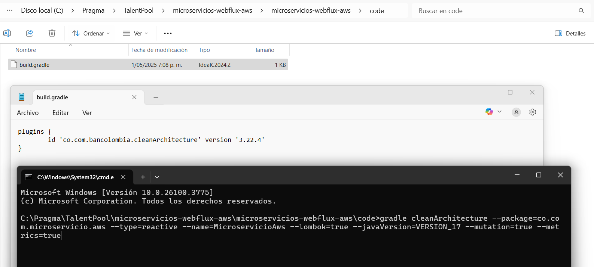
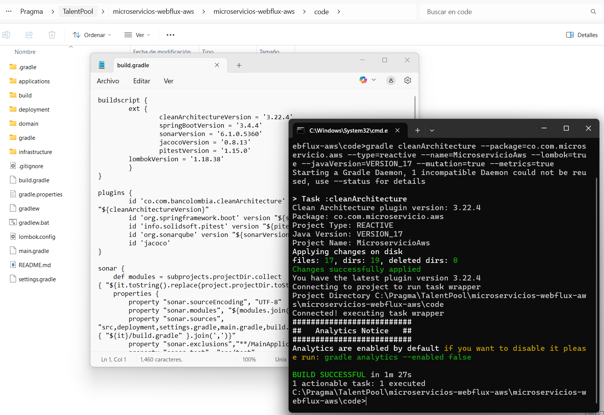
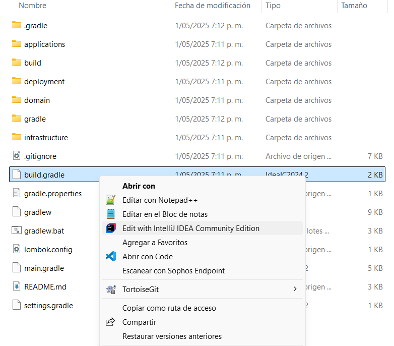
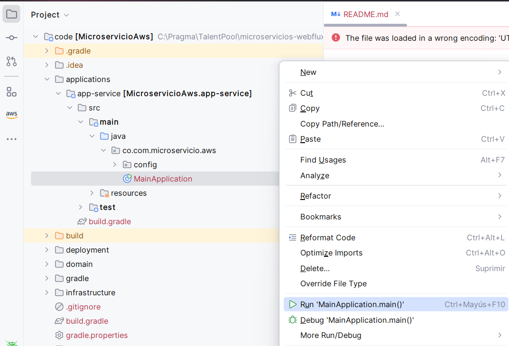

# Instructivo paso a paso proyecto base
> A continuación se hace uso del plugin gradle bancolombia para la creación base del proyecto basada en microservicio y arquitectura limpia

### Gradle Scaffold Clean Architecture: 

[Plugin introducción](https://bancolombia.github.io/scaffold-clean-architecture/)

[Plugin documentación](https://bancolombia.github.io/scaffold-clean-architecture/docs/intro)

### Crear proyecto:

1. Crear en un directorio de trabajo en su computador el archivo build.gradle con lo siguiente:

    ```
    plugins {
        id 'co.com.bancolombia.cleanArchitecture' version '3.22.4'
    }
    ```
2. Abrir la consola de comandos en el directorio donde se ha creado el archivo y colocar el siguiente comando el cual puede ser modificado según requieran para sus proyectos

    ```
    gradle cleanArchitecture --package=co.com.microservicio.aws --type=reactive --name=MicroservicioAws --lombok=true --javaVersion=VERSION_17 --mutation=true --metrics=true
    ```

    ### Notas complementarias:  
    - **Metrics**: habilitar métricas en el proyecto usando Micrometer, una librería de observabilidad que permite recolectar métricas de rendimiento (como tiempos de respuesta, número de peticiones, uso de memoria, etc.)
    - **Mutation**: habilitar el mutation testing, una técnica de pruebas que evalúa la calidad de tus tests introduciendo pequeños cambios (mutaciones) en el código y viendo si las pruebas lo detectan. Generalmente se hace con herramientas como Pitest.

3. Evidencia:
   - Ejecutar paso 1:  

   

   - Ejecutar paso 2:  

   

4. Abrir la aplicación en intellij
   - Abrir desde el explorador:

   

   - Cambiar el archivo build.gradle del proyecto applications > app-service
   la línea

    ```
    implementation 'org.springframework.boot:spring-boot-starter'
    ```
    por las siguientes dos líneas

    ```
    implementation "org.springframework.boot:spring-boot-starter-webflux:${springBootVersion}"
    implementation "org.springframework.boot:spring-boot-starter:${springBootVersion}"
    ```
   
   - Ejecutar desde intellij

    

   - Validar ejecución exitosa

   

5. Instalar helpers básicos
    - Commons: Contiene información sobre: Estructura para logs, extracción de información de los headers, manipulación de fechas.

    Ejecutar en el directorio que contiene el build.gradle:
    ```
    gradle generateHelper --name=commons
    ```

    - Log: Contiene clase para manejo de logs dentro del código

    Ejecutar en el directorio que contiene el build.gradle:
    ```
    gradle generateHelper --name=log
    ```

6. Configurar uso de logs dentro de la aplicación
    - En el archivo build.gradle (MicroservicioAWS) del proyecto general agregamos la versión para usar en log4jVersion
        ```
        buildscript {
            ext {
                cleanArchitectureVersion = '3.22.4'
                springBootVersion = '3.4.4'
                sonarVersion = '6.1.0.5360'
                jacocoVersion = '0.8.13'
                pitestVersion = '1.15.0'
                lombokVersion = '1.18.38'
                log4jVersion = '2.24.3'
            }
        }
        ```
    
    - En el archivo main.gradle agregar sobre la línea 30 el siguiente segmento de código
        ```
        if (!['model', 'usecase'].contains(it.name)) {
            dependencies {
                implementation "org.apache.logging.log4j:log4j-core:${log4jVersion}"
                implementation "org.apache.logging.log4j:log4j-api:${log4jVersion}"
            }
        }
        ```

    - En el archivo build.gradle del proyecto helpers/log agregamos las dependencias
        ```
        dependencies {
            implementation project(':model')
            implementation 'org.springframework:spring-context'
            implementation "org.apache.logging.log4j:log4j-core:${log4jVersion}"
            implementation "org.apache.logging.log4j:log4j-api:${log4jVersion}"
            implementation "org.apache.logging.log4j:log4j-to-slf4j:${log4jVersion}"
            implementation 'com.fasterxml.jackson.core:jackson-databind'
        }
        ```

    - En el archivo build.gradle (:app-service) agregar el segmento de configuration
        ```
        dependencies {
            ...
        }

        // Para evitar conflicto con Logback
        configurations {
            all {
                exclude group: 'org.apache.logging.log4j', module: 'log4j-to-slf4j'
                exclude group: 'org.springframework.boot', module: 'spring-boot-starter-logging'
            }
        }
        ```
        
    - Agregamos la clase TransactionLog al paquete co.com.microservicio.aws.log
        ```
        package co.com.microservicio.aws.log;

        import java.io.Serial;
        import java.io.Serializable;
        import java.util.Map;

        import lombok.AllArgsConstructor;
        import lombok.Getter;
        import lombok.NoArgsConstructor;
        import lombok.Setter;
        import lombok.ToString;

        @Getter
        @Setter
        @NoArgsConstructor
        @AllArgsConstructor
        @ToString
        public class TransactionLog {
            @Serial
            private static final long serialVersionUID = 1L;

            private DataLog dataLog;
            private Request request;
            private Response response;

            @Getter
            @Setter
            @NoArgsConstructor
            @AllArgsConstructor
            @ToString
            public static class DataLog implements Serializable {
                @Serial
                private static final long serialVersionUID = 1L;

                private String message;
                private String messageId;
                private String service;
                private String method;
                private String appName;
            }

            @Getter
            @Setter
            @NoArgsConstructor
            @AllArgsConstructor
            @ToString
            public static class Request implements Serializable {
                @Serial
                private static final long serialVersionUID = 1L;

                private Map<String, String> headers;
                private transient Object body;
            }

            @Getter
            @Setter
            @NoArgsConstructor
            @AllArgsConstructor
            @ToString
            public static class Response implements Serializable {
                @Serial
                private static final long serialVersionUID = 1L;

                private Map<String, String> headers;
                private transient Object body;
            }
        }
        ```

    - Agregamos la clase LoggerBuilder al paquete co.com.microservicio.aws.log
        ```
        package co.com.microservicio.aws.log;

        import com.fasterxml.jackson.core.JsonProcessingException;
        import com.fasterxml.jackson.databind.ObjectMapper;
        import lombok.Getter;
        import lombok.extern.log4j.Log4j2;
        import org.apache.logging.log4j.message.ObjectMessage;
        import org.springframework.beans.factory.annotation.Value;
        import org.springframework.stereotype.Component;

        @Log4j2
        @Getter
        @Component
        public class LoggerBuilder  {
            private String appName;
            private ObjectMapper objectMapper;

            public LoggerBuilder(@Value("${spring.application.name}") String appName, ObjectMapper objectMapper) {
                this.appName = appName;
                this.objectMapper = objectMapper;
            }

            public void info(TransactionLog.Request rq, TransactionLog.Response rs,
                        String message, String messageId, String service, String method) {
                log.info(new ObjectMessage(buildObject(rq, rs, buildDataLog(message, messageId, service, method))));
            }

            public void info(String message, String messageId, String service, String method) {
                log.info(new ObjectMessage(buildObject(new TransactionLog.Request(), new TransactionLog.Response(),
                    buildDataLog(message, messageId, service, method))));
            }

            public void error(String message, String messageId, String service, String method) {
                log.error(new ObjectMessage(buildObject(new TransactionLog.Request(), new TransactionLog.Response(),
                        buildDataLog(message, messageId, service, method))));
            }

            private TransactionLog.DataLog buildDataLog(String message, String messageId, String service, String method){
                return new TransactionLog.DataLog(message, messageId, service, method, appName);
            }

            private String buildObject(TransactionLog.Request rq, TransactionLog.Response rs,
                        TransactionLog.DataLog dataLog) {
                var logObject = new TransactionLog(dataLog, rq, rs);
                try {
                    return objectMapper.writeValueAsString(logObject);
                } catch (JsonProcessingException e) {
                    return logObject.toString();
                }
            }
        }
        ```
    - En el archivo log4j2.properties del paquete app-service\src\main\resources colocar
        ```
        status = error
        name = MicroservicioAWS
        appender.console.type = Console
        appender.console.name = STDOUT
        appender.console.layout.type = JsonLayout
        appender.console.layout.compact = true
        appender.console.layout.eventEol = true
        appender.console.layout.includeStacktrace = true
        appender.console.layout.includeThreadContext = false
        appender.console.layout.properties = false

        appender.console.layout.includeTimeMillis = false

        rootLogger.level = info
        rootLogger.appenderRefs = stdout
        rootLogger.appenderRef.stdout.ref = STDOUT
        ```

7. Crear archivo con perfil local

    - En el proyecto applications/app-service/src/main/java/resource crear el archivo application-local.yaml con la siguiente información [application-local-yaml](./code/applications/app-service/src/main/resources/application-local.yaml)

8. Ejecutar aplicación con los cambios realizados
    

    

9. La aplicación se debería ejecutar correctamente

[< Volver](README-PROYECTO-JAVA-WEBFLUX.md)

---

**Author**: Pedro Luis Osorio Pavas [Linkedin](www.linkedin.com/in/pedro-luis-osorio-pavas-68b3a7106)  
**Start Date**: 01-06-2025  
**Update Date**: 01-06-2025.