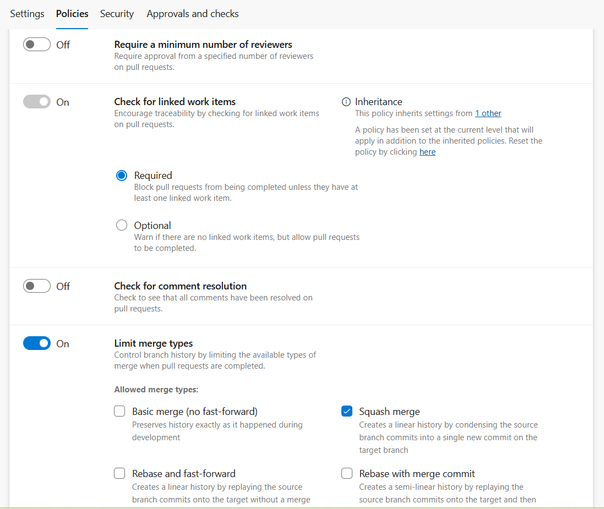
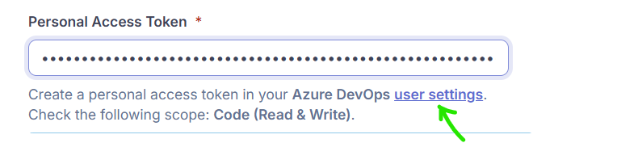
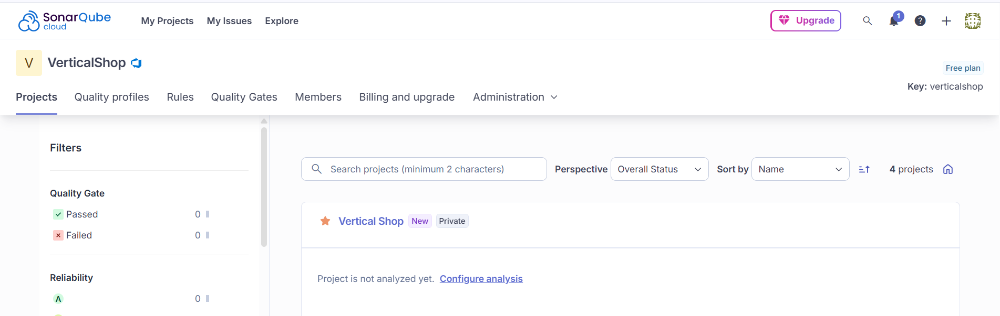
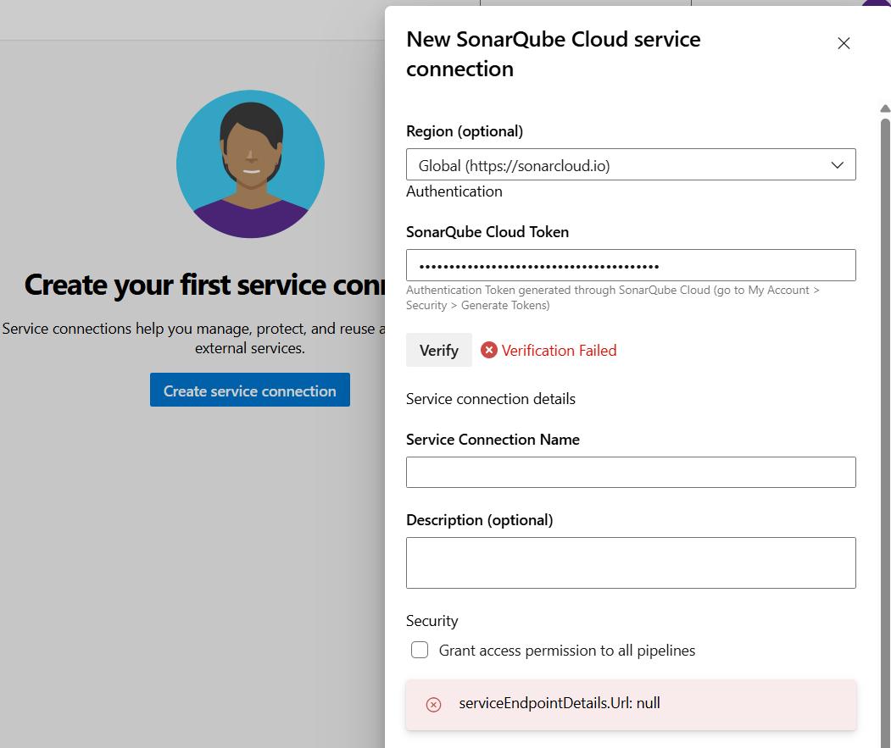
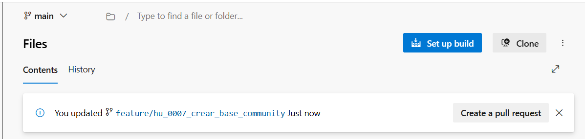
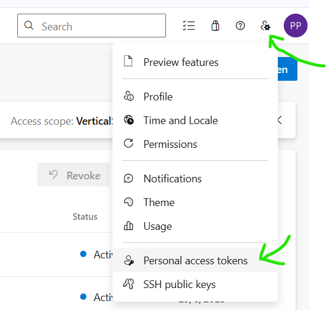

# Azure Devops

> A continuación se describe las configuraciones base para politicas de branches, creación de pipelines CI / CD

⚠️ Este contenido no puede ser usado con fines comerciales. Ver [LICENSE.md](LICENSE.md)

### Requisitos

- ⚠️ Tener una licencia gratuita de Azure Devops
- ⚠️ Crear un repositorio con un proyecto JAVA

### Sitio web
[Azure devops](https://dev.azure.com/)

### Indice

* [1. Agregar políticas a la rama main](#id1)
* [2. Crear la aplicación](#id2)
* [3. Postgresql: Crear la conexión](#id3)

# <div id='id1'/>
# Agregar políticas a la rama principal (main)

¿Qué puedes configurar en la rama principal? Desde el menú Repos > Branches, haz clic en los tres puntos junto a main y selecciona Branch policies. Ahí puedes activar:
- **Requerir pull request para hacer cambios:** bloquea los commits directos a la rama.
- **Requerir work items vinculados:** obliga a que cada PR esté asociado a una tarea, historia o bug (puede ser requerido u opcional)
- **Revisión mínima:** puedes exigir que al menos 1 persona apruebe el PR, si eres el único developer, entonces no actives esta opción.
- **Validación de compilación:** opcional, para que el PR solo se fusione si pasa el build.
- **Limit merge types:** sirve para controlar cómo se integran los cambios una vez que un pull request es aprobado y completado. Esto impacta directamente el historial de tu rama principal.  

## ¿Qué tipos de merge puedes limitar?

- Basic merge (no fast-forward): Conserva la historia exactamente como sucedió durante el desarrollo.
- Merge commit: Fusiona todos los commits del PR en un único commit de merge.
- Squash merge: Combina todos los commits del PR en un único commit limpio.
- Rebase and fast-forward: Reescribe el historial como si los cambios hubieran sido aplicados directamente.

## Recomendación: 

Habilita solo "squash merge" y desactiva los demás. Así tendrás un historial más claro y fácil de revisar cuando empieces a colaborar con más personas.

👉 Al activar cualquier política obligatoria en la rama Azure DevOps automáticamente bloquea los pushes directos a esa rama. Es decir, solo se puede modificar mediante Pull Requests que cumplan esas políticas.



# <div id='id2'/>
# Definición de otras políticas

## Build Validation

Esta opción asegura que los cambios propuestos en un Pull Request compilen correctamente antes de poder hacer merge.
- Puedes vincular un pipeline de CI (por ejemplo, uno en YAML) que se ejecute automáticamente cuando se crea o actualiza un PR.
- Si el build falla, el PR no podrá completarse.
- Ideal para prevenir errores en main y mantener la calidad del código.
- Puedes configurar múltiples validaciones si tienes distintos pipelines (tests, linting, etc.).

Ejemplo: Validar que el proyecto compile y pase pruebas unitarias antes de permitir el merge.

## Status Checks

Permite que servicios externos (como SonarQube, GitHub Actions, etc.) publiquen un estado en el PR que debe cumplirse para permitir el merge.
- Puedes exigir que ciertos checks externos estén en estado “success”.
- Útil para integraciones como análisis de calidad de código, escaneo de seguridad, despliegues, etc.
- Puedes definir si el check es obligatorio o solo informativo.

Ejemplo: Requerir que SonarQube publique un análisis exitoso antes de permitir el merge.

## Automatically Included Reviewers

Agrega automáticamente revisores a los Pull Requests que afecten ciertas rutas o archivos.
- Puedes incluir usuarios o grupos (como “Backend Team”).
- Puedes definir si su aprobación es obligatoria u opcional.
- Puedes usar filtros de ruta para que solo se incluyan si se modifican ciertos archivos.

Ejemplo: Si se modifica /infra/terraform/*, incluir automáticamente al equipo de DevOps como revisores obligatorios.

# <div id='id3'/>
# Agregar políticas build con SonarQube

## ¿Puedo usar SonarQube en la versión gratis de azure?

SonarQube Cloud Free Tier: Ideal para desarrolladores o equipos pequeños que quieren mejorar la calidad del código sin costo.

### Lo que puedes hacer:
- Analizar proyectos privados de hasta 50,000 líneas de código.
- Analizar Pull Requests (solo si apuntan a la rama principal).
- Soporte para 30 lenguajes de programación y plataformas IaC (como Terraform, Docker, etc.).
- Integración con plataformas DevOps como GitHub, GitLab, Bitbucket y Azure DevOps.
- Decoración automática de PRs con métricas, bugs, vulnerabilidades y cobertura.
- Análisis automático del código en la rama principal (sin configurar CI).
- Hasta 5 usuarios por organización.

🔗 👉 [📘 Ir al sitio SonarQube Cloud](https://sonarcloud.io/login)

- Loguearse con la cuenta de Azure Devops
- Elegir: import an organization
- Escribir el nombre de la organización
- Al escribir el token... Dar click en el link user settings y crear un nuevo token



- Elegir plan gratis
- Presionar boton: create organization
- Elegir todos los proyectos importados
- Presionar el boton "setup up"
- Seleccionar la opción "previous version"
- Presionar el boton "create projects"



- ir al link "Configure Analysis"
- Seguir los pasos que se indican
- Volver al azure devops
- Ingresar al proyecto de la organización
- Ir a la opción: Projects settings > service connections
- Crear una nueva conexión
- Elegir "SonarQube Cloud"
- Ingresar el token generado en Perfil > My Account > security 
- Dar al botón "Verify", aca me salió el siguiente error:



- Luego de dar muchas vueltas realice los siguientes pasos
    - Inicie sesión por una página de incognito
    - Ir a la opción: Projects settings > service connections
    - Elegir "SonarQube cloud"
    - Ingresar el token
    - Darle en "verify", volvió a fallar
    - En la opción Region (opcional) elegí la otra opción
    - Presioné el boton "verify", falló por otra causa
    - Volví a elegir: "Global..."
    - Presioné el boton "verify", Funcionó la conexión
    - Ingresar nombre: SonarCloud, esto es importante porque va en el pipeline.yaml
    - Marcar la casilla "Grant access permission to all pipelines"
    - Guardar la conexión

- Ubicarse en la raiz del proyecto y crear el archivo azure-pipelines.yaml con la siguiente información:
```
trigger:
  branches:
    include:
      - main

pool:
  vmImage: 'ubuntu-latest'

variables:
  JAVA_HOME: '/usr/lib/jvm/java-21-openjdk'
  GRADLE_USER_HOME: $(Pipeline.Workspace)/.gradle
  SONAR_USER_HOME: $(Pipeline.Workspace)/.sonar
  projectKey: 'VerticalShop_Vetrik_community_service'
  organization: 'verticalshop'

steps:
  - task: SonarCloudPrepare@1
    inputs:
      SonarCloud: 'SonarCloud'
      organization: '$(organization)'
      scannerMode: 'CLI'
      configMode: 'manual'
      cliProjectKey: '$(projectKey)'
      cliProjectName: '$(projectKey)'
      cliSources: '.'

  - task: Gradle@3
    inputs:
      gradleWrapperFile: 'gradlew'
      tasks: 'clean build sonarqube'
      options: '-Dsonar.gradle.skipCompile=true'
      publishJUnitResults: true
      testResultsFiles: '**/build/test-results/test/TEST-*.xml'
      javaHomeOption: 'JDKVersion'
      jdkVersionOption: '1.21'

  - task: SonarCloudAnalyze@1

  - task: SonarCloudPublish@1
    inputs:
      pollingTimeoutSec: '300'

  - task: PublishTestResults@2
    inputs:
      testResultsFormat: 'JUnit'
      testResultsFiles: '**/build/test-results/test/TEST-*.xml'
      failTaskOnFailedTests: true

  - task: PublishBuildArtifacts@1
    inputs:
      pathToPublish: 'build/libs'
      artifactName: 'drop'

```

- ⚠️ Tener cuidado con la seccion de variables, en este el nombre del proyecto corresponde al creado en azure y generado por SonarCloud
```
variables:
  JAVA_HOME: '/usr/lib/jvm/java-21-openjdk'
  GRADLE_USER_HOME: $(Pipeline.Workspace)/.gradle
  SONAR_USER_HOME: $(Pipeline.Workspace)/.sonar
  projectKey: 'VerticalShop_Vetrik_community_service'
  organization: 'verticalshop'
```

- ⚠️ Previo de aplicar el PR a la rama main se ejecuta este pipeline
```
trigger:
  branches:
    include:
      - main
```

- ⚠️ Se agrega a la raiz del proyecto ya que Azure toma esta ruta por defecto para buscar el archivo pipeline

- Preparamos el proyecto para subir los cambios
- Realizamos el pull request
- Aprobamos el pull request




- Si no se crea el pipeline de build automaticamente, se puede hacer realizando los siguientes pasos:

- Cómo crear un pipeline manual en Azure DevOps

    - Entra a tu organización/proyecto:
    https://dev.azure.com/tu-proyecto/

    - En el menú lateral, ve a: Pipelines > Pipelines

    - Haz clic en el botón "New Pipeline"

    - Paso 1: Select the source
        - Code: selecciona Azure Repos Git
        - Repository: elige tu repositorio

    - Paso 2: Configure your pipeline
        - Selecciona la opción YAML
        - En el selector de archivo YAML, asegúrate de que esté bien:
        - Branch: main
        - Path: azure-pipelines.yml

    - Paso 3: Run or Save
        - Haz clic en "Run" para ejecutarlo inmediatamente o puedes guardar y programar su ejecución

    - Es probable que el pipeline falle con el siguiente error: ##[error]No hosted parallelism has been purchased or granted. To request a free parallelism grant, please fill out the following form https://aka.ms/azpipelines-parallelism-request, esto es porque para versiones gratuistas se debe pedir a microsoft este permiso, pero para proyectos privados, uno mismo debe crear la máquina de ejecución del pipeline

# <div id='id4'/>
# 4. Crear máquina en Podman para ejecución pipeline

- Paso a paso para crear el agente con Podman
    1. ✅ Genera un PAT (Personal Access Token)
    - Ve a: https://dev.azure.com
    - Haz clic en tu user settings > Personal access token

    
    
    - En Personal Access Tokens, crea uno con:
    - Scope: Agent Pools (Read & manage)
    - Agrega una vigencia de un año
    - Agrega un nombre al token
    - Guarda el token (lo necesitarás como variable de entorno)

    2. Abrir gitbash y colocar el siguiente código luego de reemplazar las variables
    ```
    export AZP_URL="https://dev.azure.com/MY_ORGANIZATION/MY_PROJECT"
    export AZP_TOKEN="TOKEN_PERSONAL_ACCESS_TOKEN"
    export AZP_AGENT_NAME="podman-agent"
    export AZP_POOL="Default"

    # Ejecuta el agente
    podman run --rm \
    -e AZP_URL \
    -e AZP_TOKEN \
    -e AZP_AGENT_NAME \
    -e AZP_POOL \
    --name azure-agent \
    mcr.microsoft.com/azure-pipelines/vsts-agent:latest
    ```

    
    

## Relacionar AzureDevops con SonarCloud

- ir al sitio: [Integración SonarCloud con AzureDevops](https://docs.sonarsource.com/sonarqube-cloud/advanced-setup/ci-based-analysis/sonarcloud-extension-for-azure-devops/)
- Presionar el boton "Start free"
- Iniciar sesión con Azure Devops


---

[< Volver al índice](README.md)

💡 Esta documentación fue elaborada con ayuda de Copilot, basado en mis consultas técnicas

⚠️ Este contenido no puede ser usado con fines comerciales. Ver [LICENSE.md](LICENSE.md)

