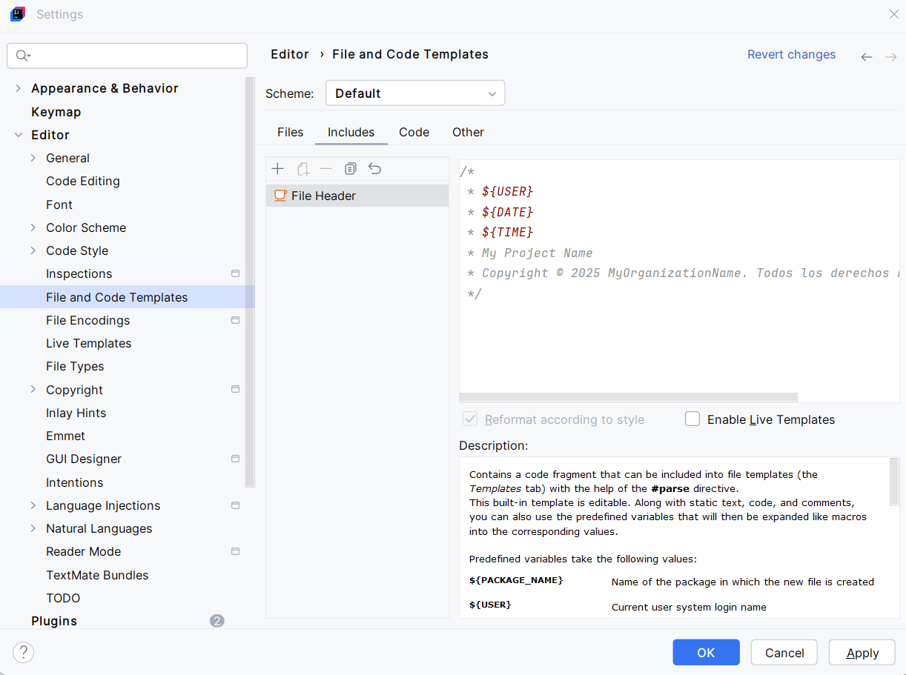
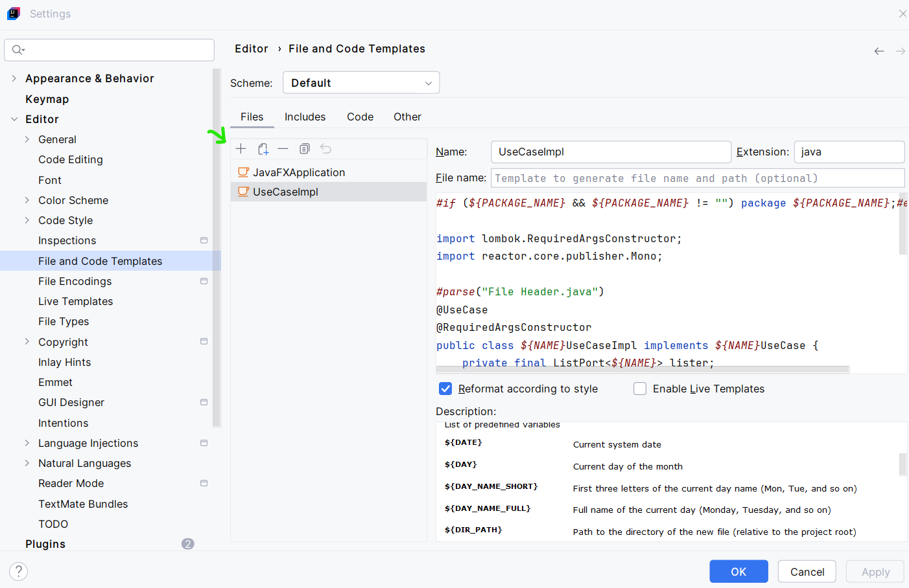
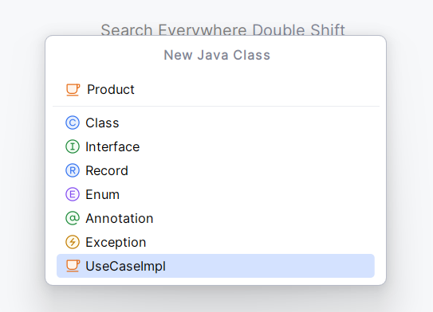
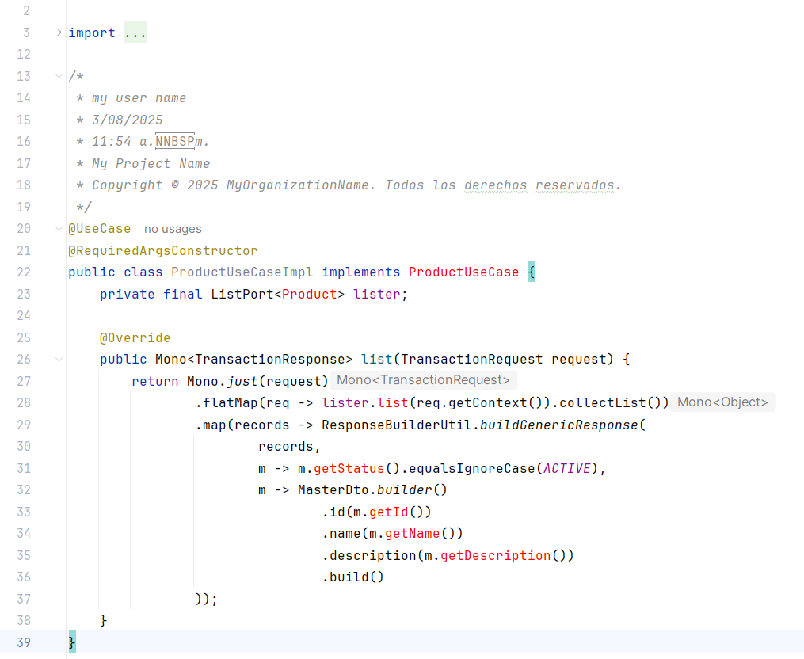
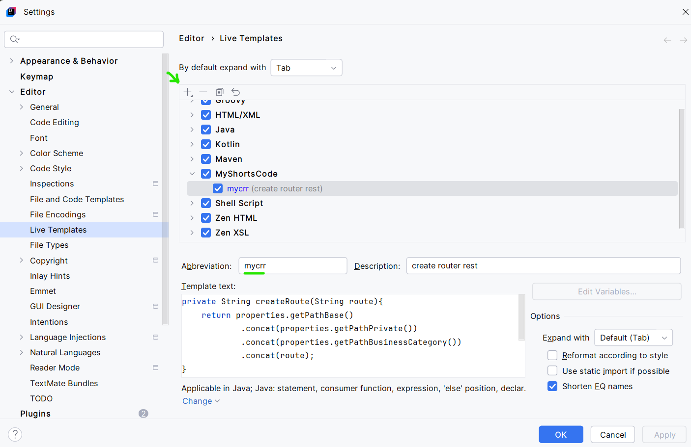
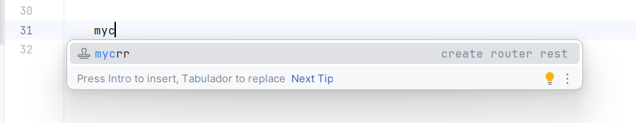

# Configuración de plantillas y accesos rápidos en generación de código
> A continuación se indica el paso a paso que se debe realizar para crear configurar plantillas o generar código con ayuda de intellij

## Clase base y repetible
Supongamos que tenemos una clase de implementación para un caso de uso. En este ejemplo, se trata de una entidad maestra llamada BusinessCategory. Mantenemos una convención de nombres tanto para la clase como para el puerto asociado, el cual puede representar cualquier tipo de salida, como guardar en base de datos, enviar un evento o escribir en un archivo. La implementación concreta es indiferente para el caso.

Ahora bien, como vamos a crear múltiples entidades maestras que tendrán exactamente la misma lógica (cambiando únicamente el nombre y algunos atributos), podemos agilizar este proceso utilizando plantillas en IntelliJ IDEA. Esto nos permitirá generar nuevas clases de manera rápida, coherente y sin repetir código manualmente.

- Clase base
    ```
    package co.com.empresa.proyecto.application.impl.masters;

    import lombok.RequiredArgsConstructor;
    import reactor.core.publisher.Mono;

    @UseCase
    @RequiredArgsConstructor
    public class BusinessCategoryUseCaseImpl implements BusinessCategoryUseCase {
        private final ListPort<BusinessCategory> lister;

        @Override
        public Mono<TransactionResponse> list(TransactionRequest request) {
            return Mono.just(request)
                    .flatMap(req -> lister.list(req.getContext()).collectList())
                    .map(records -> ResponseBuilderUtil.buildGenericResponse(
                            records,
                            m -> m.getStatus().equalsIgnoreCase(ACTIVE),
                            m -> MasterDto.builder()
                                    .id(m.getId())
                                    .name(m.getName())
                                    .description(m.getDescription())
                                    .build()
                    ));
        }
    }
    ```

- Clase como plantilla
    ```
    #if (${PACKAGE_NAME} && ${PACKAGE_NAME} != "") package ${PACKAGE_NAME};#end

    import lombok.RequiredArgsConstructor;
    import reactor.core.publisher.Mono;

    #parse("File Header.java")
    @UseCase
    @RequiredArgsConstructor
    public class ${NAME}UseCaseImpl implements ${NAME}UseCase {
        private final ListPort<${NAME}> lister;

        @Override
        public Mono<TransactionResponse> list(TransactionRequest request) {
            return Mono.just(request)
                    .flatMap(req -> lister.list(req.getContext()).collectList())
                    .map(records -> ResponseBuilderUtil.buildGenericResponse(
                            records,
                            m -> m.getStatus().equalsIgnoreCase(ACTIVE),
                            m -> MasterDto.builder()
                                    .id(m.getId())
                                    .name(m.getName())
                                    .description(m.getDescription())
                                    .build()
                    ));
        }
    }
    ```

- En intellij configurar File Header
    ```
    /*
    * ${USER}
    * ${DATE}
    * ${TIME}
    * My Project Name
    * Copyright © 2025 MyOrganizationName. Todos los derechos reservados.
    */
    ```



- En intellij configurar Template UseCaseImpl


- Insertar una clase para validar la plantilla





- En intellij configurar shourt code  
Supongamos que vamos a generar el siguiente código, para generación de rutas en la clase Router Rest

    ```
    private String createRoute(String route){
        return properties.getPathBase()
                .concat(properties.getPathPrivate())
                .concat(properties.getPathBusinessCategory())
                .concat(route);
    }
    ```
- En intellij configurar la generación de este segmento de código





---

[< Volver al índice](README.md)

💡 Esta documentación fue elaborada con ayuda de ChatGPT, basado en mis consultas técnicas

⚠️ Este contenido no puede ser usado con fines comerciales. Ver [LICENSE.md](LICENSE.md)
